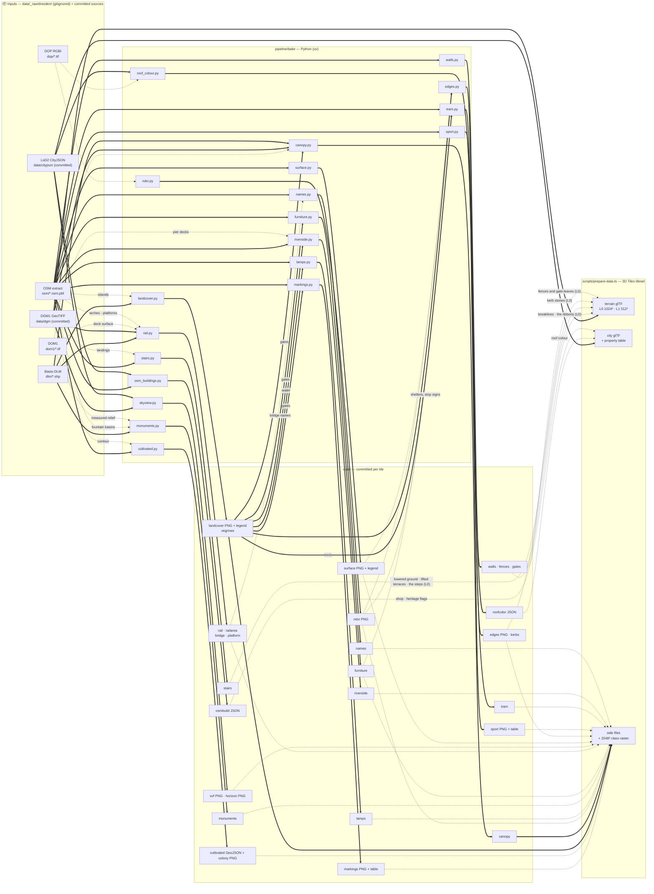

# Data → feature provenance

How each **raw data source** becomes a **rendered feature**. This is the
"structured overview" of the pipeline: read it before adding a data source or a
feature, and **update it when you change either** (see
[the maintenance rule](./README.md#keeping-these-docs-current)). The
plain-language version of this page is the guide's
[How the city walker works](./guide/en/how-it-works.md); the per-attribute
encoding table (which value drives which pixel) is in
[rendering.md](./rendering.md#visual-encoding--which-data-drives-which-pixel);
the bakes that produce each artifact are in
[data-pipeline.md](./data-pipeline.md), and the
[second diagram](#how-the-artifacts-are-made) below maps them.

The diagram convention encodes the *kind* of relation:

| Edge | Meaning |
|---|---|
| `A ==> B` (solid, bold) | **Required / primary.** B cannot render without A. |
| `A -.-> B` (dashed) | **Optional / enhancer / modifier.** B works without A; A improves or constrains it. |
| edge label | the transform, or *why* (e.g. `gates`, `preferred`, `fallback`). |
| node tagged *planned* | designed, not yet built (see [transformations.md](./transformations.md)). |
| node tagged *synth* | synthesized in-engine, no external data. |

```mermaid
flowchart LR
  classDef planned fill:#fef3c7,stroke:#d97706,stroke-dasharray:4 3,color:#92400e;
  classDef synth fill:#ede9fe,stroke:#7c3aed,color:#5b21b6;

  subgraph SRC["📦 Data sources — Saxon open geodata (+ OSM)"]
    direction TB
    CJ["CityJSON LoD2<br/>buildings + ALKIS attrs"]
    DGM["DGM1<br/>terrain raster (1 m)"]
    DOM["DOM1<br/>surface raster (1 m)"]
    DLM["Basis-DLM (ATKIS)<br/>land cover + veg rows"]
    OSM["OpenStreetMap<br/>(Geofabrik .osm.pbf extract)"]
    DOP["DOP orthophoto<br/>RGB + near-IR"]
    LSC["Laser scan (LAZ)<br/>every tile"]
    KAT["Stadtbaumkataster<br/>(Dresden street trees)"]
  end

  HASH["deterministic hash"]:::synth
  SUN["sun rig (time of day)"]:::synth

  subgraph FEAT["🎨 Rendered features — what you walk through"]
    direction TB
    TER["Terrain ground"]
    SURF["Surface colours<br/>roads · meadow · …"]
    PAVE["Kerbs, paving &amp; parking<br/>kerb stones · lawn edge · sett · slabs · bays"]
    WAT["Water (Elbe)"]
    BLD["Buildings<br/>(geometry)"]
    DET["Building detailing<br/>tint · roof · eave · glow · shop fronts"]
    VEG["Trees &amp; hedges"]
    LOW["OSM hedges"]
    LAMP["Street lamps"]
    FURN["Street furniture &amp; playgrounds<br/>benches · bins · stands · shelters · play equipment<br/>columns · signals · hydrants · clocks · stop signs"]
    MON["Fountains &amp; monuments"]
    RAIL["Railway tracks"]
    TRAM["Trams<br/>tracks · masts · contact wire"]
    RIV["Elbe landing stages<br/>piers · pontoons · groynes · ferry lines"]
    NAMES["Street names<br/>lettering from the air · caption on foot"]
    BRG["Bridges"]
    PLT["Station platforms"]
    WAL["Retaining walls"]
    FEN["Fences, railings &amp; gates"]
    STR["Stairs"]
    SPT["Sports grounds<br/>pitches · courts · tracks · goals"]
    MRK["Road markings<br/>zebras · Furten · stop lines · cycle and centre lines"]
    CULT["Cultivated land<br/>allotment beds · orchard trees · vine rows"]
    MM["Minimap"]
    LIGHT["Light &amp; shadow"]
  end

  %% terrain + ground clamp
  DGM ==>|"glTF terrain: fine TIN (native 1 m), coarse 512² grid"| TER
  DGM -. ground-clamp .-> BLD
  DGM -. ground-clamp .-> VEG
  DGM -. ground-clamp .-> LAMP
  DGM -. ground-clamp .-> FURN
  DGM -. ground-clamp .-> MON

  %% surfaces + water (multi-source)
  DLM ==>|"class raster → palette painted at runtime"| SURF
  OSM -. "squares, islands, lawns carved out of the road class" .-> SURF
  DOP -. "NDVI meadow tint (class 1)<br/>+ urban green (classes 0, 4)" .-> SURF
  DLM ==>|"road / meadow edges → smoothed distance + kerb lines"| PAVE
  DOP -. "NDVI → urban green as meadow" .-> PAVE
  OSM -. "surface · sidewalk:*:surface · parking<br/>+ way direction" .-> PAVE
  DLM ==>|"class 8 → water coverage (3×3 tent)"| WAT
  DGM ==>|"shares terrain mesh"| WAT

  %% buildings + detailing
  CJ ==>|"glTF mesh + EXT_mesh_features ids"| BLD
  CJ ==>|"function · roofType · height · surfacetype<br/>(property table)"| DET
  HASH -.->|"per-building variation<br/>(carries the look when attrs are sparse)"| DET
  DOP -. "real roof colour<br/>(83% coverage, else synth)" .-> DET
  OSM -. "shop / café on the ground floor · heritage=*<br/>(joined to the LoD2 footprints)" .-> DET

  %% vegetation (multi-source + gated)
  DLM ==>|"hedge / tree rows"| VEG
  DOM ==>|"nDOM = DOM1 − DGM1 → canopy"| VEG
  DGM ==>|"nDOM base term"| VEG
  DLM -. "gates: no trees on roads/water" .-> VEG
  DOP -. "NDVI → crown colour" .-> VEG
  LSC -. "crown peaks outside the canopy mask" .-> VEG
  KAT ==>|"surveyed trees: position · h · crown · trunk · genus → season"| VEG
  KAT -. "thins the scan trees (bake) · vetoes canopy trees in its crowns" .-> VEG
  OSM -. "natural=tree the cadastre lacks (≥ 3 m off) · taxon" .-> VEG
  DLM -. "forest/copse: no veto" .-> VEG

  %% hedges
  OSM ==>|"barrier=hedge lines"| LOW
  LSC -. "measured height" .-> LOW
  DGM -. ground-clamp .-> LOW

  %% lamps
  OSM ==>|"point positions"| LAMP

  %% street furniture
  OSM ==>|"bench · waste_basket · bicycle_parking · bollard · post_box · shelter<br/>playground outlines + mapped equipment<br/>advertising · traffic_signals · fire_hydrant · clock · drinking_water · bus_stop"| FURN
  DLM -. "road class → the kerb a signal or sign moves to" .-> FURN
  OSM -. "nearest highway → which way it faces" .-> FURN

  %% fountains + monuments (official list, OSM basins)
  DLM ==>|"sie03_p monuments: position · name · kind"| MON
  OSM -. "amenity=fountain: basin outlines + fountains the DLM lacks" .-> MON
  DOM ==>|"nDOM = DOM1 − DGM1 → the sculpture's measured bulk"| MON

  %% railway + bridges + platforms
  DLM ==>|"ver03_f area (dissolved) = ballast<br/>+ ver03_l tracks (heavy rail)"| RAIL
  DGM -. "drape / lift onto deck" .-> RAIL
  DLM ==>|"ver06_l decks + ver06_f footprints"| BRG
  DGM ==>|"abutment deck height + piers"| BRG
  DOM -. "deck surface (viaducts)" .-> BRG
  OSM -. "bridge:structure → arches" .-> BRG
  OSM ==>|"railway=platform polygons"| PLT
  OSM ==>|"railway=tram · power=catenary_mast · tram_stop + platforms<br/>building outlines → rosette spans"| TRAM
  DLM -. "road / meadow class → track bed" .-> TRAM
  DOP -. "NDVI → lawn track bed" .-> TRAM
  DGM -. "drape · lift onto a bridge deck" .-> TRAM
  OSM ==>|"man_made=pier / groyne · route=ferry"| RIV
  DLM -. "water class → pontoon · ferry cut to the water" .-> RIV
  DGM -. "pier deck from the bank · pontoon on the drawn water" .-> RIV
  OSM ==>|"highway name · named squares"| NAMES
  DLM -. "bridge names" .-> NAMES
  DGM -. "lettering on the ground" .-> NAMES
  OSM ==>|"barrier=retaining_wall/city_wall · natural=cliff + height"| WAL
  DGM -. "snap to the measured step (fine TIN)" .-> WAL
  WAL -. "breakline burned into the coarse grid at build" .-> TER
  OSM ==>|"barrier=fence/handrail + fence_type · gates on a line"| FEN
  DGM -. "stands on the fine TIN" .-> FEN
  FEN -. "gates cut freestanding walls" .-> WAL
  OSM ==>|"highway=steps + width · step_count"| STR
  DGM -. "landing heights" .-> STR
  STR -. "ground lowered under the flight at build" .-> TER
  OSM -. "layer ≥ 1 areas a flight climbs onto → terraces lifted at build" .-> TER
  DGM -. ground-clamp .-> PLT
  OSM ==>|"leisure=pitch/track<br/>sport · surface → table + index raster"| SPT
  OSM ==>|"crossings · signals · cycleway · lanes → table + lane raster"| MRK
  DLM -. "carriageway width + kerb distance" .-> MRK
  OSM ==>|"landuse=allotments/orchard/vineyard → colonies, trees, rows"| CULT
  DGM -. "rows along the contour · ground-clamp" .-> CULT
  DGM -. "goals · posts · nets ground-clamped" .-> SPT

  %% minimap + lighting (derived, not raw data)
  DGM -. "tile bounds" .-> MM
  DLM -. "class raster + palette as map background" .-> MM
  CJ -. "building footprints" .-> MM
  SUN ==> LIGHT
  DGM ==>|"sky-view factor · far horizon (with the LoD2 roofs)"| LIGHT
  CJ -. "roofs in the sky view and horizon" .-> LIGHT
  SUN -. "fog · sky · dusk gate" .-> DET
```

## Feature-by-feature

| Feature | Primary source | Also needs / modifiers | Code |
|---|---|---|---|
| **Terrain ground** | DGM1 GeoTIFF → glTF terrain at two levels: the fine one an error-bounded TIN of the native 1 m grid (±0.15 m), the coarse one a 512² grid (baked normals, 30 m skirt) | OSM stairs (ground lowered under the flight at build) · OSM `layer` ≥ 1 terraces · OSM walls (burned in as a step, coarse grid only) | baked by `scripts/bake-tiles.ts` (`tinTerrainMesh` via `scripts/bake-terrain-tin.ts` + `lib/city/terrain-tin.ts`; `terrainMesh`, `lib/city/terrain-conflate.ts`, `lib/city/stairs.ts`) in `scripts/prepare-data.ts`; `terrain-layer.ts` (`TinIndex` heights), `tile-stream.ts` |
| **Surface colours** | Basis-DLM class raster (ids 0–8), painted with the palette on the GPU at load | DOP NDVI (meadow tint, class 1; urban green on classes 0 and 4) | `landcover-splat.ts`, `lib/city/landcover.ts` (the one palette), `terrain-layer.ts` (samples the splat + `uNdvi`), `ground-detail.ts` (urban green); baked by `pipeline/bake/landcover.py` + `ndvi.py` |
| **Kerbs, paving & parking** | Basis-DLM class raster: the road (7) and meadow (1, + urban green) edges as smoothed signed distances, and the kerb lines the fine terrain stands kerb stones on (`edges.py`) | OSM paving raster (`surface`, `sidewalk:*:surface`, `parking:*` lanes, `amenity=parking`/`parking_space` with their aisles, the way direction; else the class default) | `ground-detail.ts` (in the terrain fragment pass), `terrain-layer.ts`; baked by `pipeline/bake/surface.py` |
| **Sports grounds** | OSM `leisure=pitch` / `track` (playgrounds are street furniture): per ground its frame, surface and line scheme (`sport_<t>.json`) and a 2048² index raster (`sport_<t>.png`) | the sport's usual surface when untagged · DGM1 (the goals, posts and nets stand on the ground) | `sport-ground.ts` (in the terrain fragment pass), `sport-fixtures.ts` (dressing), `lib/city/sport.ts`; baked by `pipeline/bake/sport.py` |
| **Road markings** | OSM `highway=crossing` (marked kinds), directed `highway=traffic_signals`, `cycleway*=lane`, `lanes` + `oneway`: a table of crossings and stop lines (`markings_<t>.json`) and a 2048² raster of rows, lane bits and the centre offset (`markings_<t>.png`) | Basis-DLM class raster (the carriageway's width across each crossing; the kerb distance the cycle lane keeps) | `road-markings.ts` (in the terrain fragment pass), `lib/city/markings.ts`; baked by `pipeline/bake/markings.py` |
| **Water (Elbe)** | Basis-DLM class 8 (water coverage from the painted splat) **+** DGM1 (the terrain geometry it drapes on) | — | `water-layer.ts`, `landcover-splat.ts` |
| **Buildings (geometry)** | CityJSON LoD2 → glTF per tile (`_FEATURE_ID_0` per vertex, `EXT_mesh_features`) | DGM1 (ground-clamp) | baked by `scripts/bake-city-mesh.ts` (`cityjson-threejs-loader`) → `scripts/bake-tiles.ts` `cityMesh` → `scripts/tile-glb.ts`; `city-layer.ts` |
| **Building detailing** | CityJSON attrs + `surfacetype`, baked per object into an `EXT_structural_metadata` property table | DOP roof colour (real, ~83%) · hash (fallback) · sun (dusk gate) · OSM shops on the ground floor and `heritage=*` (the `flags` column) | `bake-city-mesh.ts` (per-object table), `lib/city/city-mesh.ts` (`objectTable`, `packObjectTexels`), `visual-style.ts`, `lib/city/building-tint.ts`; roof colour baked by `pipeline/bake/roof_colour.py`, the OSM flags by `osm_buildings.py` |
| **Inventory trees** | Stadtbaumkataster Dresden (WFS `cls:L1261`): position, height, crown diameter, trunk diameter, taxon → genus **+** OSM `natural=tree` more than 3 m from every cadastre tree (a taxon naming a known genus, or `leaf_type`, else dropped) | DGM1 (ground-clamp) · DOP NDVI (deciduous crown colour) · vetoes the rows/canopy trees inside each crown, except in DLM forest/copse · trunks + broadleaf crowns drawn in the canopy's meshes · the scene date → per-genus autumn colour and bare crowns (`lib/city/tree-season.ts`) | `tree-inventory-layer.ts`, `crown-season.ts`, `lib/city/tree-inventory.ts`, `lib/city/tree-season.ts`, `tile-stream.ts`; baked by `pipeline/bake/trees.py` (+ `tree_archetypes.py`) |
| **Trees & hedges** | Basis-DLM rows **+** DOM1−DGM1 canopy **+** LSC crown peaks outside the mask (every tile, thinned against the cadastre) | DLM class raster *(gates)* · DOP NDVI (crown colour) · the scene date (a generic deciduous year: autumn colour, bare crowns; hedges stay green) | `vegetation-layer.ts`, `crown-season.ts`; baked by `pipeline/bake/landcover.py` + `canopy.py` + `ndvi.py` + `lowveg.py` |
| **Cultivated land** | OSM `landuse=allotments` (+ `leisure=garden` plots), `orchard`, `vineyard` | the colony raster (beds in the terrain pass) · OSM `natural=tree` in an orchard, else an 8 m grid · DGM1 (a vineyard's rows along the contour; ground-clamp) | `cultivated-layer.ts`, `lib/city/cultivated.ts`, `tile-stream.ts`; baked by `pipeline/bake/cultivated.py` |
| **OSM hedges** | OSM `barrier=hedge` lines (Geofabrik extract) | LSC (measured height) · DGM1 (ground-clamp); tag / 1.5 m where no LAZ. The bake's laser-scan-only hedges and shrubs are not shipped (🗃️ in the ledger) | `low-vegetation-layer.ts`; baked by `pipeline/bake/lowveg.py` |
| **Street lamps** | OSM `highway=street_lamp` (Geofabrik extract) | DGM1 (ground-clamp); gated off water + railway | baked by `pipeline/bake/lamps.py`; `lamp-layer.ts` |
| **Street furniture & playgrounds** | OSM `amenity=bench/waste_basket/bicycle_parking/post_box/clock/drinking_water`, `leisure=picnic_table`, `barrier=bollard` (+ `height`, `material`), `advertising=column` (+ `lit`), `highway=traffic_signals` (+ `traffic_signals:direction`), `emergency=fire_hydrant` (+ `fire_hydrant:type`), `leisure=playground` outlines + `playground=*` equipment, stops with `shelter=yes` and bus stops without (their sign) (Geofabrik extract; the committed files from BBBike's Dresden cut) | OSM highways (the bearing an untagged object faces; a signal's travel direction) · the DLM road class (the kerb a signal or hydrant sign in the carriageway moves to) · OSM building outlines (wall clocks) · DGM1 (ground-clamp); gated off water, railway and bridge decks | baked by `pipeline/bake/furniture.py`; `furniture-layer.ts`, `lib/city/furniture.ts` |
| **Fountains & monuments** | Basis-DLM `sie03_p` monument points (`BWF` 1750/1770/1780, official names) | OSM `amenity=fountain` (basin outlines, fountains the DLM lacks, which DLM monument is a fountain) · DOM1 − DGM1 (the sculpture's measured form) · DGM1 (seated over the highest ground under a basin) | baked by `pipeline/bake/monuments.py`; `monument-layer.ts`, `lib/city/monuments.ts` |
| **Railway tracks** | Basis-DLM `ver03_f` area (dissolved ballast) **+** `ver03_l` (heavy-rail steel) | DGM1 (drape / lift onto deck) | `rail-layer.ts`; baked by `pipeline/bake/rail.py` |
| **Trams** | OSM `railway=tram` (each track), `power=catenary_mast` (the masts within 15 m of a tram track), the OSM building outlines (facades for the rosette spans), `railway=tram_stop` + the platforms (the stop signs) | DLM class raster (street vs lawn vs ballast bed) · DOP NDVI (lawn bed) · DGM1 (drape) · the bridge decks (a track tagged `bridge` rides the deck) | `tram-layer.ts`, `lib/city/tram.ts` (wire stations and sag); baked by `pipeline/bake/tram.py` |
| **Elbe landing stages** | OSM `man_made=pier` (fixed or `floating`), `man_made=groyne`, `route=ferry` | DLM water class (a pontoon and a ferry line cut to the water) · DGM1 (a pier's deck from the bank; a pontoon floats on the terrain the water sheet lies on) | `riverside-layer.ts`, `map-overlay.ts` (the ferry lines show from the air only); baked by `pipeline/bake/riverside.py` |
| **Street names** | OSM `highway=*` `name` (merged per name; label windows + the named ways), named `place=square` / pedestrian areas | Basis-DLM bridge names (`NAM`, via the bridge file) · DGM1 (the ribbons lie on the ground) · the page's font (Canvas 2D, at runtime) | `name-layer.ts`, `street-caption.tsx`, `lib/city/names.ts`, `map-overlay.ts`; baked by `pipeline/bake/names.py` |
| **Bridges** | Basis-DLM `ver06_l` decks (+ `ver06_f` footprints) | DGM1 (abutment height + piers) **+** DOM1 (deck surface) · OSM `bridge:structure` (arches) | `rail-layer.ts`; baked by `pipeline/bake/rail.py` |
| **Station platforms** | OSM `railway=platform` (Geofabrik extract) | DGM1 (ground-clamp) | `rail-layer.ts`; baked by `pipeline/bake/rail.py` |
| **Retaining walls** | OSM `barrier=retaining_wall/city_wall/wall`, `man_made=embankment`, `natural=cliff` + `height` (Geofabrik extract) | DGM1 (ribbon snapped to the measured step of the fine TIN; the coarse grid is conflated to a step instead) — *no DGM/DOM/LiDAR product has the wall as a vertical face* | `lib/city/walls.ts` + `lib/city/wall-snap.ts` (at build, into the fine terrain glTF), `lib/city/terrain-conflate.ts` (coarse grid), `wall-layer.ts` (material); baked by `pipeline/bake/walls.py` |
| **Fences, railings & gates** | OSM `barrier=fence/handrail` + `fence_type` + `height`; `barrier=gate/lift_gate/swing_gate/cycle_barrier` points on a wall or fence line (BBBike extract) | DGM1 (stands on the fine TIN, never reshapes it) · gates cut their fence or freestanding wall | `lib/city/fences.ts` (at build, into the fine terrain glTF), `fence-layer.ts` (the pattern, the veil, the partial shadow); baked by `pipeline/bake/walls.py` |
| **Stairs** | OSM `highway=steps` + `width` · `step_count` (else an `area:highway=steps` outline; else the gap between the OSM walls either side; else defaults) | DGM1 (landing heights; the terrain lowered under the flight) — *the DGM smooths steps into a bank*; OSM `layer` ≥ 1 areas the DGM lacks (the Brühlsche Terrasse), lifted to the flight's tagged top | `lib/city/stairs.ts` (burn + step geometry, both at build, into the fine terrain glTF), `stair-layer.ts` (material); baked by `pipeline/bake/stairs.py` |
| **Minimap** | tile bounds (tileset `extras`) + the 2048² class raster in the palette + CityJSON footprints (`footprints_<tile>.json`) | DTK / basemap.de *(planned, richer)* | `minimap.tsx`, `lib/city/minimap*`, `lib/city/landcover.ts` |
| **Light & shadow** | sun rig (time, not data) | DGM1 + LoD2: the sky-view factor (ambient) and the far horizon (long shadows past the shadow map), baked per tile | `sun-rig.ts`, `post-stack.ts`, `sky-light.ts`; baked by `pipeline/bake/skyview.py` |

Every row that reads OSM reads the site's local Geofabrik extract through
GDAL's OSM driver (`pipeline/bake/osm.py`); no bake queries a live API
([ADR 0025](./adr/0025-bakes-are-one-python-package.md)). The committed
lamp, platform and bridge-structure files still predate that and came from
Overpass — see [data-pipeline.md](./data-pipeline.md#provenance).

**Multi-source features to keep in mind when porting:** *Water* needs both DLM
and DGM1; *Trees* combine DLM rows, the DOM1−DGM1 canopy, and a DLM gate; *Building
detailing* prefers DOP roof colour but degrades to the hash. What happens when a
new location is missing one of these inputs is spelled out in
[portability.md](./portability.md).

## How the artifacts are made

The same sources, one level down: which bake module
(`pipeline/bake/`, run by `bun run bake`) writes which committed file, and
what the build step (`scripts/prepare-data.ts`) turns them into. Bold edges
are required inputs; dashed ones are optional (the step skips with a note,
or the feature falls back).

The ingest adapter that fills the inputs (`pipeline/bake/ingest_sn.py` for
Saxony) and the tileset's tree and glTF encoding are described in
[data-pipeline.md](./data-pipeline.md).
