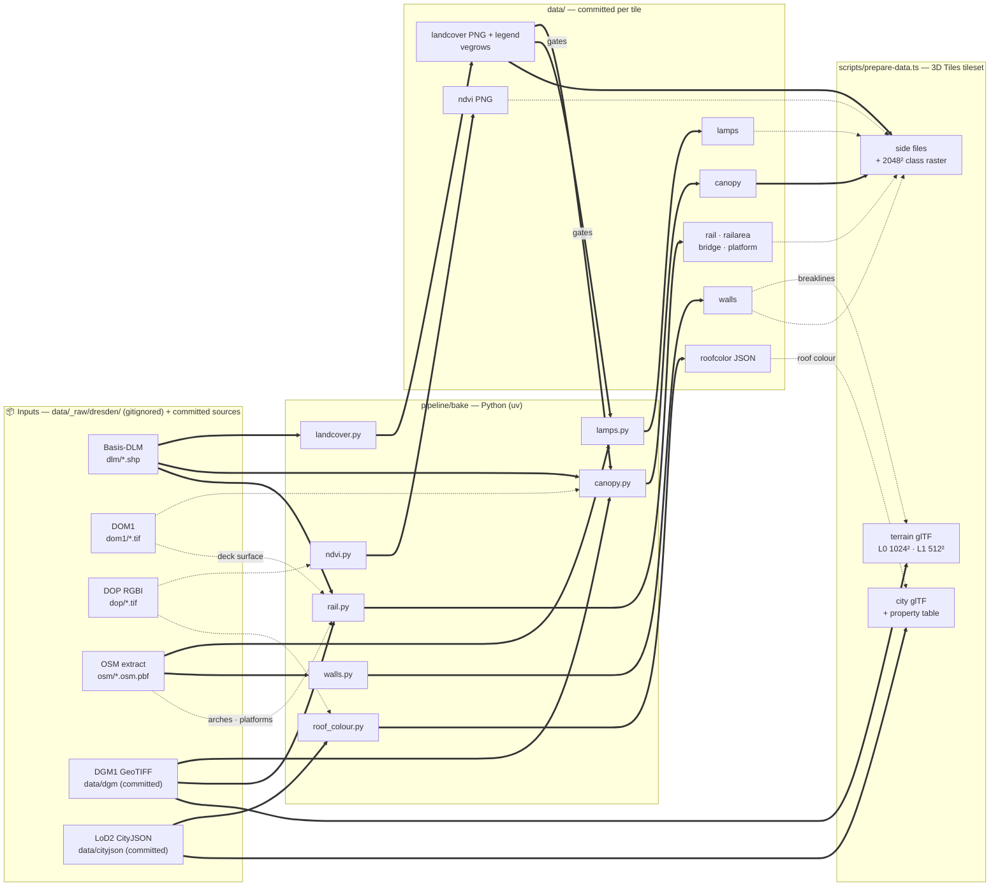

# Data → feature provenance

How each **raw data source** becomes a **rendered feature**. This is the
"structured overview" of the pipeline: read it before adding a data source or a
feature, and **update it when you change either** (see
[the maintenance rule](./README.md#keeping-these-docs-current)). The
plain-language version of this page is the guide's
[How the city walker works](./guide/en/how-it-works.md); the per-attribute
encoding table (which value drives which pixel) is in
[rendering.md](./rendering.md#visual-encoding--which-data-drives-which-pixel);
the bakes that produce each artifact are in
[data-pipeline.md](./data-pipeline.md), and the
[second diagram](#how-the-artifacts-are-made) below maps them.

The diagram convention encodes the *kind* of relation:

| Edge | Meaning |
|---|---|
| `A ==> B` (solid, bold) | **Required / primary.** B cannot render without A. |
| `A -.-> B` (dashed) | **Optional / enhancer / modifier.** B works without A; A improves or constrains it. |
| edge label | the transform, or *why* (e.g. `gates`, `preferred`, `fallback`). |
| node tagged *planned* | designed, not yet built (see [transformations.md](./transformations.md)). |
| node tagged *synth* | synthesized in-engine, no external data. |

```mermaid
flowchart LR
  classDef planned fill:#fef3c7,stroke:#d97706,stroke-dasharray:4 3,color:#92400e;
  classDef synth fill:#ede9fe,stroke:#7c3aed,color:#5b21b6;

  subgraph SRC["📦 Data sources — Saxon open geodata (+ OSM)"]
    direction TB
    CJ["CityJSON LoD2<br/>buildings + ALKIS attrs"]
    DGM["DGM1<br/>terrain raster (1 m)"]
    DOM["DOM1<br/>surface raster (1 m)"]
    DLM["Basis-DLM (ATKIS)<br/>land cover + veg rows"]
    OSM["OpenStreetMap<br/>(Geofabrik .osm.pbf extract)"]
    DOP["DOP orthophoto<br/>RGB + near-IR"]
    LSC["Laser scan (LAZ)<br/>spawn tile so far"]
    KAT["Stadtbaumkataster<br/>(Dresden street trees)"]
  end

  HASH["deterministic hash"]:::synth
  SUN["sun rig (time of day)"]:::synth

  subgraph FEAT["🎨 Rendered features — what you walk through"]
    direction TB
    TER["Terrain ground"]
    SURF["Surface colours<br/>roads · meadow · …"]
    WAT["Water (Elbe)"]
    BLD["Buildings<br/>(geometry)"]
    DET["Building detailing<br/>tint · roof · eave · glow"]
    VEG["Trees &amp; hedges"]
    LOW["OSM hedges"]
    LAMP["Street lamps"]
    RAIL["Railway tracks"]
    BRG["Bridges"]
    PLT["Station platforms"]
    WAL["Retaining walls"]
    MM["Minimap"]
    LIGHT["Light &amp; shadow"]
  end

  %% terrain + ground clamp
  DGM ==>|"error-bounded TIN, two levels (glTF)"| TER
  DGM -. ground-clamp .-> BLD
  DGM -. ground-clamp .-> VEG
  DGM -. ground-clamp .-> LAMP

  %% surfaces + water (multi-source)
  DLM ==>|"class raster → palette painted at runtime"| SURF
  DOP -. "NDVI meadow tint (class 1)" .-> SURF
  DLM ==>|"class 8 → water coverage (3×3 tent)"| WAT
  DGM ==>|"shares terrain mesh"| WAT

  %% buildings + detailing
  CJ ==>|"glTF mesh + EXT_mesh_features ids"| BLD
  CJ ==>|"function · roofType · height · surfacetype<br/>(property table)"| DET
  HASH -.->|"per-building variation<br/>(carries the look when attrs are sparse)"| DET
  DOP -. "real roof colour<br/>(83% coverage, else synth)" .-> DET

  %% vegetation (multi-source + gated)
  DLM ==>|"hedge / tree rows"| VEG
  DOM ==>|"nDOM = DOM1 − DGM1 → canopy"| VEG
  DGM ==>|"nDOM base term"| VEG
  DLM -. "gates: no trees on roads/water" .-> VEG
  DOP -. "NDVI → crown colour" .-> VEG
  LSC -. "crown peaks outside the canopy mask" .-> VEG
  KAT ==>|"surveyed trees: position · h · crown · taxon"| VEG
  KAT -. "thins the scan trees (bake) · vetoes canopy trees in its crowns" .-> VEG
  DLM -. "forest/copse: no veto" .-> VEG

  %% hedges
  OSM ==>|"barrier=hedge lines"| LOW
  LSC -. "measured height" .-> LOW
  DGM -. ground-clamp .-> LOW

  %% lamps
  OSM ==>|"point positions"| LAMP

  %% railway + bridges + platforms
  DLM ==>|"ver03_f area (dissolved) = ballast<br/>+ ver03_l tracks (heavy rail)"| RAIL
  DGM -. "drape / lift onto deck" .-> RAIL
  DLM ==>|"ver06_l decks + ver06_f footprints"| BRG
  DGM ==>|"abutment deck height + piers"| BRG
  DOM -. "deck surface (viaducts)" .-> BRG
  OSM -. "bridge:structure → arches" .-> BRG
  OSM ==>|"railway=platform polygons"| PLT
  OSM ==>|"barrier=retaining_wall/city_wall + height"| WAL
  DGM -. "snap to the measured step" .-> WAL
  DGM -. ground-clamp .-> PLT

  %% minimap + lighting (derived, not raw data)
  DGM -. "tile bounds" .-> MM
  DLM -. "class raster + palette as map background" .-> MM
  CJ -. "building footprints" .-> MM
  SUN ==> LIGHT
  SUN -. "fog · sky · dusk gate" .-> DET
```

## Feature-by-feature

| Feature | Primary source | Also needs / modifiers | Code |
|---|---|---|---|
| **Terrain ground** | DGM1 GeoTIFF → glTF terrain at two levels: an error-bounded TIN of the native 1 m grid (±0.15 m fine, ±0.5 m coarse, baked normals, 30 m skirt) | nothing burned in; a DGM with NoData falls back to the 1024² / 512² grid with the OSM walls burned in as a step | baked by `scripts/bake-tiles.ts` (`tinTerrainMesh`, `lib/city/terrain-tin.ts`; fallback `terrainMesh`, `lib/city/terrain-conflate.ts`) in `scripts/prepare-data.ts`; `terrain-layer.ts` (ground height over the drawn triangles), `tile-stream.ts` |
| **Surface colours** | Basis-DLM class raster (ids 0–8), painted with the palette on the GPU at load | DOP NDVI (meadow tint, class 1) | `landcover-splat.ts`, `lib/city/landcover.ts` (the one palette), `terrain-layer.ts` (samples the splat + `uNdvi`); baked by `pipeline/bake/landcover.py` + `ndvi.py` |
| **Water (Elbe)** | Basis-DLM class 8 (water coverage from the painted splat) **+** DGM1 (the terrain geometry it drapes on) | — | `water-layer.ts`, `landcover-splat.ts` |
| **Buildings (geometry)** | CityJSON LoD2 → glTF per tile (`_FEATURE_ID_0` per vertex, `EXT_mesh_features`) | DGM1 (ground-clamp) | baked by `scripts/bake-city-mesh.ts` (`cityjson-threejs-loader`) → `scripts/bake-tiles.ts` `cityMesh` → `scripts/tile-glb.ts`; `city-layer.ts` |
| **Building detailing** | CityJSON attrs + `surfacetype`, baked per object into an `EXT_structural_metadata` property table | DOP roof colour (real, ~83%) · hash (fallback) · sun (dusk gate) | `bake-city-mesh.ts` (per-object table), `lib/city/city-mesh.ts` (`objectTable`, `packObjectTexels`), `visual-style.ts`, `lib/city/building-tint.ts`; roof colour baked by `pipeline/bake/roof_colour.py` |
| **Inventory trees** | Stadtbaumkataster Dresden (WFS `cls:L1261`): position, height, crown diameter, taxon | DGM1 (ground-clamp) · DOP NDVI (deciduous crown colour) · vetoes the rows/canopy trees inside each crown, except in DLM forest/copse · trunks + broadleaf crowns drawn in the canopy's meshes | `tree-inventory-layer.ts`, `lib/city/tree-inventory.ts`; fetched by `pipeline/bake/ingest_trees_dresden.py`, baked by `trees.py` (+ `tree_archetypes.py`) |
| **Trees & hedges** | Basis-DLM rows **+** DOM1−DGM1 canopy **+** LSC crown peaks outside the mask (tiles with a scan, thinned against the cadastre) | DLM class raster *(gates)* · DOP NDVI (crown colour) | `vegetation-layer.ts`; baked by `pipeline/bake/landcover.py` + `canopy.py` + `ndvi.py` + `lowveg.py` (`canopyx`) |
| **OSM hedges** | OSM `barrier=hedge` lines (Geofabrik extract) | LSC (measured height and width, tiles with a scan) · DGM1 (ground-clamp); the tag or 1.5 m where no LAZ. The laser-scan-only hedges and shrubs are not shipped (🗃️ in the ledger) | `low-vegetation-layer.ts`; baked by `pipeline/bake/lowveg.py` |
| **Street lamps** | OSM `highway=street_lamp` (Geofabrik extract) | DGM1 (ground-clamp); gated off water + railway | baked by `pipeline/bake/lamps.py`; `lamp-layer.ts` |
| **Railway tracks** | Basis-DLM `ver03_f` area (dissolved ballast) **+** `ver03_l` (heavy-rail steel) | DGM1 (drape / lift onto deck) | `rail-layer.ts`; baked by `pipeline/bake/rail.py` |
| **Bridges** | Basis-DLM `ver06_l` decks (+ `ver06_f` footprints) | DGM1 (abutment height + piers) **+** DOM1 (deck surface) · OSM `bridge:structure` (arches) | `rail-layer.ts`; baked by `pipeline/bake/rail.py` |
| **Station platforms** | OSM `railway=platform` (Geofabrik extract) | DGM1 (ground-clamp) | `rail-layer.ts`; baked by `pipeline/bake/rail.py` |
| **Retaining walls** | OSM `barrier=retaining_wall/city_wall/wall` + `height` (Geofabrik extract) | DGM1 (ribbon snapped to the measured step of the TIN; on a grid-fallback tile the terrain is conflated to a step at build instead) — *no DGM/DOM/LiDAR product has the wall as a vertical face* | `wall-layer.ts`, `lib/city/wall-snap.ts`, `lib/city/terrain-conflate.ts` (fallback, at build); baked by `pipeline/bake/walls.py` |
| **Minimap** | tile bounds (tileset `extras`) + the 2048² class raster in the palette + CityJSON footprints (`footprints_<tile>.json`) | DTK / basemap.de *(planned, richer)* | `minimap.tsx`, `lib/city/minimap*`, `lib/city/landcover.ts` |
| **Light & shadow** | sun rig (time, not data) | — | `sun-rig.ts`, `post-stack.ts` |

Every row that reads OSM reads the site's local Geofabrik extract through
GDAL's OSM driver (`pipeline/bake/osm.py`); no bake queries a live API
([ADR 0025](./adr/0025-bakes-are-one-python-package.md)). The committed
lamp, platform and bridge-structure files still predate that and came from
Overpass — see [data-pipeline.md](./data-pipeline.md#provenance).

**Multi-source features to keep in mind when porting:** *Water* needs both DLM
and DGM1; *Trees* combine DLM rows, the DOM1−DGM1 canopy, and a DLM gate; *Building
detailing* prefers DOP roof colour but degrades to the hash. What happens when a
new location is missing one of these inputs is spelled out in
[portability.md](./portability.md).

## How the artifacts are made

The same sources, one level down: which bake module
(`pipeline/bake/`, run by `bun run bake`) writes which committed file, and
what the build step (`scripts/prepare-data.ts`) turns them into. Bold edges
are required inputs; dashed ones are optional (the step skips with a note,
or the feature falls back).

The ingest adapter that fills the inputs (`pipeline/bake/ingest_sn.py` for
Saxony) and the tileset's tree and glTF encoding are described in
[data-pipeline.md](./data-pipeline.md).
