# Data → feature provenance

How each **raw data source** becomes a **rendered feature**. This is the
"structured overview" of the pipeline: read it before adding a data source or a
feature, and **update it when you change either** (see
[the maintenance rule](./README.md#keeping-these-docs-current)).

The diagram convention encodes the *kind* of relation:

| Edge | Meaning |
|---|---|
| `A ==> B` (solid, bold) | **Required / primary.** B cannot render without A. |
| `A -.-> B` (dashed) | **Optional / enhancer / modifier.** B works without A; A improves or constrains it. |
| edge label | the transform, or *why* (e.g. `gates`, `preferred`, `fallback`). |
| node tagged *planned* | designed, not yet built (see [transformations.md](./transformations.md)). |
| node tagged *synth* | synthesized in-engine, no external data. |

```mermaid
flowchart TB
  classDef planned fill:#fef3c7,stroke:#d97706,stroke-dasharray:4 3,color:#92400e;
  classDef synth fill:#ede9fe,stroke:#7c3aed,color:#5b21b6;

  subgraph SRC["📦 Data sources — Saxon open geodata (+ OSM)"]
    direction LR
    CJ["CityJSON LoD2<br/>buildings + ALKIS attrs"]
    DGM["DGM1<br/>terrain raster (1 m)"]
    DOM["DOM1<br/>surface raster (1 m)"]
    DLM["Basis-DLM (ATKIS)<br/>land cover + veg rows"]
    OSM["OpenStreetMap<br/>street lamps"]
    DOP["DOP orthophoto<br/>RGB + near-IR"]:::planned
  end

  HASH["deterministic hash"]:::synth
  SUN["sun rig (time of day)"]:::synth

  subgraph FEAT["🎨 Rendered features — what you walk through"]
    direction LR
    TER["Terrain ground"]
    SURF["Surface colours<br/>roads · meadow · …"]
    WAT["Water (Elbe)"]
    BLD["Buildings<br/>(geometry)"]
    DET["Building detailing<br/>tint · roof · eave · glow"]
    VEG["Trees &amp; hedges"]
    LAMP["Street lamps"]
    MM["Minimap"]
    LIGHT["Light &amp; shadow"]
  end

  %% terrain + ground clamp
  DGM ==>|heightfield| TER
  DGM -. ground-clamp .-> BLD
  DGM -. ground-clamp .-> VEG
  DGM -. ground-clamp .-> LAMP

  %% surfaces + water (multi-source)
  DLM ==>|"splatmap RGB"| SURF
  DLM ==>|"alpha = water mask"| WAT
  DGM ==>|"shares terrain mesh"| WAT

  %% buildings + detailing
  CJ ==>|"merged mesh + objectid"| BLD
  CJ ==>|"function · roofType · height · surfacetype"| DET
  HASH -.->|"per-building variation<br/>(carries the look when attrs are sparse)"| DET
  DOP -. "preferred roof colour<br/>(replaces hash for roofs)" .-> DET

  %% vegetation (multi-source + gated)
  DLM ==>|"hedge / tree rows"| VEG
  DOM ==>|"nDOM = DOM1 − DGM1 → canopy"| VEG
  DGM ==>|"nDOM base term"| VEG
  DLM -. "gates: no trees on roads/water" .-> VEG
  DOP -. "NDVI → density &amp; crown colour" .-> VEG

  %% lamps
  OSM ==>|"point positions"| LAMP

  %% minimap + lighting (derived, not raw data)
  DGM -. "tile bounds" .-> MM
  SUN ==> LIGHT
  SUN -. "fog · sky · dusk gate" .-> DET
```

## Feature-by-feature

| Feature | Primary source | Also needs / modifiers | Code |
|---|---|---|---|
| **Terrain ground** | DGM1 GeoTIFF | — | `terrain-layer.ts`, `lib/city/terrain-geometry.ts` |
| **Surface colours** | Basis-DLM splatmap PNG | — | `terrain-layer.ts` (samples splat); baked by `scripts/extract-dlm.sh` |
| **Water (Elbe)** | Basis-DLM (alpha = water) **+** DGM1 (geometry) | — | `water-layer.ts` |
| **Buildings (geometry)** | CityJSON LoD2 | DGM1 (ground-clamp) | `city-layer.ts` (`cityjson-threejs-loader`) |
| **Building detailing** | CityJSON attrs + `surfacetype` | hash (fallback variation) · DOP *(planned, preferred roof)* · sun (dusk gate) | `city-layer.ts` `annotateBuildingDetail`, `visual-style.ts`, `lib/city/building-tint.ts` |
| **Trees & hedges** | Basis-DLM rows **+** DOM1−DGM1 canopy | DLM class raster *(gates)* · DOP NDVI *(planned)* | `vegetation-layer.ts`; baked by `extract-dlm.sh` + `extract-canopy.sh` |
| **Street lamps** | OSM | DGM1 (ground-clamp) | baked by `scripts/extract-lamps.sh`; placed in `vegetation-layer.ts` / scene |
| **Minimap** | derived from tile bounds | DTK / basemap.de *(planned, richer)* | `minimap.tsx`, `lib/city/minimap*` |
| **Light & shadow** | sun rig (time, not data) | — | `sun-rig.ts`, `post-stack.ts` |

**Multi-source features to keep in mind when porting:** *Water* needs both DLM
and DGM1; *Trees* combine DLM rows, the DOM1−DGM1 canopy, and a DLM gate; *Building
detailing* prefers DOP roof colour but degrades to the hash. What happens when a
new location is missing one of these inputs is spelled out in
[portability.md](./portability.md).
