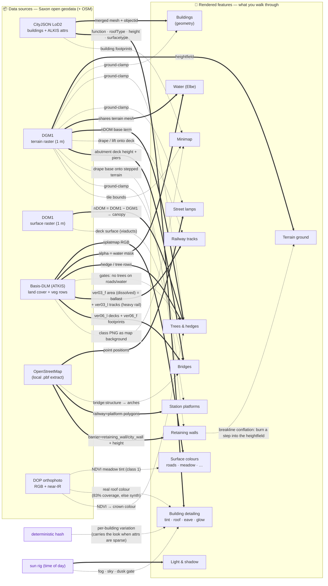

# Data → feature provenance

How each **raw data source** becomes a **rendered feature**. This is the
"structured overview" of the pipeline: read it before adding a data source or a
feature, and **update it when you change either** (see
[the maintenance rule](./README.md#keeping-these-docs-current)). The
plain-language version of this page is the guide's
[How the city walker works](./guide/en/how-it-works.md); the per-attribute
encoding table (which value drives which pixel) is in
[rendering.md](./rendering.md#visual-encoding--which-data-drives-which-pixel);
the bakes that produce each artifact are in [data-pipeline.md](./data-pipeline.md).

The diagram convention encodes the *kind* of relation:

| Edge | Meaning |
|---|---|
| `A ==> B` (solid, bold) | **Required / primary.** B cannot render without A. |
| `A -.-> B` (dashed) | **Optional / enhancer / modifier.** B works without A; A improves or constrains it. |
| edge label | the transform, or *why* (e.g. `gates`, `preferred`, `fallback`). |
| node tagged *planned* | designed, not yet built (see [transformations.md](./transformations.md)). |
| node tagged *synth* | synthesized in-engine, no external data. |

## Feature-by-feature

| Feature | Primary source | Also needs / modifiers | Code |
|---|---|---|---|
| **Terrain ground** | DGM1 GeoTIFF → build-time heightfield (`.u16.gz`) | OSM walls (conflated into a step) · 🧪 `?terrain=tin`: the primary tile as an error-bounded TIN of the native 1 m DGM1 (`.tin-15cm.bin.gz`, no conflation) | baked by `scripts/prepare-data.ts` (`lib/city/heightfield.ts`; TIN: `scripts/bake-terrain-tin.ts`, `lib/city/terrain-tin.ts`); `terrain-layer.ts`, `lib/city/terrain-geometry.ts`, `lib/city/terrain-conflate.ts` |
| **Surface colours** | Basis-DLM splatmap PNG | DOP NDVI (meadow tint, class 1) | `terrain-layer.ts` (samples splat + `uNdvi`); baked by `extract-dlm.sh` + `extract-ndvi.sh` |
| **Water (Elbe)** | Basis-DLM (alpha = water) **+** DGM1 (geometry) | — | `water-layer.ts` |
| **Buildings (geometry)** | CityJSON LoD2 → build-time mesh (`.mesh.bin.gz` + `.mesh.json`) | DGM1 (ground-clamp) | baked by `scripts/bake-city-mesh.ts` (`cityjson-threejs-loader`, `lib/city/city-mesh.ts`); `city-layer.ts` |
| **Building detailing** | CityJSON attrs + `surfacetype` (baked per object) | DOP roof colour (real, ~83%) · hash (fallback) · sun (dusk gate) | `bake-city-mesh.ts` (per-object table), `city-mesh.ts` `buildDetailAttributes`, `visual-style.ts`, `lib/city/building-tint.ts`; bake `extract-roof-colour.sh` |
| **Trees & hedges** | Basis-DLM rows **+** DOM1−DGM1 canopy | DLM class raster *(gates)* · DOP NDVI (crown colour) | `vegetation-layer.ts`; baked by `extract-dlm.sh` + `extract-canopy.sh` + `extract-ndvi.sh` |
| 🧪 **Inventory trees** (`?trees=kataster`) | Stadtbaumkataster Dresden (WFS `cls:L1261`): position, height, crown diameter, taxon | DGM1 (ground-clamp) · DOP NDVI (deciduous crown colour) · vetoes the rows/canopy trees inside each crown | `tree-inventory-layer.ts`, `lib/city/tree-inventory.ts`; baked by `scripts/extract-trees.sh` (+ `tree_archetypes.py`) |
| **Street lamps** | OSM | DGM1 (ground-clamp); gated off water + railway | baked by `scripts/extract-lamps.sh`; `lamp-layer.ts` |
| **Railway tracks** | Basis-DLM `ver03_f` area (dissolved ballast) **+** `ver03_l` (heavy-rail steel) | DGM1 (drape / lift onto deck) | `rail-layer.ts`; baked by `scripts/extract-rail.sh` |
| **Bridges** | Basis-DLM `ver06_l` decks (+ `ver06_f` footprints) | DGM1 (abutment height + piers) **+** DOM1 (deck surface) · OSM `bridge:structure` (arches) | `rail-layer.ts`; baked by `scripts/extract-rail.sh` |
| **Station platforms** | OSM `railway=platform` | DGM1 (ground-clamp) | `rail-layer.ts`; baked by `scripts/extract-rail.sh` |
| **Retaining walls** | OSM `barrier=retaining_wall/city_wall/wall` + `height` (local `.pbf`) | DGM1 (base drape + terrain conflated to step; 🧪 `?terrain=tin`: ribbon snapped to the measured step instead) — *no DGM/DOM/LiDAR product has the wall as a vertical face* | `wall-layer.ts`, `lib/city/terrain-conflate.ts`, `lib/city/wall-snap.ts`; baked by `scripts/extract-walls.sh` |
| **Minimap** | tile bounds + DLM class PNG (background) + CityJSON footprints | DTK / basemap.de *(planned, richer)* | `minimap.tsx`, `lib/city/minimap*` |
| **Light & shadow** | sun rig (time, not data) | — | `sun-rig.ts`, `post-stack.ts` |

**Multi-source features to keep in mind when porting:** *Water* needs both DLM
and DGM1; *Trees* combine DLM rows, the DOM1−DGM1 canopy, and a DLM gate; *Building
detailing* prefers DOP roof colour but degrades to the hash. What happens when a
new location is missing one of these inputs is spelled out in
[portability.md](./portability.md).
