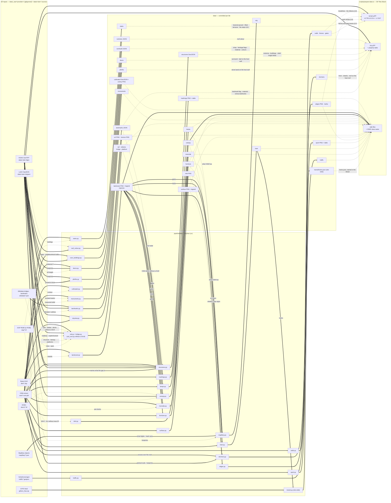

# Data → feature provenance

How each **raw data source** becomes a **rendered feature**. This is the
"structured overview" of the pipeline: read it before adding a data source or a
feature, and **update it when you change either** (see
[the maintenance rule](./README.md#keeping-these-docs-current)). The
plain-language version of this page is the guide's
[How the city walker works](./guide/en/how-it-works.md); the per-attribute
encoding table (which value drives which pixel) is in
[rendering.md](./rendering.md#visual-encoding--which-data-drives-which-pixel);
the bakes that produce each artifact are in
[data-pipeline.md](./data-pipeline.md), and the
[second diagram](#how-the-artifacts-are-made) below maps them.

The diagram convention encodes the *kind* of relation:

| Edge | Meaning |
|---|---|
| `A ==> B` (solid, bold) | **Required / primary.** B cannot render without A. |
| `A -.-> B` (dashed) | **Optional / enhancer / modifier.** B works without A; A improves or constrains it. |
| edge label | the transform, or *why* (e.g. `gates`, `preferred`, `fallback`). |
| node tagged *planned* | designed, not yet built (see [transformations.md](./transformations.md)). |
| node tagged *synth* | synthesized in-engine, no external data. |

```mermaid
flowchart LR
  classDef planned fill:#fef3c7,stroke:#d97706,stroke-dasharray:4 3,color:#92400e;
  classDef synth fill:#ede9fe,stroke:#7c3aed,color:#5b21b6;

  subgraph SRC["📦 Data sources — Saxon open geodata (+ OSM)"]
    direction TB
    CJ["CityJSON LoD2<br/>buildings + ALKIS attrs"]
    DGM["DGM1<br/>terrain raster (1 m)"]
    DOM["DOM1<br/>surface raster (1 m)"]
    DLM["Basis-DLM (ATKIS)<br/>land cover + veg rows"]
    OSM["OpenStreetMap<br/>(Geofabrik .osm.pbf extract)"]
    DOP["DOP orthophoto<br/>RGB + near-IR (Bavaria: RGB only)"]
    WD["Wikidata<br/>(bridge class · main span ·<br/>landmarks: sitelinks · material)"]
    LSC["Laser scan (LAZ)<br/>every tile"]
    KAT["Street-tree registers<br/>(Dresden · Hamburg · Leipzig · Berlin)"]
    VM["Traffic counts<br/>(vehicles / day per section: Dresden · Berlin · Hamburg · the road censuses of Saxony and NRW)"]
    RZ["Bicycle counters<br/>(bicycles / hour, live: Dresden · Hamburg)"]
    GTFS["GTFS timetable<br/>(DELFI via gtfs.de)"]
  end

  HASH["deterministic hash"]:::synth
  SUN["sun rig (time of day)"]:::synth

  subgraph FEAT["🎨 Rendered features — what you walk through"]
    direction TB
    TER["Terrain ground"]
    SURF["Surface colours<br/>roads · meadow · …"]
    PAVE["Kerbs, paving &amp; parking<br/>kerb stones · lawn edge · sett · slabs · bays"]
    WAT["Water (Elbe)"]
    BLD["Buildings<br/>(geometry)"]
    DET["Building detailing<br/>tint · roof · eave · glow · shop fronts<br/>mapped colour · glass/metal sheen"]
    LMK["Landmarks<br/>HUD list · glide to a vantage"]
    VEG["Trees &amp; hedges"]
    LOW["OSM hedges"]
    LAMP["Street lamps"]
    FURN["Street furniture &amp; playgrounds<br/>benches · bins · stands · shelters · play equipment<br/>columns · signals · hydrants · clocks · stop signs"]
    MON["Fountains &amp; monuments"]
    RAIL["Railway tracks"]
    TRAM["Trams<br/>tracks · masts · contact wire"]
    RIV["Elbe landing stages<br/>piers · pontoons · groynes · ferry lines"]
    SND["Sound (hidden, opt-in)<br/>hour bells · footsteps · river · birds"]
    TRF["Data layer: motor traffic<br/>flowing bands per direction"]
    BIK["Data layer: bicycle counters<br/>a column per direction (live)"]
    TCAR["Data layer: trams by timetable<br/>cars at the scene's clock"]
    BRG["Bridges<br/>deck · truss · pylons · arch"]
    PLT["Station platforms"]
    WAL["Retaining walls"]
    FEN["Fences, railings &amp; gates"]
    STR["Stairs"]
    SPT["Sports grounds<br/>pitches · courts · tracks · goals"]
    MRK["Road markings<br/>zebras · Furten · stop lines · cycle and centre lines"]
    CULT["Cultivated land<br/>allotment beds · orchard trees · vine rows"]
    MM["Minimap"]
    LIGHT["Light &amp; shadow"]
    PLAN["Modell: planning views<br/>Schwarzplan · Schnitt profile · plinth · shadow study"]
  end

  %% terrain + ground clamp
  DGM ==>|"glTF terrain: fine TIN (native 1 m), coarse 512² grid"| TER
  DGM -. ground-clamp .-> BLD
  DGM -. ground-clamp .-> VEG
  DGM -. ground-clamp .-> LAMP
  DGM -. ground-clamp .-> FURN
  DGM -. ground-clamp .-> MON

  %% surfaces + water (multi-source)
  DLM ==>|"class raster → palette painted at runtime"| SURF
  OSM -. "squares, islands, lawns carved out of the road class" .-> SURF
  DOP -. "NDVI meadow tint (class 1)<br/>+ urban green (classes 0, 4)" .-> SURF
  DLM ==>|"road / meadow edges → smoothed distance + kerb lines"| PAVE
  DOP -. "NDVI → urban green as meadow" .-> PAVE
  OSM -. "surface · sidewalk:*:surface · parking<br/>+ way direction" .-> PAVE
  DLM ==>|"class 8 → water coverage (3×3 tent)"| WAT
  DGM ==>|"shares terrain mesh"| WAT

  %% buildings + detailing
  CJ ==>|"glTF mesh + EXT_mesh_features ids"| BLD
  LSC ==>|"small structures LoD2 lacks<br/>(2–6.5 m, single-echo, flat) → boxes"| BLD
  DOM -. "LoD2 roofs that miss the scan<br/>→ measured levels and faces" .-> BLD
  OSM -. "markets · building sites · car parks: not taken" .-> BLD
  DOM -. "DOM1 − max(DGM1, LoD2 roof), only where OSM names it:<br/>chimneys · towers · masts · missing buildings" .-> BLD
  OSM -. "man_made=chimney/tower/mast/… · building outlines LoD2 lacks" .-> BLD
  DOM -. "a landmark's roof above its LoD2 roof → relief height field<br/>standing on the roof under each cell" .-> BLD
  CJ ==>|"function · roofType · height · surfacetype<br/>(property table)"| DET
  HASH -.->|"per-building variation<br/>(carries the look when attrs are sparse)"| DET
  DOP -. "real roof colour<br/>(83% coverage, else synth)" .-> DET
  OSM -. "shop / café on the ground floor · heritage=*<br/>building:material · building:colour · roof:colour → clay palette<br/>(joined to the LoD2 footprints)<br/>the neighbourhood's mapped walls → brick or plaster for the rest" .-> DET
  WD -. "landmark flag · material where OSM has none" .-> DET
  WD ==>|"notable buildings and structures (sitelinks,<br/>≥ 8 % of the tile's top), matched to LoD2 objects → the site's 12"| LMK
  OSM -. "wikidata= outlines → which objects" .-> LMK

  %% vegetation (multi-source + gated)
  DLM ==>|"hedge / tree rows"| VEG
  DOM ==>|"nDOM = DOM1 − DGM1 → canopy"| VEG
  DGM ==>|"nDOM base term"| VEG
  DLM -. "gates: no trees on roads/water" .-> VEG
  DOP -. "NDVI → crown colour" .-> VEG
  DOP -. "fallback without near-IR: GLI from RGB on the NDVI's scale" .-> VEG
  LSC -. "crown peaks outside the canopy mask" .-> VEG
  KAT ==>|"surveyed trees: position · h · crown · trunk · genus → season"| VEG
  KAT -. "thins the scan trees (bake) · vetoes canopy trees in its crowns" .-> VEG
  OSM -. "natural=tree the cadastre lacks (≥ 3 m off) · taxon" .-> VEG
  DLM -. "forest/copse: no veto" .-> VEG

  %% hedges
  OSM ==>|"barrier=hedge lines"| LOW
  LSC -. "measured height" .-> LOW
  DGM -. ground-clamp .-> LOW

  %% lamps
  OSM ==>|"point positions"| LAMP

  %% street furniture
  OSM ==>|"bench · waste_basket · bicycle_parking · bollard · post_box · shelter<br/>playground outlines + mapped equipment<br/>advertising · traffic_signals · fire_hydrant · clock · drinking_water · bus_stop"| FURN
  DLM -. "road class → the kerb a signal or sign moves to" .-> FURN
  OSM -. "nearest highway → which way it faces" .-> FURN

  %% fountains + monuments (official list, OSM basins)
  DLM ==>|"sie03_p monuments: position · name · kind"| MON
  OSM -. "amenity=fountain: basin outlines + fountains the DLM lacks" .-> MON
  DOM ==>|"nDOM = DOM1 − DGM1 → the sculpture's measured bulk"| MON

  %% railway + bridges + platforms
  DLM ==>|"ver03_f area (dissolved) = ballast<br/>+ ver03_l tracks (heavy rail)"| RAIL
  OSM -. "fallback without a DLM: railway=rail/light_rail/subway<br/>→ tracks + ballast beds" .-> RAIL
  DGM -. "the level along the whole line<br/>ground · deck · span · cut" .-> RAIL
  DLM ==>|"ver06_l decks + ver06_f footprints"| BRG
  OSM -. "fallback without a DLM: bridge ways + man_made=bridge<br/>→ decks (one bridge's ways merged per level)" .-> BRG
  DGM ==>|"abutment ramp · piers · water under the fairway"| BRG
  DOM -. "roadway height · superstructure ribs (truss, pylons, arch)" .-> BRG
  OSM -. "bridge:structure · fairway clearance → deck depth" .-> BRG
  WD -. "class (overrides OSM) · main span" .-> BRG
  OSM ==>|"railway=platform polygons"| PLT
  OSM ==>|"railway=tram + gauge · power=catenary_mast · tram_stop + platforms<br/>building outlines → rosette spans"| TRAM
  DLM -. "road / meadow class → track bed" .-> TRAM
  DOP -. "NDVI → lawn track bed" .-> TRAM
  DGM -. "the level along the whole line<br/>ground · deck · span" .-> TRAM
  OSM ==>|"man_made=pier / groyne · route=ferry"| RIV
  DLM -. "water class → pontoon · ferry cut to the water" .-> RIV
  DGM -. "pier deck from the bank · pontoon on the drawn water" .-> RIV
  VM ==>|"vehicles / day per direction · heavy share"| TRF
  DGM -. "drape (0.15 m over the ground)" .-> TRF
  BRG -. "deck under a bridge street" .-> TRF
  RZ ==>|"read by the browser every 5 min while on"| BIK
  DGM -. ground-clamp .-> BIK
  GTFS ==>|"trips · stop times · day kinds"| TCAR
  OSM ==>|"tram tracks → the way between two stops"| TCAR
  BRG -. "deck under a bridge track" .-> TCAR
  SUN -. "the scene's clock" .-> TCAR
  OSM ==>|"churches · bell towers · paving · tram tracks"| SND
  CJ -. "tower tip + height" .-> SND
  DLM -. "water · green · roads" .-> SND
  SUN -. "night · season · the hour" .-> SND
  OSM ==>|"barrier=retaining_wall/city_wall · natural=cliff + height"| WAL
  DGM -. "snap to the measured step (fine TIN)" .-> WAL
  WAL -. "breakline burned into the coarse grid at build" .-> TER
  OSM ==>|"barrier=fence/handrail + fence_type · gates on a line"| FEN
  DGM -. "stands on the fine TIN" .-> FEN
  FEN -. "gates cut freestanding walls" .-> WAL
  OSM ==>|"highway=steps + width · step_count"| STR
  DGM -. "landing heights" .-> STR
  STR -. "ground lowered under the flight at build" .-> TER
  OSM -. "layer ≥ 1 areas a flight climbs onto → terraces lifted at build" .-> TER
  DGM -. ground-clamp .-> PLT
  OSM ==>|"leisure=pitch/track<br/>sport · surface → table + index raster"| SPT
  OSM ==>|"crossings · signals · cycleway · lanes → table + lane raster"| MRK
  DLM -. "carriageway width + kerb distance" .-> MRK
  OSM ==>|"landuse=allotments/orchard/vineyard → colonies, trees, rows"| CULT
  DGM -. "rows along the contour · ground-clamp" .-> CULT
  DGM -. "goals · posts · nets ground-clamped" .-> SPT

  %% minimap + lighting (derived, not raw data)
  DGM -. "tile bounds" .-> MM
  DLM -. "class raster + palette as map background" .-> MM
  CJ -. "building footprints" .-> MM
  SUN ==> LIGHT
  DGM ==>|"sky-view factor · far horizon (with the LoD2 roofs,<br/>the rebuilt ones in their place)"| LIGHT
  CJ -. "roofs in the sky view and horizon" .-> LIGHT
  SUN -. "fog · sky · dusk gate" .-> DET
  CJ ==>|"the clay as the figure (black)"| PLAN
  DGM ==>|"ground profile along a cut · plinth walls"| PLAN
  DLM -. "plan palette (Strich)" .-> PLAN
  SUN -. "21.3. · 21.6. · 21.12. at fixed hours" .-> PLAN
```

## Feature-by-feature

| Feature | Primary source | Also needs / modifiers | Code |
|---|---|---|---|
| **Terrain ground** | DGM1 GeoTIFF → glTF terrain at two levels: the fine one an error-bounded TIN of the native 1 m grid (±0.15 m), the coarse one a 512² grid (baked normals, 30 m skirt) | OSM stairs (ground lowered under the flight at build) · OSM `layer` ≥ 1 terraces · OSM walls (burned in as a step, coarse grid only) | baked by `scripts/bake-tiles.ts` (`tinTerrainMesh` via `scripts/bake-terrain-tin.ts` + `lib/city/terrain-tin.ts`; `terrainMesh`, `lib/city/terrain-conflate.ts`, `lib/city/stairs.ts`) in `scripts/prepare-data.ts`; `terrain-layer.ts` (`TinIndex` heights), `tile-stream.ts` |
| **Surface colours** | Basis-DLM class raster (ids 0–8), painted with the palette on the GPU at load | DOP NDVI (meadow tint, class 1; urban green on classes 0 and 4) | `landcover-splat.ts`, `lib/city/landcover.ts` (the one palette), `terrain-layer.ts` (samples the splat + the NDVI, `meadowNdvi`), `ground-detail.ts` (urban green); baked by `pipeline/bake/landcover.py` + `ndvi.py` |
| **Kerbs, paving & parking** | Basis-DLM class raster: the road (7) and meadow (1, + urban green) edges as smoothed signed distances, and the kerb lines the fine terrain stands kerb stones on (`edges.py`) | OSM paving raster (`surface`, `sidewalk:*:surface`, `parking:*` lanes, `amenity=parking`/`parking_space` with their aisles, the way direction; else the class default) | `ground-detail.ts` (in the terrain fragment pass), `terrain-layer.ts`; baked by `pipeline/bake/surface.py` |
| **Sports grounds** | OSM `leisure=pitch` / `track` (playgrounds are street furniture): per ground its frame, surface and line scheme (`sport_<t>.json`) and a 2048² index raster (`sport_<t>.png`) | the sport's usual surface when untagged · DGM1 (the goals, posts and nets stand on the ground) | `sport-ground.ts` (in the terrain fragment pass), `sport-fixtures.ts` (dressing), `lib/city/sport.ts`; baked by `pipeline/bake/sport.py` |
| **Road markings** | OSM `highway=crossing` (marked kinds), directed `highway=traffic_signals`, `cycleway*=lane`, `lanes` + `oneway`: a table of crossings and stop lines (`markings_<t>.json`) and a 2048² raster of rows, lane bits and the centre offset (`markings_<t>.png`) | Basis-DLM class raster (the carriageway's width across each crossing; the kerb distance the cycle lane keeps) | `road-markings.ts` (in the terrain fragment pass), `lib/city/markings.ts`; baked by `pipeline/bake/markings.py` |
| **Water (Elbe)** | Basis-DLM class 8 (water coverage from the painted splat) **+** DGM1 (the terrain geometry it drapes on) | — | `water-layer.ts`, `landcover-splat.ts` |
| **Buildings (geometry)** | CityJSON LoD2 → glTF per tile (`_FEATURE_ID_0` per vertex, `EXT_mesh_features`); a LoD2 roof that misses DOM1 (free-form roofs of complex buildings, 3 m placeholders of new ones) replaced by what DOM1 measures there — flat levels, and its surface where it slopes or curves (ADR 0036); plus the small structures the laser scan saw and LoD2 lacks (sheds, garden houses, container buildings), appended as boxes with `source` = 1; plus what DOM1 shows above LoD2 where OSM names it (chimneys, towers, masts, water towers, lighthouses as lathed columns; buildings LoD2 does not carry yet, extruded; a landmark's roof relief as its measured height field, 1 m grid, its walls down to the LoD2 roof under each cell; a mapped tower under a LoD2 roof is LoD2's own), appended with `source` = 2 | DGM1 (ground-clamp) · DOM1 (the measured roofs) · DOP NDVI (a crown over a roof is not the roof) · LSC (the structures' footprint, ground and top) · OSM (pedestrian areas, squares, marketplaces, building sites and car parks — the Christmas markets of the flight — are not taken) · DOP NDVI (a clipped evergreen is not a roof) · DOM1 − max(DGM1, LoD2 roof) with OSM `man_made=*` and building outlines (nothing from DOM alone: the cranes) · the landmarks (relief only on them) | baked by `scripts/bake-city-mesh.ts` (`cityjson-threejs-loader`, `withMeasuredRoofs` + `scripts/measured-roofs.ts`, `appendScanStructures`, `appendGapStructures`, `lib/city/small-buildings.ts`, `lib/city/structures.ts`) → `scripts/bake-tiles.ts` `cityMesh` → `scripts/tile-glb.ts`; `city-layer.ts`; the structures by `pipeline/bake/small_buildings.py` and `structures.py`, the measured roofs by `pipeline/bake/roofs.py` |
| **Building detailing** | CityJSON attrs + `surfacetype`, baked per object into an `EXT_structural_metadata` property table | DOP roof colour (real, ~83%) · hash (fallback) · sun (dusk gate) · OSM shops on the ground floor and `heritage=*` (the `flags` column) · OSM `building:levels` (the storey bands' spacing) · OSM `building:colour` / `roof:colour` (in the clay's register) and `building:material` (palette family; glass and metal as flags with a sheen) · the neighbourhood's mapped wall materials (brick or plaster for a building without its own, `context`) · Wikidata (landmark flag; its material where OSM has none) | `bake-city-mesh.ts` (per-object table), `lib/city/city-mesh.ts` (`objectTable`, `packObjectTexels`), `visual-style.ts`, `lib/city/building-tint.ts`; roof colour baked by `pipeline/bake/roof_colour.py`, the OSM flags by `osm_buildings.py` |
| **Object facts + the inquiry card** (ADR 0042) | CityJSON `gml:id` (the Building's), `function`, `roofType`, `measuredHeight`, `Dachneigung`, `creationDate`, GroundSurface area → fact columns of the same table | OSM building outlines and address points (`name`, `addr`, `levels`) · `data/<site>/provenance.json` → `provenance.json` (each source's edition and licence) | `lib/city/object-facts.ts` (bake + read), `osm_buildings.py`, `lib/city/provenance.ts`, `lib/city/inquiry.ts`, `inquiry-probe.ts`, `inquiry-card.tsx` |
| **Tree facts** (plan 052 phase 4) | Stadtbaumkataster: species (German, botanical), location and tree number, age, the record's date, which sizes are measured · OSM `natural=tree` taxon and tags | aligned with the trees file by index; fetched with the question | `pipeline/bake/trees.py` → `treefacts_<tile>.json`, `lib/city/inquiry-features.ts`, `inquiry-card.tsx` |
| **Landmarks** (HUD, *Erkunden*) | Wikidata (CC0): per tile the buildings and structures with ≥ 2 sitelinks (`bun run fetch`, cached), matched to the LoD2 objects that draw them; per tile those with ≥ 8 % of its most notable one's sitelinks (cap 40); the site's 12 most notable in the tileset's `extras.landmarks` | OSM outlines tagged `wikidata=` (which objects), else the LoD2 building under the point · LoD2 heights (the vantage's altitude) | `places-list.tsx` (*Orte*, one list with the vantages: a landmark a vantage names or looks at is folded into it, `lib/city/places.ts`), `lib/city/landmarks.ts` (`siteLandmarks` — one per building drawn —, `landmarkVantage`), `scripts/prepare-data.ts` (`withLandmarks`); baked by `pipeline/bake/landmarks.py` |
| **Inventory trees** | The city's street-tree register (Dresden `cls:L1261`, Hamburg, Leipzig, Berlin; WFS, one field mapping each in `cadastre.py`): position, height (Hamburg's: measured in DOM1 − DGM1), crown diameter, trunk diameter, taxon → genus **+** OSM `natural=tree` more than 3 m from every cadastre tree (a taxon naming a known genus, or `leaf_type`, else dropped) | DGM1 (ground-clamp) · DOP NDVI (deciduous crown colour) · vetoes the rows/canopy trees inside each crown, except in DLM forest/copse · trunks + broadleaf crowns drawn in the canopy's meshes · the scene date → per-genus autumn colour and bare crowns (`lib/city/tree-season.ts`) | `tree-inventory-layer.ts`, `crown-season.ts`, `lib/city/tree-inventory.ts`, `lib/city/tree-season.ts`, `tile-stream.ts`; baked by `pipeline/bake/trees.py` (+ `tree_archetypes.py`) |
| **Trees & hedges** | Basis-DLM rows **+** DOM1−DGM1 canopy **+** LSC crown peaks outside the mask (every tile, thinned against the cadastre and the OSM trees) | DLM class raster *(gates)* · the LSC small structures (a canopy or scan point in or within 0.5 m of one is its roof, dropped at build time by `scripts/prepare-data.ts`) · DOP NDVI (crown colour; the GLI from RGB where the DOP has no near-IR, Munich) · without a DLM the OSM bridge decks keep the canopy off (`rail` runs first) · the scene date (a generic deciduous year: autumn colour, bare crowns; hedges stay green) · the terrain level shown (the fine one draws every tree, the coarse one a fixed third, √3 wider, baked by `scripts/coarse-crowns.ts` into `crowns_<t>.crw.gz`) | `vegetation-layer.ts`, `crown-season.ts`, `coarse-crowns-layer.ts`; baked by `pipeline/bake/landcover.py` + `canopy.py` + `ndvi.py` + `lowveg.py` |
| **Cultivated land** | OSM `landuse=allotments` (+ `leisure=garden` plots), `orchard`, `vineyard` | the colony raster (beds in the terrain pass) · OSM `natural=tree` in an orchard, else an 8 m grid, less the spots a canopy, scan or inventory tree already fills · DGM1 (a vineyard's rows along the contour, over the whole vineyard from every tile's DGM; ground-clamp) | `cultivated-layer.ts`, `lib/city/cultivated.ts`, `tile-stream.ts`; baked by `pipeline/bake/cultivated.py` |
| **OSM hedges** | OSM `barrier=hedge` lines (Geofabrik extract) | LSC (measured height) · DGM1 (ground-clamp); tag / 1.5 m where no LAZ. The bake's laser-scan-only hedges and shrubs are not shipped (🗃️ in the ledger) | `low-vegetation-layer.ts`; baked by `pipeline/bake/lowveg.py` |
| **Street lamps** | OSM `highway=street_lamp` (Geofabrik extract) **+** Mapillary's detected street lights where OSM has none within 8 m (Dresden, `Site.mapillary`; CC BY-SA 4.0, its own file `mly_<t>.geojson`) | DGM1 (ground-clamp); gated off water + railway (Mapillary's also off LoD2 footprints and bridge decks, out of the carriageway to the kerb) | baked by `pipeline/bake/lamps.py` + `mapillary.py`; `lamp-layer.ts`, `lib/city/mapillary.ts` |
| **Street furniture & playgrounds** | OSM `amenity=bench/waste_basket/bicycle_parking/post_box/clock/drinking_water`, `leisure=picnic_table`, `barrier=bollard` (+ `height`, `material`), `advertising=column` (+ `lit`), `highway=traffic_signals` (+ `traffic_signals:direction`), `emergency=fire_hydrant` (+ `fire_hydrant:type`), `leisure=playground` outlines + `playground=*` equipment, stops with `shelter=yes` and bus stops without (their sign) (Geofabrik extract; the committed files from BBBike's Dresden cut) | OSM highways (the bearing an untagged object faces; a signal's travel direction) · the DLM road class (the kerb a signal or hydrant sign in the carriageway moves to) · OSM building outlines (wall clocks) · DGM1 (ground-clamp); gated off water, railway and bridge decks · **+** Mapillary's detected trash cans where OSM has no bin within 8 m (as the lamps above) | baked by `pipeline/bake/furniture.py` + `mapillary.py`; `furniture-layer.ts`, `lib/city/furniture.ts`, `lib/city/mapillary.ts` |
| **Fountains & monuments** | Basis-DLM `sie03_p` monument points (`BWF` 1750/1770/1780, official names) | OSM `amenity=fountain` (basin outlines, fountains the DLM lacks, which DLM monument is a fountain) · DOM1 − DGM1 (the sculpture's measured form) · DGM1 (seated over the highest ground under a basin) | baked by `pipeline/bake/monuments.py`; `monument-layer.ts`, `lib/city/monuments.ts` |
| **Railway tracks** | Basis-DLM `ver03_f` area (dissolved ballast) **+** `ver03_l` (heavy-rail steel; trams left to OSM); without a DLM (Hamburg, Berlin) OSM `railway=rail/light_rail/subway/narrow_gauge` with `tracks` and `electrified`, its ballast the ways' beds buffered | DGM1 (the level along the whole line: ground, deck, span — ADR 0041) · Basis-DLM tunnels `ver06` `BWF=1870` (a stretch > 15 m within 2 m of one is underground: cut; OSM: `tunnel`, `location=underground`) | `rail-layer.ts`; baked by `pipeline/bake/rail.py` (`rail_osm.py` without a DLM) |
| **Trams** | OSM `railway=tram` (each track, with its `gauge`; standard gauge where untagged), `power=catenary_mast` (the masts within 15 m of a tram track), the OSM building outlines (facades for the rosette spans), `railway=tram_stop` + the platforms (the stop signs) | DLM class raster (street — road, path or built-up — vs lawn vs ballast bed; no way in a tunnel) · DOP NDVI (lawn bed) · DGM1 (drape) · the bridge decks (a track tagged `bridge` rides the deck) | `tram-layer.ts`, `lib/city/tram.ts` (wire stations and sag); baked by `pipeline/bake/tram.py` |
| **Data layer: motor traffic** (off by default) | the site's counts (`traffic_sources.py`): Dresden's Verkehrsmengen (WFS `cls:L363`, per direction), Berlin's and Hamburg's Verkehrsmengen, Saxony's road census SVZ 2021, NRW's Verkehrswerte (both directions together, split evenly): vehicles per day per road section, heavy goods share | DGM1 (drape) · the bridge decks (a section on a street named a bridge rides the deck) · the scene's clock on a measured daily curve (Hamburg's inner-city counters, `lib/city/traffic-hours.ts`) · the HUD's switch | `traffic-layer.ts`, `lib/city/traffic.ts`, `lib/city/traffic-hours.ts`, `tile-stream.ts`; asked through `traffic-ask.ts` → `lib/city/inquiry-traffic.ts`; baked by `pipeline/bake/traffic.py` |
| **Data layer: bicycle counters** (off by default) | Dresden's Rad-Dauerzählstellen (WFS `cls:L1781`) and Hamburg's counting network (SensorThings), read live by the browser: bicycles of the last hour per direction | DGM1 (ground-clamp) · the HUD's switch and list | `bike-layer.ts`, `data-overlays.ts`, `lib/city/bike-counts.ts`; asked through `bike-ask.ts` → `lib/city/inquiry-traffic.ts` |
| **Data layer: trams by timetable** (off by default) | GTFS from DELFI via gtfs.de: every tram trip of the site (DVB, LVB, MVG), its stops and times, three kinds of day | OSM tram tracks (the way between two stops) · DGM1 (rail top) · the bridge decks · the scene's clock · the HUD's switch | `tram-cars.ts`, `data-overlays.ts`, `lib/city/tram-timetable.ts`; baked once for the site by `pipeline/bake/transit.py` |
| **Elbe landing stages** | OSM `man_made=pier` (fixed or `floating`), `man_made=groyne`, `route=ferry` | DLM water class (a pontoon and a ferry line cut to the water) · DGM1 (a pier's deck from the bank; a pontoon floats on the terrain the water sheet lies on) | `riverside-layer.ts`, `map-overlay.ts` (the ferry lines show from the air only); baked by `pipeline/bake/riverside.py` |
| **Sound** (hidden, opt-in: L or *Klang*) | OSM churches and bell towers at the tip and height the LoD2 measures (`soundmarks_<t>.geojson`) — the hour bells | Basis-DLM class raster (water, green, roads) · the sky-view factor · the OSM paving raster (footsteps) · OSM tram tracks · the fountains · the loaded trees · sun and date | `app/_components/soundscape/`, `soundscape-toggle.tsx`, `lib/city/soundscape.ts`; baked by `pipeline/bake/soundmarks.py` |
| **Bridges** | Basis-DLM `ver06_l` decks (+ `ver06_f` footprints); without a DLM OSM's `bridge` ways on roads, paths and railways (+ `man_made=bridge` outlines), one bridge's ways merged per `layer` | DGM1 (abutment ramp, piers, the water under the fairway) · DOM1 (the roadway's height; the superstructure — truss, pylons, steel arch — as ribs) · OSM `bridge:structure` and the fairway's clearance (deck depth, a pier-free fairway) · Wikidata (class, main span) — *LoD2's bridge slabs are left out of the buildings*; drawn on both terrain levels (the coarse one without rails); the deck laid out by its axis (footways, kerbs, carriageway, centre dashes), the stone as ashlar | `rail-layer.ts`, `bridge-surface.ts`, `lib/city/bridge.ts`; baked by `pipeline/bake/rail.py` + `bridge.py` (+ `rail_osm.py`) |
| **Station platforms** | OSM `railway=platform` (Geofabrik extract; none below ground — tunnel, `location=underground`, negative `layer`/`level`) | DGM1 (ground-clamp) | `rail-layer.ts`; baked by `pipeline/bake/rail.py` |
| **Retaining walls** | OSM `barrier=retaining_wall/city_wall/wall`, `man_made=embankment`, `natural=cliff` + `height` (Geofabrik extract) | DGM1 (ribbon snapped to the measured step of the fine TIN; the coarse grid is conflated to a step instead) — *no DGM/DOM/LiDAR product has the wall as a vertical face* | `lib/city/walls.ts` + `lib/city/wall-snap.ts` (at build, into the fine terrain glTF), `lib/city/terrain-conflate.ts` (coarse grid), `wall-layer.ts` (material); baked by `pipeline/bake/walls.py` |
| **Fences, railings & gates** | OSM `barrier=fence/handrail` + `fence_type` + `height`; `barrier=gate/lift_gate/swing_gate/cycle_barrier` points on a wall or fence line (BBBike extract) | DGM1 (stands on the fine TIN, never reshapes it) · gates cut their fence or freestanding wall | `lib/city/fences.ts` (at build, into the fine terrain glTF), `fence-layer.ts` (one low band in a muted tone, no shadow cast); baked by `pipeline/bake/walls.py` |
| **Stairs** | OSM `highway=steps` + `width` · `step_count` (else an `area:highway=steps` outline; else the gap between the OSM walls either side; else defaults) | DGM1 (landing heights; the terrain lowered under the flight) — *the DGM smooths steps into a bank*; OSM `layer` ≥ 1 areas the DGM lacks (the Brühlsche Terrasse), lifted to the flight's tagged top | `lib/city/stairs.ts` (burn + step geometry, both at build, into the fine terrain glTF), `stair-layer.ts` (material); baked by `pipeline/bake/stairs.py` |
| **Minimap** | tile bounds (tileset `extras`) + the 512² class raster in the palette + CityJSON footprints (`footprints_<tile>.json`) | DTK / basemap.de *(planned, richer)* | `minimap.tsx`, `lib/city/minimap*`, `lib/city/landcover.ts` |
| **Light & shadow** | sun rig (time, not data) | DGM1 + LoD2 (the roofs rebuilt from DOM1 in place of theirs): the sky-view factor (ambient) and the horizon in two bands (the shadows past the shadow map: the far skyline's and, beyond the frustum, the neighbours'), baked per tile | `sun-rig.ts`, `post-stack.ts`, `sky-light.ts`; baked by `pipeline/bake/skyview.py` |

Every row that reads OSM reads the site's local Geofabrik extract through
GDAL's OSM driver (`pipeline/bake/osm.py`); no bake queries a live API
([ADR 0025](./adr/0025-bakes-are-one-python-package.md)). The committed
lamp, platform and bridge-structure files still predate that and came from
Overpass — see [data-pipeline.md](./data-pipeline.md#provenance).

**Multi-source features to keep in mind when porting:** *Water* needs both DLM
and DGM1; *Trees* combine DLM rows, the DOM1−DGM1 canopy, and a DLM gate; *Building
detailing* prefers DOP roof colour but degrades to the hash. What happens when a
new location is missing one of these inputs is spelled out in
[portability.md](./portability.md); which stand-in each built city
actually uses is the generated
[Sources by city](./guide/en/sources-by-city.md) page.

## How the artifacts are made

The same sources, one level down: which bake module
(`pipeline/bake/`, run by `bun run bake`) writes which committed file, and
what the build step (`scripts/prepare-data.ts`) turns them into. Bold edges
are required inputs; dashed ones are optional (the step skips with a note,
or the feature falls back).

```mermaid
flowchart LR
  subgraph IN["📦 Inputs — data/_raw/&lt;provider&gt;/ (gitignored) + data/&lt;site&gt;/ sources"]
    direction TB
    iDLM["Basis-DLM<br/>dlm/*.shp"]
    iDOM["DOM1<br/>dom1/*.tif"]
    iDOP["DOP RGBI (or RGB)<br/>dop/*.tif"]
    iOSM["OSM extract<br/>osm/*.osm.pbf"]
    iDGM["DGM1 GeoTIFF<br/>data/&lt;site&gt;/dgm"]
    iCJ["LoD2 CityJSON<br/>data/&lt;site&gt;/cityjson"]
    iWD["Wikidata bridges · landmarks<br/>wikidata/*.json"]
    iMLY["Mapillary objects<br/>mapillary/*.json"]
    iVM["Verkehrsmengen<br/>traffic/*.geojson"]
    iGTFS["GTFS feed<br/>gtfs/nv_free.zip"]
  end

  subgraph PY["pipeline/bake — Python (uv)"]
    direction TB
    bLC["landcover.py"]
    bCAN["canopy.py"]
    bNDVI["ndvi.py"]
    bROOF["roof_colour.py"]
    bOSMB["osm_buildings.py"]
    bLAMP["lamps.py"]
    bMON["monuments.py"]
    bFURN["furniture.py"]
    bMLY["mapillary.py"]
    bWALL["walls.py"]
    bSTR["stairs.py"]
    bRAIL["rail.py + bridge.py<br/>(rail_osm.py without a DLM)"]
    bSURF["surface.py"]
    bEDGE["edges.py"]
    bSPT["sport.py"]
    bSKY["skyview.py"]
    bMRK["markings.py"]
    bCULT["cultivated.py"]
    bTRAM["tram.py"]
    bRIV["riverside.py"]
    bLMK["landmarks.py"]
    bGAP["structures.py"]
    bDOOR["doors.py"]
    bPLIN["plinths.py"]
    bDORM["dormers.py"]
    bTRF["traffic.py"]
    bTRS["transit.py (site-wide)"]
  end

  subgraph DATA["data/ — committed per tile"]
    direction TB
    dCLS["landcover PNG + legend<br/>vegrows"]
    dCAN["canopy"]
    dNDVI["ndvi PNG"]
    dROOF["roofcolor JSON"]
    dOSMB["osmbuild JSON"]
    dDOOR["doors"]
    dPLIN["plinths"]
    dDORM["dormers"]
    dLAMP["lamps"]
    dMON["monuments"]
    dFURN["furniture"]
    dMLY["mly"]
    dWALL["walls · fences · gates"]
    dSTR["stairs"]
    dRAIL["rail · railarea<br/>bridge · platform"]
    dSURF["surface PNG + legend"]
    dEDGE["edges PNG · kerbs"]
    dSPT["sport PNG + table"]
    dSKY["svf PNG · horizon PNG"]
    dMRK["markings PNG + table"]
    dCULT["cultivated GeoJSON + colony PNG"]
    dTRAM["tram"]
    dRIV["riverside"]
    dLMK["landmarks JSON"]
    dGAP["structures GeoJSON"]
    dTRF["traffic"]
    dTRS["transit/trams.json (site-wide)"]
  end

  subgraph TS["scripts/prepare-data.ts — 3D Tiles tileset"]
    direction TB
    tTER["terrain glTF<br/>L0 TIN ±0.15 m · L1 512²"]
    tCITY["city glTF<br/>+ property table"]
    tSIDE["side files<br/>+ 2048² class raster"]
  end

  iDLM ==> bLC ==> dCLS
  iOSM -. "islands" .-> bLC
  iDOM -.-> bCAN
  iDGM ==> bCAN
  iDLM -.-> bCAN
  dRAIL -. "OSM decks without a DLM" .-> bCAN
  dCLS ==>|gates| bCAN
  bCAN ==> dCAN
  iDOP -. "NDVI · GLI without near-IR" .-> bNDVI ==> dNDVI
  iDOP -.-> bROOF
  iCJ ==> bROOF ==> dROOF
  iOSM ==>|"tags · neighbourhood walls"| bOSMB
  iCJ ==> bOSMB ==> dOSMB
  iOSM ==>|"entrance=*"| bDOOR
  iCJ ==>|"footprints"| bDOOR
  iDGM -. "sill height" .-> bDOOR
  bDOOR ==> dDOOR
  iCJ ==>|"footprints"| bPLIN
  iDGM ==>|"ground in front"| bPLIN
  bPLIN ==> dPLIN
  iOSM ==> bLAMP
  dCLS ==>|gates| bLAMP
  bLAMP ==> dLAMP
  iDLM ==> bMON
  iOSM -. "fountain basins" .-> bMON
  iDOM -. "measured relief" .-> bMON
  bMON ==> dMON
  iOSM ==> bFURN
  dCLS ==>|gates| bFURN
  bFURN ==> dFURN
  iMLY ==>|"street lights · trash cans"| bMLY
  dLAMP -. "what OSM has" .-> bMLY
  dFURN -. "what OSM has" .-> bMLY
  dCLS ==>|gates| bMLY
  iCJ -. "footprints" .-> bMLY
  bMLY ==> dMLY
  iOSM ==> bWALL ==> dWALL
  iOSM ==> bSTR ==> dSTR
  iDGM -. "landings" .-> bSTR
  iDLM ==> bRAIL
  iOSM -. "rails · ballast · decks without a DLM" .-> bRAIL
  iDGM ==> bRAIL
  iDOM -. "roadway · superstructure" .-> bRAIL
  iOSM -. "structure · fairway · platforms" .-> bRAIL
  iWD -. "class · span" .-> bRAIL
  bRAIL ==> dRAIL
  iOSM ==> bSURF ==> dSURF
  dCLS ==> bEDGE ==> dEDGE
  dNDVI -.-> bEDGE
  dSURF -.-> bEDGE
  iOSM ==> bSPT ==> dSPT
  iOSM ==> bMRK ==> dMRK
  dCLS ==> bMRK
  dMRK -.-> tSIDE
  iOSM ==> bCULT ==> dCULT
  iDGM -. "contour" .-> bCULT
  dCULT -.-> tSIDE
  iDGM ==> bSKY
  iCJ ==> bSKY ==> dSKY
  iOSM ==> bTRAM
  dCLS ==>|beds| bTRAM
  dNDVI -.-> bTRAM
  dFURN -. "shelters, stop signs" .-> bTRAM
  bTRAM ==> dTRAM
  iOSM ==> bRIV
  dCLS ==>|water| bRIV
  iDGM -. "pier decks" .-> bRIV
  bRIV ==> dRIV
  iWD ==> bLMK
  iCJ ==> bLMK
  iOSM -. "wikidata= outlines" .-> bLMK
  bLMK ==> dLMK
  iDOM ==> bGAP
  iDGM ==> bGAP
  iCJ ==> bGAP
  iOSM ==>|"names what the gap is"| bGAP
  dLMK -. "roof relief" .-> bGAP
  bGAP ==> dGAP
  iDOM ==>|"excess over the roof"| bDORM
  iCJ ==>|"pitched roofs · footprints"| bDORM
  dCAN -. "no crown" .-> bDORM
  bDORM ==> dDORM
  iVM ==> bTRF ==> dTRF
  iGTFS ==> bTRS
  dTRAM ==>|tracks| bTRS
  bTRS ==> dTRS

  iDGM ==> tTER
  dWALL -. "breaklines · the ribbons (L0)" .-> tTER
  dSTR -. "lowered ground · lifted terraces · the steps (L0)" .-> tTER
  iCJ ==> tCITY
  dROOF -. "roof colour" .-> tCITY
  dOSMB -. "shop · heritage flags · material · colours" .-> tCITY
  dGAP -. "columns · buildings · relief height fields" .-> tCITY
  dDOOR -. "surround · leaf on the host wall" .-> tCITY
  dPLIN -. "stone band on the host wall" .-> tCITY
  dDORM -. "front · cheeks · roof on the host roof" .-> tCITY
  dLMK -. "landmark flag · material · extras.landmarks" .-> tCITY
  dCLS ==> tSIDE
  dCAN ==> tSIDE
  dNDVI -.-> tSIDE
  dLAMP -.-> tSIDE
  dMON -.-> tSIDE
  dFURN -.-> tSIDE
  dRAIL -.-> tSIDE
  dSKY -.-> tSIDE
  dSURF -.-> tSIDE
  dEDGE -.-> tSIDE
  dSPT -.-> tSIDE
  dTRAM -.-> tSIDE
  dRIV -.-> tSIDE
  dTRF -.-> tSIDE
  dTRS -. "trams.json, named in the tileset" .-> tSIDE
  dEDGE -. "kerb stones (L0)" .-> tTER
  dWALL -. "fences and gate leaves (L0)" .-> tTER
```

The fetch adapter that fills the inputs (`pipeline/bake/providers/<id>.py`,
one per Land), the OSM land cover for providers without an open Basis-DLM
(`landcover_osm.py`), and the tileset's tree and glTF encoding are described in
[data-pipeline.md](./data-pipeline.md).
