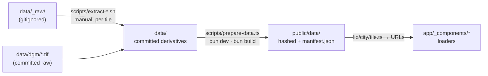

# Data pipeline — the bakes, the build step and the artifact contracts

The developer reference for everything between a provider download and the
files the browser requests. For the plain-language version read the guide
[From download to browser](./guide/en/data-journey.md); for *what maps to
what* see [data-flow.md](./data-flow.md); for standing up another location
see [portability.md](./portability.md).



## Tiles

Saxony's open geodata is cut into 2 km squares named
`<UTM zone><easting km>_<northing km>_<edge km>_sn`. The viewer loads a
2×2 block; `lib/city/tile.ts` is the single home of the list (`TILE_BLOCK`)
and of every per-tile file name (`tileArtifacts()`).

```
        N
  ┌─────────────────┬─────────────────┐
  │ 33410_5658      │ 33412_5658      │   neighbours: heightfield 512², rasters 2048²
  ├─────────────────┼─────────────────┤
  │ 33410_5656      │ 33412_5656  ★   │   ★ primary: heightfield 1024², rasters 4096²,
  └─────────────────┴─────────────────┘     collision, demolish, spawn
                                      E
```

The primary tile spans 412 000–414 000 E / 5 656 000–5 658 000 N
(EPSG:25833) — roughly 51.049–51.067° N, 13.745–13.773° E. Two further DGM
tiles (`33414_5656`, `33414_5658`, ~28 MB) are committed under `data/dgm/`
but load nowhere; keeping or dropping them is a maintainer decision
(recorded in [plans/README.md](./plans/README.md)).

## Stage 1 — the bakes (`scripts/extract-*.sh`)

Manual, one tile per invocation (`bash scripts/extract-dlm.sh 33412_5656`),
run in this order because later scripts read earlier outputs. All need
**GDAL** on `PATH` (with the SQLite/Spatialite dialect for the rail
dissolve) and **Python 3 with Pillow**; `curl` for the Overpass scripts.
**numpy and `gdal_calc.py` are not available** on the bake machine, so all
raster maths is done in Pillow (palette mode for speed, mode `F` for float
GeoTIFFs).

| # | Script | Reads | Writes (`data/…`) | Knobs (env) | Gotchas |
|---|---|---|---|---|---|
| 1 | `extract-dlm.sh` | `_raw/basis-dlm/basisdlm_sn_shape/*.shp` | `dlm/landcover_<t>.png` (class ids, 4096²), `dlm/landcover_<t>.json` (bounds + legend), `dlm/landcover_rgb_<t>.png` (pastel RGB, **alpha = water coverage**), `dlm/vegrows_<t>.geojson` | `LANDCOVER_RES` (4096), `LANDCOVER_BLUR` (0.3 px), `WATER_BLUR` (1.0 px) | Class ids burn lowest-priority first, so water (8) wins over everything. Roads are centrelines buffered by surveyed width `BRF`, else by class `WDM`. The RGB PNG's alpha is *data*, not transparency — see the downsample note below |
| 2 | `extract-canopy.sh` | `_raw/dom1/…/dom1_<t>.tif`, `dgm/…/dgm1_<t>.tif`, DLM shapes, the class PNG from step 1 | `dlm/canopy_<t>.geojson` (points with `h`) | `CANOPY_SPACING` (7 m) | `nDOM = DOM1 − DGM1` in pure Pillow. One tree per cell at the tallest pixel between 3 m and 45 m, only inside forest/copse/park, never on classes 5–8 (rail, path, road, water) — the gate that stopped trees growing through bridge decks |
| 3 | `extract-ndvi.sh` | `_raw/DOP_RGBI/…/dop20rgbi_<t>.tif` | `dlm/ndvi_<t>.png` (L, 1024², `clamp(NDVI,0..1)·255`) | `NDVI_RES` (1024) | Pillow silently drops band 4 of an RGBI TIFF, so red and NIR are extracted with `gdal_translate` first. Assumes the DOP covers the tile bounds exactly (no world file read) |
| 4 | `extract-roof-colour.sh` | the same DOP, `cityjson/lod2_<t>.city.json` | `dop/roofcolor_<t>.json` (`meta` + `roofs: {id: [r,g,b]}` in linear RGB) | `ROOF_ERODE_PX` (5) | Per building: rasterise the RoofSurface rings, erode 5 px inward (building lean), take the per-channel median of ≥ 12 samples. Keyed by CityJSON object id string. Lifts Pillow's 89 MP decompression-bomb guard for the 100 MP tile |
| 5 | `extract-lamps.sh` | Overpass API (`highway=street_lamp`), the class PNG | `dlm/lamps_<t>.geojson` (points, `attribution` member) | `LAMP_HEIGHT` (5.0 m) | The raw Overpass response is cached in `_raw/osm/lamps_<t>.json` and validated as JSON before reuse (a 429 HTML page must not become a committed empty file). Lamps on water (8) and railway (5) are dropped |
| 6 | `extract-walls.sh` | `_raw/osm/*.osm.pbf` (Geofabrik Sachsen) via GDAL's OSM driver | `dlm/walls_<t>.geojson` (LineStrings with `kind`, `h`, `attribution`) | `WALLS_PBF` (path) | Reads both the `lines` and `multipolygons` layers — GDAL routes closed ways with an area key into the latter; polygon rings are emitted as closed lines. Heights from `height`/`est_height`, clamped 0.5–30 m, defaults per kind (city_wall 6, retaining_wall 3, wall 1.5, embankment 2.5). Verified feature-for-feature identical to the old Overpass bake (436 walls on 33410_5656) |
| 7 | `extract-rail.sh` | DLM shapes `ver03_f`, `ver03_l`, `ver06_f`, `ver06_l`; DOM1 + DGM1; Overpass (`railway=platform`, `bridge:structure`) | `dlm/railarea_<t>.geojson` (dissolved ballast polygons), `dlm/rail_<t>.geojson` (lines with `tracks`, `electrified`), `dlm/bridge_<t>.geojson` (polygons with per-vertex `deck`, `kind`, `name`, `structure`), `dlm/platform_<t>.geojson` | — | Ballast: `ST_Union(ST_MakeValid())` over `OBJART=42010`, clipped to the tile. Rails: heavy rail only (`SPW=1000`; trams excluded), fragments snap-merged at 1 m. Decks: every `ver06_l` centreline (`BWF=1800`), snapped to a `ver06_f` footprint ≤ 50 m away else buffered by kind width; deck Z = DGM abutment ramp lifted to the DOM surface; `kind` by rasterising the networks; arches only where OSM says `arch` (nearest centroid ≤ 60 m). Every output is written even when empty |

Every emitter writes EPSG:25833 coordinates (`RFC7946=NO`, 2 decimals) and
the loaders never reproject; the OSM-derived files carry
`"attribution": "© OpenStreetMap contributors (ODbL)"` as a foreign member
(the platform file is written straight by `ogr2ogr` and does not — the HUD
footer carries the credit).

### The land-cover legend

| id | class | DLM source | pastel (RGB) |
|---|---|---|---|
| 0 | background | — | 230 224 209 |
| 1 | farmland / meadow | `veg01_f` | 197 211 170 |
| 2 | forest | `veg02_f` | 150 176 138 |
| 3 | copse | `veg03_f` | 175 195 158 |
| 4 | built-up | `sie02_f` | 228 219 203 |
| 5 | railway | `ver03_f` | 178 169 160 |
| 6 | path | `ver02_l` buffered 1 m | 224 205 168 |
| 7 | road | `ver01_f` + `ver01_l` buffered | 200 200 206 |
| 8 | water | `gew01_f`, `gew02_f`, `gew01_l` buffered 1 m | 164 192 209 |

Water coverage is *also* written to the RGB PNG's alpha channel (blurred
1 px) — that is the mask the water layer samples. The class PNG's own alpha
decodes to 1 everywhere and must never be read as a mask.

## Stage 2 — the build step (`scripts/prepare-data.ts`)

Runs ahead of `next dev` and `next build` (`bun dev`, `bun build`). Two
sub-stages:

**Bake** (cached in `.cache/prepare-data/`, gitignored). Staleness is by
mtime against the inputs *and* the bake's own source files, so a changed
resampler or codec re-bakes even when `HEIGHTFIELD_VERSION` was not bumped.

| Output (logical name) | From | Via | Notes |
|---|---|---|---|
| `dgm1_<t>.heightfield-<n>.json` + `.u16.gz` | `data/dgm/…/dgm1_<t>.tif` (+ `.tfw` when no embedded georeferencing) | `bake-heightfield.ts` → `lib/city/heightfield.ts` | bilinear resample to n×n (1024 primary / 512 neighbours), quantised `zMin + v·0.01 m`, `0xFFFF` = NoData, pre-gzipped because static hosts do not compress binary MIME types; the browser inflates with `DecompressionStream` |
| `city_<t>.mesh.json` + `.mesh.bin.gz` | `data/cityjson/lod2_<t>.city.json` + `data/dop/roofcolor_<t>.json` | `bake-city-mesh.ts` → `lib/city/city-mesh.ts` | runs `cityjson-threejs-loader` once, concatenates the chunk meshes into one vertex stream (uint16-quantised positions ≈ 3 cm in plan, per-vertex `objectid`, roof flag), plus a per-object table (tint, roof colour with the DOP LUT folded in, eave/storey heights, glow, roughness jitter, demolish root, minimap footprints). The primary tile bakes first; neighbours reuse its recenter matrix |
| `landcover_<t>.r2048.png`, `landcover_rgb_<t>.r2048.png` | the committed 4096² PNGs | `downsample-raster.ts` (sharp) | class ids NEAREST (must not blend), RGB Lanczos. **Colour and alpha are resized as two alpha-less images**: sharp premultiplies alpha across a resize, and on this raster alpha is water coverage, so a plain resize zeroes the colour of every land texel (a black ground). Keep the split and its unit test. Replacing sharp with `Bun.Image` is [plan 016](./plans/README.md) |
| `wissen-hero.webp` | the four committed `landcover_rgb_<t>.png` | `bake-wissen-hero.ts` (sharp) | not a viewer artifact: the block's pastel ground as one 1600² map, the picture of the `/wissen` pages (ADR 0021), which hand it to `next/image`. Alpha (water coverage) is dropped before the resize, for the same reason as above. Optional: skipped with a log line if a splat is missing |
| everything else | `data/dlm/*`, `data/dop/*` | copied | optional artifacts may be absent (logged, feature off); required ones fail the build |

**Publish.** Each artifact is copied to `public/data/` as
`<stem>.<8 hex of sha1>.<ext>`; `manifest.json` (`{ version: 1, files:
{logical: hashed} }`) maps the names; a heightfield header is rewritten so
its `data` field names the hashed sibling. Files the manifest no longer
references are pruned. `next.config.ts` serves `/data/*` as
`public, max-age=31536000, immutable` and the manifest as `no-cache`.

A `required` artifact that is neither copied nor baked fails the build
(`prepare-data: required artifact … was neither copied nor baked`) rather
than becoming a 404 the loader turns into "feature off" on every client.

## The contracts the browser relies on

| Contract | Module | Checked by |
|---|---|---|
| Tile list + every file name, resample kind, `required` flag | `lib/city/tile.ts` (`tileArtifacts`, `tileUrlsFrom`) | `tile.test.ts` pins the names; `prepare-data.ts` and `city-walk-client.tsx` both derive from it — add an artifact there and nowhere else |
| GeoJSON feature shapes per kind | `lib/city/features.ts` | `features.test.ts` reads **every committed file** of every tile: a bake that renames a property fails there, not as an empty layer |
| Heightfield header + sample layout | `lib/city/heightfield.ts` (`HEIGHTFIELD_VERSION = 2`) | `heightfield.test.ts`, `scripts/bake-heightfield.test.ts` |
| Building mesh stream + meta | `lib/city/city-mesh.ts` (`CITY_MESH_VERSION = 1`) | `city-mesh.test.ts` |
| Raster downsample keeps land colour | `scripts/downsample-raster.ts` | `downsample-raster.test.ts` (asserts alpha-0 texels keep their RGB) |
| Optional-artifact fetch policy | `app/_components/fetch-optional.ts` | 404 / network / parse → `null`/`[]` (feature off); **abort always rethrows** so a StrictMode-remounted instance stops building from partial data |

GeoJSON allows `properties: null` and `MultiPolygon` geometries; every
loader guards both (the rail loader once dropped two of three ballast
polygons on a neighbour tile for lack of it).

## Measuring what the browser downloads

The guide's size tables come from this procedure. After
`bun scripts/prepare-data.ts`, sum the published files per tile, taking
PNG/`.gz` at face value and gzipping JSON/GeoJSON at level 6 (what a static
host sends):

```bash
bun scripts/prepare-data.ts
python3 - <<'PY'
import os, gzip, json, re
d = "public/data"; man = json.load(open(f"{d}/manifest.json"))["files"]
tot = {}
for logical, hashed in man.items():
    p = f"{d}/{hashed}"; raw = os.path.getsize(p)
    wire = raw if logical.endswith((".png", ".gz")) else len(gzip.compress(open(p, "rb").read(), 6))
    tile = (re.search(r"33\d{3}_\d{4}", logical) or [None])[0]
    t = tot.setdefault(tile, [0, 0]); t[0] += raw; t[1] += wire
for tile, (raw, wire) in sorted(tot.items(), key=str):
    print(tile, f"raw {raw/1e6:.2f} MB", f"wire {wire/1e6:.2f} MB")
PY
```

Measured 2026-09-22 (current data): primary tile ≈ 3.9 MB on the wire
(the 4096² rasters included), each neighbour ≈ 2.2–2.7 MB; a desktop visit
≈ 10.6 MB, a phone ≈ 10.4 MB (2048² rasters for every tile), the lite
profile ≈ 3.3 MB. Sources on disk that are never served: the DGM GeoTIFF
(13.6 MB/tile) and the CityJSON (7.8–10.5 MB/tile).

## Provenance

`data/provenance.json` is the machine-readable record: for every tile and
GeoSN product the provider's currency field ("Stand") and the download URL,
plus what is known about the OSM inputs. The guide's
[dataset table](./guide/en/data-sources.md#dataset-editions-in-use) (and its
German twin) is the prose version. Update both when a source is
re-downloaded.

**Where the GeoSN values come from.** The portal's download app
(`geoviewer.sachsen.de/mapviewer/resources/apps/produktdownload/`) reads an
ArcGIS map service that carries one feature per 2 km tile and product with
the fields `Produkt`, `Kachel` (the tile as `<easting km><northing km>`,
e.g. `4125656`), `Download` (the ZIP on `geocloud.landesvermessung.sachsen.de`)
and `Stand`. Layers: 1 LSC · 2 LoD1 · 3 LoD2 (`Download_CityGML`,
`Download_DXF`, `Download_Shape`) · 4 DOM1 · 6 DGM1 · 7 DOP_RGB · 17
DOP_RGBI · 18 P10 · 8–16 DTK sheets. This queries the block for one layer:

```bash
L=17   # 6 = DGM1, 4 = DOM1, 3 = LoD2, 17 = DOP_RGBI, 1 = LSC
curl -sS -G "https://geodienste.sachsen.de/ags-relay/ArcGISServer/guest/arcgis/rest/services/geosn/rest_geosn_downloadlinks/MapServer/$L/query" \
  --data-urlencode 'geometry={"xmin":410000,"ymin":5656000,"xmax":414000,"ymax":5660000,"spatialReference":{"wkid":25833}}' \
  --data-urlencode 'geometryType=esriGeometryEnvelope' --data-urlencode 'inSR=25833' \
  --data-urlencode 'spatialRel=esriSpatialRelIntersects' --data-urlencode 'outFields=*' \
  --data-urlencode 'returnGeometry=false' --data-urlencode 'f=json' \
  | python3 -c 'import json,sys; [print(f["attributes"]) for f in json.load(sys.stdin)["features"]]'
```

The ZIPs themselves are on public Nextcloud folders (one token per product
and format); the tokens can rotate, the service is the durable index. The
Basis-DLM is one statewide package replaced quarterly under the same URL
(`basisdlm_sn_shape.zip`, 1.23 GB, `Last-Modified` 2026-07-28 when
checked), so its edition must be noted at download time: `curl -sI -r 0-0`
on the URL prints the file date, and the ZIP carries a metadata file.

**Where the OSM values come from.** Overpass responses are cached under
`data/_raw/osm/*.json`; their `osm3s.timestamp_osm_base` is the exact data
timestamp. The Geofabrik extract's timestamp is printed by
`osmium fileinfo -e data/_raw/osm/sachsen-latest.osm.pbf`
(`osmosis_replication_timestamp`). Neither raw file is committed, so the
table records the git dates as bounds until someone reads the timestamps.

**Licences.** *Datenlizenz Deutschland – Namensnennung 2.0* (`dl-de/by-2-0`)
for the GeoSN products and ODbL for OSM; both credits are in the HUD footer
(`scene-sidebar.tsx`).

## Regenerating or adding a tile

```bash
bash scripts/extract-dlm.sh 33412_5656         # 1  surfaces + class raster + veg rows
bash scripts/extract-canopy.sh 33412_5656      # 2  canopy (needs 1; DOM1 + DGM1)
bash scripts/extract-ndvi.sh 33412_5656        # 3  NDVI raster (DOP)
bash scripts/extract-roof-colour.sh 33412_5656 # 4  roof LUT (DOP + CityJSON)
bash scripts/extract-lamps.sh 33412_5656       # 5  lamps (Overpass; needs 1)
bash scripts/extract-walls.sh 33412_5656       # 6  walls (local .osm.pbf)
bash scripts/extract-rail.sh 33412_5656        # 7  rails, ballast, bridges, platforms
bun scripts/prepare-data.ts                    #    bake + publish → public/data
bun test                                       #    features.test.ts checks the new files
```

For a new tile also: drop its DGM GeoTIFF (+ `.tfw`, `_akt.csv`) under
`data/dgm/dgm1_<t>_tiff/`, its CityJSON under `data/cityjson/` (EPSG:25832
or 25833 declared in `metadata.referenceSystem`; reproject with
`cjio in.city.json reproject 25833 save out.city.json`), and add it to
`TILE_BLOCK`. The full porting checklist, including what to do when a
source is missing, is in [portability.md](./portability.md).
