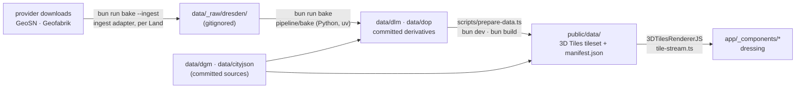

# Data pipeline — the bakes, the build step and the artifact contracts

The developer reference for everything between a provider download and the
files the browser requests. For the plain-language version read the guide
[From download to browser](./guide/en/data-journey.md); for *what maps to
what* see [data-flow.md](./data-flow.md); for standing up another location
see [portability.md](./portability.md).



Two stages, one language each ([ADR 0025](./adr/0025-bakes-are-one-python-package.md)):
**Python** turns provider downloads into the small per-tile files committed
under `data/`, and runs by hand; **TypeScript** turns `data/` into the
tileset the browser streams, and runs on every `bun dev` / `bun build`.

## Sites and tiles

Everything about a place that is not data lives in one site config
([ADR 0026](./adr/0026-one-site-config-per-build.md)): `sites/<id>.ts`,
typed by `lib/city/site.ts`, picked at build time by `SITE=<id>` (default
`dresden`; the registry is `sites/index.ts`, and `next.config.ts` inlines
the id for the client as `NEXT_PUBLIC_SITE`). The bakes and the build step
read the same registry, so the HUD and the data always describe one place.

A site lists its tiles as `{e, n}` cells — the south-west corner in km of
the site's grid (`tileKm`) in its CRS (`epsg`, 25832 or 25833). The **first
tile is the spawn tile**; the order of the rest does not matter.
`tileIdOf` names a cell `<UTM zone><e>_<n>_<tileKm><tileSuffix>`, the
scheme Saxony's downloads use, and every file name under `data/` carries
that id; `tileExtentOf` gives its extent. Dresden:

```
        N
  ┌─────────────────┬─────────────────┬─────────────────┬─────────────────┬─────────────────┐
  │ 33408_5658_2_sn │ 33410_5658_2_sn │ 33412_5658_2_sn │ 33414_5658_2_sn │ 33416_5658_2_sn │
  │ Pieschen,       │ Innere Neustadt │ Äußere Neustadt │ Waldschlößchen- │ Dresdner Heide, │
  │ Mickten         │                 │                 │ brücke          │ Loschwitz slope │
  ├─────────────────┼─────────────────┼─────────────────┼─────────────────┼─────────────────┤
  │ 33408_5656_2_sn │ 33410_5656_2_sn │ 33412_5656_2_sn │ 33414_5656_2_sn │ 33416_5656_2_sn │
  │ Friedrichstadt, │ Altstadt        │ Johannstadt ★   │ Elbwiesen,      │ Blaues Wunder,  │
  │ Ostragehege     │                 │                 │ Elbschlösser    │ Loschwitz       │
  ├─────────────────┼─────────────────┼─────────────────┼─────────────────┼─────────────────┤
  │ 33408_5654_2_sn │ 33410_5654_2_sn │ 33412_5654_2_sn │ 33414_5654_2_sn │ 33416_5654_2_sn │
  │ Löbtau, Plauen  │ Hauptbahnhof    │ Großer Garten   │ Striesen        │ Blasewitz       │
  └─────────────────┴─────────────────┴─────────────────┴─────────────────┴─────────────────┘
                                                                                            E
  ★ spawn tile (sites/dresden.ts, first in the list)
```

The spawn tile spans 412 000–414 000 E / 5 656 000–5 658 000 N
(EPSG:25833) — roughly 51.049–51.067° N, 13.745–13.773° E; the site as a
whole covers 408 000–418 000 E / 5 654 000–5 660 000 N, a 5×3 block of fifteen
tiles. No
tile has a role beyond "where you start": which tile is detailed is decided
by camera distance at runtime
([ADR 0024](./adr/0024-site-streams-as-3d-tiles.md)), and collision,
demolish and picking work on every loaded tile.

## Stage 1 — the bakes (`pipeline/`, `bun run bake`)

`pipeline/` is a [uv](https://docs.astral.sh/uv/) project:
`pipeline/pyproject.toml` pins numpy, rasterio, pyogrio, shapely, pyproj
and Pillow exactly (Python 3.12–3.13), `pipeline/uv.lock` locks the rest.
GDAL comes inside the rasterio and pyogrio wheels, with the OSM driver —
there is no system GDAL, no `gdal_calc.py` and no bash. `uv` on `PATH` is
the whole setup; `uv run` creates the environment on first use.

```bash
bun run bake                        # every tile of the site, every step
bun run bake 33412_5656_2_sn        # one tile
bun run bake --ingest               # fetch the raw inputs first (ingest adapter)
bun run bake --step canopy          # one step, in the order `all` runs them:
                                    #   landcover, islands (OSM squares into
                                    #   the class raster, no raw DLM needed),
                                    #   canopy, trees, ndvi, roof-colour,
                                    #   osm-buildings, rail, lamps, monuments,
                                    #   furniture, walls, stairs, surface,
                                    #   edges, markings, sport, tram,
                                    #   riverside, skyview, soundmarks,
                                    #   lowveg, cultivated, small-buildings
bun run bake --step lowveg --research   # also every hedge/shrub candidate
bun run test:pipeline               # pytest + ruff check + ruff format --check
```

`scripts/bake.ts` reads the site and, per tile, runs
`uv run --project pipeline python -m bake <step> --tile … --bounds … --epsg
… --raw data/_raw/<site> --data data` — the extent and CRS come from the
site, never from the tile name. With `--ingest` it first runs the site's
adapter, `python -m bake.ingest_<site.ingest>`. The modules in
`pipeline/bake/`:

| Module | Role |
|---|---|
| `__main__.py` | the step table and CLI; `all` runs the steps in dependency order |
| `common.py` | `Tile` (id, extent, CRS, raw and data folders), reading vector layers without geopandas, the GeoJSON writer |
| `osm.py` | reads the site's `.osm.pbf` through GDAL's OSM driver, with a margin in degrees around the tile, reprojected to the tile's CRS |
| `landcover.py`, `canopy.py`, `trees.py`, `ndvi.py`, `roof_colour.py`, `osm_buildings.py`, `rail.py`, `lamps.py`, `monuments.py`, `furniture.py`, `walls.py`, `stairs.py`, `surface.py`, `edges.py`, `markings.py`, `sport.py`, `tram.py`, `riverside.py`, `skyview.py`, `soundmarks.py`, `lowveg.py`, `cultivated.py`, `small_buildings.py` | one step each, in the order of the step table (`STEPS`; the table below) |
| `lsc.py` | the laser scan → the 0.5 m rasters `lowveg` and `small-buildings` read (laspy, PDAL's binning rules) |
| `tree_archetypes.py` | the cadastre's (and OSM's) taxon → crown archetype, leaf type, foliage colour and the genus id of the season table (`GENERA`; pure Python; `scripts/eval/kataster-eval.py` reuses it) |
| `ingest_sn.py` | the Saxony ingest adapter (with Dresden's street-tree WFS) |

`pipeline/tests/test_bakes.py` covers the pure helpers (line merging, deck
outlines, wall heights, coordinate rounding, the class ids the client's
palette is keyed by, the monument kinds, the DLM ↔ OSM fountain
conflation and the relief measurement), and runs the `walls` and `stairs`
steps end to end against a synthetic DGM and a small OSM XML file (GDAL's
OSM driver reads `.osm` as well as `.osm.pbf`). CI's `pipeline` job runs it with ruff after
`uv sync --locked`. The bakes themselves need the raw downloads and run on
the maintainer's machine.

### The canonical raw layout

The bakes know no provider. They read one layout, which an ingest adapter
writes (gitignored, never committed — no Git-LFS):

```
data/_raw/<site>/
  dom1/<tile>.tif (+ .tfw)   DOM1 surface model, 1 m
  dop/<tile>.tif             orthophoto, 4 bands (R, G, B, NIR)
  dlm/*.shp                  Basis-DLM, AdV Shape profile (veg01_f, ver01_l, …)
  osm/*.osm.pbf              OpenStreetMap extract (the newest is read)
  trees/<tile>.geojson       the street-tree cadastre (+ .meta.json: the
                             request, the date, the server's count)
  lsc/<tile>.laz             the laser scan (--ingest --lsc, or by hand; ≈380 MB)
  lsc/<tile>/*.tif           its 0.5 m rasters, made by lsc.py on first use
  downloads/                 the adapter's cache of provider ZIPs
```

The DGM1 GeoTIFF (`data/dgm/dgm1_<tile>_tiff/`) and the LoD2 CityJSON
(`data/cityjson/lod2_<tile>.city.json`) are **not** raw: they stay
committed ([ADR 0004](./adr/0004-commit-derived-artifacts-not-raw-data.md)),
because the build step reads them on every build. The bakes read them from
there too.

### The Saxony ingest adapter (`ingest_sn.py`)

`bun run bake --ingest` fills the layout from GeoSN and Geofabrik and never
downloads a file twice (the ZIPs stay in `downloads/`):

- **DOM1 and DOP RGBI, per tile:** the portal's own download-link service
  (layers 4 and 17, see [Provenance](#provenance)) is queried with a point
  inside the tile; the ZIP it names is fetched and its `.tif` / `.tfw`
  unpacked as `dom1/<tile>.tif` and `dop/<tile>.tif`.
- **Basis-DLM:** the statewide Shape package (one ZIP of ZIPs, ~1.2 GB),
  unpacked flat into `dlm/`.
- **OpenStreetMap:** Geofabrik's `sachsen-latest.osm.pbf` into `osm/`
  (from the Claude Code cloud container Geofabrik resets the connection;
  there, BBBike's city extract
  `https://download.bbbike.org/osm/bbbike/Dresden/Dresden.osm.pbf` does the
  same job — the bakes read the newest `.osm.pbf` under `osm/`). If
  the download fails the adapter says so and carries on; put any
  `.osm.pbf` covering the site there by hand.
- **The street-tree cadastre, per tile:** Dresden's WFS 2.0
  (`kommisdd.dresden.de`, `cls:L1261`, dl-de/by-2-0) over the tile plus
  10 m, as GeoJSON into `trees/<tile>.geojson`. The service has no paging:
  one request per tile, trusted only when its feature count equals the
  server's `numberMatched` (a hits request first; recorded in the sidecar).
  Outside Dresden the answer is empty and the `trees` step writes nothing.
- **The laser scan, only with `--lsc`** (≈380 MB a tile): layer 1 of the
  same link service, unpacked as `lsc/<tile>.laz`. A failed download is a
  note, not an error (the hedge step then goes OSM-only); the LAZ can also
  be put there by hand.
- **A rotated share is followed.** GeoSN rotates the share a product is
  served from, and the link service has lagged behind: on 2026-09-25 it
  still named `…/rqcqdt8QMcLFUvC/lsc_<tile>_laz.zip` (and the retired LoD2
  share), which answered 503. When a product download fails, the adapter
  reads the catalogue embedded in the portal's batch download page
  (`batch-download-4719.html`: every product's current `share_id` and file
  name pattern) and fetches the same file under the share named there
  (`current_share_url`, unit-tested).

Skipped inputs are skipped by *presence*: an existing `dom1/<tile>.tif` or
any `dlm/*.shp` is not fetched again. Delete it to refresh.

**Every OSM input comes from that local extract** (ADR 0025 tightening
[ADR 0012](./adr/0012-openstreetmap-for-what-official-data-lacks.md)):
walls, lamps, fountains, street furniture, platforms and the bridge structure. There are no Overpass
queries any more — a re-bake is reproducible from the recorded extract. The
*committed* lamp, platform and bridge-structure data still comes from the
old Overpass bakes; the next re-bake moves it (see
[Provenance](#provenance)).

### The steps

Each step writes into `data/` in the site's CRS (2 decimals for lines and
polygons, 1 for points) with a named-CRS member; the loaders never
reproject. Order matters where noted: `landcover` writes the class raster
that `canopy`, `trees`, `lamps` and `furniture` gate on; `rail` writes the
bridge decks before `furniture`, `tram`, `lowveg` and
`small-buildings` read them; `tram` reads the furniture (its own tile's
and its neighbours'); `lowveg` runs after the rest, thinned against the
canopy and the cadastre, then `cultivated` (an orchard tree gives way to a
measured one, canopyx included) and `small-buildings` last (the same scan
rasters; walls, bridges, monuments and stop shelters mask it). Steps that
read a neighbour's files (`markings`, `cultivated`, `tram`, `skyview`,
`soundmarks`, `small-buildings`) find the neighbours by their committed
DGM (`skyview.site_sources`); run them for every tile.

| Step | Reads | Writes (`data/…`) | Notes |
|---|---|---|---|
| `landcover` | `dlm/*.shp`; the OSM extract, when there, for the islands | `dlm/landcover_<t>.png` (class ids 0–8, one byte, 4096² over the tile), `dlm/landcover_<t>.json` (tile, CRS, bounds, size, legend), `dlm/vegrows_<t>.geojson` (`kind`: hedge / treerow) | Class ids only — the colours are painted in the browser ([ADR 0023](./adr/0023-land-cover-colours-painted-at-runtime.md)). The layer → class table is data at the top of the module (`CLASSES`, `burn_order`, `ROAD_HALF_WIDTH`). Classes burn lowest priority first, so water (8) wins. Roads are centrelines buffered by the surveyed width `BRF`, else by class `WDM`. Then the OSM islands (see `islands`) are carved out of the road class. Fails if nothing rasterised |
| `canopy` | DOM1, the committed DGM1, `veg02_f`/`veg03_f`/park areas, the class raster | `dlm/canopy_<t>.geojson` (points with `h`) | `nDOM = DOM1 − DGM1` in numpy. One tree per 7 m cell at the tallest texel between 3 and 45 m, only inside forest, copse or park, never on classes 5–8 (rail, path, road, water) — the gate that stopped trees growing through bridge decks. **No DOM1: skipped with a note** |
| `ndvi` | DOP bands 1 (red) and 4 (NIR) | `dlm/ndvi_<t>.png` (one byte, 1024², `max(NDVI, 0)·255`) | Reads the whole DOP resampled to 1024², so it assumes the DOP covers the tile exactly. **No DOP: skipped** |
| `roof-colour` | DOP bands 1–3, the committed CityJSON | `dop/roofcolor_<t>.json` (`meta` + `roofs: {id: [r,g,b]}`, linear RGB) | Per building: rasterise the RoofSurface rings, erode 5 px inward (the orthophoto leans buildings), take the per-channel median of ≥ 12 texels. Keyed by CityObject id. **No DOP or CityJSON: skipped** |
| `osm-buildings` | the committed CityJSON (GroundSurface rings, else the roof rings, as footprints); OSM points with `shop=*` or `amenity=cafe/restaurant/bar/pub/fast_food/ice_cream/biergarten`, building multipolygons carrying them or `heritage=*` | `dlm/osmbuild_<t>.json` (`attribution`, `meta` with the counts, `objects: {id: {shop?: 1, heritage?: 1}}`) | A shop point marks the footprint it lies in, else the nearest within 3 m (entrances sit on the facade line); points tagged on another floor (`level` without a 0) are dropped. An OSM outline marks the objects it covers ≥ 50 %. A marked part marks its root Building too. Per tile 264–323 objects with a shop, 28–478 listed (the Altstadt tile carries the most). **No extract or CityJSON: skipped** |
| `lamps` | OSM `highway=street_lamp`, the class raster | `dlm/lamps_<t>.geojson` (points, `h` = 5 m) | Only the lamps the tile owns (west and south edges in, east and north out), so a seam lamp stands once when both tiles are dressed; the viewer applies the same rule (`ownsPoint`) to older files. Lamps over railway (5) or water (8) are dropped. No `.osm.pbf`: skipped with a note, the file already there stays |
| `monuments` | Basis-DLM `sie03_p` (`OBJART=51009`, `BWF` 1750 Denkmal · 1770 Säule/Stein · 1780 Brunnen, with `NAM`); OSM `amenity=fountain` (points + basin outlines); DOM1 + the committed DGM1 | `dlm/monuments_<t>.geojson` (`kind`: fountain / statue / stone / column; `name`, `source`; fountains `style`: basin / pool / splash, `figure`; `relief`: `west`, `north`, `cols`, `rows`, `dm` — the measured body, heights above ground in dm on the 1 m grid) | The DLM is the official list and names; it does not say which monument is a fountain nor how big a basin is. A DLM point within 6 m of (or inside) an OSM fountain *is* that fountain — it keeps the DLM name (Albertplatz: "Stilles Wasser", "Stürmische Wogen"); a DLM name with *…brunnen*/*Tränke* is a fountain without a partner; every other OSM fountain is added (`source: osm`). An outline becomes a Polygon ring: the rim, its hole the water (inset 0.35 m); outlines under 1 m² become points. `relief`: for each monument and each fountain a DLM monument stands in, the nDOM patch above 0.7 m — inside the basin's water, or grown from the tallest cell within 2.5 m of the point — kept only when it ends within 6 m, stays ≤ 60 cells and below 8.5 m and touches nothing taller (a tree crown or a facade); 27 of 174 pass. Only what the tile owns (representative point). **No Basis-DLM: skipped, the file already there stays. No `.osm.pbf`: DLM monuments only. No DOM1: no reliefs (markers)** |
| `furniture` | OSM `leisure=playground` areas and `playground=*` equipment (points, ways, areas); OSM points `amenity=bench/waste_basket/bicycle_parking/post_box/shelter/clock/drinking_water`, `leisure=picnic_table`, `barrier=bollard`, `advertising=column`, `highway=traffic_signals`, `emergency=fire_hydrant`, `highway=bus_stop` / `public_transport=platform` with `shelter=yes`; bench ways; every `highway` line; the OSM building outlines when a wall clock is mapped; the class raster, the tile's `bridge` file | `dlm/furniture_<t>.geojson` (points with `k`: bench / picnic / bin / bike / bollard / postbox / shelter / stop / column / signal / hydrant / hydrantsign / clock / wallclock / water; `lit` on a lit column; `a` the bearing it faces, degrees from north; `l` a bench way's length; `back: false`; `n` a stand's hoops; `h`, `metal` a bollard's tagged height and material; Polygons `k: playground` and sandpit areas; equipment points `k`: swing / slide / sandpit / climb / springy / seesaw / roundabout / playhouse) | `a`: OSM `direction` on a bench (degrees or a compass point), else towards the nearest highway line within 25 m, across it when the object stands on it (< 0.5 m); a bench way stands at its midpoint facing the path side, length clamped 1–8 m. `n` = ⌈`capacity` ÷ 2⌉, 1–12. Dropped: `bicycle_parking=wall_loops`, `amenity=shelter` other than public transport, stops without `shelter=yes`, `indoor=yes`, `location=indoor/underground`, `level` < 0, classes 5 and 8, inside a bridge deck; a shelter within 8 m of another. Playgrounds under 20 m² and equipment kinds without a model (mounds, table football, …) are left out; nothing is added to a playground OSM maps empty. Plan 030: a traffic signal on the road class moves to the kerb (walking ≤ 15 m in 0.5 m steps until the class is no longer road, then 0.6 m on) on the right of the traffic its `traffic_signals:direction` names along the way through it, facing that traffic; without a direction to the nearest kerb (16 bearings); an underground hydrant's sign on the road likewise to the nearest kerb; a wall clock to the nearest OSM facade ≤ 3 m, facing out of it (else dropped); tower clocks and sundials dropped; a bus stop without a shelter becomes a `stop` sign unless a shelter stands within 8 m. Columns, hydrants, bins and bollards carry no `a`. Only what the tile owns. No `.osm.pbf`: skipped with a note, the file already there stays |
| `walls` | OSM `barrier=retaining_wall/city_wall/wall`, `man_made=embankment`, `natural=cliff`; `barrier=fence/handrail`; `barrier=gate/lift_gate/swing_gate/cycle_barrier` points | `dlm/walls_<t>.geojson` (lines with `kind`, `h`; then the fences, `kind: "fence"` with `type` railing/mesh/picket/rail and `h`; then the gates on a wall or fence line, points with `kind: "gate"`, `w`, `on`, `type` for a lift gate, swing gate or cycle barrier, and `seam` on a neighbour's gate; a terrain bake input, not served) | Both the `lines` and `multipolygons` layers — GDAL routes closed ways with an area key into the latter; polygons contribute their outer ring. Heights from `height`/`est_height`, clamped 0.5–30 m, else per kind (city_wall 6, retaining_wall 3, wall 1.5, embankment 2.5, cliff 3). Clipped to the tile as lines: an area's outer ring first, then the ring cut at the tile edge (clipping the polygon first closed the ring along the seam). Fences: `fence_type` → the panel (untagged: railing), `height` when 0.3–4 m, else 1.2 m (handrail 1.0). Gates: those the tile owns within 0.5 m of a wall or fence line, snapped onto it, and a neighbour's whose gap reaches into the tile (`seam: true`: it cuts this tile's piece too); `width` when 0.5–12 m, else 1.2 m (lift gate 4 m); gates on no line are dropped, and so is a gate whose line of its kind (`on`) the written file does not carry within 0.5 m (`on_written_lines`). Walls first, in their old order (the terrain study addresses them by index). **The committed walls are older than the fences and gates** (the Geofabrik bake of 2026-06-15, kept verbatim so the terrain study's indices hold; the fences and gates are the BBBike extract's of 2026-09-19): two `on: "wall"` gates 70–73 m from any committed wall (33412_5656, 33412_5658) were dropped from the committed files on 2026-09-26 by that same filter — a full walls re-bake would bring the walls up to date and re-number them for the study. No `.osm.pbf`: skipped with a note, the file already there stays |
| `stairs` | OSM `highway=steps` (+ `area:highway=steps` outlines, `barrier=wall/retaining_wall/city_wall`, areas on `layer` ≥ 1), the committed DGM1 | `dlm/stairs_<t>.geojson` (lines bottom → top with `w`, `n`, `z` = [bottom, top] landing heights), `dlm/terraces_<t>.geojson` (polygons with a level `z`) — both terrain bake inputs, not served | Landings: the DGM 1 m beyond each end, 3×3 m median. Width: `width`, else outline area ÷ axis length, else the gap between the walls either side (within 15 m, minus 0.3 m each side, the axis re-centred) when both edges of that gap climb ≥ half the axis's rise, else 2.5 m (0.8–30 m). A flight with less than half its tagged rise in the DGM (`step_count` × `step:height`, 15 cm untagged), an `incline` and its top ≤ 3 m from a raised area (no building, `man_made`, `landuse`, bridge, railway or public-transport area) takes the tagged rise from its lower landing; the area becomes a terrace at the highest such top (its outer rings, holes filled). Steps: `step_count` if its riser is 8–25 cm, else rise ÷ 16 cm. Left out: indoor, underground, `level` < 0, tunnel, bridge, rise < 30 cm. Unclipped (the viewer stands a flight on the tile that owns its middle). No `.osm.pbf`: skipped with a note, the file already there stays |
| `rail` | `ver03_f`, `ver03_l`, `ver06_f`, `ver06_l`, `ver01_l`, `ver02_l`; DGM1 + DOM1; OSM `man_made=bridge`, `railway=platform` | `dlm/railarea_<t>.geojson` (ballast polygons), `dlm/rail_<t>.geojson` (lines with `tracks`, `electrified`), `dlm/bridge_<t>.geojson` (polygons with per-vertex `deck`, `kind`, `name`, `structure`), `dlm/platform_<t>.geojson` | Ballast: `OBJART=42010` made valid, unioned (shapely) and clipped. Rails: heavy rail only (`SPW=1000`, trams excluded), fragments merged at 1 m. Decks: every `ver06_l` centreline (`BWF=1800`), snapped to a `ver06_f` footprint ≤ 50 m away, else buffered by kind width; deck height = the DGM abutment ramp lifted to the DOM surface, plus camber; `kind` from the rail/road/path networks under it; `structure` (arches) from the nearest OSM bridge ≤ 60 m. **No Basis-DLM: the step is skipped, the files already there stay. No DOM1: decks use the DGM ramp. No `.osm.pbf`: bridges without structure, the platform file already there stays.** Every other output is written, even when empty |

| `trees` | `trees/<t>.geojson` (the cadastre), the OSM extract (`natural=tree`), the class raster | `dlm/trees_<t>.geojson` (points with `h`, `d`, archetype `a`, leaf type `l`, optional foliage `c`, globe `g`, forest/copse `f`, genus `gn`, trunk diameter `t` in cm, `s: "osm"` for an OSM tree; `genera` and `attribution` members) | Only the trees the tile owns (`gis_x_utm`/`gis_y_utm`, west and south edges in); trunk stumps dropped. Taxon → archetype, leaf type and foliage colour by `tree_archetypes.py`. A missing height or crown imputed from this tile's genus median height / archetype crown-to-height ratio, then clamped (1.5–40 m, 0.8–30 m, crown ≤ 1.6 · h). A trunk diameter over 15 cm per metre of the tree's height, or over 4 m, is a typo and dropped (not clamped). Then the OSM trees more than 3 m from every cadastre tree of the cached WFS answer, its 10 m margin across the seams included (the cadastre wins): classified from `species`/`taxon`/`genus` (then `species:de`/`genus:de`) when it names a genus `tree_archetypes.py` knows — German names mapped by their last word ("Gemeine Fichte", "Winter-Linde"), a lower-case genus capitalised, an unambiguous bare epithet (`hippocastanum`) read; a family or an English name is no taxon — or, failing that, `leaf_type`/`leaf_cycle` (round or conifer); a `leaf_type` that contradicts the taxon wins, `leaf_cycle` sets the leaf type; neither → dropped. Their `height`/`diameter_crown`/`circumference` tags are read, the gaps filled from the cadastre's statistics. Features sorted by position. Last re-bake 2026-09-25 on all fifteen tiles (the WFS caches of that day, BBBike extract of 2026-09-19): 56 185 cadastre trees (51 523 with a trunk diameter), 3 453 OSM trees (88 / 50 / 176 / 592 / 854 / 252 / 220 / 368 / 346 / 121 / 152 / 88 / 83 / 63 / 0 in tile order 33408_5654 … 33416_5658; 298 with a genus). `f = 1` where the tree stands in DLM forest/copse (classes 2/3): such a tree vetoes no canopy tree. Analysis: `scripts/eval/kataster-eval.py`. That re-bake against the previous commit: the same cadastre trees with the same positions and properties but for 63 implausible trunk diameters dropped; the OSM trees the same but for one added (tagged only `genus:de`), one claimed by a cadastre tree across the seam, and 10 that gained their genus (bare `hippocastanum`, lower-case genera). **No cadastre: skipped with a note, the file already there stays** |
| `lowveg` | the laser scan (`lsc/<t>.laz` → 0.5 m rasters under `lsc/<t>/`, `lsc.py`: ground idw/min/count, surface max/count, non-ground count and multi-echo count, the mean intensity of the low returns 0.25–4 m above ground); OSM `barrier=hedge` lines, `natural=scrub/shrubbery` areas, `natural=shrub` nodes; the class raster, NDVI, walls, bridges, canopy and cadastre trees; the committed CityJSON and DGM1 | `dlm/lowveg_<t>.geojson` (the OSM hedge LineStrings `h`/`w`, `src` `osm`/`osm+lsc` — only what renders), `dlm/canopyx_<t>.geojson` (the scan's crown peaks `h`/`r` the canopy leaves out, minus those within max(4 m, crown radius) of a cadastre tree) | Needs scipy, scikit-image and laspy (lazrs), all in the uv environment. `lsc.py` streams the LAZ in chunks and bins it by PDAL's `writers.gdal` `binmode` rules, read from PDAL's `GDALGrid.cpp` (a point in the cell containing it; `idw` is the cell's first point in file order, because bin mode passes every point at distance 0; empty cells filled from the non-empty ones within the window, weighted by 1 / the Chebyshev distance in cells; the bands in PDAL's fixed order min, max, mean, idw, count, so the low returns' height above ground is over the DTM's band 2, `idw`), writing the band names PDAL wrote — a folder PDAL made reads as it is. Closed hedge ways (a garden ring) come through GDAL's `multipolygons` layer and are taken as their rings. Method and thresholds: the ledger's "Low vegetation". **No LAZ: OSM only** — mapped hedges at their `height` tag or 1.5 m, no `canopyx`; every committed tile has its scan (2026-09-25), so `tile-data.test.ts` holds all of them to a `canopyx` file. Checked 2026-09-25, before the scans: from the BBBike Dresden extract the three OSM-only neighbours came out identical to the committed files (54 / 94 / 45 hedges); `scripts/eval/compare-bakes.py` compares a re-bake with the committed files (and two raster folders). On 33412_5656 with the LAZ, `lsc.py`'s rasters match PDAL's cell for cell (the low-return intensity but for ~400 of 2 M cells, points on the 0.25 / 4 m bounds), and with the inputs of the first bake the scan trees and hedges come out identical; with the current bridges and land cover the scan trees are 5 788 (5 739 before). `--research` also writes every candidate (scan-only hedges, shrubs) to `lsc/lowveg_all_<t>.geojson`, never committed. No `.osm.pbf`: skipped with a note |
| `small-buildings` | the laser-scan rasters (as `lowveg`: surface max, ground idw — the DGM1 where empty —, the multi-echo count) of the tile and of its neighbours within 40 m; the class raster, NDVI, the committed CityJSON (every surface, +1 m), walls (not fences, +0.75 m), bridges, monuments and furniture shelters, the neighbours' too; OSM pedestrian areas (`highway` / `area:highway=pedestrian`) and `highway=pedestrian` lines, `place=square`, `amenity=marketplace`, `landuse=construction`, `amenity=parking` (surface or untagged), building outlines | `dlm/smallbuild_<t>.geojson` (Polygons — the minimum rotated rectangle, 4 corners + the closing one — with `z`, the lowest ground under it — the cells under the rectangle and the DGM1 at its corners —, `h`, the fitted top's median above `z`, and `hc`, the heights above `z` at the four corners when the top tilts > 8°; a city-mesh bake input, not served) | Plan 034. Band 2–6.5 m above ground, off classes 5/7/8; the core = cells with no multi-echo return in their 3 × 3 window (a roof's edge splits the pulse, so a blob-wide rule found 4 blobs on the spawn tile); cores ≥ 4 m², grown back one cell within the band, kept at 6–150 m² when the top fits a plane (residual < 0.35 m, tilt ≤ 35°), fills > 60 % of its rectangle, is ≥ 2 m wide, has a median NDVI ≤ 0.25, is no sliver along the LoD2 (aspect ≥ 3 with ≥ 20 % of its rim on the mask), stands on ground that falls ≤ 1.5 m under its rectangle and does not touch the edge of what was read (the 40 m margin, or the site's rim). Of two rectangles overlapping by > 0.5 m² the smaller goes. Everything is decided over the margin and written by the tile that owns the rectangle's centroid, so a shed on a seam is kept once (before, a blob touching the tile's edge was dropped on both sides). Then the OSM context: nothing inside the excluded areas or within 6 m of a pedestrian street's line (the flight, 27–30 Nov 2024, caught the Christmas markets), nothing within 3 m of a monument or stop shelter, nothing vehicle-sized (2–2.8 × 4.5–18 m, < 4.2 m) unless an OSM building outline confirms it. 1–1 485 per tile, 6 625 in all (2026-09-26; 6 783 before the seam, ground and overlap fixes). **No LAZ: skipped, the file already there stays. No `.osm.pbf`: skipped** |
| `islands` | the committed class raster; OSM pedestrian / island / fountain areas, parks and lawns | the class raster in place (+ the legend's `attribution`) | The same `carve_islands` the `landcover` step runs when an extract is there: road texels (7) under OSM pedestrian areas, `area:highway` footway/pedestrian/traffic-island and fountain basins become 4, under parks and lawns 1 (lawn over walk). Idempotent; for sites whose raw DLM is not at hand |
| `edges` | the committed class raster; the NDVI and paving rasters when present | `dlm/edges_<t>.png` (8-bit greyscale 4096 × 2048 = two bytes per texel of a 2048² raster, interleaved: R, G = 128 + 20 · the signed distance (m) to the road edge / the meadow edge, positive inside, ±6.35 m), `dlm/edges_<t>.json` (legend, `scale`), `dlm/kerbs_<t>.geojson` (lines, the road on their left; a terrain bake input, not served) | Distance by growing the mask ring by ring (octagonal metric), three 3×3 box passes, averaged 4096 → 2048. The meadow mask counts urban green: NDVI (upsampled, blurred) > 0.3 on classes 0/4, not paved per the OSM raster. Kerb lines: marching squares on the road field's 0 level, segments beside water or railway dropped, merged, simplified 0.15 m, shorter than 3 m dropped. Runs after `surface`; needs no raw data |
| `sport` | OSM `leisure=pitch` / `track` multipolygons (`sport`, `surface`, `indoor`, `covered`, `location`) and `leisure=track` lines (`width`) | `dlm/sport_<t>.json` (tile, CRS, bounds, encoding, the surface / marking / shape ids, attribution, and `grounds`: one row per ground, `[cx, cy, angle, p1, p2, p3, surface, marking, shape]`, the centre in m from the tile's north-west corner), `dlm/sport_<t>.png` (8-bit greyscale 8192 × 2048 = four bytes per texel of a 2048² raster, interleaved: R = 1 + the row on top — every outline grown 1.5 m, then the exact outlines —, G = 1 + a second row, outlines grown 4 m with the first row winning, B = 255 inside an exact outline, A = 0) | Grounds touching the tile, outdoors only; playgrounds are the `furniture` step's. Surface: the tag (`SURFACE_OF`), else the first sport's usual one (`SPORTS`); lines by the first sport; a football pitch on a sealed surface shorter than 50 m draws as a court. Shape: the minimum rotated rectangle when the area fills ≥ 85 % of it; a track with a radius ≥ 15 m that fills less is a capsule (half straight, outer radius, the band's width solved from the area); else the mapped outline. Burn order tracks, then pitches largest first, so a court inside a larger ground wins; at most 255 rows. Tracks mapped as a line are buffered by their `width` (else six lanes, 7.32 m). No `.osm.pbf`: skipped with a note, the files already there stay |
| `cultivated` | OSM `landuse=allotments/orchard/vineyard` and `leisure=garden` multipolygons, `natural=tree` points, the `highway` lines (a colony's paths); the committed DGM1 (every tile's), class raster, and the `canopy`, `canopyx` and `trees` files of the tile and its neighbours | `dlm/cultivated_<t>.geojson` (`k`: colony / parcel / orchard / vineyard polygons, clipped; `tree` points with `h`, `d`, `src` grid/osm, the tile's own, none a measured tree stands in for; `row` lines; `attribution`), `dlm/cultivated_<t>.png` (8-bit greyscale 4096 × 2048 = two bytes per texel of a 2048² raster, interleaved: R = 128 + 20 · the signed distance (m) to the edge of the garden land — the colony less its paths, roads, rail, water and a 0.5 m seam along each mapped parcel's border — positive inside, 1..255, 0 farther outside; G = 1 + the long axis over 0–180° in 0..126 of the colony or mapped parcel the texel lies in or nearest to, within 8 m; 0 none). prepare-data publishes it cropped to the texels that carry a colony (`cultivatedCrop` in the fine terrain's extras) plus a half-resolution twin for phones (`cultivatedLow`) | A garden is a colony's parcel when half of it lies inside (and it is under half the colony). Orchard trees: the mapped `natural=tree` inside, else a grid 8 m apart along the minimum rotated rectangle's long axis, centred, at least 1 m inside; a tree of the `canopy`, `canopyx` or `trees` files (any tile's) within 4 m — or within its own crown radius, when wider — takes an orchard tree's place, so the step runs after `lowveg`. Vine rows 1.8 m apart, perpendicular to the DGM's mean gradient over the whole vineyard, read from every committed DGM it touches (this tile's alone kinked the rows at a seam: 152.0° vs 149.8° across x = 416 000; a gradient under 1 %: along its long axis). The distance is measured on a 0.5 m grid (EDT) and averaged onto the raster, so its LINEAR sample has no staircase. ≈20 s per tile. No `.osm.pbf`: skipped with a note, the files already there stay |
| `markings` | OSM `highway=crossing` and `highway=traffic_signals` nodes, `highway=*` lines (`lanes`, `oneway`, `lane_markings`, `cycleway*`); the committed class raster, and its neighbours' within 64 m of the tile | `dlm/markings_<t>.json` (tile, CRS, bounds, encoding, kinds, attribution, and `markings`: one row per crossing or stop line, `[cx, cy, angle, halfLength, halfWidth, kind]`, the centre in m from the tile's north-west corner, the axis across the road), `dlm/markings_<t>.png` (8-bit greyscale 8192 × 2048 = four bytes per texel of a 2048² raster, interleaved: R + 256·A = 1 + the row whose outline grown by 1 m reaches the texel, a texel within 0.75 m of a rectangle the nearest one's; G = lane bits, 1 a cycle lane along this side's kerb, 4 a centre-line road; B = 128 + 20 · the signed distance (m) to the carriageway's middle), `dlm/markings_low_<t>.png` (the same at 1024², a 1.45 m core; phones) | Crossings and signals the tile owns, and a neighbour's whose painted rectangle (grown by the raster's fringe) reaches into the tile — paint only, like a seam gate; the run counts them as `seam` (13 over the site, 2026-09-26). Every row is measured on the class raster of the tile and its neighbours (64 m around it), so a carriageway is no longer cut at the seam (8 rows had been, down to 0.12 m half-lengths) and both tiles measure a seam crossing alike. The carriageway is the contiguous class-7 run along the road's normal, sampled at the node and 5/10 m along the road (a stop line: 4/8 m back along the approach); the narrowest valid run wins unless the node's own is within 1.5 m of it; runs over 30 m are not painted. Lane side per texel: the nearest motor way (EDT over the rasterised ways) and which side of its digitised direction the texel lies on. Centre offset: half the difference of the distances to the kerb texels on the way's two sides; junctions (≥ 3 segment ends of non-service roads) cleared by 12 m. Overlapping rows of one family (crossings; stop lines) within 30° of one axis merge (a zebra over a *Furt*), so a crossing OSM maps twice keeps its paint; the run logs the rows still clipped (only where another row paints) and losing paint (none). ≈12 s per tile. No `.osm.pbf` or class raster: skipped with a note, the files already there stay |
| `skyview` | the committed DGM1 of the tile and of every committed neighbour, and the CityJSON of every one that has it (the margins; a DGM without LoD2 is bare ground to the bake) | `dlm/svf_<t>.png` (1024², one byte, 255 · the sky-view factor within 150 m; cells under a roof carry the nearest open cell's value), `dlm/horizon_<t>.png` (8-bit greyscale 1024 wide × 2048 = eight RGBA planes of 256² stacked north-to-south, the bytes interleaved: planes 0–3 the far band, the horizon angle of occluders 80–1 500 m away at 0–45° over 0–255; planes 4–7 the near band, 8–80 m away at 0–90°; plane p, channel c = azimuth 4 (p mod 4) + c, clockwise from north in 22.5° steps; cells under a roof carry the nearest open cell's angles), `dlm/horizon_<t>.json` (the legend with both bands and the `attribution`, GeoSN; not served) | Height field: the DGM averaged onto the grid, every LoD2 ring that is not a wall triangulated (shapely's constrained Delaunay) and burned at its plane's height, max over triangles, fully vectorised; for the horizon the roofs are burned at 2 m and max-pooled to 8 m. The observer is the bare ground. Beyond the committed tiles the ground is open at the mean height of the tile's edge, so a tile on the site's rim has no skyline past it. Rays march one cell per step in 16 azimuths (shifted arrays). ≈25–40 s per tile. The plan's 4 m horizon was 1.86 MB for the far band alone — past its 1.5 MB cap — so it is 8 m (far band ≈0.6 MB, both bands 1.13–1.23 MB). No raw data: reproducible from the repository |
| `tram` | OSM `railway=tram` lines, `power=catenary_mast` points, `building` outlines (all within 30 m of the tile), `railway=tram_stop` points and the platforms (`public_transport=platform`, `railway=platform`: points, lines, areas); the class raster, the NDVI raster and the committed `furniture` files of the tile and of its neighbours within 33 m | `dlm/tram_<t>.geojson` (`k: track` lines cut at the tile edge with `bed` street / grass / ballast, `bridge: 1`, `layer`, `s` = the distances (m) along the line where a span or arm holds the contact wire; `k: mast` points; `k: span` / `rosette` / `arm` two-point lines between their anchors, `x` = the fractions along a span where it crosses a track; `k: stop` points with `name` and `a`, the bearing to the track) | Fragments with the same bed, bridge and layer chained at 1 m (rail.py `merge_lines`). Bed per OSM way from its 2 m samples on the tile: street when ≥ 70 % lie on the road class (7), grass when ≥ 50 % lie on the meadow class (1) or NDVI > 0.3, else ballast. Masts: only those within 15 m of a tram track (the rest are the railway's), each written by the tile that owns it. Spans: mast pairs ≤ 28 m apart whose line crosses a track, shortest first, each mast once; an unpaired mast gets an arm over the nearest track ≤ 10 m (to a parallel track ≤ 4.5 m further, if any; 0.3 m overshoot). Rosettes: every 30 m along a track (not on a bridge, not in a cutting) that is > 45 m from every mast, a span between the nearest facades either side (≤ 15 m out; both needed), one per 12 m. A support is written by the tile that owns its midpoint (an arm: its mast). Stop signs: a `tram_stop` node lies on the track, so its sign stands on the nearest platform ≤ 25 m (an area's edge, a line's nearest point), facing the track, only on the tile that owns that point; none within 8 m of a furniture shelter or stop sign (the neighbours' too: a tile's furniture file holds only what it owns) or of another tram stop's sign (decided over every stop around the tile, so both sides of a seam agree); a stop with no platform gets none. Runs after `furniture` on every tile. No `.osm.pbf`: skipped with a note, the file already there stays |
| `riverside` | OSM `man_made=pier` (lines and areas), `man_made=groyne` lines, `route=ferry` lines; the class raster, the committed DGM1 | `dlm/riverside_<t>.geojson` (`k: pier` polygons with `deck`; `k: pontoon` polygons with `len` and `bank`; `k: groyne` and `k: ferry` lines, a ferry with the route's `name`) | A pier way is buffered by its `width` (1–30 m, else 3 m; flat ends). Floating: `floating=yes`, or more than 25 m of the pier over the water class. A pier's deck: the highest dry DGM sample on its outline (the landward end) + 0.4 m, the highest sample when it touches no dry ground. A pontoon is cut to its largest part on the water class (the class raster polygonised in a window around it) — its height is read at runtime from the ground the water sheet lies on; `bank`: the nearest dry point within 30 m of its outline, unless a fixed pier comes within 1 m. Ferry routes are cut at the tile edge and to their stretches over the water (2 m samples, ≥ 10 m). A pier or pontoon is written by the tile owning its representative point. No `.osm.pbf`: skipped with a note, the file already there stays |
| `soundmarks` | OSM church outlines (`building=church\|cathedral\|chapel`, `amenity=place_of_worship` + `religion=christian`), bell towers (`man_made=tower` + `tower:type=bell_tower` as points or areas, `building=bell_tower`), all within ≈ 100 m of the tile; the committed CityJSON and DGM1 of the tile **and of every committed neighbour** | `dlm/soundmarks_<t>.geojson` (`k: bell` points at the tower's tip, with `h` = its height above the DGM, `size` large / medium / small, the church's `name`) | For the hidden soundscape (plan 035). OSM says which building is a church, the LoD2 where its tower stands: the tip is the highest LoD2 vertex inside the outline (1 m around it); a tip under 22 m above the ground carries no bell (a chapel, a ridge turret) and a church the LoD2 does not reach is left out. Size by height: large from 65 m, medium from 40 m. A place-of-worship outline over a church building is the same church (≥ 50 % overlap, the larger outline kept, the first name); a bell tower within 30 m of a church's tip is that church's. Written by the tile owning the tip; a tile without churches writes an empty collection. 20 towers over the fifteen tiles (7 empty); ≈ 20 s a tile (reading the CityJSON). No `.osm.pbf`: skipped with a note, the file already there stays |
| `surface` | OSM `highway=*` lines (`surface`, `width`, `footway=sidewalk`, `sidewalk:*:surface`, `footway:surface`, `parking:{left,right,both}` + `:orientation`, `service=parking_aisle`) and `highway` / `area:highway` / `amenity=parking` / `amenity=parking_space` multipolygons | `dlm/surface_<t>.png` (8-bit greyscale 4096 × 2048 = two bytes per texel of a 2048² raster, interleaved: R = park · 64 + walk · 8 + road, G = the way direction, 1 + bearing mod 180° over 0–254, 0 = unknown; greyscale because the viewer decodes data PNGs itself, `lib/city/png-raster.ts`), `dlm/surface_<t>.json` (tile, CRS, bounds, size, encoding, the surface and parking ids, attribution) | Two materials per texel because an OSM road buffer (half-width per `highway` class, else `width`) reaches past the DLM's carriageway: the viewer reads `road` on class 7 and `walk` elsewhere. Roads burn least important first (a primary wins its junctions); walks burn parking and pedestrian areas, then the roads' sidewalk bands (kerb to +3 m on the tagged side), then the ways. Direction: the car parks' long axes first, then every way's segments — the road's reach with its pavement (an aisle's reach covers its bays, 5.5 m), then walkways, then the carriageways (a crossing does not turn the road). Parking: car parks on the ground (not underground, multi-storey, rooftop, garages) = 3 and asphalt when they carry no `surface`, the road half on each tagged side = 1 (parallel) or 2 (perpendicular/diagonal), then the aisles cleared. Surface values → ids in `SURFACE_OF`. No `.osm.pbf`: skipped with a note, the file already there stays |

The OSM-derived files (`lamps`, `furniture`, `walls`, `stairs`, `bridge`, `platform`, `tram`, `riverside`, `lowveg`, `cultivated`, the `markings` table) carry
`"attribution": "© OpenStreetMap contributors (ODbL)"` as a foreign member;
`monuments` carries both credits (`Quelle: GeoSN, dl-de/by-2-0; © OpenStreetMap
contributors (ODbL)`), `soundmarks` the OSM credit and the GeoSN one for the
tower heights, and the paving raster carries the OSM credit in its
legend JSON; `trees` carries "Stadtbaumkataster © Landeshauptstadt Dresden
(dl-de/by-2-0); © OpenStreetMap contributors (ODbL)" (the OSM credit only
when OSM trees were added), `canopyx` and `smallbuild` the GeoSN credit (laser scan), and `lowveg` both
where the scan measured the heights.
(The committed platform files predate that and carry none; the HUD footer
has the credit either way.)

### The land-cover legend

The ids are the bake's; the colours are `lib/city/landcover.ts`, the one
palette the terrain, the minimap and the `/wissen` picture paint with.
Changing a colour is a look change, not a re-bake.

| id | class | Basis-DLM source | palette (sRGB) |
|---|---|---|---|
| 0 | background | — | 230 224 209 |
| 1 | farmland / meadow | `veg01_f` | 197 211 170 |
| 2 | forest | `veg02_f` | 150 176 138 |
| 3 | copse | `veg03_f` | 175 195 158 |
| 4 | built-up | `sie02_f` | 228 219 203 |
| 5 | railway | `ver03_f` | 178 169 160 |
| 6 | path | `ver02_l` buffered 1 m | 224 205 168 |
| 7 | road | `ver01_f` + `ver01_l` buffered | 200 200 206 |
| 8 | water | `gew02_f`, `gew01_f`, `gew01_l` buffered 1 m | 164 192 209 |

Water coverage is no longer a baked channel: the browser derives it from
class 8 when it paints the splat (`app/_components/landcover-splat.ts`, a
3×3 tent — the soft shoreline). `lib/city/landcover.test.ts` checks every
committed legend names the same classes; `test_bakes.py` checks the bake's
ids are the palette's order.

### Checked against the committed artifacts

The committed `data/` was **not** re-baked by the Python pipeline. Its
outputs were compared with the committed files on the spawn tile, from
fresh GeoSN downloads:

| Output | Result |
|---|---|
| NDVI | byte-identical |
| land cover | 99.95 % of texels agree |
| roof colours | 3658 of 3668 buildings identical |
| bridges | 3 = 3 |
| canopy | 5104 trees vs 5118 committed |
| ballast | none vs one small corner sliver committed |

The differences trace to the newer Basis-DLM edition on the portal, not to
the port. The OSM steps (walls, lamps, platforms, bridge structure) were
not run against the committed files: Geofabrik was unreachable from that
environment.

## Stage 2 — the build step (`scripts/prepare-data.ts`)

Runs ahead of `next dev` and `next build` (`bun dev`, `bun build`) and turns
`data/` into an **OGC 3D Tiles 1.1** tileset under `public/data/`
([ADR 0024](./adr/0024-site-streams-as-3d-tiles.md)), which
3DTilesRendererJS streams (`app/_components/tile-stream.ts`). Four steps:

1. **Side files.** Each tile's rasters and feature collections
   (`tileArtifacts` in `lib/city/tile.ts`) are published as committed,
   plus `landcover_<t>.r2048.png`: the class raster downsampled NEAREST to
   2048², single band (`scripts/downsample-raster.ts`, sharp) — for phones,
   the coarse terrain and the minimap. Only class rasters are resized; no
   raster whose alpha carries data goes through an image tool any more.
2. **Content.** Per tile, three glTF files (below), each naming its side
   files in the glTF scene `extras`.
3. **Tilesets.** `tileset.json` over every tile of the site and
   `tileset-spawn.json` over the spawn tile alone (`lib/city/tileset.ts`,
   `buildTileset`). The client picks the full one unless the scene budget
   keeps to the spawn tile — the `lite` profile of the headless e2e
   (`city-walk-client.tsx`).
4. **Publish** (below).

### The tree

Per site tile, in the site's recentered data frame (Z-up, like every 3D
Tiles frame), all three nodes sharing the tile's bounding box:

```
root                                   refine ADD
└ tile            city_<t>.glb.gz      refine ADD      error 100 000
  └ terrain L1    terrain_<t>_l1       refine REPLACE  error 40 (COARSE_TERRAIN_ERROR)
    └ terrain L0  terrain_<t>_l0                       error 0
```

The buildings load whenever the tile is in view. The terrain refines from
512² to 1024² by screen-space error — at the renderer's 16 px target, 40 m
switches at ≈ 1.2 km from the tile on a 1080p screen. Only L0 is
*dressed*: vegetation, lamps, monuments, rails and the water and mist sheets
are built when a fine terrain tile arrives and leave with it. The root's
`extras` carry what the viewer needs before any content: the site id, the
EPSG code, the recenter offset `(cx, cy)` and per tile its id, extent and
minimap raster, and `sound`: the files the hidden soundscape fetches
while (and only while) it plays — `soundmarks`, `tram`, `monuments`,
`surface`, `svf` (`TileSoundFiles`, plan 035).

### The glTF content

Standard glTF 2.0 binaries, written by `scripts/tile-glb.ts` with
glTF-Transform: `EXT_meshopt_compression`, `KHR_mesh_quantization`
(16-bit positions, 8-bit normals, the dequantisation on the node), Y-up
(data `(x, y, z)` → glTF `(x, z, −y)`). Pre-gzipped at level 9 as
`.glb.gz`, because static hosts do not compress binary types; the client
inflates them with `DecompressionStream` when the gzip magic is there (a
host that adds `Content-Encoding: gzip` has the browser do it first). They
open in any glTF or 3D Tiles tool.

| File | From | Via | Contents |
|---|---|---|---|
| `terrain_<t>_l0.glb.gz`, `terrain_<t>_l1.glb.gz` | `data/dgm/…/dgm1_<t>.tif` (+ `.tfw` when there is no embedded georeferencing), `data/dlm/walls_<t>.geojson`, `data/dlm/stairs_<t>.geojson`, `data/dlm/terraces_<t>.geojson`, `data/dlm/kerbs_<t>.geojson` | `scripts/bake-tiles.ts` (`readDgm`, `tinTerrainMesh`, `terrainMesh`, `stairMesh`), `scripts/bake-terrain-tin.ts` | **L0** is an error-bounded TIN of the DGM read at its native 1 m ([ADR 0030](./adr/0030-terrain-tin-and-wall-snap.md)): the terraces lifted and the ground lowered under each flight of stairs ([ADR 0028](./adr/0028-osm-stairs-as-geometry-over-a-lowered-terrain.md), `lib/city/stairs.ts`; ±0.15 m deeper, the TIN's tolerance), **no wall burn**, then Delatin refines until every grid point lies within ±0.15 m (`FINE_TIN_MAX_ERROR`): 0.30–0.49 M triangles, 1.6–2.0 MB gzipped per tile (the 1024² grid it replaced: 2 M, 2.15–2.45 MB), about 8 s per tile to bake. A 30 m skirt, baked normals, reordered for meshopt; `extras.tin` (`maxError`, `triangles`) tells the runtime to index the triangles for ground height (`lib/city/terrain-tin.ts` `TinIndex`). A DGM with NoData keeps the grid. **L1** is the DGM resampled bilinear to 512² (NoData = NaN), the OSM walls burned in as breaklines ([ADR 0014](./adr/0014-wall-to-terrain-breakline-conflation.md), `lib/city/terrain-conflate.ts`), the terraces and stairs as above, the grid plus a 30 m skirt; its first n·n vertices are the grid, row 0 = north, and the runtime samples ground height from them. L0 also carries a `stairs` node — the flights the tile owns as treads, risers and cheeks with 8-bit `COLOR_0` shades (`bake-tiles.ts` `stairMesh`) — and a `walls` node, the tile's wall ribbons standing on every tile's fine TIN, the earth-retaining ones snapped to the step it measures (`wallMesh`, `lib/city/walls.ts`, `lib/city/wall-snap.ts`), a `kerbs` node, the kerb stones on the tile's kerb lines (`kerbMesh`, `lib/city/kerbs.ts`), and a `fences` node, the fences (one quad per ≤ 2.5 m panel with `TEXCOORD_0` packing the pattern code and the distance along it, 16-bit) cut at their gates, a leaf or boom in each gap, the gates on freestanding walls cutting those ribbons too (`fenceMesh`, `lib/city/fences.ts`; 13.5–41 k triangles, 44–115 kB gzipped per tile), so L0's cache key covers every tile's terrain inputs ([ADR 0029](./adr/0029-static-dressing-baked-into-the-fine-terrain.md)). `extras`: `kind`, `tileId`, `level`, `n`, `bounds`, `minElevation`, the level's class raster (`landcover`: 4096² for L0, 2048² for L1), `landcoverLow`, `ndvi`, the sports grounds (`sport`, `sportTable`), and on L0 the paving and edge rasters (`surface`, `edges`) and the `dressing` file names |
| `city_<t>.glb.gz` | `data/cityjson/lod2_<t>.city.json` + `data/dop/roofcolor_<t>.json` (optional) + `data/dlm/osmbuild_<t>.json` (optional) + `data/dlm/smallbuild_<t>.geojson` (optional; appended as boxes, `appendScanStructures`, `lib/city/small-buildings.ts`) | `scripts/bake-city-mesh.ts` (runs `cityjson-threejs-loader` once) → `bake-tiles.ts` `cityMesh` → `tile-glb.ts` `writeMeshGlb` + `addPropertyTable` | One welded mesh per tile. `_FEATURE_ID_0` per vertex (`EXT_mesh_features`) into an `EXT_structural_metadata` property table, one row per object: `tint`, `roof` (DOP colour folded in), `baseZ`, `eaveH`, `storeyH`, `glow`, `night` (how it is lit at night), `rough`, `flags` (OSM: shop 1 + heritage 2), `building`, `root` (the demolish tree), `source` (0 LoD2, 1 the laser scan's small structures); `_ROOF` flags roof vertices. `extras`: `kind`, `tileId`, `footprints` |
| `footprints_<t>.json` | the same parse | `cityMesh` | per-object 2D footprints for the minimap, `[object][polygon][vertex] = [x, y]` |

Scene `extras` name the tile under **`tileId`, never `tile`**: the renderer
writes `userData.tile` itself. Every tile is recentered on one offset: the
spawn tile's CityJSON loader matrix, reused for the rest; the EPSG code
comes from the CityJSON's `metadata.referenceSystem` (25832 or 25833).

The client reads the property table through 3DTilesRendererJS's
`GLTFExtensionsPlugin` (`metadata: true`, meshopt decoder) and packs it
into a float texture the clay shader reads per object; demolish filters
the index buffer. That half is in [rendering.md](./rendering.md).

### The `/wissen` picture

`wissen-hero.webp` is not a viewer artifact: the site's class rasters
painted with the viewer's palette into one 1600² map
(`scripts/bake-wissen-hero.ts`), the picture of the `/wissen` pages
([ADR 0021](./adr/0021-docs-published-under-wissen-with-prerendered-diagrams.md)),
which hand it to `next/image`. Skipped with a log line if a class raster
is missing.

### Cache and publish

**Cache.** Baked outputs are cached in `.cache/prepare-data/` (gitignored),
one entry per output, under a key over its input files (path, mtime and
size), the bake's own sources (`BAKE_SOURCES` in `prepare-data.ts`: the
bake scripts and the `lib/city/` modules they use) and the values it
depends on (the recenter offset, the `extras` it names). A changed input,
a changed bake or a renamed side file re-bakes; anything else is a cache
read. A cold run of the Dresden site takes ≈ 21 s on four cores.

**Publish.** Each file is written to `public/data/` as
`<stem>.<8 hex of sha1>.<ext>` (`.glb.gz` keeps both suffixes);
`manifest.json` (`{ version: 1, files: {logical: hashed} }`) maps every
name, but the viewer looks up only the tileset in it: the tileset names
the hashed content, and the content's `extras` name the hashed side files
(the `/wissen` pages look up their picture the same way). Files the
manifest no longer references are pruned. `next.config.ts`
serves `/data/*` as `public, max-age=31536000, immutable` and the manifest
as `no-cache` ([ADR 0007](./adr/0007-content-hashed-publishing-with-a-manifest.md)).

A `required` side file that is missing fails the build
(`prepare-data: missing source file data/dlm/…`) rather than becoming a
404 on every client; so do a missing DGM GeoTIFF or CityJSON. A missing
optional one is logged and the feature is off.

## The contracts the browser relies on

| Contract | Module | Checked by |
|---|---|---|
| The site: tiles, CRS, grid, tile ids and extents | `lib/city/site.ts`, `sites/*.ts` | `tile.test.ts` pins Dresden's ids, spawn first |
| Every side file of a tile, its `required` flag (land cover, its 2048² variant, veg rows) and its source | `lib/city/tile.ts` (`tileArtifacts`) | `tile.test.ts`; `prepare-data.ts` publishes exactly this list and names it in the glTF `extras` — add an artifact there and nowhere else |
| The tileset tree and its `extras` | `lib/city/tileset.ts` (`buildTileset`, `parseTilesetExtras`) | `tileset.test.ts` |
| glTF encoding: meshopt, quantisation, Y-up, the property table | `scripts/tile-glb.ts` | `tile-glb.test.ts` |
| DGM → terrain grid, `.tfw` fallback | `scripts/bake-tiles.ts` | `bake-tiles.test.ts` (reads the committed spawn-tile DGM) |
| The per-object table and its texture packing, demolish | `lib/city/city-mesh.ts` | `city-mesh.test.ts` |
| Class ids ↔ palette | `lib/city/landcover.ts`, `pipeline/bake/landcover.py` | `landcover.test.ts` (every committed legend), `test_bakes.py` |
| The 2048² class raster keeps exact ids | `scripts/downsample-raster.ts` | `downsample-raster.test.ts` |
| GeoJSON feature shapes per kind | `lib/city/features.ts` | `features.test.ts` reads **every committed file** of every tile: a bake that renames a property fails there, not as an empty layer |
| Terrain TIN (the fine level) | `lib/city/terrain-tin.ts` (`tinFromMesher`, `buildTinGeometryData`, `TinIndex`), `TerrainExtras.tin` | `terrain-tin.test.ts`, `scripts/bake-terrain-tin.test.ts` (every grid point within the tolerance; the committed spawn DGM at its native 2000²) |
| Optional-artifact fetch policy | `app/_components/fetch-optional.ts` | 404 / network / parse → `null`/`[]` (feature off); **abort always rethrows** so a torn-down instance stops building from partial data |

GeoJSON allows `properties: null` and `MultiPolygon` geometries; every
loader guards both (the rail loader once dropped two of three ballast
polygons on a tile for lack of it).

## Measuring what the browser downloads

The guide's size figures come from this procedure. After
`bun scripts/prepare-data.ts`, sum the published files per tile, taking
PNG/WebP/`.gz` at face value and gzipping JSON/GeoJSON at level 6 (what a
static host sends):

```bash
bun scripts/prepare-data.ts
python3 - <<'PY'
import os, gzip, json, re
d = "public/data"; man = json.load(open(f"{d}/manifest.json"))["files"]
tot = {}
for logical, hashed in man.items():
    p = f"{d}/{hashed}"; raw = os.path.getsize(p)
    packed = logical.endswith((".png", ".webp", ".gz"))
    wire = raw if packed else len(gzip.compress(open(p, "rb").read(), 6))
    m = re.search(r"\d{5}_\d{4}_\d+(?:_[a-z]+)?", logical)
    t = tot.setdefault(m.group(0) if m else "(site)", [0, 0])
    t[0] += raw; t[1] += wire
for tile, (raw, wire) in sorted(tot.items()):
    print(tile, f"raw {raw/1e6:.2f} MB", f"wire {wire/1e6:.2f} MB")
PY
```

Measured 2026-09-25 on the current build (Dresden, gzipped wire sizes):

| Per tile | Wire |
|---|---|
| buildings `city_<t>.glb.gz` | up to 1.9 MB (33416_5658, all forest, holds one building) |
| fine terrain L0 (the TIN, with walls, stairs and kerb stones) | 1.3–3.6 MB |
| coarse terrain L1 | 0.41–0.65 MB |
| minimap footprints | up to 0.08 MB (0.34 MB raw) |
| class raster 4096² / 2048² | 0.15–0.29 MB / 0.06–0.11 MB |
| NDVI 1024² | 0.32–0.77 MB |
| paving raster 2048² (fine level only) | 0.25–0.97 MB |
| edge raster 2048² (fine level only) | 0.03–1.97 MB (the forest tiles are the bottom, the southern row the top) |
| canopy GeoJSON | 0.04–0.53 MB (0.6–9.5 MB raw; the forest tiles 33414_5658 and 33416_5658 are the top) |
| street furniture GeoJSON | up to 0.02 MB (0.19 MB raw; the forest tile 33416_5658 has seven pieces); with plan 030's signs and fixtures 0.01–0.03 MB (0.07–0.25 MB raw) on the four first tiles |
| street-tree cadastre + OSM trees GeoJSON | 0.01–0.07 MB (0.1–0.9 MB raw; none on 33416_5658, all forest; the four first tiles with OSM trees 0.04–0.07 MB) |
| scan trees GeoJSON | 0.03–0.09 MB (0.4–1.1 MB raw) |
| OSM hedges GeoJSON | ≤ 0.005 MB |
| trams GeoJSON (the four first tiles) | 0.003–0.017 MB (0.01–0.09 MB raw) |
| riverside GeoJSON (the four first tiles) | ≤ 0.004 MB (≤ 0.02 MB raw) |
| everything else (veg rows, lamps, monuments, walls, rail, bridges, platforms) | ≈ 0.01–0.04 MB together |
| **tile total** | **4.0–9.7 MB** (phones, without the 4096² raster: 3.8–9.4 MB) |

The whole Dresden site is ≈ 98.9 MB on the wire (≈ 95.6 MB for a phone),
the spawn tile alone — the `lite` profile — ≈ 6.4 MB. A visit fetches
less: streaming loads a tile's content only when it is in view, and a far
tile stops at its coarse terrain (≈ 1.3–3.3 MB per tile: buildings,
footprints, the coarse terrain with its 2048² raster and the NDVI).
Before the tileset a desktop visit loaded the then four-tile site whole
at boot, ≈ 10.6 MB; the growth is quantised meshes instead of a heightfield blob
(≈ 1.4 + 1.5 + 0.4 MB of buildings and terrain per tile now vs
≈ 1.0 + 1.1 MB). Sources on disk that are never served: the DGM
GeoTIFF (12.9–15.6 MB/tile) and the CityJSON (2.7–13.6 MB/tile).

## Provenance

`data/provenance.json` is the machine-readable record: for every tile and
GeoSN product the provider's currency field ("Stand") and the download URL,
plus what is known about the OSM inputs. The guide's
[dataset table](./guide/en/data-sources.md#dataset-editions-in-use) (and its
German twin) is the prose version. Update both when a source is
re-downloaded — `bun run bake --ingest` keeps every ZIP it fetched under
`data/_raw/<site>/downloads/`, named as the provider named it.

**Where the GeoSN values come from.** The portal's download app
(`geoviewer.sachsen.de/mapviewer/resources/apps/produktdownload/`) reads an
ArcGIS map service that carries one feature per 2 km tile and product with
the fields `Produkt`, `Kachel` (the tile as `<easting km><northing km>`,
e.g. `4125656`), `Download` (the ZIP on `geocloud.landesvermessung.sachsen.de`)
and `Stand`. Layers: 1 LSC · 2 LoD1 · 3 LoD2 (`Download_CityGML`,
`Download_DXF`, `Download_Shape`) · 4 DOM1 · 6 DGM1 · 7 DOP_RGB · 17
DOP_RGBI · 18 P10 · 8–16 DTK sheets. The Saxony ingest adapter resolves
its DOM1 and DOP downloads through this service (a point query per tile).
This queries the whole Dresden site for one layer, with the `Stand`:

```bash
L=17   # 6 = DGM1, 4 = DOM1, 3 = LoD2, 17 = DOP_RGBI, 1 = LSC
curl -sS -G "https://geodienste.sachsen.de/ags-relay/ArcGISServer/guest/arcgis/rest/services/geosn/rest_geosn_downloadlinks/MapServer/$L/query" \
  --data-urlencode 'geometry={"xmin":410000,"ymin":5656000,"xmax":414000,"ymax":5660000,"spatialReference":{"wkid":25833}}' \
  --data-urlencode 'geometryType=esriGeometryEnvelope' --data-urlencode 'inSR=25833' \
  --data-urlencode 'spatialRel=esriSpatialRelIntersects' --data-urlencode 'outFields=*' \
  --data-urlencode 'returnGeometry=false' --data-urlencode 'f=json' \
  | python3 -c 'import json,sys; [print(f["attributes"]) for f in json.load(sys.stdin)["features"]]'
```

The ZIPs themselves are on public Nextcloud folders (one token per product
and format); the tokens can rotate, the service is the durable index. The
Basis-DLM is one statewide package replaced quarterly under the same URL
(`basisdlm_sn_shape.zip`, 1.23 GB, `Last-Modified` 2026-07-28 when
checked; `BASIS_DLM` in `ingest_sn.py`), so its edition must be noted at
download time: `curl -sI -r 0-0` on the URL prints the file date, and the
ZIP carries a metadata file.

**Where the OSM values come from.** The pipeline reads the Geofabrik
extract in `data/_raw/<site>/osm/`; its timestamp is printed by
`osmium fileinfo -e <file>.osm.pbf` (`osmosis_replication_timestamp`).
The committed walls came from such an extract; the committed lamps,
platforms and bridge structures came from Overpass queries in the old bash
bakes, whose cached responses carried the data timestamp in
`osm3s.timestamp_osm_base`. `data/provenance.json` records both sources.
No raw file is committed, so the record keeps git dates as bounds until
someone reads the timestamps.

**Licences.** *Datenlizenz Deutschland – Namensnennung 2.0* (`dl-de/by-2-0`)
for the GeoSN products and ODbL for OSM; both credits are in the HUD footer
(`scene-sidebar.tsx`), whose lines come from the site's `attribution`.

## Regenerating or adding a tile

```bash
bun run bake 33412_5656_2_sn --ingest --lsc   # fetch DOM1, DOP, Basis-DLM, OSM, the
                                         # cadastre and the laser scan; bake all steps
bun run bake 33412_5656_2_sn --step rail   # or one step again
bun scripts/prepare-data.ts             # tileset + publish → public/data
bun test                                # features.test.ts checks the new files,
                                        # tile-data.test.ts that none is missing
```

**Every tile carries the same files.** Most artifacts are optional at
runtime — a missing one is left out by `prepare-data` and its layer stays
off — so a step that ran on some tiles only would ship as a quietly poorer
part of the city, and did: tiles added before a new step landed on main
lacked its sports grounds and street furniture until they were baked again.
`lib/city/tile-data.test.ts` fails instead. It holds every tile of the site
to every kind of file *any* tile has under `data/dlm/` and `data/dop/`
(so a new step's output counts without being listed anywhere), to every
entry of `tileArtifacts` and to the committed bake inputs, and it names
files left over for a tile outside the site. A step that finds nothing on a
tile still writes its file, empty (the cadastre on the Dresdner Heide), so
"baked, nothing here" never reads as "not baked". After merging a branch
that adds a step, `bun test` therefore lists the tiles to run
`bun run bake <tile> --step <step>` on.

For a new tile also:

1. Commit its DGM GeoTIFF (+ `.tfw`, `_akt.csv`) under
   `data/dgm/dgm1_<t>_tiff/` and its LoD2 as CityJSON under
   `data/cityjson/lod2_<t>.city.json`, with EPSG:25832 or 25833 declared in
   `metadata.referenceSystem` (reproject with
   `cjio in.city.json reproject 25833 save out.city.json`). The ingest
   adapter fetches neither: both are committed sources, not raw inputs.
2. Add the cell to the site's `tiles` in `sites/<id>.ts` (the first stays
   the spawn tile).
3. Bake and build as above; `bun test` runs `features.test.ts` over the
   committed files and `tile-data.test.ts` names anything still missing.

A new place is a new site file and, outside Saxony, a new ingest adapter;
what exists for that, and what is missing, is in
[portability.md](./portability.md).
