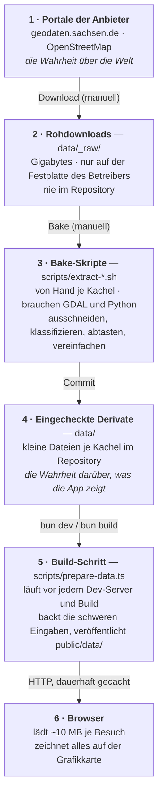
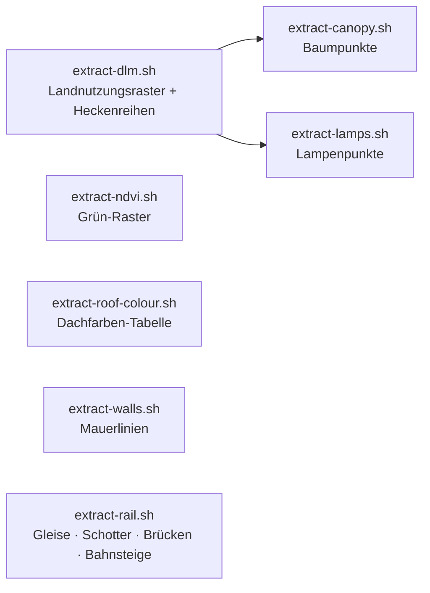

# Der Weg der Daten

*English: [From download to browser](../en/data-journey.md)*

Diese Seite folgt den Daten vom Portal des Anbieters bis zu den Pixeln auf
deinem Bildschirm. Sie beantwortet vier Fragen, die man bei so einem
Projekt stellt: **wo liegt die Wahrheit**, **was ist ein Derivat**, **was
lädt der Browser tatsächlich herunter** und **was muss neu gemacht werden,
wenn sich eine Quelle ändert**. Abkürzungen stehen im
[Glossar](./glossary.md).

## Die sechs Stationen

Zwei der Pfeile sind manuell und selten (ein neuer Download, ein
geändertes Bake); die letzten beiden passieren automatisch bei jedem Build
und jedem Besuch.

### Station 1 — die Portale der Anbieter

Die sächsische Landesvermessung und OpenStreetMap besitzen die Daten. Wenn
sich die Stadt ändert, ändert sie sich zuerst dort. Das Projekt hält einen
Schnappschuss; wie alt jeder ist, steht in der
[Stände-Tabelle](./data-sources.md#verwendete-datenstände).

### Station 2 — Rohdownloads (`data/_raw/`, nicht eingecheckt)

Die Rohdownloads sind groß: das landesweite Landschaftsmodell mehrere
Gigabyte, eine Luftbildkachel hunderte Megabyte, der OpenStreetMap-Auszug
für Sachsen etwa 250 MB. Sie liegen in einem Ordner, den die
Versionsverwaltung ignoriert. Jeder kann sie neu herunterladen; niemand
braucht sie, um den Viewer zu betreiben.

**Die eine Ausnahme** ist das Geländemodell: Sein GeoTIFF ist eingecheckt
(13,6 MB je Kachel), weil der Build-Schritt in Station 5 es direkt liest
und zwei Bake-Skripte es ebenfalls brauchen. Das ist eine bewusste
Entscheidung ([ADR 0004](../../adr/0004-commit-derived-artifacts-not-raw-data.md),
englisch).

### Station 3 — die Bake-Skripte (manuell, je Kachel)

Sieben Shell-Skripte verwandeln die Rohdownloads in kleine, kachelgroße
Dateien. Sie laufen auf dem Rechner des Betreibers, brauchen das
GDAL-Werkzeugpaket und Python und werden in fester Reihenfolge
ausgeführt, weil spätere die Ausgaben früherer lesen:

Jedes Skript beschreibt, was es in den Rohdaten „sieht“ und wie es
vereinfacht. Die Entwicklerseite [data-pipeline.md](../../data-pipeline.md)
(englisch) dokumentiert Eingaben, Ausgaben und Stellschrauben jedes
Skripts.

### Station 4 — die eingecheckten Derivate (`data/`)

Dieser Ordner ist das, was das Repository tatsächlich garantiert. Alles,
was der Viewer zeigt, liegt entweder hier oder wird daraus berechnet. Er
enthält je Kachel:

| Ordner | Dateien | Was sie sind | Größe je Kachel |
|---|---|---|---|
| `data/dgm/` | `dgm1_<Kachel>.tif` + `.tfw` + `_akt.csv` | das Geländemodell wie heruntergeladen (die Ausnahme von oben) | 13,6 MB |
| `data/cityjson/` | `lod2_<Kachel>.city.json` | das Gebäudemodell, nach CityJSON umgewandelt | 8–11 MB |
| `data/dlm/` | `landcover_<Kachel>.png` + `.json` | Landnutzungsklasse je Halbmeter-Pixel (4096²), mit Legende | 0,2 MB |
| | `landcover_rgb_<Kachel>.png` | die pastelligen Bodenfarben, Wasseranteil im Alphakanal | 0,5–0,6 MB |
| | `ndvi_<Kachel>.png` | Grünindex aus dem Luftbild, 1024² | 0,3–0,5 MB |
| | `vegrows_<Kachel>.geojson` | Hecken- und Baumreihenlinien | wenige kB |
| | `canopy_<Kachel>.geojson` | ein Punkt je Baum mit Höhe (5 000–16 000 je Kachel) | 0,6–1,8 MB |
| | `lamps_<Kachel>.geojson` | Lampenpositionen | bis 60 kB |
| | `walls_<Kachel>.geojson` | Mauerlinien mit Art und Höhe | 50–120 kB |
| | `rail_<Kachel>.geojson`, `railarea_<Kachel>.geojson` | Gleislinien mit Gleiszahl; verschmolzene Schotterflächen | wenige kB |
| | `bridge_<Kachel>.geojson` | Brückendeck-Umrisse mit Höhe je Ecke, Art und Tragwerk | wenige kB |
| | `platform_<Kachel>.geojson` | Bahnsteige | wenige kB |
| `data/dop/` | `roofcolor_<Kachel>.json` | eine Farbe je Gebäude, aus dem Luftbild abgetastet | 0,2 MB |

Insgesamt trägt das Repository etwa 130 MB Daten für die vier Kacheln
(plus zwei Geländekacheln im Osten, die noch nichts lädt).

**Eine Wahrheit gegenüber Derivat, auf einen Blick:**

| Schicht im Viewer | Wahrheit (Anbieter) | Im Repository eingecheckt | Beim Build erzeugt | An den Browser gesendet |
|---|---|---|---|---|
| Gelände | DGM1-GeoTIFF | das GeoTIFF selbst | ein kompaktes **Höhenfeld** (1024²-Raster aus Zentimeter-Ganzzahlen, gzip) | das Höhenfeld |
| Gebäude | LoD2-CityGML | die CityJSON-Umwandlung | ein **binäres Gebäudenetz** plus eine kleine Tabelle mit Stilwerten je Gebäude (Dachfarbe eingearbeitet) | Netz + Tabelle |
| Bodenfarben | Basis-DLM-Shapefiles | die zwei Landnutzungs-PNGs | halb so große Kopien (2048²) für Nachbarkacheln und Handys | die PNGs |
| Bäume | Basis-DLM + DOM1 + DGM1 | Baumpunkte, Heckenreihen | — | wie eingecheckt |
| Grün | DOP | das NDVI-PNG | — | wie eingecheckt |
| Dachfarben | DOP + LoD2 | die Dachfarben-Tabelle | in die Gebäudetabelle eingearbeitet | in der Gebäudetabelle |
| Lampen, Mauern, Bahnsteige, Brückentragwerk | OpenStreetMap | die GeoJSON-Dateien | — | wie eingecheckt |
| Gleise, Schotter, Brücken | Basis-DLM (+ DOM1/DGM1 für Höhen) | die GeoJSON-Dateien | — | wie eingecheckt |

### Station 5 — der Build-Schritt (`scripts/prepare-data.ts`)

Jedes `bun dev` und `bun build` beginnt damit, dieses Skript auszuführen.
Es tut drei Dinge:

1. **Backt die schweren Eingaben.** Das Gelände-GeoTIFF wird zum Höhenfeld
   (ein Raster von 1024 × 1024 Höhenwerten für die Kachel, auf der du
   stehst, 512 × 512 für die Nachbarn, als Zentimeter-Ganzzahlen gespeichert
   und gezippt: etwa 1 MB statt 13,6 MB). Das CityJSON wird zu einem
   binären Netz, das die Grafikkarte direkt laden kann (etwa 0,7 MB statt
   10 MB), samt einer Tabelle mit Stilwerten je Gebäude. Die zwei
   Landnutzungs-PNGs bekommen 2048²-Kopien für die Nachbarkacheln und für
   Handys. Ergebnisse werden in `.cache/` zwischengespeichert und nur neu
   erzeugt, wenn sich eine Eingabe oder der Bake-Code geändert hat.
2. **Veröffentlicht** jede Datei nach `public/data/` unter einem Namen, der
   einen Fingerabdruck ihres Inhalts trägt (zum Beispiel
   `canopy_33412_5656_2_sn.55a26a2d.geojson`), und schreibt eine
   `manifest.json`, die die einfachen Namen auf die Namen mit
   Fingerabdruck abbildet.
3. **Räumt auf**, was das Manifest nicht mehr nennt, damit eine entfernte
   Quelle ihr Feature wirklich abschaltet, statt weiterzuleben.

Die Namen mit Fingerabdruck erlauben dem Browser, jede Datendatei dauerhaft
zu cachen; nur das winzige Manifest wird bei jedem Besuch neu geprüft. Ein
neues Bake ändert die Fingerabdrücke, und das neue Manifest zeigt auf die
neuen Dateien.

### Station 6 — der Browser

Der Browser holt das Manifest, dann die Dateien der Kachel, auf der du
startest, dann den Rest. Gemessen an den aktuellen Daten (komprimierte
Größe, wie über das Netz gesendet):

| Was | Startkachel | Je Nachbar |
|---|---|---|
| Gelände-Höhenfeld | 1,09 MB | 0,3–0,4 MB |
| Gebäudenetz + Stiltabelle | 0,72 + 0,29 MB | 0,6–0,8 + 0,2–0,3 MB |
| Landnutzungsklassen-PNG | 0,22 MB (4096²) | 0,09 MB (2048²) |
| Pastellige Bodenfarben | 0,52 MB (4096²) | 0,5–0,6 MB (2048²) |
| Grün (NDVI) | 0,39 MB | 0,3–0,45 MB |
| Baumpunkte | 36 kB | 54–110 kB |
| Mauern | 12 kB | 8–22 kB |
| Lampen, Gleise, Schotter, Brücken, Bahnsteige, Heckenreihen | je unter 5 kB | je unter 5 kB |
| **Je Kachel** | **≈ 3,9 MB** | **≈ 2,2–2,7 MB** |

Ein vollständiger Besuch am Desktop lädt etwa **10,6 MB** für die vier
Kacheln; ein Handy etwa 10,4 MB (es nimmt die 2048²-Bodenraster für jede
Kachel); das nur für Tests gedachte „lite“-Profil mit einer einzigen
Kachel etwa 3,3 MB.

Was **nie** gesendet wird: das 13,6-MB-Gelände-GeoTIFF, das 10-MB-CityJSON
und keiner der Rohdownloads. Der Browser dekodiert kein Raster und parst
kein CityJSON; er bekommt Raster und Netze, die er direkt verwenden kann.

Was **im Browser berechnet** statt heruntergeladen wird: die
Geländedreiecke aus dem Höhenfeld, die Wasseroberfläche, jeder Baum aus
seinem Punkt und seiner Höhe, Laternenmasten aus ihren Punkten, Mauern und
Brücken aus ihren Umrissen, der Sonnenstand, alle Beleuchtung und Schatten
und der gesamte Nachbearbeitungs-Look.

## Was neu gemacht werden muss, wenn sich etwas ändert

| Änderung | Manuelle Schritte | Automatisch |
|---|---|---|
| Neuer Geländestand | GeoTIFF in `data/dgm/` ersetzen; `extract-canopy.sh` und `extract-rail.sh` neu ausführen (sie lesen es) | das Höhenfeld wird beim nächsten Build neu gebacken |
| Neues Gebäudemodell | nach CityJSON umwandeln, in `data/cityjson/` ersetzen; `extract-roof-colour.sh` neu ausführen | das Gebäudenetz wird beim nächsten Build neu gebacken |
| Neuer Landnutzungsstand | `extract-dlm.sh` neu ausführen, dann `extract-canopy.sh`, `extract-lamps.sh`, `extract-rail.sh` (sie lesen das Klassenraster) | die 2048²-Kopien werden neu gebacken |
| Neue Luftbilder | `extract-ndvi.sh` und `extract-roof-colour.sh` neu ausführen | die Dachfarben werden beim nächsten Build ins Netz eingearbeitet |
| Neue OpenStreetMap-Daten | die zwischengespeicherten Overpass-Antworten löschen und `extract-lamps.sh` sowie `extract-rail.sh` neu ausführen; einen frischen Geofabrik-Auszug laden und `extract-walls.sh` neu ausführen | — |
| Eine neue Kachel | alle Quellen dafür laden, alle sieben Bakes ausführen, die Kachel in die Liste in `lib/city/tile.ts` eintragen | der Build backt und veröffentlicht sie |

## Warum es so gebaut ist

Die schwere Arbeit einmal offline zu erledigen, hält den Viewer eine
schlichte statische Website: kein Server, keine Datenbank, keine
API-Schlüssel und ein erstes Bild in wenigen Sekunden selbst auf dem Handy.
Die kleinen Derivate im Repository zu halten, heißt, dass jeder den Viewer
ohne die Gigabytes an Rohdaten bauen und starten kann und jede Änderung
dessen, was der Viewer zeigt, in der Versionsgeschichte sichtbar ist. Die
Abwägungen stehen in den
[Architekturentscheidungen](../../adr/README.md) (englisch).
