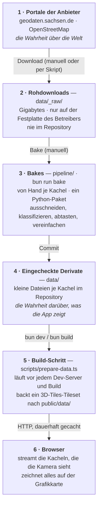
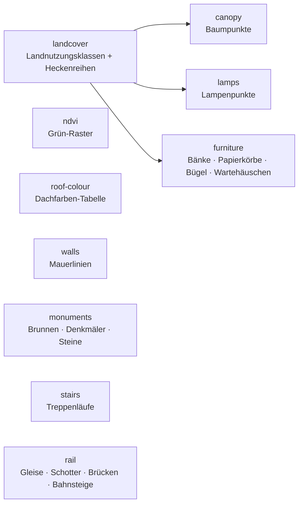

# Der Weg der Daten

*English: [From download to browser](../en/data-journey.md)*

Diese Seite folgt den Daten vom Portal des Anbieters bis zu den Pixeln auf
deinem Bildschirm. Sie beantwortet vier Fragen, die man bei so einem
Projekt stellt: **wo liegt die Wahrheit**, **was ist ein Derivat**, **was
lädt der Browser tatsächlich herunter** und **was muss neu gemacht werden,
wenn sich eine Quelle ändert**. Abkürzungen stehen im
[Glossar](./glossary.md).

## Die sechs Stationen

Zwei der Pfeile sind manuell und selten (ein neuer Download, ein
geändertes Bake); die letzten beiden passieren automatisch bei jedem Build
und jedem Besuch.

### Station 1 — die Portale der Anbieter

Die sächsische Landesvermessung und OpenStreetMap besitzen die Daten. Wenn
sich die Stadt ändert, ändert sie sich zuerst dort. Das Projekt hält einen
Schnappschuss; wie alt jeder ist, steht in der
[Stände-Tabelle](./data-sources.md#verwendete-datenstände).

### Station 2 — Rohdownloads (`data/_raw/`, nicht eingecheckt)

Die Rohdownloads sind groß: das landesweite Landschaftsmodell mehrere
Gigabyte, eine Luftbildkachel hunderte Megabyte, der OpenStreetMap-Auszug
für Sachsen etwa 250 MB. Sie liegen in einem Ordner, den die
Versionsverwaltung ignoriert, mit einem Unterordner je Standort und Quelle
(`data/_raw/dresden/dom1`, `…/dop`, `…/dlm`, `…/osm`). Jeder kann sie neu
herunterladen — `bun run bake --ingest` erledigt das in einem Rutsch —, und
niemand braucht sie, um den Viewer zu betreiben.

**Die eine Ausnahme** ist das Geländemodell: Sein GeoTIFF ist eingecheckt
(13,6 MB je Kachel), weil der Build-Schritt in Station 5 es direkt liest
und zwei Bakes es ebenfalls brauchen. Das ist eine bewusste
Entscheidung ([ADR 0004](../../adr/0004-commit-derived-artifacts-not-raw-data.md),
englisch).

### Station 3 — die Bakes (manuell, je Kachel)

Ein Python-Paket, `pipeline/bake/`, verwandelt die Rohdownloads in kleine,
kachelgroße Dateien. Es läuft auf dem Rechner des Betreibers mit einem
einzigen Befehl, `bun run bake`, der die **Standort-Konfiguration** liest
(`sites/dresden.ts`: welche Kacheln, wo sie liegen, welches
Koordinatensystem) und je Kachel sieben Schritte ausführt. Die
Python-Umgebung ist festgeschrieben, und ihre Geodaten-Bibliotheken bringen
GDAL gleich mit, sodass nichts weiter installiert werden muss. Mit
`--ingest` holt es die Downloads vorher selbst: Oberflächenmodell und
Luftbild jeder Kachel über den Download-Dienst der Landesvermessung, das
landesweite Landschaftsmodell und den OpenStreetMap-Auszug für Sachsen von
Geofabrik.

Die Schritte laufen in fester Reihenfolge, weil manche die Ausgabe eines
früheren lesen:

Jeder Schritt beschreibt, was er in den Rohdaten „sieht“ und wie er
vereinfacht. Fehlen für eine Kachel Oberflächenmodell oder Luftbild, werden
die Schritte, die sie brauchen (Bäume, Grün, Dachfarben), mit einem Hinweis
übersprungen, statt abzubrechen. Die Entwicklerseite
[data-pipeline.md](../../data-pipeline.md) (englisch) dokumentiert
Eingaben, Ausgaben und Stellschrauben jedes Schritts.

### Station 4 — die eingecheckten Derivate (`data/`)

Dieser Ordner ist das, was das Repository tatsächlich garantiert. Alles,
was der Viewer zeigt, liegt entweder hier oder wird daraus berechnet. Er
enthält je Kachel:

| Ordner | Dateien | Was sie sind | Größe je Kachel |
|---|---|---|---|
| `data/dgm/` | `dgm1_<Kachel>.tif` + `.tfw` + `_akt.csv` | das Geländemodell wie heruntergeladen (die Ausnahme von oben) | 13,6 MB |
| `data/cityjson/` | `lod2_<Kachel>.city.json` | das Gebäudemodell, nach CityJSON umgewandelt | 8–11 MB |
| `data/dlm/` | `landcover_<Kachel>.png` + `.json` | Landnutzungsklasse je Halbmeter-Pixel (4096²), mit Legende; die Datei enthält nur Klassennummern, die Farben kommen erst im Browser dazu | 0,2 MB |
| | `ndvi_<Kachel>.png` | Grünindex aus dem Luftbild, 1024² | 0,3–0,5 MB |
| | `vegrows_<Kachel>.geojson` | Hecken- und Baumreihenlinien | wenige kB |
| | `canopy_<Kachel>.geojson` | ein Punkt je Baum mit Höhe (5 000–16 000 je Kachel) | 0,6–1,8 MB |
| | `lamps_<Kachel>.geojson` | Lampenpositionen | bis 60 kB |
| | `furniture_<Kachel>.geojson` | Bänke, Papierkörbe, Fahrradbügel, Poller, Briefkästen und Wartehäuschen, jeweils mit ihrer Blickrichtung | 50–180 kB |
| | `monuments_<Kachel>.geojson` | Brunnenbecken und Denkmalpunkte mit Art und amtlichem Namen | 2–55 kB |
| | `walls_<Kachel>.geojson` | Mauerlinien mit Art und Höhe, dazu die Zäune und Geländer (mit Bauart) und die Tore darauf | 130–290 kB |
| | `stairs_<Kachel>.geojson` | Treppenläufe: Achse, Breite, Stufenzahl, Höhe an Fuß und Kopf | wenige kB |
| | `terraces_<Kachel>.geojson` | erhöhte Flächen, die dem Geländemodell fehlen (die Brühlsche Terrasse), mit ihrer Höhe | wenige kB |
| | `rail_<Kachel>.geojson`, `railarea_<Kachel>.geojson` | Gleislinien mit Gleiszahl; verschmolzene Schotterflächen | wenige kB |
| | `bridge_<Kachel>.geojson` | Brückendeck-Umrisse mit Höhe je Ecke, Art und Tragwerk | wenige kB |
| | `platform_<Kachel>.geojson` | Bahnsteige | wenige kB |
| | `osmbuild_<Kachel>.json` | je Gebäude: Laden oder Café im Erdgeschoss, Baudenkmal | 15–40 kB |
| `data/dop/` | `roofcolor_<Kachel>.json` | eine Farbe je Gebäude, aus dem Luftbild abgetastet | 0,2 MB |

Insgesamt trägt das Repository etwa 400 MB Daten für die fünfzehn Kacheln.

**Eine Wahrheit gegenüber Derivat, auf einen Blick:**

| Schicht im Viewer | Wahrheit (Anbieter) | Im Repository eingecheckt | Beim Build erzeugt | An den Browser gesendet |
|---|---|---|---|---|
| Gelände | DGM1-GeoTIFF | das GeoTIFF selbst | zwei **Geländenetze** je Kachel (ein detailliertes und ein grobes), mit eingearbeiteten Mauerkanten, als **glTF** | das Netz, das die Kamera gerade braucht |
| Gebäude | LoD2-CityGML | die CityJSON-Umwandlung | ein **glTF-Gebäudenetz** je Kachel mit einer Tabelle von Stilwerten je Gebäude (Dachfarbe eingearbeitet), dazu die Grundrisse für die Minikarte | Netz + Grundrisse |
| Bodenfarben | Basis-DLM-Shapefiles | das Landnutzungsklassen-PNG mit Legende | eine halb so große Kopie (2048²) für Handys und ferne Geländeteile und eine kleine (512²) für die Minikarte | die Klassen-PNGs; die Farben malt der Browser |
| Bäume | Basis-DLM + DOM1 + DGM1 | Baumpunkte, Heckenreihen | — | wie eingecheckt |
| Grün | DOP | das NDVI-PNG | — | wie eingecheckt |
| Dachfarben | DOP + LoD2 | die Dachfarben-Tabelle | in die Tabelle des Gebäudenetzes eingearbeitet | im Gebäudenetz |
| Ladenfronten, Baudenkmale | OpenStreetMap + LoD2 | die Tabelle je Gebäude | in die Tabelle des Gebäudenetzes eingearbeitet | im Gebäudenetz |
| Denkmäler und Brunnen | Basis-DLM (Namen, Lage) + OpenStreetMap (Becken) | die GeoJSON-Dateien | — | wie eingecheckt |
| Lampen, Bahnsteige, Brückentragwerk | OpenStreetMap | die GeoJSON-Dateien | — | wie eingecheckt |
| Mauern, Zäune, Treppen, Terrassen | OpenStreetMap + DGM1 | die GeoJSON-Dateien | ins detaillierte Geländenetz eingebaut: der Boden an und unter ihnen geformt, Mauern, Zäune und Stufen Teil des Netzes | im Geländenetz |
| Gleise, Schotter, Brücken | Basis-DLM (+ DOM1/DGM1 für Höhen) | die GeoJSON-Dateien | — | wie eingecheckt |

### Station 5 — der Build-Schritt (`scripts/prepare-data.ts`)

Jedes `bun dev` und `bun build` beginnt damit, dieses Skript auszuführen.
Es tut drei Dinge:

1. **Backt die schweren Eingaben zu einem Tileset.** Für jede Kachel wird
   das Gelände-GeoTIFF zu zwei fertigen Geländenetzen: einem detaillierten
   auf einem Raster von 1024 × 1024 Punkten und einem groben auf
   512 × 512 – mit den hohen Mauern aus OpenStreetMap als scharfen Kanten,
   mit den Treppen samt passend geformtem Boden darunter und mit einer
   kurzen Schürze am Rand, damit an den Nahtstellen
   zwischen Kacheln keine Lücke sichtbar wird. Das CityJSON wird zu einem
   Gebäudenetz je Kachel mit einer Tabelle von Stilwerten je Gebäude, dazu
   einer Liste der Gebäudegrundrisse für die Minikarte. Jedes Netz wird als
   **glTF** geschrieben, das Standardformat für 3D-Modelle, komprimiert und
   gezippt: etwa 1,1–1,5 MB Gebäude, 1,5–2,0 MB detailliertes und
   0,4–0,55 MB grobes Gelände je Kachel, statt des 13,6-MB-GeoTIFFs und
   des 8–11-MB-CityJSONs. Eine kleine Indexdatei, `tileset.json`, im
   offenen **3D-Tiles**-Format, listet für jede Kachel die Gebäude und die
   zwei Geländestufen und legt fest, ab welcher Nähe die detaillierte Stufe
   die grobe ersetzt. Das Landnutzungsklassen-PNG bekommt eine
   2048²- und eine 512²-Kopie. Ergebnisse werden in `.cache/` zwischengespeichert und nur
   neu erzeugt, wenn sich eine Eingabe oder der Bake-Code geändert hat.
2. **Veröffentlicht** jede Datei nach `public/data/` unter einem Namen, der
   einen Fingerabdruck ihres Inhalts trägt (zum Beispiel
   `canopy_33412_5656_2_sn.55a26a2d.geojson`), und schreibt eine
   `manifest.json`, die die einfachen Namen auf die Namen mit
   Fingerabdruck abbildet.
3. **Räumt auf**, was das Manifest nicht mehr nennt, damit eine entfernte
   Quelle ihr Feature wirklich abschaltet, statt weiterzuleben.

Die Namen mit Fingerabdruck erlauben dem Browser, jede Datendatei dauerhaft
zu cachen; nur das winzige Manifest wird bei jedem Besuch neu geprüft. Ein
neues Bake ändert die Fingerabdrücke, und das neue Manifest zeigt auf die
neuen Dateien.

### Station 6 — der Browser

Der Browser holt das Manifest und das Tileset und **streamt** dann: Eine
Bibliothek namens 3DTilesRendererJS entscheidet danach, wo die Kamera
steht und wohin sie schaut, welche Dateien geladen werden. Das erste Bild
wartet nur auf Gebäude und Gelände der Kachel, auf der du startest.
Kacheln nahe der Kamera bekommen das detaillierte Gelände – Mauern und
Treppen sind darin schon eingebaut – und werden dann mit Bäumen, Lampen und
Gleisen *ausgestattet*; weiter entfernte
Kacheln zeigen ihre Gebäude auf dem groben Gelände; Kacheln außer Sicht
werden gar nicht geladen, und Kacheln, die du hinter dir gelassen hast,
können wieder aus dem Speicher fallen. Gemessen an den aktuellen Daten
(komprimierte Größe, wie über das Netz gesendet):

| Was | Startkachel | Andere Kacheln | Geladen, wenn |
|---|---|---|---|
| Gebäude (mit Stiltabelle) | 1,34 MB | bis 1,91 MB | die Kachel im Blick ist |
| Gebäudegrundrisse (Minikarte) | 48 kB | bis 75 kB | mit den Gebäuden |
| Grobes Gelände (512²) | 0,41 MB | 0,44–0,65 MB | die Kachel im Blick ist |
| Detailliertes Gelände (ein TIN, mit seinen Mauern, Treppen und Bordsteinen) | 1,61 MB | 1,31–3,56 MB | die Kamera nahe kommt |
| Landnutzungsklassen, 512² | 15 kB | 9–18 kB | beim Start, für die Minikarte (die Klangkulisse nutzt es mit) |
| Landnutzungsklassen, 2048² | 0,08 MB | 0,06–0,11 MB | mit dem groben Gelände (auf Handys mit jeder Stufe) |
| Landnutzungsklassen, 4096² | 0,22 MB | 0,15–0,29 MB | mit dem detaillierten Gelände (nur Desktop) |
| Grün (NDVI) | 0,39 MB | 0,32–0,77 MB | mit dem Gelände |
| Baumpunkte | 36 kB | 41–526 kB | mit dem detaillierten Gelände |
| Stadtmöbel | 19 kB | 0,3–19 kB | mit dem detaillierten Gelände |
| Lampen, Gleise, Schotter, Brücken, Bahnsteige, Heckenreihen | je unter 5 kB | je unter 5 kB | mit dem detaillierten Gelände |
| Belag- und Straßenkanten-Raster | 2,18 MB | 0,28–2,76 MB | mit dem detaillierten Gelände |
| **Je Kachel, volle Detailstufe** | **≈ 6,4 MB** | **≈ 4,0–9,7 MB** | |
| **Je Kachel, nur als ferne Kulisse** | ≈ 2,3 MB | ≈ 1,3–3,3 MB | |

Wie viel ein Besuch lädt, hängt also davon ab, wohin du gehst. Mit jeder
Kachel in voller Detailstufe hat ein Desktop-Browser etwa **97 MB** für die
fünfzehn Kacheln geladen; ein Handy etwa 95 MB (es nimmt für jede Kachel das
2048²-Landnutzungsraster); das nur für Tests gedachte „lite“-Profil, das
allein die Startkachel streamt, etwa 6 MB. Das ist mehr als vor der
Umstellung aufs Streamen (ein vollständiger Besuch lag bei etwa 10,6 MB),
weil das Gelände jetzt als fertiges Netz statt als kompaktes Höhenraster
ankommt; dafür ist jede Datei ein Standardformat, das gängige 3D-Werkzeuge
öffnen können.

Was **nie** gesendet wird: das 13,6-MB-Gelände-GeoTIFF, das 10-MB-CityJSON
und keiner der Rohdownloads. Der Browser parst kein CityJSON und baut kein
Gelände; er bekommt Netze, die er direkt zeichnen kann, dazu kleine Bilder
und Feature-Dateien.

Was **im Browser berechnet** statt heruntergeladen wird: die Bodenfarben
(einmal je Kachel auf der Grafikkarte gemalt, aus den
Landnutzungsklassen und einer Pastellpalette), die Wasseroberfläche, jeder
Baum aus seinem Punkt und seiner Höhe, Laternenmasten und Bänke aus ihren Punkten,
Brücken aus ihren Umrissen, der Sonnenstand, alle Beleuchtung
und Schatten und der gesamte Nachbearbeitungs-Look.

## Was neu gemacht werden muss, wenn sich etwas ändert

| Änderung | Manuelle Schritte | Automatisch |
|---|---|---|
| Neuer Geländestand | GeoTIFF in `data/dgm/` ersetzen; die Bakes `canopy` und `rail` neu ausführen (sie lesen es) | die Geländenetze samt Mauerkanten werden beim nächsten Build neu gebacken |
| Neues Gebäudemodell | nach CityJSON umwandeln, in `data/cityjson/` ersetzen; das Bake `roof-colour` neu ausführen | das Gebäudenetz wird beim nächsten Build neu gebacken |
| Neuer Landnutzungsstand | das neue Paket laden, das Bake `landcover` neu ausführen, dann `canopy`, `lamps`, `furniture`, `rail` und `tram` (sie lesen das Klassenraster) | die 2048²- und 512²-Kopien werden neu gebacken |
| Neue Luftbilder | die Bakes `ndvi` und `roof-colour` neu ausführen | die Dachfarben werden beim nächsten Build ins Netz eingearbeitet |
| Neue OpenStreetMap-Daten | einen frischen Geofabrik-Auszug laden und die Bakes `lamps`, `furniture`, `monuments`, `osm-buildings`, `walls`, `stairs`, `rail` und `tram` neu ausführen | — |
| Andere Bodenfarben | die eine Palette im Code ändern | nichts neu zu backen: Der Browser malt die Farben |
| Eine neue Kachel | Gelände- und Gebäudemodell von Hand laden (das Gebäudemodell nach CityJSON umgewandelt) und beide einchecken; die Kachel in die Standort-Konfiguration `sites/dresden.ts` eintragen; `bun run bake --ingest` holt den Rest und führt alle sieben Bakes aus | der Build nimmt sie ins Tileset auf und veröffentlicht sie |

## Warum es so gebaut ist

Die schwere Arbeit einmal offline zu erledigen, hält den Viewer eine
schlichte statische Website: kein Server, keine Datenbank, keine
API-Schlüssel und ein erstes Bild in wenigen Sekunden selbst auf dem Handy.
Die kleinen Derivate im Repository zu halten, heißt, dass jeder den Viewer
ohne die Gigabytes an Rohdaten bauen und starten kann und jede Änderung
dessen, was der Viewer zeigt, in der Versionsgeschichte sichtbar ist. Die
Abwägungen stehen in den
[Architekturentscheidungen](../../adr/README.md) (englisch).
