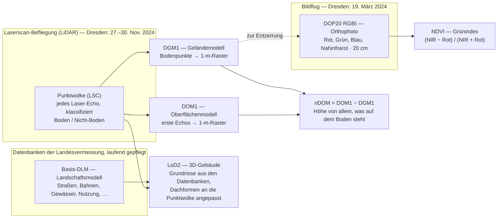

# Woher die Daten kommen

*English: [Where the data comes from](../en/data-sources.md)*

Alles im Viewer ist aus **offenen Daten** abgeleitet: Datensätzen, die eine
Behörde oder eine Freiwilligen-Community zur freien Nutzung
veröffentlicht. Nichts wurde für dieses Projekt selbst vermessen oder von
Hand gezeichnet. Diese Seite listet jeden Datensatz, wo er heruntergeladen
wurde, was er gut kann, wo er schwächelt und unter welcher Lizenz er
verwendet werden darf. Die Abkürzungen erklärt das [Glossar](./glossary.md).

## Die Anbieter

**GeoSN** — das *Landesamt für Geobasisinformation Sachsen*, die
Landesvermessung. Es stellt Gelände- und Oberflächenmodell, das
3D-Gebäudemodell, das Landschaftsmodell und die Luftbilder als kostenlose
Downloads auf seinem Portal für offene Geodaten bereit,
[geodaten.sachsen.de](https://www.geodaten.sachsen.de/). Alle sind in
dieselben **2 km × 2 km großen Kacheln** geschnitten, weshalb auch der
Viewer in Kacheln denkt. Welche Kacheln er zeigt, steht an einer einzigen
Stelle, der Standort-Konfiguration `sites/dresden.ts`: die fünfzehn Kacheln
(die erste ist die, auf der du startest), die Aussichtspunkte und die
Quellenvermerke.

**OpenStreetMap (OSM)** — die von Freiwilligen gepflegte Weltkarte. Sie
füllt Lücken, die die amtlichen Datensätze lassen: Straßenlampen,
Bänke und andere Stadtmöbel, Bahnsteige, Stützmauern mit Höhen, den Tragwerkstyp von Brücken, die
Form von Brunnenbecken und die Bäume in Höfen und Gärten, die das
Stadtbaumkataster nicht führt.

**Landeshauptstadt Dresden** — die Stadt selbst. Ihr Stadtbaumkataster
verzeichnet rund 124.000 städtische Bäume mit Art, Höhe,
Kronen- und Stammdurchmesser. Der Viewer pflanzt diese Bäume dort, wo sie
wirklich stehen, mit gemessener Höhe, Krone und Stamm, einer Kronenform,
die der Art folgt, und dem Jahr der Art: wann sie austreibt, wie sie sich
im Herbst färbt und wann sie kahl ist.

## Die Datensätze im Überblick

| Datensatz | Auf Deutsch | Anbieter | Wofür der Viewer ihn nutzt |
|---|---|---|---|
| **DGM1** | Geländemodell, 1-m-Raster | GeoSN | Der Boden; jedes Objekt darauf absetzen; Brückenwiderlager-Höhen; Eingang für Baumhöhen |
| **DOM1** | Oberflächenmodell, 1-m-Raster (Gelände *plus* alles, was darauf steht) | GeoSN | Baumhöhen (Oberfläche minus Gelände); Brückendeck-Höhen |
| **LoD2** | 3D-Gebäudemodell mit Dachformen | GeoSN | Grundriss, Höhe, Dachform und Attribute jedes Gebäudes |
| **Basis-DLM** | Digitales Landschaftsmodell (die Landnutzungskarte) | GeoSN | Bodenfarben, Gewässerumrisse, Hecken und Baumreihen, Bahnflächen und Gleise, Brückenumrisse, Denkmäler und Brunnen (Lage und amtlicher Name) |
| **DOP** | Digitales Orthophoto, 20 cm, mit Nahinfrarot-Kanal | GeoSN | Dachfarben; Vegetationsgrün für Baumkronen und Wiesen |
| **LSC** | Laserscan-Punktwolke | GeoSN | Heckenhöhen; Bäume in Höfen und Gärten |
| **OSM** | OpenStreetMap | Freiwillige | Straßenlampen, Hecken, Stadtmöbel (Bänke, Papierkörbe, Fahrradbügel, Poller, Briefkästen, Wartehäuschen und Haltestellenschilder, Litfaßsäulen, Ampeln, Hydranten, Uhren, Trinkbrunnen), Spielplätze und ihre Geräte, Bahnsteige, Mauern, Felskanten, Treppen, Brücken-Tragwerkstypen, Brunnenbecken, womit Straßen, Gehwege und Parkplätze belegt sind, Sportplätze, Läden und Cafés im Erdgeschoss, Baudenkmale, Zäune, Geländer und Tore, Fahrbahnmarkierungen (Überwege, Haltlinien, Rad- und Mittellinien), Kleingärten und Obstwiesen, Bäume, die das Stadtbaumkataster nicht führt, Straßenbahngleise mit ihren Oberleitungsmasten, Anlegestellen, Buhnen und Fährrouten auf der Elbe, Straßennamen |
| **Stadtbaumkataster** | Das Baumverzeichnis der Stadt | Landeshauptstadt Dresden | Straßen- und Parkbäume an ihrem vermessenen Standort, mit Höhe, Kronenbreite, Stamm, einer Kronenform nach der Art und deren Herbstfarbe und Laubfall |

Im selben Portal verfügbar, aber **noch nicht genutzt**: die Flurstücke
(**ALKIS**) und die topographische Grundkarte (**DTK**). Der Abschnitt
„Planned“ des [Transformations-Verzeichnisses](../../transformations.md)
(englisch) hält fest, was sie beitragen könnten.

## Wie die amtlichen Datensätze entstehen

Das meiste, was der Viewer zeigt, geht auf zwei Arten von Befliegungen
über der Stadt und auf die Datenbanken der Landesvermessung zurück. Das
Diagramm zeigt, wie die Produkte voneinander abhängen; die Steckbriefe
darunter liefern die Details.

## Datensatz für Datensatz

Jeder Steckbrief beantwortet dieselben Fragen: Wofür steht die Abkürzung,
wie werden die Daten erhoben, wie oft aktualisiert, wie genau sind sie,
wofür eignen sie sich allgemein, wofür nutzt sie der Viewer, und wo haben
sie Schwächen. Angaben mit „laut GeoSN“ stammen aus der
Produktdokumentation des Anbieters.

### DGM1 — das Geländemodell

| | |
|---|---|
| **Steht für** | *Digitales Geländemodell 1* — Geländemodell mit 1 m Gitterweite. „Gelände“ meint den nackten Boden: Gebäude, Brücken und Vegetation sind entfernt. |
| **Wie erhoben** | Flugzeuggestütztes Laserscanning (LiDAR): Ein Flugzeug tastet den Boden mit Laserimpulsen ab und zeichnet jedes Echo auf. Die entstehende Punktwolke wird in Boden- und Nichtbodenpunkte klassifiziert; die Bodenpunkte werden in ein regelmäßiges Raster interpoliert. Lücken unter Gebäuden werden mit interpolierten Punkten gefüllt. |
| **Aktualisierung** | Gebietsweise nach jeder neuen Laserbefliegung. Für Dresden stammte der vorige Scan von 2016, der aktuelle vom 27.–30. November 2024. |
| **Auflösung und Genauigkeit** | 1-m-Zellen, Höhe in der Zellenmitte. Höhengenauigkeit bis ±0,15 m, Lagegenauigkeit ±0,30 m bei 95 % Sicherheit, laut GeoSN. |
| **Allgemein geeignet für** | Jede Frage „wie hoch liegt der Boden hier“: Geländeanalysen, Hochwasser- und Abflussmodelle, Sichtbarkeitsstudien, Hangneigungskarten, Entzerrung von Luftbildern. |
| **Hier genutzt für** | Den Boden selbst — ein Dreiecksnetz, das jeden Punkt des 1-m-Rasters auf 15 cm genau trifft (25 cm auf den äußeren Kacheln), dicht, wo der Boden sich biegt, und grob, wo er flach ist, sodass Mauern und Böschungen ihre Kanten behalten; das Absetzen von Gebäuden, Bäumen, Lampen und Spieler darauf; die Widerlagerhöhen von Brücken; den Grundterm der Baumhöhen. |
| **Stärken** | Die wahre Form des Bodens, einschließlich Flussufern, Dämmen und den Terrassen der Altstadt, auf wenige Zentimeter. |
| **Schwächen** | Alles Senkrechte: Eine gelaserte Mauer wird zu einer steilen, ein bis zwei Meter breiten Rampe, nie zu einer senkrechten Wand — und sobald der Viewer das 1-m-Raster auf sein 2-m-Netz umrechnet, „verschwinden“ monumentale Mauern wie die Brühlsche Terrasse in einer etwa 3 m breiten, sanften Böschung. Brücken sind per Definition entfernt, ein Deck aus diesem Modell würde auf den Flussgrund sinken. Der Viewer behebt beides mit anderen Quellen. |
| **Format und Download** | GeoTIFF, 2000 × 2000 Pixel als 32-Bit-Gleitkommazahlen, 13,6 MB je 2-km-Kachel, mit `.tfw`-Weltdatei und einer `_akt.csv` mit dem Erfassungsdatum. Höhen in Metern über Normalhöhennull (**DHHN2016**). [Digitale Höhenmodelle](https://www.geodaten.sachsen.de/downloadbereich-digitale-hoehenmodelle-4851.html). |

Sonderrolle: Dies ist der einzige Rohdatensatz, der ins Repository
eingecheckt ist, weil der Build-Schritt ihn direkt liest. Siehe
[Der Weg der Daten](./data-journey.md).

### DOM1 — das Oberflächenmodell

| | |
|---|---|
| **Steht für** | *Digitales Oberflächenmodell 1* — Oberflächenmodell mit 1 m Gitterweite. „Oberfläche“ meint das Erste, was der Laser trifft: Dächer, Baumwipfel, Brückendecks, parkende Lastwagen. |
| **Wie erhoben** | Dieselbe Laserbefliegung wie das DGM1; statt der Bodenpunkte werden die ersten Echos der Punktwolke ins Raster interpoliert. |
| **Aktualisierung** | Zusammen mit dem DGM1; für diese Kacheln identische Daten (27.–30. November 2024). |
| **Auflösung und Genauigkeit** | 1-m-Zellen; dieselbe Höhengenauigkeit wie die Punktwolke (bis ±0,15 m), laut GeoSN. Eine Zelle am Rand einer Krone oder eines Dachs kann beide Höhen tragen. |
| **Allgemein geeignet für** | Gebäude- und Baumhöhen (als DOM − DGM, das **nDOM**), Kronenkartierung, Unterscheidung von Laub- und Nadelbäumen (durch kahle Kronen scheint der Boden durch), Auffinden von Brücken und abgesenkten Einfahrten, Solardach-Studien. |
| **Hier genutzt für** | `DOM1 − DGM1` ergibt die Höhe von allem, was auf dem Boden steht. Wo das Landschaftsmodell Wald, Gehölz oder Park sagt, setzt der Viewer je 7-m-Zelle einen Baum an den höchsten Punkt, mit dieser Höhe. Brückendecks bekommen ihre Höhe daraus. Es ist außerdem die einzige verlässliche Quelle dafür, wie ein Denkmal oder die Skulptur eines Brunnens *aussieht*: Sein gemessener Körper (die Figurengruppen am Albertplatz sind 3,7 m hoch und etwa 4 × 5 m groß) wird zu einer weichen Tonform in dieser Größe und diesem Umriss. |
| **Stärken** | Gemessene Höhen für jeden Baum und jedes Dach der Stadt auf einmal, in echter Draufsicht ohne die seitliche Verkippung eines Fotos. |
| **Schwächen** | Es kann einen Baum nicht von einem Gebäude oder Bus unterscheiden; die Baumplatzierung ist deshalb auf Vegetationsklassen beschränkt und von Straßen, Gleisen und Wasser ausgeschlossen. Bewuchs unter 3 m wird ignoriert; ein Meter ist zu grob für einzelne Sträucher. Ein November-Scan zeigt Laubbäume ohne Blätter, ihre Kronen sind in den Daten dünner als im Sommer. |
| **Format und Download** | GeoTIFF wie das DGM1, dieselbe Portalseite. Nur offline genutzt; die Rohdatei ist nicht eingecheckt und erreicht den Browser nie. |

### LSC — die Laserscan-Punktwolke

| | |
|---|---|
| **Steht für** | *Laserscandaten* — die rohe Punktwolke, aus der die beiden Höhenmodelle berechnet werden. |
| **Wie erhoben** | Die Laserbefliegung selbst; jedes Echo ist ein Punkt mit Lage, Höhe und Intensität, klassifiziert in Boden und Nicht-Boden. |
| **Aktualisierung** | Wie die Höhenmodelle (27.–30. November 2024 für diese Kacheln). |
| **Auflösung und Genauigkeit** | Unregelmäßige Punkte, mehrere je Quadratmeter; ±0,15 m in der Höhe, ±0,30 m in der Lage, laut GeoSN. |
| **Allgemein geeignet für** | Alles, was die Raster wegvereinfachen: einzelne Baumkronen, Dachkanten, Mauerflächen, Freileitungen. |
| **Hier genutzt für** | Die Höhe der in OpenStreetMap kartierten Hecken sowie Bäume in Höfen und Gärten, die die Landnutzungskarte nicht als Grün führt (außer dort, wo das Stadtbaumkataster schon einen Baum hat). Hecken und Sträucher, die nur der Scan findet, werden nicht gezeigt: etwa ein Drittel davon waren Ränder von Baumkronen. |
| **Stärken** | Sieht unter 3 m und zwischen die Häuser, wo die Höhenraster und die Landnutzungskarte nichts sehen. Jeder Punkt weiß, wie hell sein Echo war und ob sich der Puls geteilt hat — hohe Bäume teilen ihn fast immer, Dächer fast nie. |
| **Schwächen** | Die Klassen trennen Vegetation nicht von Gebäuden, Autos oder Zäunen. Eine geschnittene Hecke teilt einen Puls selten, deshalb stützt sich der Viewer bei niedrigen Pflanzen stattdessen auf die Grünheit des (Frühjahrs-)Luftbilds; eine Hecke unter einer Baumkrone bleibt unsichtbar. |
| **Format und Download** | LAZ je 2-km-Kachel, groß (≈380 MB für 60 Millionen Punkte); dieselbe Portalseite wie das DGM1. |

### LoD2 — das 3D-Gebäudemodell

| | |
|---|---|
| **Steht für** | *Level of Detail 2* des *Digitalen 3D-Stadtmodells*: jedes Gebäude als einfacher Körper mit echtem Grundriss, gemessener Höhe und standardisierter Dachform (Flach-, Sattel-, Walm-, Mansarddach und weitere). LoD1 wären flache Klötze; LoD3 hätte Fassadendetail. |
| **Wie erhoben** | Automatisch von der Landesvermessung erzeugt: Die Grundrisse kommen aus ihren Kataster- und Landschaftsdatenbanken (ALKIS / ATKIS), Dachformen und Höhen werden an die Laser-Punktwolke angepasst. Seit 2021 kann das Produkt auch Brücken, Mauern, Türme, Windräder und Masten enthalten. |
| **Aktualisierung** | Eine Kachel wird neu erzeugt, wenn sich ihre Eingaben ändern; das landesweite Modell wurde zuletzt im August 2025 aktualisiert. Das Modell einer Kachel ist so alt wie seine Eingaben: Für diese Kacheln stammen die Dächer aus dem Laserscan von **2016**, die Grundrisse aus dem Basis-DLM von 2021 bzw. 2022 und der Boden aus dem DGM von 2016; das Modell selbst wurde 2023 (westliches Paar) bzw. 2024 (östliches Paar) erzeugt. Die Daten von 2025 in den Dateien sind Exportdaten, keine Erfassungsdaten. |
| **Auflösung und Genauigkeit** | Grundrisse in Katastergenauigkeit (Dezimeter); Dachhöhen in Lasergenauigkeit; Dachformen sind der nächstliegende Standardtyp, nicht das reale Dach. |
| **Allgemein geeignet für** | Stadtbild-Visualisierung, Verschattungs- und Solarstudien, Lärm- und Windmodelle, Geschoss- und Volumenzählung. |
| **Hier genutzt für** | Grundriss, Höhe, Dachform und Attribute jedes Gebäudes; die Grundrisse der Minikarte; das Abriss-Werkzeug. |
| **Stärken** | Exakte Silhouetten: Grundrisse und Dachformen sind stadtweit konsistent, Höhen gemessen. |
| **Schwächen** | Nichts unterhalb der Traufe: keine Fenster, Türen, Materialien oder Farben. Die Gebäudefunktion ist bei etwa 86 % der Gebäude „nicht spezifiziert“, die Geschosszahl nur bei wenigen Prozent gefüllt; der Viewer leitet Geschossbänder deshalb aus der gemessenen Höhe ab. Die heruntergeladenen Kacheln enthalten nur Gebäude, keine Brücken oder Mauern. |
| **Format und Download** | **CityGML** je 2-km-Kachel (auch DXF und Shape); das Projekt wandelt vor dem Einchecken in **CityJSON** um, eine kompakte JSON-Form desselben Standards (8–11 MB je Kachel). [Digitale 3D-Stadtmodelle](https://www.geodaten.sachsen.de/downloadbereich-digitale-3d-stadtmodelle-4875.html). |

### Basis-DLM — das Landschaftsmodell

| | |
|---|---|
| **Steht für** | *Digitales Basis-Landschaftsmodell*: die detaillierteste Stufe von **ATKIS**, dem *Amtlichen Topographisch-Kartographischen Informationssystem*, dem bundesweiten System amtlicher topographischer Daten. Eine Vektorkarte dessen, was den Boden bedeckt — Straßen, Wege, Bahnen, Gewässer, Wald, Landwirtschaft, Siedlung — plus Linienobjekte wie Hecken und Baumreihen, mit Attributen. |
| **Wie erhoben** | Von der Landesvermessung gepflegt auf Grundlage aktueller Orthophotos, des Geländemodells, örtlicher Messungen und Daten anderer Stellen (Straßen- und Bahnbetreiber, Kommunen). Objektarten und Attribute folgen einem bundesweiten Katalog (GeoInfoDok / AAA-Schema 7.1.2 seit 2025), sind also in jedem Bundesland gleich. |
| **Aktualisierung** | Zwei Rhythmen, laut GeoSN: eine *Grundaktualisierung*, bei der alle Objekte alle 3–5 Jahre überprüft werden, und eine *Spitzenaktualisierung*, bei der wichtige Objekte (Straßen, Bahnen und dergleichen) alle 3, 6 oder 12 Monate überprüft werden. Das Download-Paket wird quartalsweise erneuert. |
| **Auflösung und Genauigkeit** | Lagegenauigkeit ±3 m für die wesentlichen Linienobjekte (Straßen, Gleise, Flüsse) und ±15 m für alles Übrige, laut GeoSN. Straßen sind Achsen mit Breitenattribut, keine Flächen. |
| **Allgemein geeignet für** | Eine konsistente, attributierte Grundlage für GIS: Fachdaten daran anknüpfen, Routing und Navigation, Nutzungsstatistiken, Kartographie im Maßstab etwa 1:10 000 bis 1:25 000. |
| **Hier genutzt für** | Die Bodenfarben (neun Landnutzungsklassen), den Gewässerumriss, Hecken und Baumreihen, die Vegetationsmaske für die Baumplatzierung, Bahnflächen und Gleislinien mit Gleiszahl, Brückenachsen und, wo vorhanden, Deck-Umrisse; die Denkmäler, Gedenksteine, Säulen und benannten Brunnen (die Albertplatz-Brunnen „Stilles Wasser“ und „Stürmische Wogen“, der Neptunbrunnen, …) mit ihren amtlichen Namen. |
| **Stärken** | Amtliche Klassifizierung mit nützlichen Attributen: Straßenbreiten, Gleiszahl, Elektrifizierung, Brückennamen. |
| **Schwächen** | Alles Kleine oder Exakte: Straßen müssen nach Regel verbreitert werden, Bahnlinien kommen in kurzen Fragmenten, Deck-Umrisse gibt es vor allem für große Brücken, es gibt keine Straßenmöbel und keine Bahnsteige. Denkmäler sind nur Punkte mit Namen: keine Größe, keine Form, und nichts sagt, welches davon ein Brunnen ist — der Viewer nimmt die Form eines Denkmals aus dem Oberflächenmodell, wo sie messbar ist (sonst eine abstrakte Markierung), und das Becken eines Brunnens aus OpenStreetMap. Bei ±3 m kann ein Straßenrand eine Spur daneben liegen. |
| **Format und Download** | Landesweites Paket als Shape (oder NAS oder GeoPackage), etwa 1,2 GB; das Projekt schneidet jede Kachel daraus aus. [Basis-DLM](https://www.geodaten.sachsen.de/downloadbereich-basis-dlm-4168.html). |

### DOP20 RGBI — die Luftbilder

| | |
|---|---|
| **Steht für** | *Digitales Orthophoto*, 20 cm Bodenauflösung, Kanäle **R**ot, **G**rün, **B**lau und Nah**i**nfrarot. Ein Orthophoto ist eine Luftaufnahme, die über das Geländemodell entzerrt ist, sodass jedes Pixel an seiner wahren Kartenposition sitzt und Entfernungen wie in einer Karte gemessen werden können. |
| **Wie erhoben** | Ein Vermessungsflugzeug fotografiert Streifen des Landes mit einer kalibrierten Kamera (seit 2021 mit 80 % Längs- und 60 % Querüberdeckung); die Bilder werden orientiert, über das DGM entzerrt und zu 2-km-Kacheln zusammengesetzt. |
| **Aktualisierung** | Jährlich etwa die Hälfte des Landes, abwechselnd im Frühjahr und im Sommer, also jede Kachel ungefähr alle zwei Jahre, laut GeoSN. Diese Kacheln wurden am **19. März 2024** beflogen — eine Frühjahrsbefliegung ohne Laub. |
| **Auflösung und Genauigkeit** | 20 cm je Pixel; Standardabweichung eines Pixels von seiner wahren Lage ≤ 0,4 m; 8 Bit je Kanal; 10 000 × 10 000 Pixel je Kachel, laut GeoSN. |
| **Allgemein geeignet für** | Das Basisbild für Kartierung und GIS-Erfassung; Umwelt-, Land- und Forstwirtschaftsmonitoring (der Infrarotkanal trennt Vegetation von allem anderen); Verkehrs- und Stadtplanung. |
| **Hier genutzt für** | Die Farbe jedes Dachs (ein robuster Median über den Dachgrundriss, den Rand meidend) und den Grünindex **NDVI** aus Rot- und Infrarotkanal, der Baumkronen von trocken-salbeigrün bis satt-dunkelgrün tönt und Wiesen ebenso. |
| **Stärken** | Echte Farben und echtes Grün, wo das Foto senkrecht nach unten schaut. |
| **Schwächen** | Fassaden sind unsichtbar (ein Senkrechtbild sieht nur Dächer); hohe Gebäude kippen im Bild seitlich, weshalb Dachgrundrisse vor der Abtastung nach innen verkleinert werden; die Rohfarben wirken fahl und dunstig, was der Viewer mit einer farbtonerhaltenden Sättigungsanhebung korrigiert. Weil die Befliegung ohne Laub stattfand, sind Laubbäume im Bild kahl: Der Grünindex ist fast überall niedrig, und die Kronenfärbung zentriert ihn auf den Median, statt ihn als Absolutwert zu lesen. |
| **Format und Download** | GeoTIFF je 2-km-Kachel, etwa 380 MB für die 4-Kanal-Variante. [DOP-Downloadbereich](https://www.geodaten.sachsen.de/downloadbereich-dop-4826.html). Eingecheckt sind nur Derivate (Dachfarben, NDVI-Raster). |

### NDVI — der Grünindex (abgeleitet, nicht heruntergeladen)

| | |
|---|---|
| **Steht für** | *Normalized Difference Vegetation Index*: (Nahinfrarot − Rot) / (Nahinfrarot + Rot), je Pixel aus dem DOP berechnet. |
| **Warum es funktioniert** | Gesunde Blätter reflektieren Nahinfrarot stark und absorbieren Rot, also ist der Index auf saftiger Vegetation hoch und auf Dächern, Straßen und Wasser nahe null. |
| **Hier genutzt für** | Kronenfarbe und Wiesentönung; gebacken in ein 1024²-Raster je Kachel (etwa 2 m je Pixel). |
| **Vorbehalt** | Nur so gut wie das Aufnahmedatum: Ein Märzbild trennt Immergrüne und Gras von allem anderen, sagt aber wenig über das Sommerlaub. |

### OSM — OpenStreetMap

| | |
|---|---|
| **Steht für** | *OpenStreetMap*, die freie Weltkarte, die seit 2004 von Freiwilligen gebaut wird. |
| **Wie erhoben** | Mitwirkende kartieren aus GPS-Spuren, Begehungen vor Ort und durch Abzeichnen von Luftbildern (einschließlich amtlicher Orthophotos, wo deren Lizenz es erlaubt) und beschreiben jedes Objekt mit freien Schlüssel-Wert-*Tags* wie `highway=street_lamp` oder `barrier=retaining_wall` + `height=9`. |
| **Aktualisierung** | Laufend: Änderungen sind binnen Minuten live. Download-Auszüge (Geofabrik) werden täglich neu gebaut; das Projekt liest einen solchen Auszug, nicht die Live-Datenbank. |
| **Auflösung und Genauigkeit** | Keine Garantie; in einer gut kartierten Stadt typischerweise meterngenaue Lagen. Vollständigkeit und Tag-Konsistenz schwanken von Straße zu Straße und Mapper zu Mapper. |
| **Allgemein geeignet für** | Dinge, die kein amtlicher Datensatz hat: Straßenmöbel, Points of Interest, Namen, informelle Wege, Tragwerkstypen; nahezu weltweite Abdeckung; schnell abzurufen. |
| **Hier genutzt für** | Lampenpositionen (`highway=street_lamp`), Stadtmöbel — Sitzbänke (`amenity=bench`, mit `backrest` und `direction`, wo eingetragen), Picknicktische, Papierkörbe, Fahrradbügel (mit `capacity`), Poller, Briefkästen und Wartehäuschen (`shelter=yes`) — eine Bushaltestelle ohne eines bekommt ihr „H“-Schild —, Litfaßsäulen (`advertising=column`), Ampeln (`highway=traffic_signals`, von der Haltlinie auf der Fahrbahn an den Bordstein auf der Seite des Verkehrs versetzt, dem sie gelten, `traffic_signals:direction`), Hydranten (`emergency=fire_hydrant`: ein Überflurhydrant, bei einem Unterflurhydranten nur sein kleines Hinweisschild), Uhren (`amenity=clock` an einem Mast oder an einer Wand) und Trinkbrunnen, Spielplatzumrisse (`leisure=playground`) mit den darauf eingetragenen Geräten (`playground=swing`, `slide`, `sandpit`, …) —, ohne eingetragene Richtung zur nächsten Straße oder zum nächsten Weg gedreht, Bahnsteige (`railway=platform`), Hecken (`barrier=hedge`), Stütz- und Stadtmauern, Böschungen und Felskanten (`barrier=*`, `man_made=embankment`, `natural=cliff`) mit ihrem `height`-Tag, Treppenläufe (`highway=steps` mit `width` und `step_count`, die Breite sonst aus einem `area:highway=steps`-Umriss), ob eine Brücke eine Bogenbrücke ist (`bridge:structure`), und Brunnen (`amenity=fountain`): der Umriss jedes Beckens, ob es ein Wasserspielplatz oder ein stilles Becken ist, und die vielen kleinen Brunnen, die das Landschaftsmodell nicht führt. Steht ein amtliches Denkmal in einem OSM-Becken, behält der Brunnen den amtlichen Namen. Außerdem, womit eine Straße, ein Weg oder ein Parkplatz belegt ist (`surface=asphalt`, `paving_stones`, `sett`, … an den Wegen, `sidewalk:*:surface` an den Straßen) und in welche Richtung sie verläuft, damit Platten und Pflastersteine längs der Straße liegen; und wo Autos parken (`parking:left/right/both` mit Ausrichtung an den Straßen, `amenity=parking`-Parkplätze mit ihren Fahrgassen, erfasste Stellplätze), gezeichnet als markierte Stellplätze; und die Fußgängerinseln, Rasenflächen und Brunnen in Plätzen, die das Landschaftsmodell als eine einzige Straßenfläche führt (der Albertplatz). Und die Sportplätze (`leisure=pitch`, `leisure=track`): ihr Umriss, die Sportart (`sport=soccer`, `tennis`, `basketball`, …) und der Belag (`surface=grass`, `clay`, `tartan`, `sand`, …), gezeichnet als Spielfeld mit seinen Linien, dazu die Tore, Basketballkörbe und Netze darauf. Und an den Gebäuden: Läden und Lokale (`shop=*`, `amenity=cafe`, `restaurant`, `bar`, `pub`, `fast_food`, …) im Erdgeschoss (ohne `level` oder mit einem, das die 0 enthält), deren Schaufenster in der Dämmerung warm leuchten, und Baudenkmale (`heritage=*` an einem Gebäudeumriss), deren Fassade ganz leicht wärmer wird. Dazu die Zäune und Geländer (`barrier=fence`, `handrail`) mit ihrer Bauart (`fence_type`: Holz wirkt etwas wärmer) und Höhe, gezeichnet als niedriges, ruhiges Band in einem sanften Ton statt Stab für Stab, und die Tore darauf (`barrier=gate`, `lift_gate`, …), die eine Lücke mit einem helleren Flügel oder einer Schranke in Zaun oder Gartenmauer schneiden. Baujahre (`start_date`) trägt OpenStreetMap hier an weniger als einem Prozent der Gebäude — zu wenig, um die Stadt danach zu färben. Und die Farbe auf der Fahrbahn: markierte Fußgängerüberwege (`highway=crossing` mit `crossing=marked`, `uncontrolled` oder `traffic_signals`, `crossing:markings`), gezeichnet als Zebrastreifen oder — an Ampeln — als die zwei unterbrochenen Linien einer Fußgängerfurt; Haltlinien vor Ampeln, deren Richtung eingetragen ist (`traffic_signals:direction`); Radfahrstreifen (`cycleway:right=lane`, …) und Mittellinien auf zweispurigen Hauptstraßen mit Gegenverkehr (`lanes`, `oneway`). Und das bebaute Land, das das Landschaftsmodell in Wiese oder Siedlungsfläche aufgehen lässt: Kleingartenanlagen (`landuse=allotments`), gezeichnet als kleine Gärten — Parzellen in sanften Grüntönen mit schmalen Wegen dazwischen, einigen Gemüsebeeten und Blumen; die Parzellen sind erfunden, weil OpenStreetMap hier keine einzelne darin erfasst —, Obstwiesen (`landuse=orchard`) mit einem Obstbaum alle 8 m oder dort, wo ein Baum eingetragen ist, und Weinberge (`landuse=vineyard`), deren Zeilen dem Hang entlang laufen (an den Loschwitzer Elbhängen). Und einzelne Bäume (`natural=tree`), wo das Stadtbaumkataster im Umkreis von 3 m keinen führt — in Höfen, im Zwinger und auf privatem Grund: ihre Art (`species`, `genus`) oder wenigstens, ob Laub- oder Nadelbaum (`leaf_type`), und ihre Höhe (`height`), wo eingetragen; ein kartierter Baum ohne beides bleibt weg. Und die Straßenbahn: jedes Gleis (`railway=tram`, Dresdens Spurweite von 1 450 mm), ob es über eine Brücke führt, und die Oberleitungsmasten (`power=catenary_mast`); das Gleisbett — Straße, Rasen oder Schotter — wird aus der Landnutzungskarte und dem Vegetationsindex gelesen, und wo kein Mast eingetragen ist, wird die Oberleitung zwischen den Fassaden der kartierten Gebäude (`building=*`) links und rechts aufgehängt, wie es Dresden in engen Straßen tut. Eine Straßenbahnhaltestelle (`railway=tram_stop`) bekommt ihr Haltestellenschild auf ihrem eingetragenen Bahnsteig. Auf der Elbe die Anlegestellen der Dampfer und die kleineren Stege (`man_made=pier`, schwimmende mit `floating=yes`), die Buhne (`man_made=groyne`) und die Fährrouten (`route=ferry`), gezeichnet als zarte Kielspur, die nur aus der Luft zu sehen ist. Und die Straßennamen (`name` an den Wegen, benannte Plätze), im Flug wie auf einer Karte auf den Boden geschrieben, beim Gehen in einer kleinen Beschriftung eingeblendet. |
| **Stärken** | Lesbare Tags für genau die Details, die die Landesvermessung nicht modelliert; die Brühlsche Terrasse existiert hier und sonst nirgends. |
| **Schwächen** | Nicht jede Lampe oder Bank ist erfasst, und nur wenige Bänke sagen, wohin sie blicken, Höhen fehlen oft (der Viewer nutzt Standardwerte je Mauertyp), Tags variieren. Freiwilligendaten müssen genannt werden (ODbL). |
| **Download und Lizenz** | Ein regionaler Auszug des ganzen Bundeslandes, `sachsen-latest.osm.pbf`, von [Geofabrik](https://download.geofabrik.de/europe/germany/sachsen.html) geladen (etwa 250 MB) und lokal gelesen, was Ratenlimits vermeidet und das Ergebnis reproduzierbar macht. Die heute eingecheckten Lampen-, Bahnsteig- und Brückentragwerk-Dateien sind älter: Sie wurden über die **Overpass-API**, einen Live-Abfragedienst, geholt, bevor die Bakes auf den Auszug umgestellt wurden, und wechseln beim nächsten Neubacken auf den Auszug. Lizenz: **ODbL**, Vermerk „© OpenStreetMap-Mitwirkende“. |

## Verwendete Datenstände

Der genaue Stand zählt, wenn das Bild der Wirklichkeit widerspricht. Das
GeoSN veröffentlicht zu jeder Kachel und jedem Produkt ein Feld „Stand“
über den Download-Dienst hinter seinem Portal; die Werte unten wurden dort
am 2026-09-22 abgelesen und stimmen mit den Metadatendateien in den
Kachel-ZIPs überein. Die maschinenlesbare Fassung mit dem Download-Link
jeder Datei ist [`data/provenance.json`](../../../data/provenance.json).
„Eingecheckt“ ist das Datum, an dem die Datei ins Repository kam; der
Download fand an diesem Tag oder kurz davor statt.

| Datensatz | Kacheln | Stand / Erfassungsdatum (Feld „Stand“ des Anbieters) | Woher bekannt | Eingecheckt |
|---|---|---|---|---|
| DGM1 | alle fünfzehn | **2024-11-30**; die nördliche Reihe (5658) **2024-11-27 und 2024-11-30** | die `_akt.csv` in jeder Kachel-ZIP; GeoSN-Download-Dienst | 2026-06-11; die elf Kacheln im Süden, Osten und Westen 2026-09-25 |
| DOM1 | alle fünfzehn | **dieselbe Laserbefliegung** wie das DGM1: 2024-11-30 bzw. 2024-11-27 und 2024-11-30 | GeoSN-Download-Dienst (DOM1, DGM1 und Punktwolke tragen identische Daten) | abgeleitete Kronen-Dateien 2026-06-12; die elf neuen Kacheln 2026-09-25 |
| LoD2 | alle fünfzehn | die westliche Spalte (33408_*) und 33410_5656/5658: Modell **2023**, gebaut aus dem Laserscan 2016, den Basis-DLM-Grundrissen 2021 und dem DGM 2016; 33412_5656/5658 und 33414_5656/5658: Modell **2024**, aus dem Laserscan 2016, dem Basis-DLM 2022 und dem DGM 2016; die südliche Reihe (5654) und 33416_5656: Modell **2023**, Grundrisse aus dem Basis-DLM 2020–2024; 33416_5658 (Wald, ein Gebäude): Modell **2021**. Exportiert wurden die Objekte 2025-04-26 … 2025-07-07 (`creationDate`) | GeoSN-Download-Dienst; einige ältere Objekte tragen noch `Stand_*`-Attribute mit denselben Werten | 2026-06-11; die elf neuen Kacheln 2026-09-25 |
| DOP (RGBI) | alle fünfzehn | beflogen am **2024-03-19** (ohne Laub) | GeoSN-Download-Dienst | abgeleitete Dachfarben und NDVI 2026-06-16/17; die elf neuen Kacheln 2026-09-25 |
| Basis-DLM | landesweites Paket | das im **Juni 2026** aktuelle Quartalspaket; das genaue Freigabedatum wurde nicht notiert und lässt sich nachträglich nicht vom Portal ablesen, weil das Paket unter demselben Dateinamen ersetzt wird (die Datei auf dem Share trug beim Prüfen das Datum 2026-07-28) | Download-Seite: „quartalsweise aktualisiert“; Git-History | abgeleitete Dateien 2026-06-12, Bahn- und Brückendateien neu gebacken 2026-09-18; die elf neuen Kacheln 2026-09-25 aus dem Paket vom 2026-07-28 |
| OSM über Overpass (von den Bakes nicht mehr genutzt; die eingecheckten Lampen-, Bahnsteig- und Brückentragwerk-Dateien stammen noch daher) | die ursprünglichen vier | die Live-Datenbank am Abfragetag: 2026-06-12 oder früher (Lampen), 2026-06-17 oder früher (Bahnsteige, Brückentragwerk) | Git-History; die zwischengespeicherten Rohantworten tragen den exakten `timestamp_osm_base` | 2026-06-12 / 2026-06-17 |
| OSM über BBBike | Auszug Dresden | der Auszug vom 2026-09-19 (Brunnen, Treppen, Beläge, Sportplätze, Straßenbahn, Anlegestellen, und alle OSM-Ebenen der elf am 2026-09-25 hinzugekommenen Kacheln: Geofabrik war vom Build-Rechner aus nicht erreichbar) | `data/provenance.json` | 2026-09-24 |
| OSM über Geofabrik | landesweiter Auszug | der Tagesauszug vom 2026-09-18 oder kurz davor | Git-History (Mauern an dem Tag neu gebacken); `osmium fileinfo -e` auf der Rohdatei zeigt den exakten Zeitstempel | 2026-09-18 |
| OSM über BBBike (Treppen) | der Stadtauszug Dresden | der Auszug vom 2026-09-19 | `Last-Modified` der Datei; `data/provenance.json` | 2026-09-24 |
| OSM über BBBike (Beläge) | der Stadtauszug Dresden | der Auszug vom 2026-09-19 | `Last-Modified` der Datei; `data/provenance.json` | 2026-09-25 |

Beachte die **unterschiedlichen Stände in einem Bild**: Boden und Baumhöhen
stammen von Ende 2024, die Gebäudeformen aus einem Laserscan von 2016 mit
Grundrissen von 2021/2022, die Dachfarben vom März 2024 und Lampen und
Mauern aus OpenStreetMap von Mitte 2026. Ein 2023 fertiggestelltes Haus
kann eine Dachfarbe von 2024 und keine 3D-Form haben.

Beim nächsten Download noch festzuhalten: das Freigabedatum des
Basis-DLM-Pakets (`Last-Modified` der ZIP oder die Metadaten darin) und der
Zeitstempel des Geofabrik-Auszugs.

## Woher genau jede Datei stammt

Das GeoSN liefert jede Kachel-ZIP aus öffentlichen Ordnern auf seinem
Cloud-Share; die Download-App des Portals findet sie über einen
Kartendienst, der auch den „Stand“ jeder Kachel führt. Die Ordner sind je
Produkt und Format:

| Produkt | Paket | Portalseite |
|---|---|---|
| DGM1 (GeoTIFF + `.tfw` + `_akt.csv`) | `…/JCcXyifaNdLDnxZ/dgm1_<Kachel>_tiff.zip` | [Digitale Höhenmodelle](https://www.geodaten.sachsen.de/downloadbereich-digitale-hoehenmodelle-4851.html) |
| DOM1 (GeoTIFF) | `…/S6wwnFwX7882sZm/dom1_<Kachel>_tiff.zip` | dieselbe Seite |
| Laserscan-Punktwolke (LAZ) | `…/EpkzyJHScGb5ndd/lsc_<Kachel>_laz.zip` | dieselbe Seite |
| LoD2 (CityGML) | `…/GVzwbSyp7Yl7mBD/lod2_<Kachel>_citygml.zip` | [Digitale 3D-Stadtmodelle](https://www.geodaten.sachsen.de/downloadbereich-digitale-3d-stadtmodelle-4875.html) |
| DOP20 RGBI (GeoTIFF) | `…/sX3GPcdBMGrfXT9/dop20rgbi_<Kachel>_tiff.zip` | [DOP](https://www.geodaten.sachsen.de/downloadbereich-dop-4826.html) |
| Basis-DLM (Shape, landesweit, 1,23 GB) | `…/DtPWngtLEJP8K3k/basisdlm_sn_shape.zip` | [Basis-DLM](https://www.geodaten.sachsen.de/downloadbereich-basis-dlm-4168.html) |

`…` steht für `https://geocloud.landesvermessung.sachsen.de/public.php/dav/files/`.
Die Ordner-Tokens können wechseln; der dauerhafte Index ist der in
[data-pipeline.md](../../data-pipeline.md#provenance) (englisch)
beschriebene Download-Dienst, der zu jeder Kachel den aktuellen Link und
„Stand“ nennt. `bun run bake --ingest` holt über diesen Dienst
Oberflächenmodell und Luftbild jeder Kachel und lädt außerdem das
landesweite Basis-DLM-Paket und den OpenStreetMap-Auszug; DGM1 und LoD2
sind eingecheckt und werden von Hand geladen. OpenStreetMap-Daten kommen
jetzt nur noch aus dem Geofabrik-Auszug für Sachsen
(`sachsen-latest.osm.pbf`); die eingecheckten Lampen-, Bahnsteig- und
Brückentragwerk-Dateien stammen noch aus früheren Abfragen über die
Overpass-API.

## Lizenzen und Quellenvermerke

| Quelle | Lizenz | Erforderlicher Vermerk |
|---|---|---|
| GeoSN-Datensätze (DGM1, DOM1, LoD2, Basis-DLM, DOP) | *Datenlizenz Deutschland – Namensnennung – Version 2.0* (`dl-de/by-2-0`), laut den [Nutzungsbedingungen](https://www.landesvermessung.sachsen.de/allgemeine-nutzungsbedingungen-8954.html) des GeoSN (geprüft am 2026-09-22) | „Quelle: GeoSN, dl-de/by-2-0“ |
| OpenStreetMap | *Open Database License* (ODbL) | „© OpenStreetMap-Mitwirkende“ |
| Stadtbaumkataster | `dl-de/by-2-0` | „Landeshauptstadt Dresden“ |

Der Viewer zeigt diese Vermerke in der Fußzeile seines Einstellungsfelds.
Die abgeleiteten Lampen- und Mauerdateien tragen den OSM-Vermerk zusätzlich
in der Datei selbst; die Denkmaldatei trägt die Vermerke von GeoSN und OSM,
weil sie beide Quellen verbindet, und die Stadtbaumdatei den der Stadt
und, für die aus OpenStreetMap ergänzten Bäume, den von OSM.
