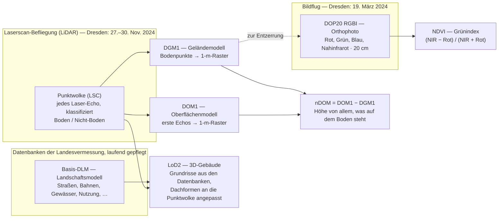

# Woher die Daten kommen

*English: [Where the data comes from](../en/data-sources.md)*

Alles im Viewer ist aus **offenen Daten** abgeleitet: Datensätzen, die eine
Behörde oder eine Freiwilligen-Community zur freien Nutzung
veröffentlicht. Nichts wurde für dieses Projekt selbst vermessen oder von
Hand gezeichnet. Diese Seite listet jeden Datensatz, wo er heruntergeladen
wurde, was er gut kann, wo er schwächelt und unter welcher Lizenz er
verwendet werden darf. Die Abkürzungen erklärt das [Glossar](./glossary.md).

## Die Anbieter

**GeoSN** — das *Landesamt für Geobasisinformation Sachsen*, die
Landesvermessung. Es stellt Gelände- und Oberflächenmodell, das
3D-Gebäudemodell, das Landschaftsmodell und die Luftbilder als kostenlose
Downloads auf seinem Portal für offene Geodaten bereit,
[geodaten.sachsen.de](https://www.geodaten.sachsen.de/). Alle sind in
dieselben **2 km × 2 km großen Kacheln** geschnitten, weshalb auch der
Viewer in Kacheln denkt. Welche Kacheln er zeigt, steht an einer einzigen
Stelle, der Standort-Konfiguration `sites/dresden.ts`: die fünfzehn Kacheln
(die erste ist die, auf der du startest) und die Aussichtspunkte; die
Quellenvermerke kommen vom Anbieter.

**Andere Orte, andere Anbieter.** Jedes Bundesland hat seine eigene
Landesvermessung, und der Viewer kann fünf davon nutzen: das GeoSN für
Dresden, Leipzig, Meißen und Grimma; **Geobasis NRW** für Unna; die
**Bayerische Vermessungsverwaltung (LDBV)** für München; den **LGV** in
Hamburg; und die **Senatsverwaltung für Stadtentwicklung** in Berlin. Sie
veröffentlichen dieselben Arten von Datensätzen in anderem Zuschnitt —
1-km-Kacheln, ein Archiv für die ganze Stadt, Luftbilder ohne Infrarotkanal
—, und ein kleiner Adapter je Amt schneidet sie auf die 2-km-Kacheln des
Viewers zu. Hamburg und Berlin veröffentlichen das Landschaftsmodell nicht
in der Form, die der Viewer liest; dort kommen die Bodenfarben aus
OpenStreetMap — und ebenso Gleise und Brücken: Die Bahnstrecken und
Brückenwege aus OpenStreetMap springen ein, die Höhe jedes Brückendecks
wird weiter im Oberflächenmodell gemessen. Münchens Luftbilder haben
keinen Infrarotkanal, deshalb wird die Farbe seiner Bäume und Wiesen
stattdessen aus den sichtbaren Farben des Bildes berechnet (siehe NDVI
unten). Und wo das Material eines Gebäudes nicht erfasst ist, übernimmt es
das seiner Nachbarschaft: In einer Straße erfasster Backsteinhäuser wird
es in Backstein gezeichnet, sonst in Putz — so erscheinen Hamburgs
Klinkerviertel in Backstein, ohne dass jemand das für die ganze Stadt
festlegen muss. Eine Bereitstellung zeigt jede Stadt, mit deren Daten sie
gebaut wurde, jede unter ihrer eigenen Adresse (`/dresden`, `/leipzig`, …),
und die Startseite listet sie auf; die Liste der Ämter mit ihren Lizenzen
steht in `sites/providers.ts`. Welche Stadt was aus welcher Quelle zeichnet
— und wo ein Ersatz einspringt, weil ein Land oder eine Stadt etwas nicht
offen veröffentlicht —, zeigt die Tabelle
[Quellen nach Stadt](./sources-by-city.md).

**OpenStreetMap (OSM)** — die von Freiwilligen gepflegte Weltkarte. Sie
füllt Lücken, die die amtlichen Datensätze lassen: Straßenlampen,
Bänke und andere Stadtmöbel, Bahnsteige, Stützmauern mit Höhen, den Tragwerkstyp von Brücken, die
Form von Brunnenbecken und die Bäume in Höfen und Gärten, die das
Stadtbaumkataster nicht führt.

**Wikidata** — die freie Wissensdatenbank hinter Wikipedia. Für benannte
Brücken sagt sie, welcher Bauart sie sind (Bogen-, Hänge-, Fachwerkbrücke
…) und oft ihre größte Spannweite. Sie nennt auch die **Wahrzeichen**
jeder Stadt: die Bauwerke mit Wikipedia-Artikeln, geordnet danach, in wie
vielen Sprachen über sie geschrieben wird. Der Viewer markiert die
Gebäude, die eines sind, listet die zwölf bekanntesten der Stadt im Feld
und nimmt das Material, das Wikidata nennt (Glas, Backstein, Stein …),
wo OpenStreetMap keines kennt. Bei Denkmälern und Skulpturen sagt sie
oft, woraus sie sind — der Goldene Reiter ist Kupfer unter Blattgold —,
und der Viewer färbt sie in einem gedämpften Ton dieses Materials, wo
OpenStreetMap keines nennt.

**Landeshauptstadt Dresden** — die Stadt selbst. Ihr Stadtbaumkataster
verzeichnet rund 124.000 städtische Bäume mit Art, Höhe,
Kronen- und Stammdurchmesser. Der Viewer pflanzt diese Bäume dort, wo sie
wirklich stehen, mit gemessener Höhe, Krone und Stamm, einer Kronenform,
die der Art folgt, und dem Jahr der Art: wann sie austreibt, wie sie sich
im Herbst färbt und wann sie kahl ist.
Aus derselben Quelle kommen zwei Verkehrsdatensätze, die der Viewer als
**zuschaltbare Datenebenen** zeigt (Seitenleiste, *Erkunden* →
*Verkehrsdaten*; beim Start aus): die gezählten Kraftfahrzeuge je
Straßenabschnitt und die Rad-Dauerzählstellen, deren Zählwerte der Browser
live bei der Stadt abruft.

**DELFI und gtfs.de** — DELFI e.V. sammelt die Fahrpläne aller
Verkehrsverbünde Deutschlands (hier den des VVO mit den Linien der DVB);
gtfs.de stellt sie im verbreiteten GTFS-Format bereit. Daraus fahren die
Straßenbahnen der dritten Datenebene, so wie der Fahrplan sie fahren lässt.

**Hamburg, Leipzig und Berlin** veröffentlichen Verzeichnisse derselben
Art, die genauso gelesen werden. Hamburgs Straßenbaumkataster (die
Umweltbehörde BUKEA) führt die Straßenbäume mit Art, Kronendurchmesser,
Stammumfang und Pflanzjahr, aber **ohne Höhe**: Der Viewer misst die Höhe
jedes Baums im Oberflächenmodell (Oberfläche minus Gelände am höchsten
Punkt seiner Krone), wo sie zur eingetragenen Krone passt — bei mehr als
vier von fünf Bäumen —, und leitet sie sonst aus der Krone ab. Leipzigs
Baumkataster (Amt für Stadtgrün und Gewässer) führt Straßen- und
Parkbäume mit Höhe, Krone und Stamm; gefällte Bäume bleiben weg. Berlins
Baumbestand (Geoportal Berlin) führt Straßen- und Anlagenbäume ebenso;
Berlin ist eingerichtet, aber noch nicht gebaut.

## Die Datensätze im Überblick

| Datensatz | Auf Deutsch | Anbieter | Wofür der Viewer ihn nutzt |
|---|---|---|---|
| **DGM1** | Geländemodell, 1-m-Raster | GeoSN | Der Boden; jedes Objekt darauf absetzen; Brückenwiderlager-Höhen und der Wasserspiegel unter der Fahrrinne; Eingang für Baumhöhen |
| **DOM1** | Oberflächenmodell, 1-m-Raster (Gelände *plus* alles, was darauf steht) | GeoSN | Baumhöhen (Oberfläche minus Gelände); die Fahrbahnhöhe von Brücken und was über ihr steht: Fachwerk, Pylone, Bögen; Schornsteine, Türme und Masten und Gebäude, die das 3D-Modell noch nicht führt — nur wo OpenStreetMap sie benennt; die Dachform eines Wahrzeichens, das das 3D-Modell flach zeichnet; die Dächer der Gebäude, die das 3D-Modell grob verfehlt; die Gauben auf geneigten Dächern; das Vordach über einer Ladenfront |
| **LoD2** | 3D-Gebäudemodell mit Dachformen | GeoSN | Grundriss, Höhe, Dachform und Attribute jedes Gebäudes (seine Brücken-Platten lässt der Viewer weg) |
| **Basis-DLM** | Digitales Landschaftsmodell (die Landnutzungskarte) | GeoSN | Bodenfarben, Gewässerumrisse, Hecken und Baumreihen, Bahnflächen und Gleise, Brückenumrisse, Denkmäler und Brunnen (Lage und amtlicher Name) |
| **DOP** | Digitales Orthophoto, 20 cm, mit Nahinfrarot-Kanal | GeoSN | Dachfarben; Vegetationsgrün für Baumkronen und Wiesen |
| **LSC** | Laserscan-Punktwolke | GeoSN (Dresden, Meißen, Grimma, Leipzig), Geobasis NRW (Unna), Bayerische Vermessungsverwaltung (München) | Heckenhöhen; Bäume in Höfen und Gärten; die Gartenlauben, Schuppen und Containerbauten, die dem 3D-Gebäudemodell fehlen |
| **OSM** | OpenStreetMap | Freiwillige | Straßenlampen, Hecken, Stadtmöbel (Bänke, Papierkörbe, Fahrradbügel, Poller, Briefkästen, Wartehäuschen und Haltestellenschilder, Litfaßsäulen, Ampeln, Hydranten, Uhren, Trinkbrunnen), Spielplätze und ihre Geräte, Bahnsteige, Mauern, Felskanten, Treppen, Brücken-Tragwerkstypen und Durchfahrtshöhen, Brunnenbecken, womit Straßen, Gehwege und Parkplätze belegt sind, Sportplätze, Läden und Cafés im Erdgeschoss, Baudenkmale, Zäune, Geländer und Tore, Fahrbahnmarkierungen (Überwege, Haltlinien, Rad- und Mittellinien), Kleingärten, Obstwiesen und Weinberge, Bäume, die das Stadtbaumkataster nicht führt, Straßenbahngleise mit ihren Oberleitungsmasten, Anlegestellen, Buhnen und Fährrouten auf der Elbe, Kirchen und Glockentürme (für die verborgene Klangkulisse), woraus Gebäude gebaut sind und ihre Wand- und Dachfarben, Schornsteine, Türme und Masten und die Gebäude, die für das 3D-Modell zu neu sind |
| **Wikidata** | freie Wissensdatenbank | Freiwillige | Bauart und Hauptspannweite benannter Brücken; die Wahrzeichen der Stadt (die Liste im Feld) und ihr Fassadenmaterial; woraus Denkmäler sind |
| **Mapillary** | Straßenfotos und die darin erkannten Objekte | Fotos der Mitwirkenden, Erkennung durch Mapillary | Nur Dresden: Straßenlampen und Papierkörbe, die OpenStreetMap nicht kennt — etwa 6 700 Lampen und 1 700 Papierkörbe auf den fünfzehn Kacheln. Mapillary verortet jedes Objekt, das es auf mehreren Fotos erkennt; der Viewer behält die, bei denen in 8 m keine Lampe bzw. kein Papierkorb aus OpenStreetMap steht, die seit 2020 gesehen wurden und nicht in einem Gebäude liegen, und rückt sie von der Fahrbahn an den Bordstein. Ihre Lage ist ein paar Meter ungenau, und eine Lampe, die es aus zwei Fahrten doppelt verortet, steht nur einmal (mindestens 7 m Abstand). Auf Nachfrage sagt eine Lampe oder ein Papierkorb, ob sie von Mapillary stammt. Die Rundumfotos sagen außerdem je Gebäude (knapp 2 000 in Dresden, vor allem an den Straßen der Innenstadt), wie unruhig und wie dunkel eine Straßenfassade ist und ob ein Ladenschild daran hängt; der Ton macht daraus ein feines Relief, einen etwas dunkleren oder helleren Ton und einen Ladensockel (*Fassadenbild*). Zwei weitere Messungen geben die Fenster. Das Schaufenster: auf allen fünfzehn Kacheln werden die Rundumfotos noch einmal entlang des Erdgeschosses jeder Wand vermessen, und wo zwei Fotos sich über breite Öffnungen einig sind — oder eine moderne Ladenzeile fast durchgehend Glas zeigt —, bekommt das Haus dort Schaufenster als weiche Nischen: das Glas in einem gedämpften, etwas dunkleren und kühleren Ton als die Wand, leicht spiegelnd, in einer flachen Laibung mit gerundeten Kanten, ohne Sprossen, mit Pfeilern dazwischen und einem Schildband, wo ein Ladenschild gesehen wurde (etwa 1 000 Wände an 780 Gebäuden). Wo das Oberflächenmodell (DOM1) über einer solchen Ladenfront ein flaches Vordach zeigt, wie an den DDR-Ladenpavillons der Hauptstraße, wird auch das Vordach gezeichnet, und das Glas läuft darunter durch. Ein Laden, den OpenStreetMap kennt und kein Foto zeigt, bekommt kein Fenster: ein Kartenpunkt sagt, dass dort ein Laden ist, nicht wo seine Fenster sind. Der Fensterrhythmus: die Rundumfotos werden über jeder Wand oberhalb des Erdgeschosses noch einmal vermessen, auf das, was nicht davon abhängt, wo genau die Kamera stand — wie weit die Fensterachsen auseinanderliegen und wie regelmäßig, die Geschosshöhe, Breite und Proportion der Fenster, Schmuck. Ein Merkmal wird nur genutzt, wo zwei getrennte Fahrten an denselben Wänden sich darüber einig sind (eine Rangkorrelation von mindestens 0,6); Faschen, Sohlbankgesimse, Lisenen und Sockel waren es nicht. Das ergibt einen gemessenen Rhythmus für etwa 590 Wände an 530 Gebäuden. Jedes andere Haus leiht sich den Rhythmus des nächsten gemessenen in 150 m mit derselben Dachform und etwa seiner Traufhöhe (die Häuser eines Blocks stammen meist aus einer Zeit) oder nimmt den seines Typs — ein Bürgerhaus mit hohen Geschossen, ein Mietshaus, ein kleines Haus, ein Flachdachblock —, dessen Werte die Mediane sind, die die Fotos an Dresdens Häusern dieses Typs gemessen haben; in den anderen Städten nimmt jedes Haus den seines Typs. Die Fenster sind in die Wand gezeichnet, nicht modelliert: eine Öffnung, in die das Auge hineinsieht, die Laibungen im Putz der Wand, der Grund dunkler und kühler, eine schmale Sohlbank darunter — kein Glas, keine Scheiben, keine Sprossen —, mittig auf jeder Wand, eine Reihe je Geschoss, ihre Höhe nach dem Geschoss. Keine an einer Brandwand, neben einer Tür, über einer Ladenfront, an einer Kirche, einem Schloss, Theater, Museum oder einer Halle und an einer Glas- oder Metallfassade |
| **Stadtbaumkataster** | Das Baumverzeichnis der Stadt | Landeshauptstadt Dresden | Straßen- und Parkbäume an ihrem vermessenen Standort, mit Höhe, Kronenbreite, Stamm, einer Kronenform nach der Art und deren Herbstfarbe und Laubfall; auf Nachfrage Art, Standort, Baumnummer und Alter |
| **Straßenbaumkataster / Baumkataster / Baumbestand** | Die Baumverzeichnisse von Hamburg, Leipzig und Berlin | Freie und Hansestadt Hamburg (BUKEA); Stadt Leipzig (Amt für Stadtgrün und Gewässer); Geoportal Berlin | Wie das Dresdner; Hamburgs Bäume bekommen ihre Höhe aus dem Oberflächenmodell |
| **Verkehrsmengen** | Kfz je Tag und Straßenabschnitt | Landeshauptstadt Dresden | Datenebene *Kfz-Verkehr*: gläserne Ströme je Fahrtrichtung, breiter, höher und kräftiger gefärbt, wo mehr fährt |
| **Tagesgang** | Anteil jeder Stunde am Tagesverkehr | Freie und Hansestadt Hamburg | die Uhrzeit der Datenebene *Kfz-Verkehr* |
| **Verkehrsmengen anderer Städte, Straßenverkehrszählungen** | Kfz je Tag und Abschnitt in Berlin und Hamburg; die Zählungen der Länder Sachsen und NRW auf ihren Straßen | Berlin (SenMVKU); Hamburg (BVM); Freistaat Sachsen (LASuV); Straßen.NRW | die Datenebene *Kfz-Verkehr* dieser Städte, beide Richtungen zusammen gezählt |
| **Hamburger Radzählnetz** | Fahrräder der letzten Stunde, live | Freie und Hansestadt Hamburg | die Datenebene *Radverkehr (live)* in Hamburg |
| **Rad-Dauerzählstellen** | Fahrräder der letzten Stunde, live | Landeshauptstadt Dresden | Datenebene *Radverkehr (live)*: je Zählstelle zwei Glassäulen, eine je Richtung |
| **GTFS-Fahrplan** | Soll-Fahrplan des Nahverkehrs | DELFI e.V. über gtfs.de | Datenebene *Straßenbahnen (Fahrplan)*: jede Bahn der DVB zur Szenenzeit auf ihrem Gleis |

Im selben Portal verfügbar, aber **noch nicht genutzt**: die Flurstücke
(**ALKIS**) und die topographische Grundkarte (**DTK**). Der Abschnitt
„Planned“ des [Transformations-Verzeichnisses](../../transformations.md)
(englisch) hält fest, was sie beitragen könnten.

## Wie die amtlichen Datensätze entstehen

Das meiste, was der Viewer zeigt, geht auf zwei Arten von Befliegungen
über der Stadt und auf die Datenbanken der Landesvermessung zurück. Das
Diagramm zeigt, wie die Produkte voneinander abhängen; die Steckbriefe
darunter liefern die Details.

```mermaid
flowchart LR
  subgraph LASER["Laserscan-Befliegung (LiDAR) — Dresden: 27.–30. Nov. 2024"]
    LSC["Punktwolke (LSC)<br/>jedes Laser-Echo, klassifiziert<br/>Boden / Nicht-Boden"]
  end
  LSC --> DGM["DGM1 — Geländemodell<br/>Bodenpunkte → 1-m-Raster"]
  LSC --> DOM["DOM1 — Oberflächenmodell<br/>erste Echos → 1-m-Raster"]
  DGM --> NDOM["nDOM = DOM1 − DGM1<br/>Höhe von allem, was auf dem Boden steht"]
  DOM --> NDOM
  subgraph PHOTO["Bildflug — Dresden: 19. März 2024"]
    DOP["DOP20 RGBI — Orthophoto<br/>Rot, Grün, Blau, Nahinfrarot · 20 cm"]
  end
  DGM -. "zur Entzerrung" .-> DOP
  DOP --> NDVI["NDVI — Grünindex<br/>(NIR − Rot) / (NIR + Rot)"]
  subgraph OFFICE["Datenbanken der Landesvermessung, laufend gepflegt"]
    DLM["Basis-DLM — Landschaftsmodell<br/>Straßen, Bahnen, Gewässer, Nutzung, …"]
  end
  DLM --> LOD["LoD2 — 3D-Gebäude<br/>Grundrisse aus den Datenbanken,<br/>Dachformen an die Punktwolke angepasst"]
  LSC --> LOD
```

## Datensatz für Datensatz

Jeder Steckbrief beantwortet dieselben Fragen: Wofür steht die Abkürzung,
wie werden die Daten erhoben, wie oft aktualisiert, wie genau sind sie,
wofür eignen sie sich allgemein, wofür nutzt sie der Viewer, und wo haben
sie Schwächen. Angaben mit „laut GeoSN“ stammen aus der
Produktdokumentation des Anbieters.

### DGM1 — das Geländemodell

| | |
|---|---|
| **Steht für** | *Digitales Geländemodell 1* — Geländemodell mit 1 m Gitterweite. „Gelände“ meint den nackten Boden: Gebäude, Brücken und Vegetation sind entfernt. |
| **Wie erhoben** | Flugzeuggestütztes Laserscanning (LiDAR): Ein Flugzeug tastet den Boden mit Laserimpulsen ab und zeichnet jedes Echo auf. Die entstehende Punktwolke wird in Boden- und Nichtbodenpunkte klassifiziert; die Bodenpunkte werden in ein regelmäßiges Raster interpoliert. Lücken unter Gebäuden werden mit interpolierten Punkten gefüllt. |
| **Aktualisierung** | Gebietsweise nach jeder neuen Laserbefliegung. Für Dresden stammte der vorige Scan von 2016, der aktuelle vom 27.–30. November 2024. |
| **Auflösung und Genauigkeit** | 1-m-Zellen, Höhe in der Zellenmitte. Höhengenauigkeit bis ±0,15 m, Lagegenauigkeit ±0,30 m bei 95 % Sicherheit, laut GeoSN. |
| **Allgemein geeignet für** | Jede Frage „wie hoch liegt der Boden hier“: Geländeanalysen, Hochwasser- und Abflussmodelle, Sichtbarkeitsstudien, Hangneigungskarten, Entzerrung von Luftbildern. |
| **Hier genutzt für** | Den Boden selbst — ein Dreiecksnetz, das jeden Punkt des 1-m-Rasters auf 15 cm genau trifft (25 cm auf den äußeren Kacheln), dicht, wo der Boden sich biegt, und grob, wo er flach ist, sodass Mauern und Böschungen ihre Kanten behalten; das Absetzen von Gebäuden, Bäumen, Lampen und Spieler darauf; die Widerlagerhöhen von Brücken; den Grundterm der Baumhöhen. |
| **Stärken** | Die wahre Form des Bodens, einschließlich Flussufern, Dämmen und den Terrassen der Altstadt, auf wenige Zentimeter. |
| **Schwächen** | Alles Senkrechte: Eine gelaserte Mauer wird zu einer steilen, ein bis zwei Meter breiten Rampe, nie zu einer senkrechten Wand — und sobald der Viewer das 1-m-Raster auf sein 2-m-Netz umrechnet, „verschwinden“ monumentale Mauern wie die Brühlsche Terrasse in einer etwa 3 m breiten, sanften Böschung. Brücken sind per Definition entfernt, ein Deck aus diesem Modell würde auf den Flussgrund sinken. Der Viewer behebt beides mit anderen Quellen. |
| **Format und Download** | GeoTIFF, 2000 × 2000 Pixel als 32-Bit-Gleitkommazahlen, 13,6 MB je 2-km-Kachel, mit `.tfw`-Weltdatei und einer `_akt.csv` mit dem Erfassungsdatum. Höhen in Metern über Normalhöhennull (**DHHN2016**). [Digitale Höhenmodelle](https://www.geodaten.sachsen.de/downloadbereich-digitale-hoehenmodelle-4851.html). |

Sonderrolle: Dies ist der einzige Rohdatensatz, der ins Repository
eingecheckt ist, weil der Build-Schritt ihn direkt liest. Siehe
[Der Weg der Daten](./data-journey.md).

### DOM1 — das Oberflächenmodell

| | |
|---|---|
| **Steht für** | *Digitales Oberflächenmodell 1* — Oberflächenmodell mit 1 m Gitterweite. „Oberfläche“ meint das Erste, was der Laser trifft: Dächer, Baumwipfel, Brückendecks, parkende Lastwagen. |
| **Wie erhoben** | Dieselbe Laserbefliegung wie das DGM1; statt der Bodenpunkte werden die ersten Echos der Punktwolke ins Raster interpoliert. |
| **Aktualisierung** | Zusammen mit dem DGM1; für diese Kacheln identische Daten (27.–30. November 2024). |
| **Auflösung und Genauigkeit** | 1-m-Zellen; dieselbe Höhengenauigkeit wie die Punktwolke (bis ±0,15 m), laut GeoSN. Eine Zelle am Rand einer Krone oder eines Dachs kann beide Höhen tragen. |
| **Allgemein geeignet für** | Gebäude- und Baumhöhen (als DOM − DGM, das **nDOM**), Kronenkartierung, Unterscheidung von Laub- und Nadelbäumen (durch kahle Kronen scheint der Boden durch), Auffinden von Brücken und abgesenkten Einfahrten, Solardach-Studien. |
| **Hier genutzt für** | `DOM1 − DGM1` ergibt die Höhe von allem, was auf dem Boden steht. Wo das Landschaftsmodell Wald, Gehölz oder Park sagt, setzt der Viewer je 7-m-Zelle einen Baum an den höchsten Punkt, mit dieser Höhe. Brücken bekommen daraus die Höhe ihrer Fahrbahn und alles, was über ihr steht: Entlang der Brückenachse zeigt der höchste Punkt über dem Deck das Fachwerk des Blauen Wunders zwischen seinen zwei Pylonen und den Stahlbogen der Waldschlößchenbrücke; Lampen und Autos werden als zu kurz herausgefiltert. Es ist außerdem die einzige verlässliche Quelle dafür, wie ein Denkmal oder die Skulptur eines Brunnens *aussieht*: Sein gemessener Körper (die Figurengruppen am Albertplatz sind 3,7 m hoch und etwa 4 × 5 m groß) wird zu einer weichen Tonform in dieser Größe und diesem Umriss. Die kleinen Bauten, die dem 3D-Modell fehlen, stecken in derselben Oberfläche, werden aber aus der Punktwolke selbst in 0,5 m gelesen, wo jedes Echo auch sagt, ob sich der Impuls geteilt hat (siehe LSC). Was höher steht als das 3D-Gebäudemodell — die Oberfläche minus das Höhere von Boden und LoD2-Dach —, kommt nur dazu, wo OpenStreetMap sagt, was es ist: Ein eingetragener Schornstein, Turm, Mast, Wasserturm oder Leuchtturm wird eine runde Säule in der gemessenen Höhe (der 48 m hohe Schornstein der Lindenbrauerei in Unna), ein eingetragenes Gebäude, das das 3D-Modell noch nicht führt, ein Block in der gemessenen Höhe. Unbenannte Spitzen bleiben weg: In der Leipziger Innenstadt waren Dutzende davon, 50–95 m hoch, die Baukräne des Flugtags. Ein Turm, den das 3D-Modell schon zeichnet — der einer Kirche, eines Schlosses —, kommt nicht ein zweites Mal dazu. Auf einem Wahrzeichen kommt ein Dach, das das 3D-Modell flach zeichnet oder zu früh abschneidet, die Oberfläche aber geformt zeigt, als die gemessene Oberfläche selbst dazu, Meter für Meter und leicht geglättet: Die Wellenkämme der Elbphilharmonie rollen über ihrem 96 m hohen Block, und ein Turmhelm, den das Modell bei 137 m enden lässt (die Stadtkirche in Unna), steigt bis zu seiner gemessenen Spitze bei fast 178 m. Und wo das Dach des 3D-Modells diese Oberfläche grob verfehlt — mehr als 2 m daneben auf 40 % der Dachfläche —, baut der Viewer das Dach daraus neu, im eigenen Grundriss des Gebäudes und in der gemessenen Form: flach, wo die Oberfläche flach ist, und wo sie sich über eine breite Fläche neigt oder wölbt — die Bogenhalle des Hauptbahnhofs, ein großes Walmdach — als die gemessene Oberfläche selbst, leicht geglättet; eine schmale Schräge bleibt eine Stufe oder zwei, das wirkt mehr wie ein Gebäude als der unscharfe Rand des Scans. Wo das 3D-Modell die richtige Form hat und nur in der falschen Höhe steht, bleibt es stehen: Die modellierte Kuppel der Frauenkirche liegt rund 5 m tiefer als das Oberflächenmodell, ist aber die richtige Kuppel (siehe LoD2, Schwächen). Auch die Gauben auf den geneigten Dächern kommen daher: Wo die Oberfläche über ein paar Quadratmeter einen Meter oder mehr über einem schrägen Dach des 3D-Modells steht — kompakt, niedriger als der First und ohne Baum in der Nähe —, setzt der Viewer eine Gaube dieser Größe und Höhe auf, zur Traufe gewandt, in den Farben des Hauses und ohne Fenster. Und über einer Ladenfront, die die Straßenfotos gefunden haben, ist eine ebene Fläche 2,6–6,5 m hoch, die 1,5–8 m aus der Wand ragt und dann abbricht, ein Vordach: die DDR-Ladenpavillons an der Hauptstraße tragen ihr Flachdach rund 4 m weit über den Gehweg. Der Viewer zeichnet diese Platte mit ihrer hohen Kante in der Farbe des Hauses und lässt das Schaufensterglas darunter durchlaufen; die Stützen, die sie tragen, sieht das Oberflächenmodell nicht, sie werden nicht gezeichnet. |
| **Stärken** | Gemessene Höhen für jeden Baum und jedes Dach der Stadt auf einmal, in echter Draufsicht ohne die seitliche Verkippung eines Fotos. |
| **Schwächen** | Es kann einen Baum nicht von einem Gebäude oder Bus unterscheiden; die Baumplatzierung ist deshalb auf Vegetationsklassen beschränkt und von Straßen, Gleisen und Wasser ausgeschlossen. Bewuchs unter 3 m wird ignoriert; ein Meter ist zu grob für einzelne Sträucher. Ein November-Scan zeigt Laubbäume ohne Blätter, ihre Kronen sind in den Daten dünner als im Sommer. |
| **Format und Download** | GeoTIFF wie das DGM1, dieselbe Portalseite. Nur offline genutzt; die Rohdatei ist nicht eingecheckt und erreicht den Browser nie. |

### LSC — die Laserscan-Punktwolke

| | |
|---|---|
| **Steht für** | *Laserscandaten* — die rohe Punktwolke, aus der die beiden Höhenmodelle berechnet werden. |
| **Wie erhoben** | Die Laserbefliegung selbst; jedes Echo ist ein Punkt mit Lage, Höhe und Intensität, klassifiziert in Boden und Nicht-Boden. |
| **Aktualisierung** | Wie die Höhenmodelle (27.–30. November 2024 für diese Kacheln). |
| **Auflösung und Genauigkeit** | Unregelmäßige Punkte, mehrere je Quadratmeter; ±0,15 m in der Höhe, ±0,30 m in der Lage, laut GeoSN. |
| **Allgemein geeignet für** | Alles, was die Raster wegvereinfachen: einzelne Baumkronen, Dachkanten, Mauerflächen, Freileitungen. |
| **Hier genutzt für** | Die Höhe der in OpenStreetMap kartierten Hecken sowie Bäume in Höfen und Gärten, die die Landnutzungskarte nicht als Grün führt (außer dort, wo das Stadtbaumkataster schon einen Baum hat). Hecken und Sträucher, die nur der Scan findet, werden nicht gezeigt: etwa ein Drittel davon waren Ränder von Baumkronen. Dazu die kleinen Bauten, die das 3D-Gebäudemodell auslässt — Garten- und Kleingartenlauben, Schuppen, Carports, Containerbauten, Pavillons, etwa 6 600 auf den fünfzehn Kacheln: Was 2–6,5 m über dem Boden steht, außerhalb jedes LoD2-Gebäudes, je Impuls nur ein Echo zurückwirft und oben flach oder gleichmäßig geneigt ist, wird zu einem einfachen Quader mit diesem Grundriss und dieser Höhe, im selben Ton wie die übrigen Gebäude. Die Befliegung hat die gerade eröffneten Weihnachtsmärkte erfasst (der Striezelmarkt begann am 27. November 2024): Aus Fußgängerzonen und Plätzen, Marktplätzen, Baustellen und Parkplätzen, wie OpenStreetMap sie erfasst, wird nichts übernommen, und nichts in der Größe eines Transporters, außer OpenStreetMap kennt dort ein Gebäude. Dasselbe geschieht für Meißen, Grimma und Leipzig mit dem Scan von GeoSN (Meißen: 475 kleine Bauten und 6 449 Bäume, die die Kronenmaske auslässt) für Unna mit dem aus Nordrhein-Westfalen (*3D-Messdaten*) und für München mit den Laserpunkten aus Bayern (beflogen im Juni 2022, mit Laub); für Hamburg und Berlin wird kein Scan gelesen, dort gibt es nur die Hecken aus OpenStreetMap. Die Regeln wurden an der Dresdner Befliegung abgestimmt. |
| **Stärken** | Sieht unter 3 m und zwischen die Häuser, wo die Höhenraster und die Landnutzungskarte nichts sehen. Jeder Punkt weiß, wie hell sein Echo war und ob sich der Puls geteilt hat — hohe Bäume teilen ihn fast immer, Dächer fast nie. |
| **Schwächen** | Die Klassen trennen Vegetation nicht von Gebäuden, Autos oder Zäunen. Eine geschnittene Hecke teilt einen Puls selten, deshalb stützt sich der Viewer bei niedrigen Pflanzen stattdessen auf die Grünheit des (Frühjahrs-)Luftbilds; eine Hecke unter einer Baumkrone bleibt unsichtbar. Die Echo-Helligkeit ist zwischen den Scannern zweier Ämter nicht vergleichbar (NRW zeichnet sie auf einer 16-mal größeren Skala auf): Jeder Scan wird so skaliert, dass seine Bodenechos im Mittel so hell sind wie die des Dresdner Scans, an dem die Heckenregel abgestimmt wurde — eine Annahme (derselbe Asphalt, derselbe Rasen werfen bei jedem Scanner gleich viel zurück), an Unnas und Münchens Hecken noch nicht geprüft. Bayern sortiert seine Punkte anders — Gebäude in einer eigenen Klasse, Vegetation zusammen mit anderen „Objektpunkten“ —, deshalb werden seine Klassen zuerst in die sächsischen übersetzt. |
| **Format und Download** | Sachsen: LAZ je 2-km-Kachel, groß (≈380 MB für 60 Millionen Punkte); dieselbe Portalseite wie das DGM1. Nordrhein-Westfalen: *3D-Messdaten* auf [opengeodata.nrw.de](https://www.opengeodata.nrw.de/produkte/geobasis/hm/3dm_l_las/) (`hm/3dm_l_las`), LAZ je 1-km-Kachel (je ≈100 MB) mit denselben Klassen Boden / Nicht-Boden; die vier Dateien einer 2-km-Kachel werden zu einer zusammengefügt. Bayern: klassifizierte Laserpunkte auf [geodaten.bayern.de](https://geodaten.bayern.de/opengeodata/), LAZ je 1-km-Kachel (je ≈105 MB), ebenso zusammengefügt. Geladen nur auf Wunsch (`bun run fetch <Ort> --lsc`). |

### LoD2 — das 3D-Gebäudemodell

| | |
|---|---|
| **Steht für** | *Level of Detail 2* des *Digitalen 3D-Stadtmodells*: jedes Gebäude als einfacher Körper mit echtem Grundriss, gemessener Höhe und standardisierter Dachform (Flach-, Sattel-, Walm-, Mansarddach und weitere). LoD1 wären flache Klötze; LoD3 hätte Fassadendetail. |
| **Wie erhoben** | Automatisch von der Landesvermessung erzeugt: Die Grundrisse kommen aus ihren Kataster- und Landschaftsdatenbanken (ALKIS / ATKIS), Dachformen und Höhen werden an die Laser-Punktwolke angepasst. Seit 2021 kann das Produkt auch Brücken, Mauern, Türme, Windräder und Masten enthalten. |
| **Aktualisierung** | Eine Kachel wird neu erzeugt, wenn sich ihre Eingaben ändern; das landesweite Modell wurde zuletzt im August 2025 aktualisiert. Das Modell einer Kachel ist so alt wie seine Eingaben: Für diese Kacheln stammen die Dächer aus dem Laserscan von **2016**, die Grundrisse aus dem Basis-DLM von 2021 bzw. 2022 und der Boden aus dem DGM von 2016; das Modell selbst wurde 2023 (westliches Paar) bzw. 2024 (östliches Paar) erzeugt. Die Daten von 2025 in den Dateien sind Exportdaten, keine Erfassungsdaten. |
| **Auflösung und Genauigkeit** | Grundrisse in Katastergenauigkeit (Dezimeter); Dachhöhen in Lasergenauigkeit; Dachformen sind der nächstliegende Standardtyp, nicht das reale Dach. |
| **Allgemein geeignet für** | Stadtbild-Visualisierung, Verschattungs- und Solarstudien, Lärm- und Windmodelle, Geschoss- und Volumenzählung. |
| **Hier genutzt für** | Grundriss, Höhe, Dachform und Attribute jedes Gebäudes; die Grundrisse der Minikarte; das Abriss-Werkzeug; und was die Karte eines befragten Gebäudes darüber sagt — seine Kennung, die amtliche Nutzung, Dachform und -neigung, gemessene Höhe und Grundfläche und den Stand des Modells. Die kleinen Bauten, die ihm fehlen, kommen aus dem Laserscan (siehe LSC); Schornsteine, Türme, Masten und Gebäude, die jünger sind als das Modell, aus dem Oberflächenmodell, wo OpenStreetMap sie benennt (siehe DOM1). |
| **Stärken** | Exakte Silhouetten: Grundrisse und Dachformen sind stadtweit konsistent, Höhen gemessen. |
| **Schwächen** | Nichts unterhalb der Traufe: keine Fenster, Türen, Materialien oder Farben (der Viewer zeichnet eine Tür, wo OpenStreetMap einen Eingang erfasst, und Fenster im Rhythmus, den Straßenfotos gemessen haben, dem eines Nachbarn oder dem des Haustyps). Die Gebäudefunktion ist bei etwa 86 % der Gebäude „nicht spezifiziert“, die Geschosszahl nur bei wenigen Prozent gefüllt; der Viewer nimmt die Geschosse deshalb aus OpenStreetMap, wo sie eingetragen sind, und leitet die Geschossbänder sonst aus der gemessenen Höhe ab. Brücken stehen in den Kacheln als flache, 1 m dicke Platten in einer Höhe (Funktion `53001_1800`, „Bauwerk im Verkehrsbereich“) — der Viewer lässt sie weg und baut Brücken aus Landschaftsmodell und Oberflächenmodell. Ein Gebäude, das zu verwickelt für den Katalog der Dachformen ist, bekommt ein „Freiform“-Dach, und bei einem großen Komplex sind das oft wenige riesige schräge Flächen über dem ganzen Grundriss: Das Hotel Westin Bellevue an der Elbe, eine flach gedeckte Scheibe mit niedrigeren Flügeln und zwei Innenhöfen, stand unter einem zeltartigen Dach mit einer Spitze in der Mitte. Gebäude, die erst nach der Dachvermessung fertig wurden, stehen als 3-m-Platzhalter da. Der Viewer misst jedes Dach am Oberflächenmodell (DOM1) und baut die 886, die es grob verfehlen — etwa 2 % —, in der Form neu, die das Oberflächenmodell zeigt: flache Teile in ihren gemessenen Höhen, breite geneigte, gewölbte und überkuppelte Teile als die gemessene Oberfläche. |
| **Format und Download** | **CityGML** je 2-km-Kachel (auch DXF und Shape); das Projekt wandelt vor dem Einchecken in **CityJSON** um, eine kompakte JSON-Form desselben Standards (8–11 MB je Kachel). [Digitale 3D-Stadtmodelle](https://www.geodaten.sachsen.de/downloadbereich-digitale-3d-stadtmodelle-4875.html). |

### Basis-DLM — das Landschaftsmodell

| | |
|---|---|
| **Steht für** | *Digitales Basis-Landschaftsmodell*: die detaillierteste Stufe von **ATKIS**, dem *Amtlichen Topographisch-Kartographischen Informationssystem*, dem bundesweiten System amtlicher topographischer Daten. Eine Vektorkarte dessen, was den Boden bedeckt — Straßen, Wege, Bahnen, Gewässer, Wald, Landwirtschaft, Siedlung — plus Linienobjekte wie Hecken und Baumreihen, mit Attributen. |
| **Wie erhoben** | Von der Landesvermessung gepflegt auf Grundlage aktueller Orthophotos, des Geländemodells, örtlicher Messungen und Daten anderer Stellen (Straßen- und Bahnbetreiber, Kommunen). Objektarten und Attribute folgen einem bundesweiten Katalog (GeoInfoDok / AAA-Schema 7.1.2 seit 2025), sind also in jedem Bundesland gleich. |
| **Aktualisierung** | Zwei Rhythmen, laut GeoSN: eine *Grundaktualisierung*, bei der alle Objekte alle 3–5 Jahre überprüft werden, und eine *Spitzenaktualisierung*, bei der wichtige Objekte (Straßen, Bahnen und dergleichen) alle 3, 6 oder 12 Monate überprüft werden. Das Download-Paket wird quartalsweise erneuert. |
| **Auflösung und Genauigkeit** | Lagegenauigkeit ±3 m für die wesentlichen Linienobjekte (Straßen, Gleise, Flüsse) und ±15 m für alles Übrige, laut GeoSN. Straßen sind Achsen mit Breitenattribut, keine Flächen. |
| **Allgemein geeignet für** | Eine konsistente, attributierte Grundlage für GIS: Fachdaten daran anknüpfen, Routing und Navigation, Nutzungsstatistiken, Kartographie im Maßstab etwa 1:10 000 bis 1:25 000. |
| **Hier genutzt für** | Die Bodenfarben (neun Landnutzungsklassen), den Gewässerumriss, Hecken und Baumreihen, die Vegetationsmaske für die Baumplatzierung, Bahnflächen und Gleislinien mit Gleiszahl, Brückenachsen und, wo vorhanden, Deck-Umrisse; die Denkmäler, Gedenksteine, Säulen und benannten Brunnen (die Albertplatz-Brunnen „Stilles Wasser“ und „Stürmische Wogen“, der Neptunbrunnen, …) mit ihren amtlichen Namen. |
| **Stärken** | Amtliche Klassifizierung mit nützlichen Attributen: Straßenbreiten, Gleiszahl, Elektrifizierung, Brückennamen. |
| **Schwächen** | Alles Kleine oder Exakte: Straßen müssen nach Regel verbreitert werden, Bahnlinien kommen in kurzen Fragmenten und sagen nicht, ob sie unter der Erde verlaufen — der Viewer lässt einen Abschnitt weg, der mehr als 15 m an einem erfassten Tunnel entlangläuft (U- und S-Bahn unter dem Münchner Marienplatz, der Leipziger City-Tunnel), ein Gleis, das nur über einen hinwegführt, bleibt —, Deck-Umrisse gibt es vor allem für große Brücken, es gibt keine Straßenmöbel und keine Bahnsteige. Denkmäler sind nur Punkte mit Namen: keine Größe, keine Form, und nichts sagt, welches davon ein Brunnen ist — der Viewer nimmt die Form eines Denkmals aus dem Oberflächenmodell, wo sie messbar ist (sonst eine abstrakte Markierung), und das Becken eines Brunnens aus OpenStreetMap. Bei ±3 m kann ein Straßenrand eine Spur daneben liegen. |
| **Format und Download** | Landesweites Paket als Shape (oder NAS oder GeoPackage), etwa 1,2 GB; das Projekt schneidet jede Kachel daraus aus. [Basis-DLM](https://www.geodaten.sachsen.de/downloadbereich-basis-dlm-4168.html). |

### DOP20 RGBI — die Luftbilder

| | |
|---|---|
| **Steht für** | *Digitales Orthophoto*, 20 cm Bodenauflösung, Kanäle **R**ot, **G**rün, **B**lau und Nah**i**nfrarot. Ein Orthophoto ist eine Luftaufnahme, die über das Geländemodell entzerrt ist, sodass jedes Pixel an seiner wahren Kartenposition sitzt und Entfernungen wie in einer Karte gemessen werden können. |
| **Wie erhoben** | Ein Vermessungsflugzeug fotografiert Streifen des Landes mit einer kalibrierten Kamera (seit 2021 mit 80 % Längs- und 60 % Querüberdeckung); die Bilder werden orientiert, über das DGM entzerrt und zu 2-km-Kacheln zusammengesetzt. |
| **Aktualisierung** | Jährlich etwa die Hälfte des Landes, abwechselnd im Frühjahr und im Sommer, also jede Kachel ungefähr alle zwei Jahre, laut GeoSN. Diese Kacheln wurden am **19. März 2024** beflogen — eine Frühjahrsbefliegung ohne Laub. |
| **Auflösung und Genauigkeit** | 20 cm je Pixel; Standardabweichung eines Pixels von seiner wahren Lage ≤ 0,4 m; 8 Bit je Kanal; 10 000 × 10 000 Pixel je Kachel, laut GeoSN. |
| **Allgemein geeignet für** | Das Basisbild für Kartierung und GIS-Erfassung; Umwelt-, Land- und Forstwirtschaftsmonitoring (der Infrarotkanal trennt Vegetation von allem anderen); Verkehrs- und Stadtplanung. |
| **Hier genutzt für** | Die Farbe jedes Dachs (ein robuster Median über den Dachgrundriss, den Rand meidend) und den Grünindex **NDVI** aus Rot- und Infrarotkanal, der Baumkronen von trocken-salbeigrün bis satt-dunkelgrün tönt und Wiesen ebenso. |
| **Stärken** | Echte Farben und echtes Grün, wo das Foto senkrecht nach unten schaut. |
| **Schwächen** | Fassaden sind unsichtbar (ein Senkrechtbild sieht nur Dächer); hohe Gebäude kippen im Bild seitlich, weshalb Dachgrundrisse vor der Abtastung nach innen verkleinert werden; die Rohfarben wirken fahl und dunstig, was der Viewer mit einer farbtonerhaltenden Sättigungsanhebung korrigiert. Weil die Befliegung ohne Laub stattfand, sind Laubbäume im Bild kahl: Der Grünindex ist fast überall niedrig, und die Kronenfärbung zentriert ihn auf den Median, statt ihn als Absolutwert zu lesen. |
| **Format und Download** | GeoTIFF je 2-km-Kachel, etwa 380 MB für die 4-Kanal-Variante. [DOP-Downloadbereich](https://www.geodaten.sachsen.de/downloadbereich-dop-4826.html). Eingecheckt sind nur Derivate (Dachfarben, NDVI-Raster). |

### NDVI — der Grünindex (abgeleitet, nicht heruntergeladen)

| | |
|---|---|
| **Steht für** | *Normalized Difference Vegetation Index*: (Nahinfrarot − Rot) / (Nahinfrarot + Rot), je Pixel aus dem DOP berechnet. |
| **Warum es funktioniert** | Gesunde Blätter reflektieren Nahinfrarot stark und absorbieren Rot, also ist der Index auf saftiger Vegetation hoch und auf Dächern, Straßen und Wasser nahe null. |
| **Hier genutzt für** | Kronenfarbe und Wiesentönung; gebacken in ein 1024²-Raster je Kachel (etwa 2 m je Pixel). |
| **Vorbehalt** | Nur so gut wie das Aufnahmedatum: Ein Märzbild trennt Immergrüne und Gras von allem anderen, sagt aber wenig über das Sommerlaub. Wo das Luftbild keinen Infrarotkanal hat (Bayerns, für München), springt ein Ersatz aus den sichtbaren Farben ein — der *Green Leaf Index*, (2·Grün − Rot − Blau) / (2·Grün + Rot + Blau), so skaliert, dass er dort zum NDVI passt, wo es beide gibt (auf den Sommerbildern aus Nordrhein-Westfalen stimmt er bei 85 % der Pixel darin mit dem NDVI überein, ob ein Pixel grün ist). Er unterscheidet Grün von Grau gut, wie wüchsig eine Pflanze ist, weniger gut. |

### OSM — OpenStreetMap

| | |
|---|---|
| **Steht für** | *OpenStreetMap*, die freie Weltkarte, die seit 2004 von Freiwilligen gebaut wird. |
| **Wie erhoben** | Mitwirkende kartieren aus GPS-Spuren, Begehungen vor Ort und durch Abzeichnen von Luftbildern (einschließlich amtlicher Orthophotos, wo deren Lizenz es erlaubt) und beschreiben jedes Objekt mit freien Schlüssel-Wert-*Tags* wie `highway=street_lamp` oder `barrier=retaining_wall` + `height=9`. |
| **Aktualisierung** | Laufend: Änderungen sind binnen Minuten live. Download-Auszüge (Geofabrik) werden täglich neu gebaut; das Projekt liest einen solchen Auszug, nicht die Live-Datenbank. |
| **Auflösung und Genauigkeit** | Keine Garantie; in einer gut kartierten Stadt typischerweise meterngenaue Lagen. Vollständigkeit und Tag-Konsistenz schwanken von Straße zu Straße und Mapper zu Mapper. |
| **Allgemein geeignet für** | Dinge, die kein amtlicher Datensatz hat: Straßenmöbel, Points of Interest, Namen, informelle Wege, Tragwerkstypen; nahezu weltweite Abdeckung; schnell abzurufen. |
| **Hier genutzt für** | Lampenpositionen (`highway=street_lamp`), Stadtmöbel — Sitzbänke (`amenity=bench`, mit `backrest` und `direction`, wo eingetragen), Picknicktische, Papierkörbe, Fahrradbügel (mit `capacity`), Poller, Briefkästen und Wartehäuschen (`shelter=yes`) — eine Bushaltestelle ohne eines bekommt ihr „H“-Schild —, Litfaßsäulen (`advertising=column`), Ampeln (`highway=traffic_signals`, von der Haltlinie auf der Fahrbahn an den Bordstein auf der Seite des Verkehrs versetzt, dem sie gelten, `traffic_signals:direction`), Hydranten (`emergency=fire_hydrant`: ein Überflurhydrant, bei einem Unterflurhydranten nur sein kleines Hinweisschild), Uhren (`amenity=clock` an einem Mast oder an einer Wand) und Trinkbrunnen, Spielplatzumrisse (`leisure=playground`) mit den darauf eingetragenen Geräten (`playground=swing`, `slide`, `sandpit`, …) —, ohne eingetragene Richtung zur nächsten Straße oder zum nächsten Weg gedreht, Bahnsteige (`railway=platform`), Hecken (`barrier=hedge`), Stütz- und Stadtmauern, Böschungen und Felskanten (`barrier=*`, `man_made=embankment`, `natural=cliff`) mit ihrem `height`-Tag, Treppenläufe (`highway=steps` mit `width` und `step_count`, die Breite sonst aus einem `area:highway=steps`-Umriss), ob eine Brücke eine Bogenbrücke ist (`bridge:structure`, wenn Wikidata die Brücke nicht kennt), die Durchfahrtshöhe der Elbbrücken aus den Binnenschifffahrts-Zeichen (`seamark:bridge:clearance_height`: sie ergibt die Konstruktionshöhe des Decks, und über der Fahrrinne stehen keine Pfeiler), und Brunnen (`amenity=fountain`): der Umriss jedes Beckens, ob es ein Wasserspielplatz oder ein stilles Becken ist, und die vielen kleinen Brunnen, die das Landschaftsmodell nicht führt. Steht ein amtliches Denkmal in einem OSM-Becken, behält der Brunnen den amtlichen Namen. Denkmäler und Kunstwerke (`memorial=*`, `artwork_type=*`): ob ein Denkmal ein Standbild auf einem Sockel ist, eine Büste, eine freie Skulptur, eine Stele, ein Stein oder ein Obelisk — das amtliche Verzeichnis sagt es nicht —, dazu Künstler und Material für die Karte und ihre Farbe (ein gedämpfter Ton von Bronze, Sandstein, Granit …) und die Skulpturen in Parks, die das amtliche Verzeichnis nicht führt. Außerdem, womit eine Straße, ein Weg oder ein Parkplatz belegt ist (`surface=asphalt`, `paving_stones`, `sett`, … an den Wegen, `sidewalk:*:surface` an den Straßen) und in welche Richtung sie verläuft, damit Platten und Pflastersteine längs der Straße liegen; und wo Autos parken (`parking:left/right/both` mit Ausrichtung an den Straßen, `amenity=parking`-Parkplätze mit ihren Fahrgassen, erfasste Stellplätze), gezeichnet als markierte Stellplätze; und die Fußgängerinseln, Rasenflächen und Brunnen in Plätzen, die das Landschaftsmodell als eine einzige Straßenfläche führt (der Albertplatz). Und die Sportplätze (`leisure=pitch`, `leisure=track`): ihr Umriss, die Sportart (`sport=soccer`, `tennis`, `basketball`, …) und der Belag (`surface=grass`, `clay`, `tartan`, `sand`, …), gezeichnet als Spielfeld mit seinen Linien, dazu die Tore, Basketballkörbe und Netze darauf. Und an den Gebäuden: Läden und Lokale (`shop=*`, `amenity=cafe`, `restaurant`, `bar`, `pub`, `fast_food`, …) im Erdgeschoss (ohne `level` oder mit einem, das die 0 enthält), deren Schaufenster in der Dämmerung warm leuchten, und Baudenkmale (`heritage=*` an einem Gebäudeumriss), deren Fassade ganz leicht wärmer wird. Für die Karte eines befragten Gebäudes: der Name eines Gebäudes (`name` an seinem Umriss), seine Adresse (`addr:street` und `addr:housenumber`, am Umriss oder an Adresspunkten darin) und seine Geschosse (`building:levels`), die auch die Geschossbänder setzen: Jede Linie liegt dann auf einer echten Decke, wo die Zahl zur Wandhöhe passt. Und die Eingänge (`entrance=*`, im Erdgeschoss): Jeder wird zu einer Tür an der nächsten Wand des 3D-Gebäudemodells — ein heller Rahmen und ein dunklerer, zurückgesetzter Flügel darin, seine Größe nach der Art (`main`, `garage`, `service`, …) oder nach `width` und `height`, wo eingetragen. Ein Gebäude ohne erfassten Eingang bekommt keine Tür; keine wird erfunden. Dazu die Zäune und Geländer (`barrier=fence`, `handrail`) mit ihrer Bauart (`fence_type`: Holz wirkt etwas wärmer) und Höhe, gezeichnet als niedriges, ruhiges Band in einem sanften Ton statt Stab für Stab, und die Tore darauf (`barrier=gate`, `lift_gate`, …), die eine Lücke mit einem helleren Flügel oder einer Schranke in Zaun oder Gartenmauer schneiden. Baujahre (`start_date`) trägt OpenStreetMap hier an weniger als einem Prozent der Gebäude — zu wenig, um die Stadt danach zu färben. Und die Farbe auf der Fahrbahn: markierte Fußgängerüberwege (`highway=crossing` mit `crossing=marked`, `uncontrolled` oder `traffic_signals`, `crossing:markings`), gezeichnet als Zebrastreifen oder — an Ampeln — als die zwei unterbrochenen Linien einer Fußgängerfurt; Haltlinien vor Ampeln, deren Richtung eingetragen ist (`traffic_signals:direction`); Radfahrstreifen (`cycleway:right=lane`, …) und Mittellinien auf zweispurigen Hauptstraßen mit Gegenverkehr (`lanes`, `oneway`). Und das bebaute Land, das das Landschaftsmodell in Wiese oder Siedlungsfläche aufgehen lässt: Kleingartenanlagen (`landuse=allotments`), gezeichnet als kleine Gärten — Parzellen in sanften Grüntönen mit schmalen Wegen dazwischen, einigen Gemüsebeeten und Blumen; die Parzellen sind erfunden, weil OpenStreetMap hier keine einzelne darin erfasst —, Obstwiesen (`landuse=orchard`) mit einem Obstbaum alle 8 m oder dort, wo ein Baum eingetragen ist, und Weinberge (`landuse=vineyard`), deren Zeilen dem Hang entlang laufen (an den Loschwitzer Elbhängen). Und einzelne Bäume (`natural=tree`), wo das Stadtbaumkataster im Umkreis von 3 m keinen führt — in Höfen, im Zwinger und auf privatem Grund: ihre Art (`species`, `genus`) oder wenigstens, ob Laub- oder Nadelbaum (`leaf_type`), und ihre Höhe (`height`), wo eingetragen; ein kartierter Baum ohne beides bleibt weg. Und die Straßenbahn: jedes Gleis (`railway=tram`) in seiner eingetragenen Spurweite (`gauge`: 1 450 mm in Dresden, 1 458 mm in Leipzig, Normalspur, wo keine eingetragen ist), ob es über eine Brücke führt, und die Oberleitungsmasten (`power=catenary_mast`); das Gleisbett — Straße, Rasen oder Schotter — wird aus der Landnutzungskarte und dem Vegetationsindex gelesen, und wo kein Mast eingetragen ist, wird die Oberleitung zwischen den Fassaden der kartierten Gebäude (`building=*`) links und rechts aufgehängt, wie es Dresden in engen Straßen tut. Eine Straßenbahnhaltestelle (`railway=tram_stop`) bekommt ihr Haltestellenschild auf ihrem eingetragenen Bahnsteig. Auf der Elbe die Anlegestellen der Dampfer und die kleineren Stege (`man_made=pier`, schwimmende mit `floating=yes`), die Buhne (`man_made=groyne`) und die Fährrouten (`route=ferry`), gezeichnet als zarte Kielspur, die nur aus der Luft zu sehen ist. Und für die verborgene Klangkulisse die Kirchen (`building=church`, `cathedral`, `chapel` oder ein christlicher `amenity=place_of_worship`) und frei stehenden Glockentürme (`tower:type=bell_tower`, `building=bell_tower`): wo auf einer Kirche der Turm steht und wie hoch er ist, sagt das 3D-Gebäudemodell, und die Türme schlagen die volle Stunde. Und woraus die Gebäude gebaut sind und welche Farbe sie haben (`building:material`, `building:colour`, `roof:colour`, an einem Gebäude oder einem seiner Teile): Die Farbe wird in den Pastellton des Viewers übersetzt — ein rotes Haus wird ein staubiges Terrakotta, nie ein Signalrot —, das Material wählt eine Familie der Tonpalette (Backstein, Stein, Putz …), und Glas- und Metallfassaden werden etwas kühler und glatter, Glas mit einem blassen Himmelsschimmer im Streiflicht; Fenster werden keine gezeichnet. Die Dachfarbe aus dem Luftbild gewinnt weiterhin, wo es eine gibt. Ein Gebäude ohne erfasstes Material übernimmt das seiner Nachbarschaft: Sind die meisten erfassten Wände im Umkreis von 300 m aus Backstein, wird es in Backstein gezeichnet, sonst in Putz (Glas- und Metallfassaden zählen nicht mit). Und in Hamburg und Berlin, deren Vermessungsämter kein Landschaftsmodell in der Form veröffentlichen, die der Viewer liest, die Bahnstrecken (`railway=rail`, `light_rail`, `subway`, mit `tracks` und `electrified`), ihre Gleisbetten und die Brücken (`bridge=*` an Straßen, Wegen und Bahnstrecken, je Brücke zu einem Deck vereint, auf ihrem `man_made=bridge`-Umriss, wo einer erfasst ist); die Höhe jedes Decks kommt weiter aus dem Oberflächenmodell. Außerdem Schornsteine, Türme, Masten, Wassertürme und Leuchttürme (`man_made=*`, mit `height` und `diameter`, wo eingetragen) und Gebäudeumrisse: Sie sagen, was eine Höhe im Oberflächenmodell, die dem 3D-Gebäudemodell fehlt, eigentlich ist (siehe DOM1). Und das Merkmal `wikidata=*` an einem Gebäudeumriss, das sagt, welche Gebäude ein Wikidata-Wahrzeichen sind. |
| **Stärken** | Lesbare Tags für genau die Details, die die Landesvermessung nicht modelliert; die Brühlsche Terrasse existiert hier und sonst nirgends. |
| **Schwächen** | Nicht jede Lampe oder Bank ist erfasst, und nur wenige Bänke sagen, wohin sie blicken, Höhen fehlen oft (der Viewer nutzt Standardwerte je Mauertyp), Tags variieren. Freiwilligendaten müssen genannt werden (ODbL). |
| **Download und Lizenz** | Ein regionaler Auszug des ganzen Bundeslandes, `sachsen-latest.osm.pbf`, von [Geofabrik](https://download.geofabrik.de/europe/germany/sachsen.html) geladen (etwa 250 MB) und lokal gelesen, was Ratenlimits vermeidet und das Ergebnis reproduzierbar macht. Die heute eingecheckten Lampen-, Bahnsteig- und Brückentragwerk-Dateien sind älter: Sie wurden über die **Overpass-API**, einen Live-Abfragedienst, geholt, bevor die Bakes auf den Auszug umgestellt wurden, und wechseln beim nächsten Neubacken auf den Auszug. Lizenz: **ODbL**, Vermerk „© OpenStreetMap-Mitwirkende“. |

### Verkehrsmengen — die gezählten Kraftfahrzeuge

| | |
|---|---|
| **Steht für** | Die *Verkehrsbelegung* des Straßen- und Tiefbauamts: Kraftfahrzeuge je Tag (DTV, durchschnittlicher täglicher Verkehr) für jeden gezählten Straßenabschnitt zwischen zwei Kreuzungen, je Fahrtrichtung, mit dem Schwerverkehr. |
| **Wie erhoben** | Meist von Hand an einem Tag gezählt und auf den Durchschnittstag hochgerechnet; an einigen Straßen Induktionsschleifen oder Infrarotdetektoren mit Jahresmittelwerten; an wenigen ein geschätzter „Hilfswert“. |
| **Aktualisierung** | Abschnitt für Abschnitt, wenn neu gezählt wird; im Gebiet meist 2023–2026, einzelne Abschnitte bis 2010 zurück. |
| **Hier genutzt für** | Die Datenebene *Kfz-Verkehr*: je gezählter Richtung ein gläserner Strom auf der Fahrbahn, rechts der Fahrtrichtung, so breit und so hoch wie die Wurzel der Fahrzeuge je Tag, in fünf Stufen von Salbei über Pfirsich, Koralle und Rosé zu Weinrot getönt; Licht läuft in Fahrtrichtung hindurch, viel Schwerverkehr färbt ihn schieferblau. Die Ströme folgen der eingestellten Uhrzeit: Die Tageszahl wird nach dem *Tagesgang* (unten) auf die Stunde umgelegt — nachts schmal und fast dunkel, im Berufsverkehr voll und langsam. Durch das Glas sieht man die Straße dahinter, leicht gebrochen; aus der Luft wird es satter, damit die Ebene als Karte lesbar bleibt. Eine Straße ohne Zählung bleibt leer — es wird nichts geschätzt. |
| **Stärken** | Gemessen und je Richtung; fast alle Hauptstraßen gezählt. |
| **Schwächen** | Ein Tagesmittel, kein eigener Verlauf über den Tag (den liefert der Tagesgang, für alle Straßen derselbe); Zählungen aus verschiedenen Jahren nebeneinander; Nebenstraßen oft ungezählt. |
| **Download und Lizenz** | Der WFS der Stadt (`kommisdd.dresden.de`, Ebene `cls:L363` „Kfz/Tag“), je Kachel abgefragt. Lizenz `dl-de/by-2-0`, Vermerk „Landeshauptstadt Dresden“. |

### Tagesgang — wie sich der Verkehr über den Tag verteilt

| | |
|---|---|
| **Steht für** | Welcher Anteil der Fahrzeuge eines Tages in welcher Stunde fährt, je für Werktag, Samstag und Sonntag. |
| **Wie erhoben** | Gemessen von den Infrarotdetektoren Hamburgs an 38 innerstädtischen Hauptstraßen, stündlich, im September 2026: je Zählstelle die vollständigen Tage auf eins normiert und gemittelt, dann über die Zählstellen. Dresden veröffentlicht nur Tageswerte; die Form der Hauptstraßen einer deutschen Großstadt steht für ihre Stunden. |
| **Hier genutzt für** | Die Uhrzeit der Datenebene *Kfz-Verkehr*: Farbe, Größe und Licht eines Stroms folgen der Tageszahl seiner Straße mal dem Anteil der eingestellten Stunde. Die Seitenleiste nennt die Stunde und wie viel los ist. |
| **Stärken** | Gemessen, städtisch, mit Werktag, Samstag und Sonntag. |
| **Schwächen** | Eine Kurve für alle Straßen und aus einer anderen Stadt; Feiertage zählen als Werktage; ein Monat, keine Jahreszeiten. |
| **Download und Lizenz** | Hamburgs Urban Data Platform (SensorThings, `iot.hamburg.de`, `HH_STA_Verkehrsdaten_Kfz_Infrarotdetektoren`), einmal ausgewertet; die Werte stehen in `lib/city/traffic-hours.ts`. Lizenz `dl-de/by-2-0`, Vermerk „Freie und Hansestadt Hamburg“. |

### Verkehrszählungen der anderen Städte

| | |
|---|---|
| **Steht für** | Kraftfahrzeuge je Tag und Straßenabschnitt, beide Richtungen zusammen: in **Berlin** die *Verkehrsmengen 2023* (Werktagsmittel, Hauptstraßennetz), in **Hamburg** die *Verkehrsmengen 2019* der Hauptverkehrsstraßen (auf tausend gerundet, mit Schwerverkehrsanteil), für **Grimma** und **Meißen** die *Straßenverkehrszählung 2021* Sachsens, für **Unna** die *Verkehrswerte* von Straßen.NRW. |
| **Wie erhoben** | Die Städte rechnen Zählungen auf ihr Netz hoch; die Straßenverkehrszählungen der Länder zählen alle fünf Jahre an festen Stellen der Bundes-, Landes- und Kreisstraßen und rechnen auf den Jahresdurchschnittstag hoch. |
| **Hier genutzt für** | Die Datenebene *Kfz-Verkehr* dieser Städte, genauso dargestellt wie in Dresden; weil nur die Summe beider Richtungen bekannt ist, bekommt jede Richtung die Hälfte — das sagt auch die Seitenleiste. |
| **Stärken** | Amtlich und offen; überall dieselbe Darstellung. |
| **Schwächen** | Keine Richtungen; Einbahnstraßen sind nicht gekennzeichnet; die Zählungen der Länder reichen nicht in die Stadtzentren (in **Leipzig** und **München** liegt keine gezählte Straße auf den Kacheln, dort gibt es die Ebene nicht). |
| **Download und Lizenz** | Berlin: WFS `gdi.berlin.de/services/wfs/verkehrsmengen_2023`, `dl-de/zero-2-0`. Hamburg: WFS `geodienste.hamburg.de/HH_WFS_Verkehrsmengen`, `dl-de/by-2-0`, „Freie und Hansestadt Hamburg, Behörde für Verkehr und Mobilitätswende“. Sachsen: `list.smwa.sachsen.de/gdi/download/DE-SN-SBV-SVZ2021.zip`, `dl-de/by-2-0`, „Freistaat Sachsen, LASuV“. NRW: WFS `wfs.nrw.de/wfs/strassen_nrw` (`ms:Verkehrswerte`), `dl-de/by-2-0`, „Straßen.NRW“. |

### Hamburger Radzählnetz — Fahrräder, live

| | |
|---|---|
| **Steht für** | Die Infrarot-Zählstellen des Hamburger Radzählnetzes, je Knotenarm und Richtung — auf Hamburgs Kacheln 21. |
| **Aktualisierung** | Stündlich. |
| **Hier genutzt für** | Die Datenebene *Radverkehr (live)* in Hamburg, wie in Dresden: Der Browser fragt die Werte der letzten Stunde direkt bei der Stadt ab. |
| **Download und Lizenz** | Die Urban Data Platform (SensorThings, `iot.hamburg.de`, `HH_STA_Verkehrsdaten_Rad_Infrarotdetektoren`). Lizenz `dl-de/by-2-0`, Vermerk „Freie und Hansestadt Hamburg“. Leipzig (täglich), München (monatlich) und Berlin (jährlich) veröffentlichen ihre Radzählungen nicht live — dort gibt es die Ebene nicht. |

### Rad-Dauerzählstellen — Fahrräder, live

| | |
|---|---|
| **Steht für** | Die automatischen Zählstellen der Stadt für den Radverkehr — im Gebiet 35, etwa auf der Albert- und der Waldschlößchenbrücke und am Elberadweg. |
| **Wie erhoben** | Messschwellen oder Sensoren im Radweg zählen jedes Rad und seine Richtung und melden die Summe jeder Stunde. |
| **Aktualisierung** | Stündlich, wenige Minuten nach der vollen Stunde. |
| **Hier genutzt für** | Die Datenebene *Radverkehr (live)*: Der Browser fragt die Zählwerte beim Einschalten und dann alle fünf Minuten direkt bei der Stadt ab. Je Zählstelle stehen zwei Glassäulen beidseits der Straße, eine je Richtung (türkis, lila), so hoch wie die Wurzel der Räder der letzten Stunde, mit Lichtringen, die umso schneller aufsteigen, je mehr Räder fuhren; meldet eine Zählstelle seit drei Stunden nichts, wird sie grau. In der Seitenleiste stehen die Zahlen, ein Klick fliegt hin. |
| **Stärken** | Aktuell, gemessen, je Richtung. |
| **Schwächen** | Nur wenige Punkte; zeigt nicht, wo dazwischen gefahren wird. Ist der Dienst der Stadt nicht erreichbar, bleiben die letzten Werte stehen. |
| **Download und Lizenz** | Derselbe WFS, Ebene `cls:L1781` („aktuelle Zählwerte“; die ganze Stundenreihe seit 2017 ist `cls:L1780`). Lizenz `dl-de/by-2-0`, Vermerk „Landeshauptstadt Dresden“. |

### GTFS-Fahrplan — die Straßenbahnen

| | |
|---|---|
| **Steht für** | *General Transit Feed Specification*, das verbreitete Austauschformat für Fahrpläne: Linien, Haltestellen, Fahrten und ihre Zeiten. |
| **Wie erhoben** | Die Verkehrsunternehmen planen ihre Fahrten; DELFI e.V. sammelt die Fahrpläne aller Verbünde Deutschlands (im NeTEx-Format), gtfs.de wandelt sie wöchentlich nach GTFS. |
| **Aktualisierung** | Wöchentlich, jeweils etwa einen Monat voraus. |
| **Hier genutzt für** | Die Datenebene *Straßenbahnen (Fahrplan)*: jede Straßenbahnfahrt der DVB im Gebiet — an einem Werktag rund 2 600 —, auf die Gleise aus OpenStreetMap gelegt (der Fahrplan kennt keine Streckenverläufe, nur die Haltestellen). Zur Szenenzeit, die von der eingestellten Uhrzeit an in Echtzeit weiterläuft, fährt jede Bahn als gelber Wagen aus vier Teilen mit einer Lichtspur dahinter, hält an ihren Haltestellen und fährt über die Brücken. Der Viewer unterscheidet Werktag, Samstag und Sonntag; ein Feiertag fährt wie sein Wochentag. |
| **Stärken** | Vollständig: jede geplante Fahrt jeder Linie. |
| **Schwächen** | Nicht live — Verspätungen, Umleitungen und Ausfälle zeigt er nicht. An wenigen Stellen liegt der Weg zwischen zwei Haltestellen auf dem falschen von zwei Gleisen. |
| **Download und Lizenz** | `nv_free` von [gtfs.de](https://gtfs.de/de/feeds/de_nv/) (ganz Deutschland, etwa 290 MB, nicht eingecheckt); eingecheckt ist nur der Auszug für das Gebiet, `data/dresden/transit/trams.json`. Lizenz *CC BY 4.0*, Vermerk „DELFI e.V. via gtfs.de“; die Gleise „© OpenStreetMap-Mitwirkende“. |

## Verwendete Datenstände

Der genaue Stand zählt, wenn das Bild der Wirklichkeit widerspricht. Das
GeoSN veröffentlicht zu jeder Kachel und jedem Produkt ein Feld „Stand“
über den Download-Dienst hinter seinem Portal; die Werte unten wurden dort
am 2026-09-22 abgelesen und stimmen mit den Metadatendateien in den
Kachel-ZIPs überein. Die maschinenlesbare Fassung mit dem Download-Link
jeder Datei ist [`data/dresden/provenance.json`](../../../data/dresden/provenance.json).
Die Stände unten sind die Dresdens; die eines anderen Orts liest man beim
Laden seiner Daten aus demselben Dienst ab.
„Eingecheckt“ ist das Datum, an dem die Datei ins Repository kam; der
Download fand an diesem Tag oder kurz davor statt.

| Datensatz | Kacheln | Stand / Erfassungsdatum (Feld „Stand“ des Anbieters) | Woher bekannt | Eingecheckt |
|---|---|---|---|---|
| DGM1 | alle fünfzehn | **2024-11-30**; die nördliche Reihe (5658) **2024-11-27 und 2024-11-30** | die `_akt.csv` in jeder Kachel-ZIP; GeoSN-Download-Dienst | 2026-06-11; die elf Kacheln im Süden, Osten und Westen 2026-09-25 |
| DOM1 | alle fünfzehn | **dieselbe Laserbefliegung** wie das DGM1: 2024-11-30 bzw. 2024-11-27 und 2024-11-30 | GeoSN-Download-Dienst (DOM1, DGM1 und Punktwolke tragen identische Daten) | abgeleitete Kronen-Dateien 2026-06-12; die elf neuen Kacheln 2026-09-25 |
| LoD2 | alle fünfzehn | die westliche Spalte (33408_*) und 33410_5656/5658: Modell **2023**, gebaut aus dem Laserscan 2016, den Basis-DLM-Grundrissen 2021 und dem DGM 2016; 33412_5656/5658 und 33414_5656/5658: Modell **2024**, aus dem Laserscan 2016, dem Basis-DLM 2022 und dem DGM 2016; die südliche Reihe (5654) und 33416_5656: Modell **2023**, Grundrisse aus dem Basis-DLM 2020–2024; 33416_5658 (Wald, ein Gebäude): Modell **2021**. Exportiert wurden die Objekte 2025-04-26 … 2025-07-07 (`creationDate`) | GeoSN-Download-Dienst; einige ältere Objekte tragen noch `Stand_*`-Attribute mit denselben Werten | 2026-06-11; die elf neuen Kacheln 2026-09-25 |
| DOP (RGBI) | alle fünfzehn | beflogen am **2024-03-19** (ohne Laub) | GeoSN-Download-Dienst | abgeleitete Dachfarben und NDVI 2026-06-16/17; die elf neuen Kacheln 2026-09-25 |
| Basis-DLM | landesweites Paket | das im **Juni 2026** aktuelle Quartalspaket; das genaue Freigabedatum wurde nicht notiert und lässt sich nachträglich nicht vom Portal ablesen, weil das Paket unter demselben Dateinamen ersetzt wird (die Datei auf dem Share trug beim Prüfen das Datum 2026-07-28) | Download-Seite: „quartalsweise aktualisiert“; Git-History | abgeleitete Dateien 2026-06-12, Bahn- und Brückendateien neu gebacken 2026-09-18; die elf neuen Kacheln 2026-09-25 aus dem Paket vom 2026-07-28 |
| OSM über Overpass (von den Bakes nicht mehr genutzt; die eingecheckten Lampen-, Bahnsteig- und Brückentragwerk-Dateien stammen noch daher) | die ursprünglichen vier | die Live-Datenbank am Abfragetag: 2026-06-12 oder früher (Lampen), 2026-06-17 oder früher (Bahnsteige, Brückentragwerk) | Git-History; die zwischengespeicherten Rohantworten tragen den exakten `timestamp_osm_base` | 2026-06-12 / 2026-06-17 |
| OSM über BBBike | Auszug Dresden | der Auszug vom 2026-09-19 (Brunnen, Treppen, Beläge, Sportplätze, Straßenbahn, Anlegestellen, und alle OSM-Ebenen der elf am 2026-09-25 hinzugekommenen Kacheln: Geofabrik war vom Build-Rechner aus nicht erreichbar) | `data/dresden/provenance.json` | 2026-09-24 |
| OSM über Geofabrik | landesweiter Auszug | der Tagesauszug vom 2026-09-18 oder kurz davor | Git-History (Mauern an dem Tag neu gebacken); `osmium fileinfo -e` auf der Rohdatei zeigt den exakten Zeitstempel | 2026-09-18 |
| OSM über BBBike (Treppen) | der Stadtauszug Dresden | der Auszug vom 2026-09-19 | `Last-Modified` der Datei; `data/dresden/provenance.json` | 2026-09-24 |
| OSM über BBBike (Beläge) | der Stadtauszug Dresden | der Auszug vom 2026-09-19 | `Last-Modified` der Datei; `data/dresden/provenance.json` | 2026-09-25 |
| OSM über BBBike (Gebäudenamen, Adressen, Geschosse, Eingänge, Läden, Baudenkmale; alle fünfzehn Kacheln) | der Stadtauszug Dresden | der Auszug vom 2026-09-26 | `Last-Modified` der Datei; `data/dresden/provenance.json` | 2026-09-27 |
| Verkehrsmengen | alle fünfzehn | Zählungen von 2010 bis 2026, meist 2023–2026, abgefragt am **2026-10-01** | WFS der Stadt; `data/dresden/provenance.json` | 2026-10-01 |
| Rad-Dauerzählstellen | — | live, beim Einschalten der Ebene und alle fünf Minuten | WFS der Stadt | nicht eingecheckt |
| GTFS-Fahrplan | das ganze Gebiet | der Feed vom **2026-09-26**; die Tage 2026-10-01 (Werktag), 2026-10-10 (Samstag), 2026-10-04 (Sonntag) | `Last-Modified` der Datei; `data/dresden/transit/trams.json` | 2026-10-01 |
| Mapillary-Objekte | Dresden (fünfzehn Kacheln) | Erkennungen, zuletzt gesehen 2020 – 2026 | `last_seen_at` jedes Objekts; der Zwischenspeicher unter `data/_raw/sn/mapillary/` | 2026-10-07 |

Beachte die **unterschiedlichen Stände in einem Bild**: Boden und Baumhöhen
stammen von Ende 2024, die Gebäudeformen aus einem Laserscan von 2016 mit
Grundrissen von 2021/2022, die Dachfarben vom März 2024 und Lampen und
Mauern aus OpenStreetMap von Mitte 2026. Ein 2023 fertiggestelltes Haus
kann eine Dachfarbe von 2024 und keine 3D-Form haben.

Beim nächsten Download noch festzuhalten: das Freigabedatum des
Basis-DLM-Pakets (`Last-Modified` der ZIP oder die Metadaten darin) und der
Zeitstempel des Geofabrik-Auszugs.

## Woher genau jede Datei stammt

Das GeoSN liefert jede Kachel-ZIP aus öffentlichen Ordnern auf seinem
Cloud-Share; die Download-App des Portals findet sie über einen
Kartendienst, der auch den „Stand“ jeder Kachel führt. Die Ordner sind je
Produkt und Format:

| Produkt | Paket | Portalseite |
|---|---|---|
| DGM1 (GeoTIFF + `.tfw` + `_akt.csv`) | `…/JCcXyifaNdLDnxZ/dgm1_<Kachel>_tiff.zip` | [Digitale Höhenmodelle](https://www.geodaten.sachsen.de/downloadbereich-digitale-hoehenmodelle-4851.html) |
| DOM1 (GeoTIFF) | `…/S6wwnFwX7882sZm/dom1_<Kachel>_tiff.zip` | dieselbe Seite |
| Laserscan-Punktwolke (LAZ) | `…/EpkzyJHScGb5ndd/lsc_<Kachel>_laz.zip` | dieselbe Seite |
| LoD2 (CityGML) | `…/GVzwbSyp7Yl7mBD/lod2_<Kachel>_citygml.zip` | [Digitale 3D-Stadtmodelle](https://www.geodaten.sachsen.de/downloadbereich-digitale-3d-stadtmodelle-4875.html) |
| DOP20 RGBI (GeoTIFF) | `…/sX3GPcdBMGrfXT9/dop20rgbi_<Kachel>_tiff.zip` | [DOP](https://www.geodaten.sachsen.de/downloadbereich-dop-4826.html) |
| Basis-DLM (Shape, landesweit, 1,23 GB) | `…/DtPWngtLEJP8K3k/basisdlm_sn_shape.zip` | [Basis-DLM](https://www.geodaten.sachsen.de/downloadbereich-basis-dlm-4168.html) |

`…` steht für `https://geocloud.landesvermessung.sachsen.de/public.php/dav/files/`.
Die Ordner-Tokens können wechseln; der in
[data-pipeline.md](../../data-pipeline.md#provenance) (englisch)
beschriebene Download-Dienst nennt zu jeder Kachel den „Stand“, die
Batch-Download-Seite des GeoSN die aktuellen Tokens. `bun run fetch dresden` liest
die Tokens von dieser Seite und holt jedes Produkt jeder Kachel —
Gelände, Oberflächenmodell, Gebäudemodell (unterwegs nach CityJSON
umgewandelt), Luftbild — sowie das landesweite Basis-DLM-Paket und den
OpenStreetMap-Auszug. Dresdens Gelände- und Gebäudemodelle sind so
eingecheckt, wie sie zuerst geladen wurden. OpenStreetMap-Daten kommen
jetzt nur noch aus dem Geofabrik-Auszug für Sachsen
(`sachsen-latest.osm.pbf`); die eingecheckten Lampen-, Bahnsteig- und
Brückentragwerk-Dateien stammen noch aus früheren Abfragen über die
Overpass-API.

## Lizenzen und Quellenvermerke

| Quelle | Lizenz | Erforderlicher Vermerk |
|---|---|---|
| GeoSN-Datensätze (DGM1, DOM1, LoD2, Basis-DLM, DOP) | *Datenlizenz Deutschland – Namensnennung – Version 2.0* (`dl-de/by-2-0`), laut den [Nutzungsbedingungen](https://www.landesvermessung.sachsen.de/allgemeine-nutzungsbedingungen-8954.html) des GeoSN (geprüft am 2026-09-22) | „Quelle: GeoSN, dl-de/by-2-0“ |
| Geobasis NRW (Unna; auch sein Laserscan) | *Datenlizenz Deutschland – Zero – Version 2.0* (`dl-de/zero-2-0`): kein Vermerk nötig | trotzdem: „Geobasis NRW, dl-de/zero-2-0“ |
| Bayerische Vermessungsverwaltung (München; auch ihre Laserpunkte) | *CC BY 4.0* | „Bayerische Vermessungsverwaltung – www.geodaten.bayern.de, CC BY 4.0“ |
| LGV Hamburg | `dl-de/by-2-0` | „Freie und Hansestadt Hamburg, Landesbetrieb Geoinformation und Vermessung (LGV), dl-de/by-2-0“ |
| Geoportal Berlin | `dl-de/zero-2-0`: kein Vermerk nötig | trotzdem: „Geoportal Berlin, dl-de/zero-2-0“ |
| OpenStreetMap | *Open Database License* (ODbL) | „© OpenStreetMap-Mitwirkende“ |
| Wikidata | *CC0* (gemeinfrei) | keiner erforderlich |
| Stadtbaumkataster | `dl-de/by-2-0` | „Landeshauptstadt Dresden“ |
| Straßenbaumkataster Hamburg | `dl-de/by-2-0` | „Freie und Hansestadt Hamburg (BUKEA)“ |
| Baumkataster Leipzig | `dl-de/by-2-0` | „Stadt Leipzig, Amt für Stadtgrün und Gewässer“ |
| Baumbestand Berlin | `dl-de/zero-2-0`: kein Vermerk nötig | trotzdem: „Geoportal Berlin“ |
| Verkehrsmengen, Rad-Dauerzählstellen | `dl-de/by-2-0` | „Landeshauptstadt Dresden“ |
| Tagesgang (Kfz-Zählstellen Hamburg) | `dl-de/by-2-0` | „Freie und Hansestadt Hamburg“ |
| Verkehrsmengen Hamburg, Radzählnetz Hamburg | `dl-de/by-2-0` | „Freie und Hansestadt Hamburg“ |
| Verkehrsmengen Berlin | `dl-de/zero-2-0`: kein Vermerk nötig | trotzdem: „SenMVKU Berlin“ |
| Straßenverkehrszählung Sachsen | `dl-de/by-2-0` | „Freistaat Sachsen, LASuV“ |
| Verkehrswerte NRW | `dl-de/by-2-0` | „Straßen.NRW“ |
| GTFS-Fahrplan | *CC BY 4.0* | „DELFI e.V. via gtfs.de“ |
| Mapillary (erkannte Straßenlampen und Papierkörbe, Fassadenbild, Schaufenster, Fensterrhythmus) | *CC BY-SA 4.0* | „Mapillary“ — in einer eigenen Datei, getrennt von den OpenStreetMap-Daten |

Der Viewer zeigt den Vermerk des Anbieters des Orts, den OSM-Vermerk und,
wo es eines gibt, den des städtischen Baumkatasters in der Fußzeile seines
Einstellungsfelds.
Die abgeleiteten Lampen- und Mauerdateien tragen den OSM-Vermerk zusätzlich
in der Datei selbst; die Denkmaldatei trägt die Vermerke von GeoSN und OSM,
weil sie beide Quellen verbindet, und die Stadtbaumdatei den der Stadt
und, für die aus OpenStreetMap ergänzten Bäume, den von OSM.
