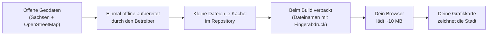
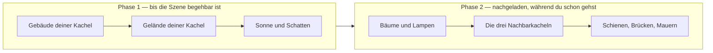

# So funktioniert der Stadtspaziergang

*English: [How the city walker works](../en/how-it-works.md)*

Diese Seite erklärt ohne Vorwissen in Geodaten oder 3D-Grafik, was du
siehst, wenn du den Viewer öffnest, woher das alles kommt und wie viel
davon „echt“ ist. Begriffe in **Fettschrift** stehen im
[Glossar](./glossary.md).

## Was du siehst

Ein stilisiertes, begehbares 3D-Modell der Dresdner Innenstadt: ein Quadrat
von 4 km × 4 km auf beiden Elbseiten, mit der historischen Altstadt im
Südwesten, Innerer und Äußerer Neustadt im Norden und der Johannstadt im
Südosten. Du startest im südöstlichen Viertel nahe der Carolabrücke und
kannst auf Straßenniveau gehen oder über die Dächer fliegen.

Nichts wird installiert, nichts über dich gespeichert, und kein Server
berechnet das Bild. Dein Browser lädt eine Handvoll vorbereiteter Dateien
(insgesamt etwa 10 MB), und deine eigene Grafikkarte zeichnet jedes Bild,
mit Hilfe einer Bibliothek namens **three.js**.

Der Look ist absichtlich nicht fotorealistisch. Es ist ein weiches,
pastelliges „Aquarell auf Papier“: Gebäude sind matte Tonvolumen, der Boden
ist nach Nutzung eingefärbt statt mit Luftbildern beklebt, und über dem
ganzen Bild liegt ein feines Papierkorn. Das ist eine gestalterische
Entscheidung, dokumentiert in den
[Art-Direction-Notizen](../../transformations.md).

## Das Ganze in einem Bild

Jede Station dieses Bildes ist in [Der Weg der Daten](./data-journey.md)
beschrieben, die Datensätze selbst in
[Woher die Daten kommen](./data-sources.md).

## Woraus die Szene besteht

Die Szene ist aus Schichten aufgebaut. Jede Schicht stammt aus ein oder
zwei Datensätzen, und jede ist eine Mischung aus gemessener Tatsache und
bewusster Vereinfachung.

| Schicht | Was sie zeigt | Woher sie kommt | Echt oder stilisiert? |
|---|---|---|---|
| **Gelände** | Die Form des Bodens: Flussufer, der Anstieg zur Neustadt, Dämme | Das amtliche Geländemodell mit 1 m Raster (**DGM1**) | Echte Höhen, auf Zentimeter gerundet. Senkrechte Mauern glättet die Quelle zu Rampen; wo OpenStreetMap eine Mauer kennt, schärft der Viewer sie wieder |
| **Bodenfarben** | Straßen grau, Wege sandfarben, Wiesen salbeigrün, Wald moosgrün, Siedlung tonfarben, Wasser blau | Das amtliche Landschaftsmodell (**Basis-DLM**) | Echte Klassifizierung; die Farben sind eine entworfene Pastellpalette, keine Fotos |
| **Wasser** | Die Elbe und kleinere Gewässer mit leicht bewegter Oberfläche und treibendem Nebel | Wasserflächen aus dem Basis-DLM, auf das echte Gelände gelegt | Echter Umriss, erfundene Wellen |
| **Gebäude** | Jedes Gebäude mit echtem Grundriss, Höhe und Dachform | Das amtliche 3D-Gebäudemodell (**LoD2**), rund 16 000 Gebäude und Gebäudeteile in den vier Kacheln | Echte Geometrie. Fassaden sind bewusst glatt; Fenster gibt es in den Quelldaten nicht |
| **Gebäudefarben** | Dachfarben; eine leichte Tönung je Gebäude; abends ein warmes Leuchten in Läden und öffentlichen Bauten | Dachfarbe aus Luftbildern (**DOP**) gemessen; der Rest aus Gebäudeattributen abgeleitet | Dachfarben sind echt (etwa 83 % Abdeckung), Wandtöne sind synthetisch |
| **Bäume und Hecken** | Einzelbäume mit Kronen in gemessener Höhe; Hecken und Baumreihen | Baumpositionen und -höhen aus der Differenz von Oberflächenmodell (**DOM1**) und Geländemodell; Reihen aus dem Basis-DLM; Grünfärbung aus dem Infrarot-Luftbild (**NDVI**) | Positionen und Höhen sind gemessen; die Kronenform ist generisch, die Baumart unbekannt |
| **Straßenlampen** | Laternen an Straßen und Plätzen | **OpenStreetMap** | Echte Positionen, Standardhöhe |
| **Bahn und Brücken** | Gleise, Schotterbetten, Brückendecks mit Bögen oder Pfeilern, Bahnsteige | Basis-DLM (Gleise, Brücken), Gelände- und Oberflächenmodell (Deckhöhen), OpenStreetMap (Bahnsteige, ob eine Brücke eine Bogenbrücke ist) | Echter Verlauf und echte Deckhöhen; das Tragwerk ist vereinfacht |
| **Mauern** | Die Brühlsche Terrasse und andere Stütz- und Stadtmauern | OpenStreetMap-Linien mit ihren eingetragenen Höhen | Echte Lage, eingetragene oder Standardhöhe |
| **Sonne, Schatten und Himmel** | Sonnenlicht für beliebiges Datum und Uhrzeit; blaue Stunde, goldene Stunde, Nacht | Aus Kalender, Uhr und Dresdens Breitengrad berechnet | Astronomisch korrekter Sonnenstand; die Farben sind entworfen |
| **Atmosphäre** | Entfernungsdunst, Talnebel in tiefem Gelände, Flussnebel, Tiefenfärbung, Papierkorn | Im Browser berechnet; der Talnebel liest die echte Geländehöhe | Künstlerisch |

## Wie ein Besuch abläuft

Die Szene wird nicht auf einmal geladen. Zwei Dinge passieren nacheinander,
und der Ladebildschirm zeigt beide:

Phase 1 endet, wenn der Ladebildschirm *begehbar* meldet: Der Vorhang löst
sich auf, und du kannst dich bewegen. Phase 2 läuft im Hintergrund weiter;
eine kleine Pille in der Ecke zählt die eintreffenden Stufen mit. Solange
die Nachbarn fehlen, ist der Horizont absichtlich dunstig, damit die
fehlenden Kacheln nicht als Abbruchkante wirken.

## Was echt ist und was nicht

**Gemessen, aus amtlichen Vermessungen:** Geländehöhen, Gebäudegrundrisse,
-höhen und Dachformen, Landnutzung, Gewässerumrisse, Gleisverläufe,
Brückenlagen und Deckhöhen, Baumpositionen und -höhen, Dachfarben,
Wiesengrün.

**Von Freiwilligen beigetragen (OpenStreetMap):** Straßenlampen,
Bahnsteige, Stützmauern mit Höhen, der Tragwerkstyp von Brücken. Die
Vollständigkeit schwankt von Straße zu Straße.

**Berechnet:** der Sonnenstand, alle Schatten, Nebel und Dunst, die
Tiefenschärfe, die langsame Bewegung von Blättern und Wasser.

**Für den Look erfunden:** die Pastellpalette, Papierkorn und Vignette, die
Form der Baumkronen, der Wandton je Gebäude, die Wellen auf dem Wasser, die
warmen Fenster in der Dämmerung (dass es ein Laden oder öffentliches
Gebäude *ist*, stimmt; seine leuchtenden Fenster sind erfunden).

**Gar nicht in den Daten:** Fenster und Türen, Fassadenmaterialien,
Straßenmöbel außer Lampen, Fahrzeuge, Menschen, Bewuchs unter etwa 3 m und
alles im Inneren von Gebäuden.

## Bevor du aus dem Bild Schlüsse ziehst

- Die Datensätze haben **unterschiedliche Stände**. Das Gelände wurde Ende
  2024 erfasst, das Gebäudemodell im Frühjahr und Sommer 2025 erzeugt,
  Landschaftsmodell und Luftbilder haben ihre eigenen Ausgaben. Ein Haus,
  das in einem Datensatz neu ist, kann in einem anderen fehlen. Siehe die
  Stände-Tabelle in [Woher die Daten kommen](./data-sources.md#verwendete-datenstände).
- Eine Kachel ist ein 2-km-Quadrat. An den **Nahtstellen** zwischen Kacheln
  kann eine kleine Stufe oder ein Farbwechsel sichtbar sein; die drei
  Nachbarkacheln werden gröber gezeichnet als die, auf der du stehst.
- Luftbilder schauen bei hohen Gebäuden leicht **schräg**, sodass eine
  gemessene Dachfarbe etwas Fassade enthalten kann. Die Abtastung meidet den
  Dachrand, um das zu mindern.
- Baum**arten** sind unbekannt; jeder Baum hat dieselbe generische Form,
  skaliert auf seine gemessene Höhe und getönt danach, wie grün er aus der
  Luft aussah.
- Das Gebäudemodell enthält für diese Kacheln **keine Brücken, Mauern oder
  Türme**, obwohl neuere Ausgaben des Produkts das könnten; deshalb werden
  Brücken und Mauern aus anderen Quellen nachgebaut.

## Wie es weitergeht

- [Woher die Daten kommen](./data-sources.md) — jeder Datensatz, wo er
  heruntergeladen wurde, was er gut kann und was nicht, die Lizenzen.
- [Der Weg der Daten](./data-journey.md) — die Stationen der Daten, was die
  eine Wahrheit ist, was ein Derivat, was der Browser tatsächlich bekommt.
- [Bedienung](./using-the-viewer.md) — Steuerung und Einstellungsfeld,
  Beschriftung für Beschriftung.
- [Glossar](./glossary.md) — die Abkürzungen.
- Für Entwickler: [docs/README.md](../../README.md) (englisch).
