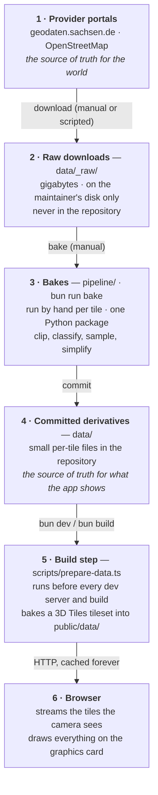
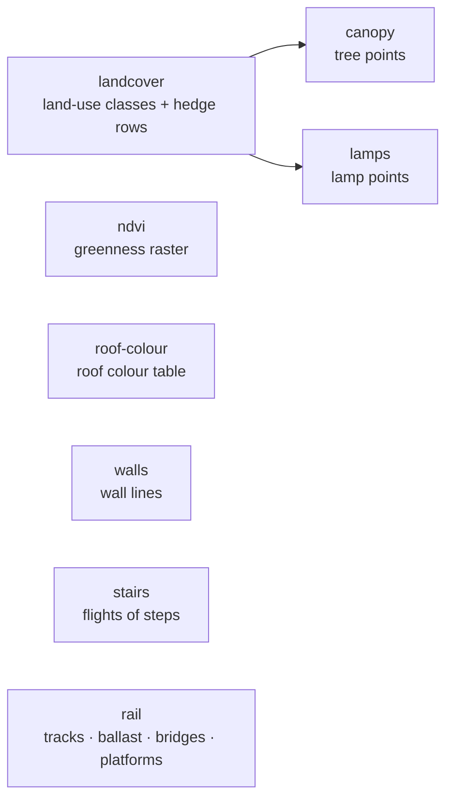

# From download to browser

*Deutsch: [Der Weg der Daten](../de/data-journey.md)*

This page follows the data from the provider's portal to the pixels on
your screen. It answers four questions people ask about a project like
this: **where is the truth kept**, **what is a derivative**, **what does the
browser actually download**, and **what has to be redone when a source
changes**. Abbreviations are in the [glossary](./glossary.md).

## The six stations

Two of the arrows are manual and happen rarely (a new download, a changed
bake); the last two happen automatically on every build and every visit.

### Station 1 — the provider portals

The Saxon survey office and OpenStreetMap own the data. If the city
changes, it changes there first. The project keeps a snapshot; see the
[edition table](./data-sources.md#dataset-editions-in-use) for how old each
snapshot is.

### Station 2 — raw downloads (`data/_raw/`, not committed)

The bulk downloads are large: the statewide landscape model is several
gigabytes, an aerial-photo tile is hundreds of megabytes, the OpenStreetMap
extract for Saxony is about 250 MB. They live in a folder the version
control system ignores, one subfolder per site and source
(`data/_raw/dresden/dom1`, `…/dop`, `…/dlm`, `…/osm`). Anyone can
re-download them — `bun run bake --ingest` does it in one go — and nobody
needs them to run the viewer.

**The one exception** is the terrain model: its GeoTIFF is committed
(13.6 MB per tile) because the build step in station 5 reads it directly
and two bakes need it as well. This is a deliberate decision
([ADR 0004](../../adr/0004-commit-derived-artifacts-not-raw-data.md)).

### Station 3 — the bakes (manual, per tile)

One Python package, `pipeline/bake/`, turns the raw downloads into small,
tile-sized files. It runs on the maintainer's machine with one command,
`bun run bake`, which reads the **site config** (`sites/dresden.ts`: which
tiles, where they lie, which coordinate system) and runs seven steps per
tile. The Python environment is pinned, and its geodata libraries bring
GDAL with them, so nothing else has to be installed. With `--ingest` it
first fetches the downloads itself: the surface model and the aerial photo
of each tile from the survey office's download service, the statewide
landscape model, and the OpenStreetMap extract for Saxony from Geofabrik.

The steps run in a fixed order, because some read the output of an
earlier one:

Each step says what it "sees" in the raw data and how it simplifies it.
When the surface model or the aerial photo of a tile is missing, the steps
that need it (trees, greenness, roof colours) are skipped with a note
instead of failing. The developer page
[data-pipeline.md](../../data-pipeline.md) documents every step's inputs,
outputs and tuning knobs.

### Station 4 — the committed derivatives (`data/`)

This folder is what the repository actually guarantees. Everything the
viewer shows is either in it or is computed from it. It holds, per tile:

| Folder | Files | What they are | Size per tile |
|---|---|---|---|
| `data/dgm/` | `dgm1_<tile>.tif` + `.tfw` + `_akt.csv` | the terrain model as downloaded (the exception above) | 13.6 MB |
| `data/cityjson/` | `lod2_<tile>.city.json` | the building model, converted to CityJSON | 8–11 MB |
| `data/dlm/` | `landcover_<tile>.png` + `.json` | land-use class per half-metre pixel (4096²), with a legend; the file holds class numbers only, the colours are added in the browser | 0.2 MB |
| | `ndvi_<tile>.png` | greenness index from the aerial photo, 1024² | 0.3–0.5 MB |
| | `vegrows_<tile>.geojson` | hedge and tree-row lines | a few kB |
| | `canopy_<tile>.geojson` | one point per tree with its height (5,000–16,000 per tile) | 0.6–1.8 MB |
| | `lamps_<tile>.geojson` | lamp positions | up to 60 kB |
| | `walls_<tile>.geojson` | wall lines with kind and height | 50–120 kB |
| | `stairs_<tile>.geojson` | flights of steps: axis, width, step count, the heights at foot and head | a few kB |
| | `rail_<tile>.geojson`, `railarea_<tile>.geojson` | track lines with track count; dissolved ballast areas | a few kB |
| | `bridge_<tile>.geojson` | bridge deck outlines with a height per corner, kind and structure | a few kB |
| | `platform_<tile>.geojson` | station platforms | a few kB |
| `data/dop/` | `roofcolor_<tile>.json` | one colour per building, sampled from the aerial photo | 0.2 MB |

In total the repository carries about 125 MB of data for the four tiles
(plus two terrain tiles to the east that nothing loads yet).

**Single source of truth versus derivative, at a glance:**

| Layer in the viewer | Truth (provider) | Committed in the repo | Produced at build time | Sent to the browser |
|---|---|---|---|---|
| Ground | DGM1 GeoTIFF | the GeoTIFF itself | two **terrain meshes** per tile (a detailed and a coarse one), with the walls sharpened in, as **glTF** | the mesh the camera needs |
| Buildings | LoD2 CityGML | the CityJSON conversion | one **glTF building mesh** per tile with a table of per-building style values (roof colour folded in), plus the footprints for the minimap | mesh + footprints |
| Ground colours | Basis-DLM shapefiles | the land-use class PNG and its legend | a half-size (2048²) copy for phones, distant terrain and the minimap | the class PNGs; the colours are painted in the browser |
| Trees | Basis-DLM + DOM1 + DGM1 | tree points, hedge rows | — | as committed |
| Greenness | DOP | the NDVI PNG | — | as committed |
| Roof colours | DOP + LoD2 | the roof colour table | folded into the building mesh's table | inside the building mesh |
| Lamps, walls, stairs, platforms, bridge structure | OpenStreetMap | the GeoJSON files | — | as committed |
| Rails, ballast, bridges | Basis-DLM (+ DOM1/DGM1 for heights) | the GeoJSON files | — | as committed |

### Station 5 — the build step (`scripts/prepare-data.ts`)

Every `bun dev` and `bun build` starts by running this script. It does
three things:

1. **Bakes the heavy inputs into a tileset.** For every tile, the terrain
   GeoTIFF becomes two ready-made terrain meshes: a detailed one on a
   1024 × 1024 grid and a coarse one on a 512 × 512 grid, with the tall
   walls from OpenStreetMap sharpened in, the ground under its stairs
   lowered a little, and a short skirt hanging from
   its edge so no gap shows at the seams between tiles. The CityJSON
   becomes one building mesh per tile with a table of per-building style
   values, and a list of building footprints for the minimap. Every mesh
   is written as **glTF**,
   the standard file format for 3D models, compressed and gzipped: about
   1.1–1.5 MB of buildings, 1.5–2.0 MB of detailed and 0.4–0.55 MB of
   coarse terrain per tile, instead of the 13.6 MB GeoTIFF and the
   8–11 MB CityJSON. A small index file, `tileset.json`, in the open
   **3D Tiles** format, lists every tile's buildings and its two terrain
   levels, and says from how close the detailed level replaces the coarse
   one. The land-use class PNG gets a 2048² copy. Results are cached in
   `.cache/` and only redone when an input or the bake code changed.
2. **Publishes** every file into `public/data/` under a name that contains
   a fingerprint of its content (for example
   `canopy_33412_5656_2_sn.55a26a2d.geojson`), and writes a
   `manifest.json` that maps the plain names to the fingerprinted ones.
3. **Prunes** files the manifest no longer mentions, so a removed source
   really switches its feature off instead of lingering.

The fingerprinted names allow the browser to cache every data file
forever; only the tiny manifest is re-checked on each visit. A re-bake
changes fingerprints, and the new manifest points at the new files.

### Station 6 — the browser

The browser fetches the manifest and the tileset, then **streams**: a
library called 3DTilesRendererJS decides, from where the camera stands and
where it looks, which files to fetch. The first picture waits only for the
buildings and the terrain of the tile you start on. Tiles near the camera
get the detailed terrain and are then *dressed* with trees, lamps, rails
and walls; tiles further away show their buildings on the coarse terrain;
tiles out of sight are not fetched, and tiles you have left behind can be
dropped from memory again. Measured on the current data (compressed size,
as sent over the network):

| What | Start tile | Other tiles | Fetched when |
|---|---|---|---|
| Buildings (with the style table) | 1.34 MB | 1.09–1.46 MB | the tile is in view |
| Building footprints (minimap) | 48 kB | 59–76 kB | with the buildings |
| Coarse terrain (512²) | 0.41 MB | 0.44–0.54 MB | the tile is in view |
| Detailed terrain (1024²) | 1.53 MB | 1.57–1.95 MB | the camera comes close |
| Land-use classes, 2048² | 0.08 MB | 0.07–0.08 MB | at the start (minimap), then for the coarse terrain |
| Land-use classes, 4096² | 0.22 MB | 0.22–0.25 MB | with the detailed terrain (desktop only) |
| Greenness (NDVI) | 0.39 MB | 0.32–0.45 MB | with the terrain |
| Tree points | 36 kB | 54–106 kB | with the detailed terrain |
| Walls | 12 kB | 8–22 kB | with the detailed terrain |
| Lamps, rails, ballast, bridges, platforms, hedge rows | under 5 kB each | under 5 kB each | with the detailed terrain |
| **Per tile, in full detail** | **≈ 4.1 MB** | **≈ 3.9–4.9 MB** | |
| **Per tile, as distant backdrop** | ≈ 2.3 MB | ≈ 2.0–2.6 MB | |

How much a visit downloads therefore depends on where you go. With every
tile in full detail, a desktop has fetched about **17 MB** for the four
tiles; a phone about 16 MB (it takes the 2048² land-use raster for every
tile); the test-only "lite" profile, which streams the start tile alone,
about 4 MB. That is more than before the switch to streaming (a full visit
used to be about 10.6 MB), because the terrain now arrives as a ready-made
mesh instead of a compact grid of heights; in exchange every file is in a
standard format that common 3D tools can open.

What is **never** sent: the 13.6 MB terrain GeoTIFF, the 10 MB CityJSON,
and any of the raw downloads. The browser parses no CityJSON and builds no
terrain; it receives meshes it can draw directly, plus small images and
feature files.

What is **computed in the browser** rather than downloaded: the ground
colours (painted once per tile on the graphics card, from the land-use
classes and one pastel palette), the water surface, every tree from its
point and height, lamp posts from their points, walls, stairs and bridges
from their outlines, the sun position, all lighting and shadows, and the whole
post-processing look.

## What has to be redone when something changes

| Change | Manual steps | Automatic |
|---|---|---|
| New terrain edition | replace the GeoTIFF in `data/dgm/`; re-run the `canopy` and `rail` bakes (they read it) | the terrain meshes, walls included, are re-baked on the next build |
| New building model | convert to CityJSON, replace in `data/cityjson/`; re-run the `roof-colour` bake | the building mesh is re-baked on the next build |
| New land-use edition | fetch the new package, re-run the `landcover` bake, then `canopy`, `lamps` and `rail` (they read the class raster) | the 2048² copies are re-baked |
| New aerial photos | re-run the `ndvi` and `roof-colour` bakes | the roof colours are folded into the mesh on the next build |
| New OpenStreetMap data | download a fresh Geofabrik extract and re-run the `lamps`, `walls`, `stairs` and `rail` bakes | — |
| Different ground colours | edit the one palette in the code | nothing to re-bake: the browser paints the colours |
| A new tile | download its terrain and building model by hand (the building model converted to CityJSON) and commit both; add the tile to the site config `sites/dresden.ts`; `bun run bake --ingest` fetches the rest and runs all seven bakes | the build adds it to the tileset and publishes it |

## Why it is built this way

Doing the heavy work once, offline, keeps the viewer a plain static
website: no server, no database, no API keys, and a first picture within a
few seconds even on a phone. Keeping the small derivatives in the
repository means anyone can build and run the viewer without the gigabytes
of raw data, and every change to what the viewer shows is visible in the
version history. The trade-offs are written down in the
[architecture decision records](../../adr/README.md).
