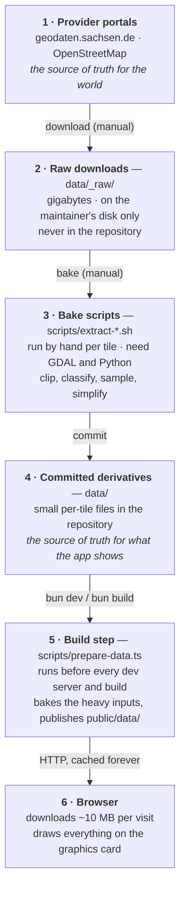
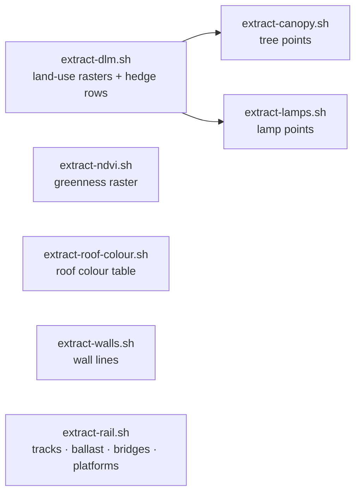

# From download to browser

*Deutsch: [Der Weg der Daten](../de/data-journey.md)*

This page follows the data from the provider's portal to the pixels on
your screen. It answers four questions people ask about a project like
this: **where is the truth kept**, **what is a derivative**, **what does the
browser actually download**, and **what has to be redone when a source
changes**. Abbreviations are in the [glossary](./glossary.md).

## The six stations

Two of the arrows are manual and happen rarely (a new download, a changed
bake); the last two happen automatically on every build and every visit.

### Station 1 — the provider portals

The Saxon survey office and OpenStreetMap own the data. If the city
changes, it changes there first. The project keeps a snapshot; see the
[edition table](./data-sources.md#dataset-editions-in-use) for how old each
snapshot is.

### Station 2 — raw downloads (`data/_raw/`, not committed)

The bulk downloads are large: the statewide landscape model is several
gigabytes, an aerial-photo tile is hundreds of megabytes, the OpenStreetMap
extract for Saxony is about 250 MB. They live in a folder the version
control system ignores. Anyone can re-download them; nobody needs them to
run the viewer.

**The one exception** is the terrain model: its GeoTIFF is committed
(13.6 MB per tile) because the build step in station 5 reads it directly
and two bake scripts need it as well. This is a deliberate decision
([ADR 0004](../../adr/0004-commit-derived-artifacts-not-raw-data.md)).

### Station 3 — the bake scripts (manual, per tile)

Seven shell scripts turn the raw downloads into small, tile-sized files.
They run on the maintainer's machine, need the GDAL toolkit and Python,
and are executed in a fixed order because later ones read the outputs of
earlier ones:

Each script says what it "sees" in the raw data and how it simplifies it.
The developer page [data-pipeline.md](../../data-pipeline.md) documents
every script's inputs, outputs and tuning knobs.

### Station 4 — the committed derivatives (`data/`)

This folder is what the repository actually guarantees. Everything the
viewer shows is either in it or is computed from it. It holds, per tile:

| Folder | Files | What they are | Size per tile |
|---|---|---|---|
| `data/dgm/` | `dgm1_<tile>.tif` + `.tfw` + `_akt.csv` | the terrain model as downloaded (the exception above) | 13.6 MB |
| `data/cityjson/` | `lod2_<tile>.city.json` | the building model, converted to CityJSON | 8–11 MB |
| `data/dlm/` | `landcover_<tile>.png` + `.json` | land-use class per half-metre pixel (4096²), with a legend | 0.2 MB |
| | `landcover_rgb_<tile>.png` | the pastel ground colours, with water coverage in the alpha channel | 0.5–0.6 MB |
| | `ndvi_<tile>.png` | greenness index from the aerial photo, 1024² | 0.3–0.5 MB |
| | `vegrows_<tile>.geojson` | hedge and tree-row lines | a few kB |
| | `canopy_<tile>.geojson` | one point per tree with its height (5,000–16,000 per tile) | 0.6–1.8 MB |
| | `lamps_<tile>.geojson` | lamp positions | up to 60 kB |
| | `walls_<tile>.geojson` | wall lines with kind and height | 50–120 kB |
| | `rail_<tile>.geojson`, `railarea_<tile>.geojson` | track lines with track count; dissolved ballast areas | a few kB |
| | `bridge_<tile>.geojson` | bridge deck outlines with a height per corner, kind and structure | a few kB |
| | `platform_<tile>.geojson` | station platforms | a few kB |
| `data/dop/` | `roofcolor_<tile>.json` | one colour per building, sampled from the aerial photo | 0.2 MB |

In total the repository carries about 130 MB of data for the four tiles
(plus two terrain tiles to the east that nothing loads yet).

**Single source of truth versus derivative, at a glance:**

| Layer in the viewer | Truth (provider) | Committed in the repo | Produced at build time | Sent to the browser |
|---|---|---|---|---|
| Ground | DGM1 GeoTIFF | the GeoTIFF itself | a compact **heightfield** (1024² grid of centimetre integers, gzip) | the heightfield |
| Buildings | LoD2 CityGML | the CityJSON conversion | a **binary building mesh** plus a small table of per-building style values (roof colour folded in) | mesh + table |
| Ground colours | Basis-DLM shapefiles | the two land-use PNGs | half-size (2048²) copies for neighbouring tiles and for phones | the PNGs |
| Trees | Basis-DLM + DOM1 + DGM1 | tree points, hedge rows | — | as committed |
| Greenness | DOP | the NDVI PNG | — | as committed |
| Roof colours | DOP + LoD2 | the roof colour table | folded into the building table | inside the building table |
| Lamps, walls, platforms, bridge structure | OpenStreetMap | the GeoJSON files | — | as committed |
| Rails, ballast, bridges | Basis-DLM (+ DOM1/DGM1 for heights) | the GeoJSON files | — | as committed |

### Station 5 — the build step (`scripts/prepare-data.ts`)

Every `bun dev` and `bun build` starts by running this script. It does
three things:

1. **Bakes the heavy inputs.** The terrain GeoTIFF becomes a heightfield
   (a grid of 1024 × 1024 height values for the tile you stand on, 512 ×
   512 for the neighbours, stored as centimetre integers and gzipped: about
   1 MB instead of 13.6 MB). The CityJSON becomes a binary mesh the graphics
   card can upload directly (about 0.7 MB instead of 10 MB), together with
   a table of per-building style values. The two land-use PNGs get 2048²
   copies for the neighbouring tiles and for phones. Results are cached in
   `.cache/` and only redone when an input or the bake code changed.
2. **Publishes** every file into `public/data/` under a name that contains
   a fingerprint of its content (for example
   `canopy_33412_5656_2_sn.55a26a2d.geojson`), and writes a
   `manifest.json` that maps the plain names to the fingerprinted ones.
3. **Prunes** files the manifest no longer mentions, so a removed source
   really switches its feature off instead of lingering.

The fingerprinted names allow the browser to cache every data file
forever; only the tiny manifest is re-checked on each visit. A re-bake
changes fingerprints, and the new manifest points at the new files.

### Station 6 — the browser

The browser fetches the manifest, then the files for the tile you spawn on,
then the rest. Measured on the current data (compressed size, as sent over
the network):

| What | Start tile | Each neighbour |
|---|---|---|
| Terrain heightfield | 1.09 MB | 0.3–0.4 MB |
| Building mesh + style table | 0.72 + 0.29 MB | 0.6–0.8 + 0.2–0.3 MB |
| Land-use class PNG | 0.22 MB (4096²) | 0.09 MB (2048²) |
| Pastel ground colours | 0.52 MB (4096²) | 0.5–0.6 MB (2048²) |
| Greenness (NDVI) | 0.39 MB | 0.3–0.45 MB |
| Tree points | 36 kB | 54–110 kB |
| Walls | 12 kB | 8–22 kB |
| Lamps, rails, ballast, bridges, platforms, hedge rows | under 5 kB each | under 5 kB each |
| **Per tile** | **≈ 3.9 MB** | **≈ 2.2–2.7 MB** |

A full visit on a desktop downloads about **10.6 MB** for the four tiles;
a phone about 10.4 MB (it takes the 2048² ground rasters for every tile);
the test-only "lite" profile with a single tile about 3.3 MB.

What is **never** sent: the 13.6 MB terrain GeoTIFF, the 10 MB CityJSON,
and any of the raw downloads. The browser decodes no raster and parses no
CityJSON; it receives grids and meshes it can use directly.

What is **computed in the browser** rather than downloaded: the terrain
triangles from the heightfield, the water surface, every tree from its
point and height, lamp posts from their points, walls and bridges from
their outlines, the sun position, all lighting and shadows, and the whole
post-processing look.

## What has to be redone when something changes

| Change | Manual steps | Automatic |
|---|---|---|
| New terrain edition | replace the GeoTIFF in `data/dgm/`; re-run `extract-canopy.sh` and `extract-rail.sh` (they read it) | the heightfield is re-baked on the next build |
| New building model | convert to CityJSON, replace in `data/cityjson/`; re-run `extract-roof-colour.sh` | the building mesh is re-baked on the next build |
| New land-use edition | re-run `extract-dlm.sh`, then `extract-canopy.sh`, `extract-lamps.sh`, `extract-rail.sh` (they read the class raster) | the 2048² copies are re-baked |
| New aerial photos | re-run `extract-ndvi.sh` and `extract-roof-colour.sh` | the roof colours are folded into the mesh on the next build |
| New OpenStreetMap data | delete the cached Overpass responses and re-run `extract-lamps.sh` and `extract-rail.sh`; download a fresh Geofabrik extract and re-run `extract-walls.sh` | — |
| A new tile | download all sources for it, run all seven bakes, add it to the tile list in `lib/city/tile.ts` | the build bakes and publishes it |

## Why it is built this way

Doing the heavy work once, offline, keeps the viewer a plain static
website: no server, no database, no API keys, and a first picture within a
few seconds even on a phone. Keeping the small derivatives in the
repository means anyone can build and run the viewer without the gigabytes
of raw data, and every change to what the viewer shows is visible in the
version history. The trade-offs are written down in the
[architecture decision records](../../adr/README.md).
