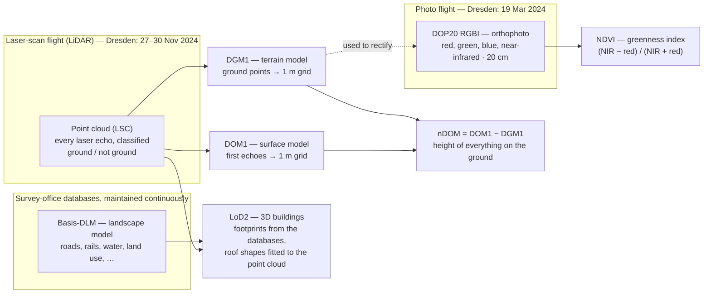

# Where the data comes from

*Deutsch: [Woher die Daten kommen](../de/data-sources.md)*

Everything in the viewer is derived from **open data**: datasets that a
public authority or a volunteer community publishes for anyone to use.
Nothing was surveyed or drawn by hand for this project. This page lists
each dataset, where it was downloaded, what it is good at, where it falls
short, and under which licence it may be used. The abbreviations are
explained in the [glossary](./glossary.md).

## The providers

**GeoSN** — the *Landesamt für Geobasisinformation Sachsen*, Saxony's state
survey office. It publishes the terrain and surface models, the 3D building
model, the land-use map and the aerial photos as free downloads on its
open-geodata portal, [geodaten.sachsen.de](https://www.geodaten.sachsen.de/).
All of them are cut into the same **2 km × 2 km tiles**, which is why the
viewer thinks in tiles too. Which tiles it shows is written down in one
place, the site config `sites/dresden.ts`: the four tiles (the first is the
one you start on), the viewpoints and the credits.

**OpenStreetMap (OSM)** — the world map maintained by volunteers. It fills
gaps the official datasets leave: street lamps, benches and other street
furniture, station platforms,
retaining walls with their heights, what kind of structure a bridge is, and
the shape of fountain basins.

## The datasets at a glance

| Dataset | Plain-English name | Provider | What the viewer uses it for |
|---|---|---|---|
| **DGM1** | Terrain model, 1 m grid | GeoSN | The ground; seating every object on it; bridge abutment heights; the input for tree heights |
| **DOM1** | Surface model, 1 m grid (terrain *plus* everything standing on it) | GeoSN | Tree heights (surface minus terrain); bridge deck heights |
| **LoD2** | 3D building model with roof shapes | GeoSN | Every building's footprint, height, roof shape and attributes |
| **Basis-DLM** | Digital landscape model (the land-use map) | GeoSN | Ground colours, water outlines, hedges and tree rows, railway areas and tracks, bridge outlines, monuments and fountains (position and official name) |
| **DOP** | Digital orthophoto, 20 cm, with a near-infrared channel | GeoSN | Roof colours; vegetation greenness for tree crowns and meadows |
| **OSM** | OpenStreetMap | Volunteers | Street lamps, street furniture (benches, bins, bicycle stands, bollards, post boxes, stop shelters), playgrounds and their equipment, station platforms, walls, cliff edges, stairs, bridge structure types, fountain basins, what streets, pavements and car parks are paved with |

Available from the same portal but **not used yet**: the laser-scan point
cloud (individual tree crowns would come from it), the cadastral parcels
(**ALKIS**), and the topographic base map (**DTK**). The planned section of
the [transformation ledger](../../transformations.md) records what they
could add.

## How the official datasets are produced

Most of what the viewer shows traces back to two kinds of flights over the
city and to the survey office's own databases. The diagram shows how the
products depend on each other; the fact sheets below give the details.

## Dataset by dataset

Each fact sheet answers the same questions: what the abbreviation means,
how the data is collected, how often it is updated, how precise it is,
what it is generally good for, what the viewer uses it for, and where it
falls short. Figures marked "per GeoSN" come from the provider's product
documentation.

### DGM1 — the terrain model

| | |
|---|---|
| **Stands for** | *Digitales Geländemodell 1* — digital terrain model, 1 m grid. "Terrain" means the bare ground: buildings, bridges and vegetation are removed. |
| **How it is collected** | Airborne laser scanning (LiDAR): an aircraft sweeps the ground with laser pulses and records each echo. The resulting point cloud is classified into ground and non-ground points; the ground points are interpolated into a regular grid. Gaps under buildings are filled with interpolated points. |
| **Update cycle** | Region by region, after each new laser flight. For Dresden the previous scan dated from 2016, the current one from 27–30 November 2024. |
| **Resolution and accuracy** | 1 m cells, height stored in the cell centre. Height accuracy up to ±0.15 m and position ±0.30 m at 95 % confidence, per GeoSN. |
| **Generally suited for** | Any "how high is the ground here" question: terrain analysis, flood and drainage modelling, visibility studies, slope maps, rectifying aerial photos. |
| **Used here for** | The ground itself; seating buildings, trees, lamps and the player on it; the abutment heights of bridges; the base term of the tree heights. |
| **Strengths** | The true shape of the ground, including river banks, embankments and the terraces of the old town, to a few centimetres. |
| **Weaknesses** | Anything vertical: a laser-scanned wall is smoothed into a ramp about a metre wide, so monumental walls such as the Brühlsche Terrasse "disappear" into a gentle bank. Bridges are removed by definition, so a deck taken from this model would sink to the river bed. The viewer fixes both with other sources. |
| **Format and download** | GeoTIFF, 2000 × 2000 pixels of 32-bit floats, 13.6 MB per 2 km tile, with a `.tfw` world file and an `_akt.csv` stating the survey date. Heights in metres above sea level (**DHHN2016**). [Digitale Höhenmodelle](https://www.geodaten.sachsen.de/downloadbereich-digitale-hoehenmodelle-4851.html). |

Special role: this is the only bulk raw dataset committed to the
repository, because the build step reads it directly. See
[From download to browser](./data-journey.md).

### DOM1 — the surface model

| | |
|---|---|
| **Stands for** | *Digitales Oberflächenmodell 1* — digital surface model, 1 m grid. "Surface" means the first thing the laser hit: roofs, tree tops, bridge decks, parked lorries. |
| **How it is collected** | The same laser flight as the DGM1; the first echoes of the point cloud are interpolated into the grid instead of the ground points. |
| **Update cycle** | Together with the DGM1; identical dates for these tiles (27–30 November 2024). |
| **Resolution and accuracy** | 1 m cells; the same height accuracy as the point cloud (up to ±0.15 m), per GeoSN. Note that a cell on the edge of a crown or a roof can hold either height. |
| **Generally suited for** | Building and tree heights (as DOM − DGM, the **nDOM**), canopy mapping, distinguishing deciduous from coniferous trees (leafless crowns let the ground show through), finding bridges and sunken entrances, solar-roof studies. |
| **Used here for** | `DOM1 − DGM1` gives the height of everything standing on the ground. Where the land-use map says forest, copse or park, the viewer places one tree per 7 m cell at the tallest point, with that height. Bridge decks take their height from it. It is also the only reliable record of what a monument or a fountain's sculpture *looks* like: its measured bulk (the Albertplatz sculpture groups are 3.7 m tall bodies about 4 × 5 m) becomes a soft clay form of that size and outline. |
| **Strengths** | Measured heights for every tree and roof in the city at once, in a true top-down view without the sideways lean of a photograph. |
| **Weaknesses** | It cannot tell a tree from a building or a bus; tree placement is therefore restricted to vegetation classes and excluded from roads, rails and water. Vegetation under 3 m is ignored; 1 m is too coarse for individual shrubs. A November scan shows deciduous trees without leaves, so their crowns are thinner in the data than in summer. |
| **Format and download** | GeoTIFF like the DGM1, same portal page. Used offline only; the raw file is not committed and never reaches the browser. |

### LSC — the laser-scan point cloud

| | |
|---|---|
| **Stands for** | *Laserscandaten* — the raw point cloud the two height models are computed from. |
| **How it is collected** | The laser flight itself; every echo is a point with position, height and intensity, classified into ground and non-ground. |
| **Update cycle** | The same as the height models (27–30 November 2024 for these tiles). |
| **Resolution and accuracy** | Irregular points, several per square metre; ±0.15 m in height, ±0.30 m in position, per GeoSN. |
| **Generally suited for** | Everything the grids simplify away: individual tree crowns, roof edges, wall faces, power lines. |
| **Used here for** | Not used yet. Segmenting individual trees from it is on the ideas list. |
| **Format and download** | LAZ per 2 km tile, large; same portal page as the DGM1. |

### LoD2 — the 3D building model

| | |
|---|---|
| **Stands for** | *Level of Detail 2* of the *Digitales 3D-Stadtmodell*: every building as a simple solid with its real footprint, measured height and a standardised roof shape (flat, gable, hip, mansard and others). LoD1 would be flat boxes; LoD3 would add facade detail. |
| **How it is collected** | Generated automatically by the survey office: the building footprints come from its cadastral and landscape databases (ALKIS / ATKIS), the roof shapes and heights are fitted to the laser point cloud. Since 2021 the product can also include bridges, walls, towers, wind turbines and masts. |
| **Update cycle** | A tile is regenerated when its inputs change; the statewide model was last updated in August 2025. The model of a tile is dated by its inputs: for these tiles the roofs come from the **2016** laser scan, the footprints from the 2021 or 2022 Basis-DLM and the ground from the 2016 DGM; the model itself was produced in 2023 (western pair) and 2024 (eastern pair). The 2025 dates inside the files are export dates, not survey dates. |
| **Resolution and accuracy** | Footprints at cadastral precision (decimetres); roof heights at laser precision; roof shapes are the nearest standard type, not the real roof. |
| **Generally suited for** | Cityscape visualisation, shadow and solar studies, noise and wind modelling, counting storeys and volumes. |
| **Used here for** | Every building's footprint, height, roof shape and attributes; the minimap footprints; the demolish tool. |
| **Strengths** | Exact silhouettes: footprints and roof shapes are consistent citywide, heights are measured. |
| **Weaknesses** | Nothing below the eaves: no windows, doors, materials or colours. The building-function attribute is "unspecified" for about 86 % of buildings and the storey count is filled in for only a few percent, so the viewer derives storey bands from the measured height. The downloaded tiles contain only buildings, no bridges or walls. |
| **Format and download** | **CityGML** per 2 km tile (also DXF and Shape); the project converts to **CityJSON**, a compact JSON form of the same standard, before committing (8–11 MB per tile). [Digitale 3D-Stadtmodelle](https://www.geodaten.sachsen.de/downloadbereich-digitale-3d-stadtmodelle-4875.html). |

### Basis-DLM — the landscape model

| | |
|---|---|
| **Stands for** | *Digitales Basis-Landschaftsmodell*: the most detailed level of **ATKIS**, the *Amtliches Topographisch-Kartographisches Informationssystem*, the nationwide system of official topographic data. A vector map of what covers the ground — roads, paths, railways, water, forest, farmland, settlements — plus line features such as hedges and tree rows, with attributes. |
| **How it is collected** | Maintained by the survey office from current orthophotos, the terrain model, local measurements and data from other authorities (road and rail operators, municipalities). Object types and attributes follow a nationwide catalogue (GeoInfoDok / AAA schema 7.1.2 since 2025), so they are identical in every German state. |
| **Update cycle** | Two rhythms, per GeoSN: a *basic update* in which every object is checked every 3–5 years, and a *priority update* in which important objects (roads, railways and the like) are checked every 3, 6 or 12 months. The download package is refreshed quarterly. |
| **Resolution and accuracy** | Positional accuracy ±3 m for the essential line objects (roads, rails, rivers) and ±15 m for everything else, per GeoSN. Roads are centrelines with a width attribute, not surfaces. |
| **Generally suited for** | A consistent, attributed base layer for GIS: joining specialist data to it, routing and navigation, land-use statistics, cartography at scales of about 1:10 000 to 1:25 000. |
| **Used here for** | The ground colours (nine land-cover classes), the water outline, hedge and tree rows, the vegetation mask that gates tree placement, railway areas and track lines with track count, bridge centrelines and, where present, deck outlines; the monuments, memorial stones, columns and named fountains (the Albertplatz fountains "Stilles Wasser" and "Stürmische Wogen", the Neptunbrunnen, …) with their official names. |
| **Strengths** | Authoritative classification with useful attributes: road widths, number of tracks, electrification, bridge names. |
| **Weaknesses** | Anything small or exact: roads must be widened by rule, railway lines come in short fragments that need merging, deck outlines exist mostly for major bridges, there is no street furniture and no platforms. Monuments are points with a name only: no size, no shape, and nothing says which of them is a fountain — the viewer takes a monument's form from the surface model where it can be measured (an abstract marker where not), and a fountain's basin from OpenStreetMap. At ±3 m a road edge can sit a lane off. |
| **Format and download** | Statewide package in Shape (or NAS or GeoPackage), about 1.2 GB; the project clips each tile out of it. [Basis-DLM](https://www.geodaten.sachsen.de/downloadbereich-basis-dlm-4168.html). |

### DOP20 RGBI — the aerial photos

| | |
|---|---|
| **Stands for** | *Digitales Orthophoto*, 20 cm ground resolution, channels **R**ed, **G**reen, **B**lue and near-**I**nfrared. An orthophoto is an aerial photograph rectified onto the terrain model so that every pixel sits at its true map position and distances can be measured as on a map. |
| **How it is collected** | A survey aircraft photographs strips of the state with a calibrated camera (80 % forward and 60 % side overlap since 2021); the images are oriented, rectified over the DGM and mosaicked into 2 km tiles. |
| **Update cycle** | About half of the state every year, alternating spring and summer flights, i.e. every tile roughly every two years, per GeoSN. These tiles were flown on **19 March 2024** — a leaf-off spring flight. |
| **Resolution and accuracy** | 20 cm per pixel; a pixel's standard deviation from its true position ≤ 0.4 m; 8 bits per channel; 10 000 × 10 000 pixels per tile, per GeoSN. |
| **Generally suited for** | The base image for mapping and GIS capture; environment, agriculture and forestry monitoring (the infrared channel separates vegetation from everything else); transport and urban planning. |
| **Used here for** | The colour of each roof (a robust median over the roof footprint, avoiding the edge) and the greenness index **NDVI** from the red and infrared channels, which tints tree crowns from dry pale sage to lush deep green and does the same for meadows. |
| **Strengths** | Real colours and real greenness where the photo looks straight down. |
| **Weaknesses** | Facades are invisible (a nadir photo sees roofs only); tall buildings lean sideways in the image, so roof footprints are eroded inward before sampling; the raw colours read drab and hazy, which the viewer corrects with a hue-preserving saturation lift. Because the flight was leaf-off, deciduous trees are bare in the image: the greenness index is low almost everywhere and the crown colouring recentres it on the median rather than reading it as an absolute value. |
| **Format and download** | GeoTIFF per 2 km tile, about 380 MB for the 4-channel variant. [DOP download area](https://www.geodaten.sachsen.de/downloadbereich-dop-4826.html). Only derivatives are committed (roof colours, NDVI raster). |

### NDVI — the greenness index (derived, not downloaded)

| | |
|---|---|
| **Stands for** | *Normalized Difference Vegetation Index*: (near-infrared − red) / (near-infrared + red), computed per pixel from the DOP. |
| **Why it works** | Healthy leaves reflect near-infrared strongly and absorb red, so the index is high on lush vegetation and near zero on roofs, roads and water. |
| **Used here for** | Tree crown colour and the meadow tint; baked into a 1024² raster per tile (about 2 m per pixel). |
| **Caveat** | Only as good as the photo's date: a March image separates evergreens and grass from everything else but says little about summer foliage. |

### OSM — OpenStreetMap

| | |
|---|---|
| **Stands for** | *OpenStreetMap*, the free world map built by volunteers since 2004. |
| **How it is collected** | Contributors map from GPS traces, on-the-ground surveys and by tracing aerial imagery (including official orthophotos where their licence allows), and describe each object with free-form key=value *tags* such as `highway=street_lamp` or `barrier=retaining_wall` + `height=9`. |
| **Update cycle** | Continuous: edits are live within minutes. Extracts for download (Geofabrik) are rebuilt daily; the project reads such an extract, not the live database. |
| **Resolution and accuracy** | No guarantee; in a well-mapped city typically metre-level positions. Completeness and tag consistency vary from street to street and mapper to mapper. |
| **Generally suited for** | Things no official dataset has: street furniture, points of interest, names, informal paths, structure types; near-worldwide coverage; quick to fetch. |
| **Used here for** | Lamp positions (`highway=street_lamp`), street furniture — benches (`amenity=bench`, with `backrest` and `direction` where tagged), picnic tables, litter bins, bicycle stands (with `capacity`), bollards, post boxes and stop shelters (`shelter=yes`), playground outlines (`leisure=playground`) with the equipment mapped on them (`playground=swing`, `slide`, `sandpit`, …) — turned towards the nearest street or path where no direction is tagged, station platforms (`railway=platform`), retaining walls, city walls, embankments and cliff edges (`barrier=*`, `man_made=embankment`, `natural=cliff`) with their `height` tag, flights of steps (`highway=steps` with `width` and `step_count`, the width else from an `area:highway=steps` outline), whether a bridge is an arch bridge (`bridge:structure`), and fountains (`amenity=fountain`): the outline of each basin, whether it is a splash pad or a still pool, and the many small fountains the landscape model does not list. Where an official monument stands in an OSM basin, the fountain keeps the official name. Also what a street, walkway or car park is paved with (`surface=asphalt`, `paving_stones`, `sett`, … on the ways, `sidewalk:*:surface` on the roads) and which way it runs, so slabs and cobbles lie along the street; and where cars park (`parking:left/right/both` with its orientation on the roads, `amenity=parking` car parks with their aisles, mapped bays), drawn as painted bays; and the pedestrian islands, lawns and fountains inside squares the landscape model draws as one road area (the Albertplatz). |
| **Strengths** | Human-readable tags for exactly the details the survey office does not model; the Brühlsche Terrasse exists here and nowhere else. |
| **Weaknesses** | Not every lamp or bench is mapped, and few benches say which way they face, heights are often missing (the viewer uses defaults per wall type), tags vary. Volunteer data must be credited (ODbL). |
| **Download and licence** | One regional extract of the whole state, `sachsen-latest.osm.pbf`, downloaded from [Geofabrik](https://download.geofabrik.de/europe/germany/sachsen.html) (about 250 MB) and read locally, which avoids rate limits and makes the result reproducible. The lamp, platform and bridge-structure files committed today are older: they were fetched through the **Overpass API**, a live query service, before the bakes switched to the extract, and move to the extract at their next re-bake. Licence: **ODbL**, credit "© OpenStreetMap contributors". |

## Dataset editions in use

The exact edition matters when the picture disagrees with reality. GeoSN
publishes, for every tile and product, a currency field ("Stand") through
the download service behind its portal; the values below were read from it
on 2026-09-22 and match the metadata files shipped in the tile ZIPs. The
machine-readable version, with the download link of every file, is
[`data/provenance.json`](../../../data/provenance.json). "Committed" is the
date a file entered the repository; the download happened on or shortly
before it.

| Dataset | Tiles | Edition / survey date (provider's "Stand") | How we know | Committed |
|---|---|---|---|---|
| DGM1 | all four (plus two unused tiles to the east) | **2024-11-30** (southern row), **2024-11-27 and 2024-11-30** (northern row) | the `_akt.csv` in each tile ZIP; GeoSN download service | 2026-06-11 |
| DOM1 | all four | the **same laser flight** as the DGM1: 2024-11-30 / 2024-11-27 and 2024-11-30 | GeoSN download service (DOM1, DGM1 and the point cloud carry identical dates) | derived canopy files 2026-06-12 |
| LoD2 | all four | south-western pair (33410_*): model **2023**, built from the 2016 laser scan, the 2021 Basis-DLM footprints and the 2016 DGM; south-eastern pair (33412_*): model **2024**, from the 2016 laser scan, the 2022 Basis-DLM and the 2016 DGM. The objects were exported 2025-04-26 … 2025-07-07 (`creationDate`) | GeoSN download service; a few older objects still carry `Stand_*` attributes with the same values | 2026-06-11 |
| DOP (RGBI) | all four | flown **2024-03-19** (leaf-off) | GeoSN download service | derived roof colours and NDVI 2026-06-16/17 |
| Basis-DLM | statewide package | the quarterly package current in **June 2026**; the exact release date was not noted and cannot be read from the portal afterwards because the package is replaced under the same file name (the share's file was dated 2026-07-28 when checked) | download page: "updated quarterly"; git history | derived files 2026-06-12, rail and bridge files re-baked 2026-09-18 |
| OSM via Overpass (no longer used by the bakes; the committed lamp, platform and bridge-structure files still come from it) | all four | the live database on the fetch day: 2026-06-12 or earlier (lamps), 2026-06-17 or earlier (platforms, bridge structure) | git history; the cached raw responses carry the exact `timestamp_osm_base` | 2026-06-12 / 2026-06-17 |
| OSM via BBBike | Dresden extract | the extract of 2026-09-19 (fountains only: Geofabrik could not be reached from the build machine that day) | `data/provenance.json` | 2026-09-24 |
| OSM via Geofabrik | statewide extract | the daily extract of 2026-09-18 or shortly before | git history (walls re-baked that day); `osmium fileinfo -e` on the raw file prints the exact timestamp | 2026-09-18 |
| OSM via BBBike (stairs) | the Dresden city extract | the extract of 2026-09-19 | the file's `Last-Modified`; `data/provenance.json` | 2026-09-24 |
| OSM via BBBike (paving) | the Dresden city extract | the extract of 2026-09-19 | the file's `Last-Modified`; `data/provenance.json` | 2026-09-25 |

Note the **mismatch of dates inside one picture**: the ground and the tree
heights are from late 2024, the building shapes from a 2016 laser scan with
2021/2022 footprints, the roof colours from March 2024, and the lamps and
walls from mid-2026 OpenStreetMap. A building finished in 2023 can have a
2024 roof colour and no 3D shape.

Still to record at the next download: the Basis-DLM package's release date
(read the `Last-Modified` of the ZIP or the metadata inside it) and the
Geofabrik extract's timestamp.

## Where exactly each file came from

GeoSN serves every tile ZIP from public folders on its cloud share; the
portal's download app finds them through a map service that also carries
the "Stand" of each tile. The folders are per product and format:

| Product | Package | Portal page |
|---|---|---|
| DGM1 (GeoTIFF + `.tfw` + `_akt.csv`) | `…/JCcXyifaNdLDnxZ/dgm1_<tile>_tiff.zip` | [Digitale Höhenmodelle](https://www.geodaten.sachsen.de/downloadbereich-digitale-hoehenmodelle-4851.html) |
| DOM1 (GeoTIFF) | `…/S6wwnFwX7882sZm/dom1_<tile>_tiff.zip` | same page |
| Laser-scan point cloud (LAZ), unused | `…/rqcqdt8QMcLFUvC/lsc_<tile>_laz.zip` | same page |
| LoD2 (CityGML) | `…/GVzwbSyp7Yl7mBD/lod2_<tile>_citygml.zip` | [Digitale 3D-Stadtmodelle](https://www.geodaten.sachsen.de/downloadbereich-digitale-3d-stadtmodelle-4875.html) |
| DOP20 RGBI (GeoTIFF) | `…/sX3GPcdBMGrfXT9/dop20rgbi_<tile>_tiff.zip` | [DOP](https://www.geodaten.sachsen.de/downloadbereich-dop-4826.html) |
| Basis-DLM (Shape, statewide, 1.23 GB) | `…/DtPWngtLEJP8K3k/basisdlm_sn_shape.zip` | [Basis-DLM](https://www.geodaten.sachsen.de/downloadbereich-basis-dlm-4168.html) |

`…` stands for `https://geocloud.landesvermessung.sachsen.de/public.php/dav/files/`.
The folder tokens can rotate; the durable index is the download service
described in [data-pipeline.md](../../data-pipeline.md#provenance), which
lists the current link and "Stand" for any tile. `bun run bake --ingest`
uses that service to fetch the surface model and the aerial photo of each
tile, and fetches the statewide Basis-DLM package and the OpenStreetMap
extract as well; the DGM1 and the LoD2 are committed and downloaded by
hand. OpenStreetMap data now comes only from the Geofabrik Saxony extract
(`sachsen-latest.osm.pbf`); the committed lamp, platform and
bridge-structure files still date from earlier Overpass API queries.

## Licences and credits

| Source | Licence | Required credit |
|---|---|---|
| GeoSN datasets (DGM1, DOM1, LoD2, Basis-DLM, DOP) | *Datenlizenz Deutschland – Namensnennung – Version 2.0* (`dl-de/by-2-0`), per GeoSN's [terms of use](https://www.landesvermessung.sachsen.de/allgemeine-nutzungsbedingungen-8954.html) (checked 2026-09-22) | "Quelle: GeoSN, dl-de/by-2-0" |
| OpenStreetMap | *Open Database License* (ODbL) | "© OpenStreetMap contributors" |

The viewer shows both credits in the footer of its settings panel. The
derived lamp and wall files carry the OSM credit inside the file as well;
the monument file carries both credits, because it combines the two.
