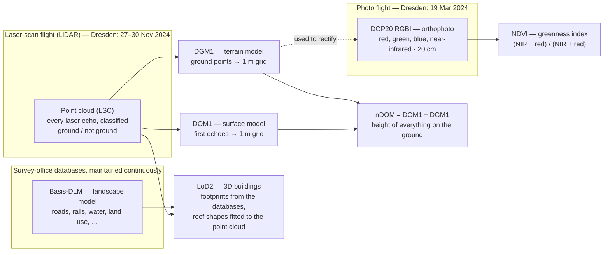

# Where the data comes from

*Deutsch: [Woher die Daten kommen](../de/data-sources.md)*

Everything in the viewer is derived from **open data**: datasets that a
public authority or a volunteer community publishes for anyone to use.
Nothing was surveyed or drawn by hand for this project. This page lists
each dataset, where it was downloaded, what it is good at, where it falls
short, and under which licence it may be used. The abbreviations are
explained in the [glossary](./glossary.md).

## The providers

**GeoSN** — the *Landesamt für Geobasisinformation Sachsen*, Saxony's state
survey office. It publishes the terrain and surface models, the 3D building
model, the land-use map and the aerial photos as free downloads on its
open-geodata portal, [geodaten.sachsen.de](https://www.geodaten.sachsen.de/).
All of them are cut into the same **2 km × 2 km tiles**, which is why the
viewer thinks in tiles too. Which tiles it shows is written down in one
place, the site config `sites/dresden.ts`: the fifteen tiles (the first is the
one you start on) and the viewpoints; the credits come from the provider.

**Other places, other providers.** Every German state runs its own survey
office, and the viewer can draw on five of them: GeoSN for Dresden,
Leipzig, Meißen and Grimma; **Geobasis NRW** for Unna; the **Bavarian
survey administration (LDBV)** for Munich; Hamburg's **LGV**; and Berlin's
**Senate department for urban development**. They publish the same kinds
of datasets in different cuts — 1 km tiles, one archive for the whole
city, aerial photos without the infrared band — and a small adapter per
office cuts them into the viewer's 2 km tiles. Hamburg and Berlin do not
publish the landscape model in the form the viewer reads, so their ground
colours come from OpenStreetMap instead — and so do their railway tracks
and bridges: OpenStreetMap's rail lines and bridge ways stand in, while
each deck's height is still measured in the surface model. Munich's aerial
photos have no infrared band, so the colour of its trees and meadows is
computed from the photo's visible colours instead (see NDVI below). And
where a building's material is not mapped, it takes its neighbourhood's:
in a street of mapped brick houses it is drawn in brick, elsewhere in
plaster — so Hamburg's clinker quarters come out in brick without anyone
having to say so for the whole city. One deployment shows every city
whose data it was built with, each at its own address (`/dresden`,
`/leipzig`, …), and the start page lists them; the list of offices with
their licences is in `sites/providers.ts`. Which city draws what from which
source — and where a stand-in steps in because a Land or a city does not
publish something openly — is the table
[Sources by city](./sources-by-city.md).

**OpenStreetMap (OSM)** — the world map maintained by volunteers. It fills
gaps the official datasets leave: street lamps, benches and other street
furniture, station platforms,
retaining walls with their heights, what kind of structure a bridge is,
the shape of fountain basins, and the trees in courts and gardens the
city's register does not list.

**Wikidata** — the free knowledge base behind Wikipedia. For named bridges
it says what kind they are (arch, suspension, truss …) and often their
main span. It also names each city's **landmarks**: the buildings and
structures with Wikipedia articles, ranked by how many languages write
about them. The viewer marks the buildings that are one, lists the
city's twelve best-known in the panel, and uses the material Wikidata
gives (glass, brick, stone …) where OpenStreetMap names none. For
monuments and sculptures it often says what they are made of — the
Goldener Reiter is copper under gold leaf — and the viewer colours them
in a muted tone of that material where OpenStreetMap names none.

**Landeshauptstadt Dresden** — the city itself. Its street-tree register
(*Stadtbaumkataster*) lists about 124,000 municipal trees with species,
height, crown width and trunk. The viewer plants those trees where they
really stand, with their measured height, crown and trunk, a crown shape
that follows the species, and the species' year: when it leafs out, which
colour it turns in autumn and when it is bare.
The same source provides two traffic datasets the viewer shows as
**switchable data layers** (sidebar, *Erkunden* → *Verkehrsdaten*; off
at start): the motor vehicles counted per road section, and the permanent
bicycle counters, whose counts the browser reads live from the city.

**DELFI and gtfs.de** — DELFI e.V. collects the timetables of every
transport association in Germany (here the VVO's, with the DVB's lines);
gtfs.de publishes them in the common GTFS format. The trams of the third
data layer run from it, as the timetable has them run.

**Hamburg, Leipzig and Berlin** publish registers of the same kind, read
the same way. Hamburg's *Straßenbaumkataster* (the environment
authority, BUKEA) lists the street trees with species, crown width,
trunk girth and planting year, but **no height**: the viewer measures
each tree's height in the surface model (surface minus terrain at the
top of its crown), where that fits the recorded crown — more than four in
five trees — and otherwise derives it from the crown. Leipzig's
*Baumkataster* (Amt für Stadtgrün und Gewässer) lists street and park
trees with height, crown and trunk; felled trees are left out. Berlin's
*Baumbestand* (Geoportal Berlin) lists street and park trees the same
way; Berlin is configured but not built yet.

## The datasets at a glance

| Dataset | Plain-English name | Provider | What the viewer uses it for |
|---|---|---|---|
| **DGM1** | Terrain model, 1 m grid | GeoSN | The ground; seating every object on it; bridge abutment heights and the water level under the fairway; the input for tree heights |
| **DOM1** | Surface model, 1 m grid (terrain *plus* everything standing on it) | GeoSN | Tree heights (surface minus terrain); a bridge's roadway height and what stands above it: trusses, pylons, arches; chimneys, towers and masts, and buildings the 3D model does not carry yet — only where OpenStreetMap names them; the roof shape of a landmark the 3D model draws flat; the roofs of buildings the 3D model gets badly wrong; the dormers on pitched roofs; the canopy over a shop front |
| **LoD2** | 3D building model with roof shapes | GeoSN | Every building's footprint, height, roof shape and attributes (the viewer leaves out its bridge slabs) |
| **Basis-DLM** | Digital landscape model (the land-use map) | GeoSN | Ground colours, water outlines, hedges and tree rows, railway areas and tracks, bridge outlines, monuments and fountains (position and official name) |
| **DOP** | Digital orthophoto, 20 cm, with a near-infrared channel | GeoSN | Roof colours; vegetation greenness for tree crowns and meadows |
| **LSC** | Laser-scan point cloud | GeoSN (Dresden, Meißen, Grimma, Leipzig), Geobasis NRW (Unna), Bavarian survey administration (Munich) | Hedge heights; trees in courtyards and gardens; the garden houses, sheds and container buildings the 3D building model lacks |
| **OSM** | OpenStreetMap | Volunteers | Street lamps, hedges, street furniture (benches, bins, bicycle stands, bollards, post boxes, stop shelters and stop signs, advertising columns, traffic signals, hydrants, clocks, drinking fountains), playgrounds and their equipment, station platforms, walls, cliff edges, stairs, bridge structure types and navigation clearances, fountain basins, what streets, pavements and car parks are paved with, sports grounds, shops and cafés on the ground floor, listed buildings, fences, railings and gates, road markings (crossings, stop lines, cycle and centre lines), allotment gardens, orchards and vineyards, trees the city's register does not list, tram tracks with their overhead-line masts, the landing stages, groynes and ferry routes on the Elbe, what buildings are made of and their wall and roof colours, chimneys, towers and masts, and the buildings too new for the 3D model |
| **Wikidata** | free knowledge base | Volunteers | The kind and main span of named bridges; the city's landmarks (the list in the panel) and their facade material; what monuments are made of |
| **Mapillary** | Street photos and the objects found in them | Contributors' photos, Mapillary's detection | In Dresden, street lamps and litter bins OpenStreetMap does not map — about 6 700 lamps and 1 700 bins on the fifteen tiles. Mapillary places each object it recognises in several photos; the viewer keeps those with no OpenStreetMap lamp or bin within 8 m, seen since 2020, not inside a building, moved off the carriageway to the kerb. Their positions are a few metres off, and a lamp it placed twice from two drives stands only once (7 m apart at least). Asked, a lamp or bin says whether it came from Mapillary. The panoramas — in every city but Unna, where Mapillary has none — also say, per building (nearly 2 000 in Dresden and 1 600 in Leipzig, mostly along the inner city's streets), how busy and how dark a street front is and whether a shop sign hangs on it; the clay turns that into a fine relief, a slightly darker or lighter tone and a shop plinth (*Fassadenbild*). Two further measurements give the windows. The shop window: on every tile the panoramas are measured once more along each wall's ground floor, and where two photos agree on wide openings — or where a modernist shop row shows glass nearly throughout — the building gets shop windows there as soft niches: the glass a muted tone a little darker and cooler than the wall, slightly reflecting, set in a shallow reveal with rounded edges, no mullions, framed by piers, with a fascia where a shop sign was seen (about 1 000 walls on 780 buildings in Dresden, 1 130 on 843 in Leipzig, 3 079 on 2 229 in Munich, 152 on 112 in Hamburg, where few panoramas were taken, 79 in Grimma and 23 in Meißen). Where the surface model (DOM1) shows a flat canopy over such a shop front, as on the Hauptstraße's GDR shop pavilions, the canopy is drawn too, and the glass runs along under it. A shop OpenStreetMap maps where no photo shows one gets no window: a map point says a shop is there, not where its windows are. The window rhythm: the panoramas are measured once more over each wall above the ground floor, for what does not depend on exactly where the camera stood — how far apart the window axes are and how regular, the storey height, the windows' width and proportions, ornament. A trait is used only where two separate drives past the same walls agree on it (a rank correlation of at least 0.6); the window surrounds (*Faschen*), sill bands, pilaster strips and plinths did not. That gives a measured rhythm for about 590 walls of 530 buildings in Dresden. Every other house borrows the rhythm of the nearest measured one within 150 m with the same roof form and about its eave height (a block's houses share their era), or else takes its type's — a town house of tall storeys, a walk-up, a small house, a flat-roofed block — whose numbers are the medians the photos measured on Dresden's houses of that type; in the other cities every house takes its type's. The windows are drawn in the wall, not modelled: an opening the eye looks into, its reveals in the wall's own plaster, its back darker and cooler, a slim sill under it — no glass, no panes, no mullions —, centred on each wall, one row per storey, their height following the storey. None on a party wall, beside a door, over a shop front, on a church, palace, theatre, museum or hall, or on a glass or metal facade |
| **Stadtbaumkataster** | The city's street-tree register | Landeshauptstadt Dresden | Street and park trees at their surveyed positions, with height, crown width, trunk, a crown shape from the species and the species' autumn colour and leaf fall; asked, their species, location, tree number and age |
| **Straßenbaumkataster / Baumkataster / Baumbestand** | The street-tree registers of Hamburg, Leipzig and Berlin | Freie und Hansestadt Hamburg (BUKEA); Stadt Leipzig (Amt für Stadtgrün und Gewässer); Geoportal Berlin | The same as Dresden's; Hamburg's trees take their height from the surface model |
| **Verkehrsmengen** | Motor vehicles per day and road section | Landeshauptstadt Dresden | Data layer *Kfz-Verkehr*: glass flows per direction, wider, taller and deeper in colour where more traffic runs |
| **Tagesgang** | Each hour's share of the day's traffic | Freie und Hansestadt Hamburg | the time of day of the *Kfz-Verkehr* data layer |
| **Other cities' traffic counts, road censuses** | Motor vehicles per day and section in Berlin and Hamburg; the road censuses of Saxony and NRW on their roads | Berlin (SenMVKU); Hamburg (BVM); Free State of Saxony (LASuV); Straßen.NRW | those cities' *Kfz-Verkehr* data layer, both directions counted together |
| **Hamburg's cycle counting network** | Bicycles of the last hour, live | Freie und Hansestadt Hamburg | the *Radverkehr (live)* data layer in Hamburg |
| **Rad-Dauerzählstellen** | Bicycles of the last hour, live | Landeshauptstadt Dresden | Data layer *Radverkehr (live)*: two glass columns per counter, one per direction |
| **GTFS timetable** | The scheduled local-transport timetable | DELFI e.V. via gtfs.de | Data layer *Straßenbahnen (Fahrplan)*: every DVB tram at the scene's time on its track |

Available from the same portal but **not used yet**: the cadastral parcels
(**ALKIS**), and the topographic base map (**DTK**). The planned section of
the [transformation ledger](../../transformations.md) records what they
could add.

## How the official datasets are produced

Most of what the viewer shows traces back to two kinds of flights over the
city and to the survey office's own databases. The diagram shows how the
products depend on each other; the fact sheets below give the details.

```mermaid
flowchart LR
  subgraph LASER["Laser-scan flight (LiDAR) — Dresden: 27–30 Nov 2024"]
    LSC["Point cloud (LSC)<br/>every laser echo, classified<br/>ground / not ground"]
  end
  LSC --> DGM["DGM1 — terrain model<br/>ground points → 1 m grid"]
  LSC --> DOM["DOM1 — surface model<br/>first echoes → 1 m grid"]
  DGM --> NDOM["nDOM = DOM1 − DGM1<br/>height of everything on the ground"]
  DOM --> NDOM
  subgraph PHOTO["Photo flight — Dresden: 19 Mar 2024"]
    DOP["DOP20 RGBI — orthophoto<br/>red, green, blue, near-infrared · 20 cm"]
  end
  DGM -. "used to rectify" .-> DOP
  DOP --> NDVI["NDVI — greenness index<br/>(NIR − red) / (NIR + red)"]
  subgraph OFFICE["Survey-office databases, maintained continuously"]
    DLM["Basis-DLM — landscape model<br/>roads, rails, water, land use, …"]
  end
  DLM --> LOD["LoD2 — 3D buildings<br/>footprints from the databases,<br/>roof shapes fitted to the point cloud"]
  LSC --> LOD
```

## Dataset by dataset

Each fact sheet answers the same questions: what the abbreviation means,
how the data is collected, how often it is updated, how precise it is,
what it is generally good for, what the viewer uses it for, and where it
falls short. Figures marked "per GeoSN" come from the provider's product
documentation.

### DGM1 — the terrain model

| | |
|---|---|
| **Stands for** | *Digitales Geländemodell 1* — digital terrain model, 1 m grid. "Terrain" means the bare ground: buildings, bridges and vegetation are removed. |
| **How it is collected** | Airborne laser scanning (LiDAR): an aircraft sweeps the ground with laser pulses and records each echo. The resulting point cloud is classified into ground and non-ground points; the ground points are interpolated into a regular grid. Gaps under buildings are filled with interpolated points. |
| **Update cycle** | Region by region, after each new laser flight. For Dresden the previous scan dated from 2016, the current one from 27–30 November 2024. |
| **Resolution and accuracy** | 1 m cells, height stored in the cell centre. Height accuracy up to ±0.15 m and position ±0.30 m at 95 % confidence, per GeoSN. |
| **Generally suited for** | Any "how high is the ground here" question: terrain analysis, flood and drainage modelling, visibility studies, slope maps, rectifying aerial photos. |
| **Used here for** | The ground itself — a triangle mesh that keeps every point of the 1 m grid within 15 cm (25 cm on the outer tiles), dense where the ground bends and sparse where it is flat, so walls and embankments keep their edges; seating buildings, trees, lamps and the player on it; the abutment heights of bridges; the base term of the tree heights. |
| **Strengths** | The true shape of the ground, including river banks, embankments and the terraces of the old town, to a few centimetres. |
| **Weaknesses** | Anything vertical: a laser-scanned wall becomes a steep ramp one to two metres wide, never a vertical face — and once the viewer resamples the 1 m grid to its 2 m mesh, monumental walls such as the Brühlsche Terrasse "disappear" into a gentle bank about 3 m wide. Bridges are removed by definition, so a deck taken from this model would sink to the river bed. The viewer fixes both with other sources. |
| **Format and download** | GeoTIFF, 2000 × 2000 pixels of 32-bit floats, 13.6 MB per 2 km tile, with a `.tfw` world file and an `_akt.csv` stating the survey date. Heights in metres above sea level (**DHHN2016**). [Digitale Höhenmodelle](https://www.geodaten.sachsen.de/downloadbereich-digitale-hoehenmodelle-4851.html). |

Special role: this is the only bulk raw dataset committed to the
repository, because the build step reads it directly. See
[From download to browser](./data-journey.md).

### DOM1 — the surface model

| | |
|---|---|
| **Stands for** | *Digitales Oberflächenmodell 1* — digital surface model, 1 m grid. "Surface" means the first thing the laser hit: roofs, tree tops, bridge decks, parked lorries. |
| **How it is collected** | The same laser flight as the DGM1; the first echoes of the point cloud are interpolated into the grid instead of the ground points. |
| **Update cycle** | Together with the DGM1; identical dates for these tiles (27–30 November 2024). |
| **Resolution and accuracy** | 1 m cells; the same height accuracy as the point cloud (up to ±0.15 m), per GeoSN. Note that a cell on the edge of a crown or a roof can hold either height. |
| **Generally suited for** | Building and tree heights (as DOM − DGM, the **nDOM**), canopy mapping, distinguishing deciduous from coniferous trees (leafless crowns let the ground show through), finding bridges and sunken entrances, solar-roof studies. |
| **Used here for** | `DOM1 − DGM1` gives the height of everything standing on the ground. Where the land-use map says forest, copse or park, the viewer places one tree per 7 m cell at the tallest point, with that height. Bridges take from it the height of their roadway and everything standing above it: along a bridge's axis, the highest point over the deck traces the Blaues Wunder's truss between its two pylons and the Waldschlößchenbrücke's steel arch; lamps and cars are filtered out as too short. It is also the only reliable record of what a monument or a fountain's sculpture *looks* like: its measured bulk (the Albertplatz sculpture groups are 3.7 m tall bodies about 4 × 5 m) becomes a soft clay form of that size and outline. The small buildings the 3D model lacks are found in the same surface, but read from the point cloud itself at 0.5 m, where each echo also says whether the pulse split (see LSC). What stands higher than the 3D building model — the surface minus the higher of ground and LoD2 roof — is added only where OpenStreetMap says what it is: a mapped chimney, tower, mast, water tower or lighthouse becomes a round column of the measured height (Unna's 48 m Lindenbrauerei chimney), and a mapped building the 3D model does not carry yet a block of the measured height. Unnamed spikes are left alone: in Leipzig's centre dozens of them, 50–95 m tall, were the construction cranes of the flight day. A tower the 3D model already draws — a church's, a castle's — is not added a second time. On a landmark, a roof the 3D model draws flat or cuts short but the surface shows shaped is added as the measured surface itself, metre by metre and lightly smoothed: the Elbphilharmonie's crests roll over its 96 m block, and a spire the model stops at 137 m (Unna's Stadtkirche) rises to its measured tip near 178 m. And where the 3D model's roof misses this surface badly — more than 2 m off over 40 % of the roof — the viewer rebuilds that building's roof from it, inside the building's own footprint, in the shape it was measured: flat where the surface is flat, and where it slopes or curves over a broad span — the Hauptbahnhof's arched train shed, a large hipped roof — as the measured surface itself, lightly smoothed; a narrow slope stays a step or two, which reads more like a building than the scan's blurred metre at its edges. Where the 3D model has the right shape and only sits at the wrong height, it stays: the Frauenkirche's modelled dome is some 5 m lower than the surface model, but it is the right dome (see LoD2, weaknesses). The dormers on the pitched roofs come from it too: where the surface stands a metre or more over a sloping roof of the 3D model across a few square metres — compact, lower than the ridge, and with no tree near it — the viewer adds a dormer of that size and height, facing down the roof, in the house's own colours and without a window. And over a shop front the street photos found, a level surface 2.6–6.5 m up that runs 1.5–8 m out of the wall and then drops away is a canopy: the GDR shop pavilions on the Hauptstraße carry their flat roof some 4 m out over the pavement. The viewer draws that slab with its deep edge in the building's colour and runs the shop glass along under it; the columns that hold it up do not show in the surface model and are not drawn. |
| **Strengths** | Measured heights for every tree and roof in the city at once, in a true top-down view without the sideways lean of a photograph. |
| **Weaknesses** | It cannot tell a tree from a building or a bus; tree placement is therefore restricted to vegetation classes and excluded from roads, rails and water. Vegetation under 3 m is ignored; 1 m is too coarse for individual shrubs. A November scan shows deciduous trees without leaves, so their crowns are thinner in the data than in summer. |
| **Format and download** | GeoTIFF like the DGM1, same portal page. Used offline only; the raw file is not committed and never reaches the browser. |

### LSC — the laser-scan point cloud

| | |
|---|---|
| **Stands for** | *Laserscandaten* — the raw point cloud the two height models are computed from. |
| **How it is collected** | The laser flight itself; every echo is a point with position, height and intensity, classified into ground and non-ground. |
| **Update cycle** | The same as the height models (27–30 November 2024 for these tiles). |
| **Resolution and accuracy** | Irregular points, several per square metre; ±0.15 m in height, ±0.30 m in position, per GeoSN. |
| **Generally suited for** | Everything the grids simplify away: individual tree crowns, roof edges, wall faces, power lines. |
| **Used here for** | The height of the hedges mapped in OpenStreetMap, and trees in courtyards and gardens that the land-use map does not mark as green (unless the city's tree register already has a tree there). Hedges and shrubs found in the scan alone are not shown: about a third of them turned out to be the rims of tree crowns. And the small buildings the 3D building model leaves out — garden and allotment houses, sheds, carports, container buildings, pavilions, about 6 600 on the fifteen tiles: whatever stands 2–6.5 m above the ground outside every LoD2 building, returns one echo per pulse and has a flat or evenly sloping top becomes a simple box of that footprint and height, in the same clay as the other buildings. The flight caught the Christmas markets, which had just opened (the Striezelmarkt on 27 November 2024): nothing is taken from pedestrian areas and squares, marketplaces, building sites and car parks as OpenStreetMap maps them, and nothing the size of a van unless OpenStreetMap maps a building there. The same is done for Meißen, Grimma and Leipzig with GeoSN's scan (Meißen: 475 small buildings and 6 449 trees the canopy leaves out) for Unna with North Rhine-Westphalia's (*3D-Messdaten*) and for Munich with Bavaria's laser points (flown in June 2022, with the leaves on); Hamburg and Berlin have no scan read and show the OpenStreetMap hedges only. The rules were tuned on Dresden's flight. |
| **Strengths** | Sees below 3 m and between buildings, where the height grids and the land-use map see nothing. Each point knows how bright its echo was and whether the pulse split — tall trees split it almost always, roofs almost never. |
| **Weaknesses** | Its classes do not separate vegetation from buildings, cars or fences. A clipped hedge rarely splits a pulse, so for low plants the viewer leans on the greenness of the (spring) aerial photo instead; a hedge under a tree crown stays invisible. Echo brightness is not comparable between two offices' scanners (NRW records it on a 16× larger scale): every scan is scaled so that its ground echoes are as bright, in the middle, as those of Dresden's scan, on which the hedge rule was tuned — an assumption (the same asphalt and lawn reflect alike for every scanner), not yet checked against Unna's or Munich's hedges. Bavaria sorts its points differently — buildings in a class of their own, vegetation together with other "object points" — so its classes are first translated into Saxony's. |
| **Format and download** | Saxony: LAZ per 2 km tile, large (≈380 MB for 60 million points); same portal page as the DGM1. North Rhine-Westphalia: *3D-Messdaten* on [opengeodata.nrw.de](https://www.opengeodata.nrw.de/produkte/geobasis/hm/3dm_l_las/) (`hm/3dm_l_las`), LAZ per 1 km tile (≈100 MB each) with the same ground / non-ground classes; the four files of a 2 km tile are merged into one. Bavaria: classified laser points on [geodaten.bayern.de](https://geodaten.bayern.de/opengeodata/), LAZ per 1 km tile (≈105 MB each), merged the same way. Downloaded only on request (`bun run fetch <site> --lsc`). |

### LoD2 — the 3D building model

| | |
|---|---|
| **Stands for** | *Level of Detail 2* of the *Digitales 3D-Stadtmodell*: every building as a simple solid with its real footprint, measured height and a standardised roof shape (flat, gable, hip, mansard and others). LoD1 would be flat boxes; LoD3 would add facade detail. |
| **How it is collected** | Generated automatically by the survey office: the building footprints come from its cadastral and landscape databases (ALKIS / ATKIS), the roof shapes and heights are fitted to the laser point cloud. Since 2021 the product can also include bridges, walls, towers, wind turbines and masts. |
| **Update cycle** | A tile is regenerated when its inputs change; the statewide model was last updated in August 2025. The model of a tile is dated by its inputs: for these tiles the roofs come from the **2016** laser scan, the footprints from the 2021 or 2022 Basis-DLM and the ground from the 2016 DGM; the model itself was produced in 2023 (western pair) and 2024 (eastern pair). The 2025 dates inside the files are export dates, not survey dates. |
| **Resolution and accuracy** | Footprints at cadastral precision (decimetres); roof heights at laser precision; roof shapes are the nearest standard type, not the real roof. |
| **Generally suited for** | Cityscape visualisation, shadow and solar studies, noise and wind modelling, counting storeys and volumes. |
| **Used here for** | Every building's footprint, height, roof shape and attributes; the minimap footprints; the demolish tool; and what the card an asked building opens says about it — its identifier, official use, roof form and pitch, measured height and ground area, and the edition of the model. The small structures it lacks come from the laser scan (see LSC); chimneys, towers, masts and buildings newer than the model from the surface model where OpenStreetMap names them (see DOM1). |
| **Strengths** | Exact silhouettes: footprints and roof shapes are consistent citywide, heights are measured. |
| **Weaknesses** | Nothing below the eaves: no windows, doors, materials or colours (the viewer draws a door where OpenStreetMap maps an entrance, and windows in the rhythm street photos measured, a neighbour's or the house type's). The building-function attribute is "unspecified" for about 86 % of buildings and the storey count is filled in for only a few percent, so the viewer takes the storeys from OpenStreetMap where they are mapped and otherwise derives the storey bands from the measured height. Bridges are in the tiles as flat, 1 m thick slabs at one height (function `53001_1800`, "structure in the traffic area") — the viewer leaves them out and builds bridges from the landscape and surface models. A building too complex for the catalogue of roof shapes gets a "free-form" roof, and on a large complex that is often a few huge sloping faces over the whole footprint: the Westin Bellevue hotel on the Elbe, a flat-roofed slab with lower wings and two courtyards, stood under one tent-like roof rising to a peak in the middle. Buildings finished after the roofs were measured stand as 3 m placeholders. The viewer measures every roof against the surface model (DOM1) and rebuilds the 886 that miss it badly — about 2 % — in the shape the surface model shows: flat parts at their measured heights, broad pitched, vaulted and domed parts as the measured surface. |
| **Format and download** | **CityGML** per 2 km tile (also DXF and Shape); the project converts to **CityJSON**, a compact JSON form of the same standard, before committing (8–11 MB per tile). [Digitale 3D-Stadtmodelle](https://www.geodaten.sachsen.de/downloadbereich-digitale-3d-stadtmodelle-4875.html). |

### Basis-DLM — the landscape model

| | |
|---|---|
| **Stands for** | *Digitales Basis-Landschaftsmodell*: the most detailed level of **ATKIS**, the *Amtliches Topographisch-Kartographisches Informationssystem*, the nationwide system of official topographic data. A vector map of what covers the ground — roads, paths, railways, water, forest, farmland, settlements — plus line features such as hedges and tree rows, with attributes. |
| **How it is collected** | Maintained by the survey office from current orthophotos, the terrain model, local measurements and data from other authorities (road and rail operators, municipalities). Object types and attributes follow a nationwide catalogue (GeoInfoDok / AAA schema 7.1.2 since 2025), so they are identical in every German state. |
| **Update cycle** | Two rhythms, per GeoSN: a *basic update* in which every object is checked every 3–5 years, and a *priority update* in which important objects (roads, railways and the like) are checked every 3, 6 or 12 months. The download package is refreshed quarterly. |
| **Resolution and accuracy** | Positional accuracy ±3 m for the essential line objects (roads, rails, rivers) and ±15 m for everything else, per GeoSN. Roads are centrelines with a width attribute, not surfaces. |
| **Generally suited for** | A consistent, attributed base layer for GIS: joining specialist data to it, routing and navigation, land-use statistics, cartography at scales of about 1:10 000 to 1:25 000. |
| **Used here for** | The ground colours (nine land-cover classes), the water outline, hedge and tree rows, the vegetation mask that gates tree placement, railway areas and track lines with track count, bridge centrelines and, where present, deck outlines; the monuments, memorial stones, columns and named fountains (the Albertplatz fountains "Stilles Wasser" and "Stürmische Wogen", the Neptunbrunnen, …) with their official names. |
| **Strengths** | Authoritative classification with useful attributes: road widths, number of tracks, electrification, bridge names. |
| **Weaknesses** | Anything small or exact: roads must be widened by rule, railway lines come in short fragments that need merging and say nothing of running underground — the viewer drops a stretch that runs along a mapped tunnel for more than 15 m (Munich's U-Bahn and S-Bahn under the Marienplatz, Leipzig's City-Tunnel), while a track that only crosses over one stays —, deck outlines exist mostly for major bridges, there is no street furniture and no platforms. Monuments are points with a name only: no size, no shape, and nothing says which of them is a fountain — the viewer takes a monument's form from the surface model where it can be measured (an abstract marker where not), and a fountain's basin from OpenStreetMap. At ±3 m a road edge can sit a lane off. |
| **Format and download** | Statewide package in Shape (or NAS or GeoPackage), about 1.2 GB; the project clips each tile out of it. [Basis-DLM](https://www.geodaten.sachsen.de/downloadbereich-basis-dlm-4168.html). |

### DOP20 RGBI — the aerial photos

| | |
|---|---|
| **Stands for** | *Digitales Orthophoto*, 20 cm ground resolution, channels **R**ed, **G**reen, **B**lue and near-**I**nfrared. An orthophoto is an aerial photograph rectified onto the terrain model so that every pixel sits at its true map position and distances can be measured as on a map. |
| **How it is collected** | A survey aircraft photographs strips of the state with a calibrated camera (80 % forward and 60 % side overlap since 2021); the images are oriented, rectified over the DGM and mosaicked into 2 km tiles. |
| **Update cycle** | About half of the state every year, alternating spring and summer flights, i.e. every tile roughly every two years, per GeoSN. These tiles were flown on **19 March 2024** — a leaf-off spring flight. |
| **Resolution and accuracy** | 20 cm per pixel; a pixel's standard deviation from its true position ≤ 0.4 m; 8 bits per channel; 10 000 × 10 000 pixels per tile, per GeoSN. |
| **Generally suited for** | The base image for mapping and GIS capture; environment, agriculture and forestry monitoring (the infrared channel separates vegetation from everything else); transport and urban planning. |
| **Used here for** | The colour of each roof (a robust median over the roof footprint, avoiding the edge) and the greenness index **NDVI** from the red and infrared channels, which tints tree crowns from dry pale sage to lush deep green and does the same for meadows. |
| **Strengths** | Real colours and real greenness where the photo looks straight down. |
| **Weaknesses** | Facades are invisible (a nadir photo sees roofs only); tall buildings lean sideways in the image, so roof footprints are eroded inward before sampling; the raw colours read drab and hazy, which the viewer corrects with a hue-preserving saturation lift. Because the flight was leaf-off, deciduous trees are bare in the image: the greenness index is low almost everywhere and the crown colouring recentres it on the median rather than reading it as an absolute value. |
| **Format and download** | GeoTIFF per 2 km tile, about 380 MB for the 4-channel variant. [DOP download area](https://www.geodaten.sachsen.de/downloadbereich-dop-4826.html). Only derivatives are committed (roof colours, NDVI raster). |

### NDVI — the greenness index (derived, not downloaded)

| | |
|---|---|
| **Stands for** | *Normalized Difference Vegetation Index*: (near-infrared − red) / (near-infrared + red), computed per pixel from the DOP. |
| **Why it works** | Healthy leaves reflect near-infrared strongly and absorb red, so the index is high on lush vegetation and near zero on roofs, roads and water. |
| **Used here for** | Tree crown colour and the meadow tint; baked into a 1024² raster per tile (about 2 m per pixel). |
| **Caveat** | Only as good as the photo's date: a March image separates evergreens and grass from everything else but says little about summer foliage. Where the aerial photo has no infrared band (Bavaria's, for Munich), a stand-in from the visible colours takes its place — the *Green Leaf Index*, (2·green − red − blue) / (2·green + red + blue), scaled to match the NDVI where both exist (on North Rhine-Westphalia's summer photos it agrees with the NDVI for 85 % of the pixels on whether a pixel is green). It tells green from grey well, but how vigorous a plant is less well. |

### OSM — OpenStreetMap

| | |
|---|---|
| **Stands for** | *OpenStreetMap*, the free world map built by volunteers since 2004. |
| **How it is collected** | Contributors map from GPS traces, on-the-ground surveys and by tracing aerial imagery (including official orthophotos where their licence allows), and describe each object with free-form key=value *tags* such as `highway=street_lamp` or `barrier=retaining_wall` + `height=9`. |
| **Update cycle** | Continuous: edits are live within minutes. Extracts for download (Geofabrik) are rebuilt daily; the project reads such an extract, not the live database. |
| **Resolution and accuracy** | No guarantee; in a well-mapped city typically metre-level positions. Completeness and tag consistency vary from street to street and mapper to mapper. |
| **Generally suited for** | Things no official dataset has: street furniture, points of interest, names, informal paths, structure types; near-worldwide coverage; quick to fetch. |
| **Used here for** | Lamp positions (`highway=street_lamp`), street furniture — benches (`amenity=bench`, with `backrest` and `direction` where tagged), picnic tables, litter bins, bicycle stands (with `capacity`), bollards, post boxes and stop shelters (`shelter=yes`) — a bus stop without one gets its "H" sign —, advertising columns (`advertising=column`), traffic signals (`highway=traffic_signals`, moved from the stop line in the road to the kerb on the side of the traffic they face, `traffic_signals:direction`), fire hydrants (`emergency=fire_hydrant`: a pillar, or for an underground one its small sign plate), clocks (`amenity=clock` on a pole or on a wall) and drinking fountains, playground outlines (`leisure=playground`) with the equipment mapped on them (`playground=swing`, `slide`, `sandpit`, …) — turned towards the nearest street or path where no direction is tagged, station platforms (`railway=platform`), hedges (`barrier=hedge`), retaining walls, city walls, embankments and cliff edges (`barrier=*`, `man_made=embankment`, `natural=cliff`) with their `height` tag, flights of steps (`highway=steps` with `width` and `step_count`, the width else from an `area:highway=steps` outline), whether a bridge is an arch bridge (`bridge:structure`, where Wikidata does not know the bridge), the Elbe bridges' navigation clearance from the inland-waterway marks (`seamark:bridge:clearance_height`: it gives the deck's structural depth, and no pier stands in the fairway), and fountains (`amenity=fountain`): the outline of each basin, whether it is a splash pad or a still pool, and the many small fountains the landscape model does not list. Where an official monument stands in an OSM basin, the fountain keeps the official name. Memorials and artworks (`memorial=*`, `artwork_type=*`): whether a monument is a statue on a pedestal, a bust, a free sculpture, a stele, a stone or an obelisk — the official list does not say — with its artist and material for the card and its colour (a muted tone of bronze, sandstone, granite …), and the park sculptures the official list leaves out. Also what a street, walkway or car park is paved with (`surface=asphalt`, `paving_stones`, `sett`, … on the ways, `sidewalk:*:surface` on the roads) and which way it runs, so slabs and cobbles lie along the street; and where cars park (`parking:left/right/both` with its orientation on the roads, `amenity=parking` car parks with their aisles, mapped bays), drawn as painted bays; and the pedestrian islands, lawns and fountains inside squares the landscape model draws as one road area (the Albertplatz). And the sports grounds (`leisure=pitch`, `leisure=track`): their outline, the sport (`sport=soccer`, `tennis`, `basketball`, …) and the playing surface (`surface=grass`, `clay`, `tartan`, `sand`, …), drawn as the field with its lines, and the goals, basketball posts and nets on it. And on the buildings: shops and places to eat and drink (`shop=*`, `amenity=cafe`, `restaurant`, `bar`, `pub`, `fast_food`, …) on the ground floor (no `level`, or one that includes 0), whose fronts glow warm at dusk, and listed buildings (`heritage=*` on a building outline), whose facades turn very slightly warmer. For the card an asked building opens: a building's name (`name` on its outline), its address (`addr:street` and `addr:housenumber`, on the outline or on address points inside it) and its storeys (`building:levels`), which also space its storey bands: each line then lies on a real floor, where the count fits the walls' height. And the entrances (`entrance=*`, on the ground floor): each becomes a door on the nearest wall of the 3D building model — a pale frame and a darker leaf set back in it, its size from the kind (`main`, `garage`, `service`, …) or from `width` and `height` where tagged. A building without a mapped entrance gets no door; none is invented. Also the fences and railings (`barrier=fence`, `handrail`) with their kind (`fence_type`: wood reads a little warmer) and height, drawn as a low, calm band in a soft tone rather than bar by bar, and the gates on them (`barrier=gate`, `lift_gate`, …), each cutting a gap with a lighter leaf or a boom into its fence or garden wall. OpenStreetMap carries a construction year (`start_date`) on under one per cent of the buildings here — too few to colour the city by age. And the paint on the roads: marked pedestrian crossings (`highway=crossing` with `crossing=marked`, `uncontrolled` or `traffic_signals`, `crossing:markings`), drawn as a zebra or — at traffic lights — as the two broken lines German signalled crossings have; stop lines before traffic lights whose direction is mapped (`traffic_signals:direction`); cycle lanes (`cycleway:right=lane`, …) and centre lines on two-way main roads with two or more lanes (`lanes`, `oneway`). And the cultivated land the landscape model folds into meadow or built-up ground: allotment colonies (`landuse=allotments`), drawn as little gardens — plots in soft greens with thin paths between them, some vegetable beds and flowers; the plots are invented, because OpenStreetMap maps no single plot in them here — orchards (`landuse=orchard`) with a fruit tree every 8 m or where a tree is mapped, and vineyards (`landuse=vineyard`), whose rows run along the slope (on the Loschwitz slopes above the Elbe). And single trees (`natural=tree`) where the city's register has none within 3 m — in courts, the Zwinger and on private ground: their species (`species`, `genus`) or at least whether they are broadleaved or needleleaved (`leaf_type`), and their `height` where tagged; a mapped tree with neither is left out. And the trams: every track (`railway=tram`) at its mapped gauge (`gauge`: 1 450 mm in Dresden, 1 458 mm in Leipzig, standard gauge where none is mapped), whether it runs on a bridge, and the overhead-line masts (`power=catenary_mast`); the track bed — street, lawn or ballast — is read from the land-use map and the vegetation index, and where no mast is mapped the wires are hung between the facades of the mapped buildings (`building=*`) either side, as Dresden does in its narrow streets. A tram stop (`railway=tram_stop`) gets the stop sign on its mapped platform. On the Elbe, the landing stages of the paddle steamers and the smaller jetties (`man_made=pier`, floating ones with `floating=yes`), the groyne (`man_made=groyne`) and the ferry routes (`route=ferry`), drawn as a faint wake that shows only from the air. And what the buildings are made of and what colour they are (`building:material`, `building:colour`, `roof:colour`, on a building or one of its parts): the colour is toned into the viewer's pastel clay — a red house becomes a dusty terracotta, never a signal red — the material picks a family of the clay palette (brick, stone, plaster …), and glass and metal facades turn a little cooler and smoother, glass with a pale sky sheen at a glancing angle; no windows are drawn. The roof colour from the aerial photo still wins where there is one. A building without a mapped material takes its neighbourhood's: if most of the mapped walls within 300 m are brick, it is drawn in brick, otherwise in plaster (glass and metal facades do not count). And in Hamburg and Berlin, whose survey offices publish no landscape model the viewer reads, the railways (`railway=rail`, `light_rail`, `subway`, with `tracks` and `electrified`), their track beds, and the bridges (`bridge=*` on roads, paths and railways, merged into one deck per bridge, on their `man_made=bridge` outline where mapped); the height of each deck still comes from the surface model. Also chimneys, towers, masts, water towers and lighthouses (`man_made=*`, with `height` and `diameter` where tagged) and building outlines: they say what a height in the surface model the 3D building model lacks actually is (see DOM1). And the `wikidata=*` tag on a building outline, which tells which buildings a Wikidata landmark is. |
| **Strengths** | Human-readable tags for exactly the details the survey office does not model; the Brühlsche Terrasse exists here and nowhere else. |
| **Weaknesses** | Not every lamp or bench is mapped, and few benches say which way they face, heights are often missing (the viewer uses defaults per wall type), tags vary. Volunteer data must be credited (ODbL). |
| **Download and licence** | One regional extract of the whole state, `sachsen-latest.osm.pbf`, downloaded from [Geofabrik](https://download.geofabrik.de/europe/germany/sachsen.html) (about 250 MB) and read locally, which avoids rate limits and makes the result reproducible. The lamp, platform and bridge-structure files committed today are older: they were fetched through the **Overpass API**, a live query service, before the bakes switched to the extract, and move to the extract at their next re-bake. Licence: **ODbL**, credit "© OpenStreetMap contributors". |

### Verkehrsmengen — the counted motor traffic

| | |
|---|---|
| **Stands for** | The road office's *Verkehrsbelegung*: motor vehicles per day (AADT, the annual average daily traffic) for every counted road section between two junctions, per direction, with the heavy goods vehicles. |
| **How it is made** | Mostly counted by hand on one day and scaled to the average day; on some roads induction loops or infrared detectors giving yearly means; on a few an estimated "Hilfswert". |
| **Updates** | Section by section, when counted again; in the site mostly 2023–2026, a few sections back to 2010. |
| **Used here for** | The *Kfz-Verkehr* data layer: one glass flow per counted direction on the carriageway, on the right of travel, as wide and as tall as the root of the vehicles per day, tinted in five steps from sage through peach, coral and rose to wine, with light running through it in the direction of travel; a high heavy-goods share turns it slate blue. The flows follow the time set: the day's count is spread over the hours by the *daily curve* (below) — slim and nearly dark at night, full and slow at the rush hours. The street behind shows through the glass, gently bent; from the air it thickens so the layer still reads as a map. A street without a count stays empty — nothing is estimated. |
| **Strengths** | Measured, per direction; nearly every main road counted. |
| **Weaknesses** | A daily mean, no curve of its own over the day (the daily curve supplies one, the same for every street); counts from different years side by side; minor streets often uncounted. |
| **Download and licence** | The city's WFS (`kommisdd.dresden.de`, layer `cls:L363` "Kfz/Tag"), read per tile. Licence `dl-de/by-2-0`, credit "Landeshauptstadt Dresden". |

### Tagesgang — how traffic spreads over the day

| | |
|---|---|
| **Stands for** | Which share of a day's vehicles drives in which hour, for working days, Saturdays and Sundays. |
| **How it is made** | Measured by Hamburg's infrared detectors on 38 inner-city main roads, hourly, in September 2026: each station's complete days normalised to one and averaged, then the stations. Dresden publishes daily values only; the shape of a German city's main roads stands in for its hours. |
| **Used here for** | The time of day of the *Kfz-Verkehr* data layer: a flow's colour, size and light follow its street's daily count times the share of the hour set. The sidebar names the hour and how busy it is. |
| **Strengths** | Measured, urban, with working day, Saturday and Sunday. |
| **Weaknesses** | One curve for every street, from another city; public holidays count as working days; one month, no seasons. |
| **Download and licence** | Hamburg's Urban Data Platform (SensorThings, `iot.hamburg.de`, `HH_STA_Verkehrsdaten_Kfz_Infrarotdetektoren`), evaluated once; the values live in `lib/city/traffic-hours.ts`. Licence `dl-de/by-2-0`, credit "Freie und Hansestadt Hamburg". |

### The other cities' traffic counts

| | |
|---|---|
| **Stands for** | Motor vehicles per day and road section, both directions together: in **Berlin** the *Verkehrsmengen 2023* (working-day mean, main road network), in **Hamburg** the main roads' *Verkehrsmengen 2019* (rounded to the thousand, with the heavy-goods share), for **Grimma** and **Meißen** Saxony's *road census 2021*, for **Unna** Straßen.NRW's *Verkehrswerte*. |
| **How it is made** | The cities scale counts onto their network; the Länder's road censuses count every five years at fixed points of the federal, state and district roads and scale to the average day of the year. |
| **Used here for** | Those cities' *Kfz-Verkehr* data layer, drawn as in Dresden; as only the sum of both directions is known, each direction gets half — the sidebar says so. |
| **Strengths** | Official and open; the same picture everywhere. |
| **Weaknesses** | No directions; one-way streets are not marked; the Länder's censuses do not reach the city centres (no counted road lies on **Leipzig**'s or **Munich**'s tiles, so the layer is not offered there). |
| **Download and licence** | Berlin: WFS `gdi.berlin.de/services/wfs/verkehrsmengen_2023`, `dl-de/zero-2-0`. Hamburg: WFS `geodienste.hamburg.de/HH_WFS_Verkehrsmengen`, `dl-de/by-2-0`, "Freie und Hansestadt Hamburg, Behörde für Verkehr und Mobilitätswende". Saxony: `list.smwa.sachsen.de/gdi/download/DE-SN-SBV-SVZ2021.zip`, `dl-de/by-2-0`, "Freistaat Sachsen, LASuV". NRW: WFS `wfs.nrw.de/wfs/strassen_nrw` (`ms:Verkehrswerte`), `dl-de/by-2-0`, "Straßen.NRW". |

### Hamburg's cycle counting network — bicycles, live

| | |
|---|---|
| **Stands for** | The infrared counters of Hamburg's cycle counting network, per junction arm and direction — 21 on Hamburg's tiles. |
| **Updates** | Hourly. |
| **Used here for** | The *Radverkehr (live)* data layer in Hamburg, as in Dresden: the browser reads the last hour's values straight from the city. |
| **Download and licence** | The Urban Data Platform (SensorThings, `iot.hamburg.de`, `HH_STA_Verkehrsdaten_Rad_Infrarotdetektoren`). Licence `dl-de/by-2-0`, credit "Freie und Hansestadt Hamburg". Leipzig (daily), Munich (monthly) and Berlin (yearly) do not publish their cycle counts live — the layer is not offered there. |

### Rad-Dauerzählstellen — bicycles, live

| | |
|---|---|
| **Stands for** | The city's automatic bicycle counters — 35 in the site, on the Albert and Waldschlößchen bridges and along the Elbe cycle path among others. |
| **How it is made** | Sensors in the cycle path count each bicycle and its direction and report every hour's sum. |
| **Updates** | Hourly, a few minutes after the hour. |
| **Used here for** | The *Radverkehr (live)* data layer: the browser reads the counts from the city when it is switched on and every five minutes after. Each counter is two glass columns either side of the street, one per direction (teal, lilac), as tall as the root of the last hour's bicycles, with rings of light rising faster the more bicycles passed; a counter silent for three hours turns grey. The sidebar lists the numbers; a click flies there. |
| **Strengths** | Current, measured, per direction. |
| **Weaknesses** | Few points; says nothing about the streets in between. When the city's service is down the last counts stay. |
| **Download and licence** | The same WFS, layer `cls:L1781` ("aktuelle Zählwerte"; the whole hourly series since 2017 is `cls:L1780`). Licence `dl-de/by-2-0`, credit "Landeshauptstadt Dresden". |

### GTFS timetable — the trams

| | |
|---|---|
| **Stands for** | *General Transit Feed Specification*, the common exchange format for timetables: lines, stops, trips and their times. |
| **How it is made** | The operators plan their trips; DELFI e.V. collects the timetables of every German transport association (as NeTEx), and gtfs.de converts them to GTFS every week. |
| **Updates** | Weekly, each about a month ahead. |
| **Used here for** | The *Straßenbahnen (Fahrplan)* data layer: every DVB tram trip in the site — about 2,600 on a working day — laid onto the OpenStreetMap tracks (the timetable knows the stops, not the way between them). At the scene's time, which runs on in real time from the time set, each tram is a yellow car of four sections trailing light along its track, that stands at its stops and crosses the bridges. The viewer tells working days, Saturdays and Sundays apart; a public holiday runs as its weekday. |
| **Strengths** | Complete: every planned trip of every line. |
| **Weaknesses** | Not live — delays, diversions and cancellations are not shown. In a few places the way between two stops lies on the wrong one of two tracks. |
| **Download and licence** | `nv_free` from [gtfs.de](https://gtfs.de/en/feeds/de_nv/) (all of Germany, about 290 MB, not committed); only the cut for the site, `data/dresden/transit/trams.json`, is. Licence *CC BY 4.0*, credit "DELFI e.V. via gtfs.de"; the tracks "© OpenStreetMap contributors". |

## Dataset editions in use

The exact edition matters when the picture disagrees with reality. GeoSN
publishes, for every tile and product, a currency field ("Stand") through
the download service behind its portal; the values below were read from it
on 2026-09-22 and match the metadata files shipped in the tile ZIPs. The
machine-readable version, with the download link of every file, is
[`data/dresden/provenance.json`](../../../data/dresden/provenance.json).
The editions below are Dresden's; another site's are read from the same
kind of service when its data is fetched. "Committed" is the
date a file entered the repository; the download happened on or shortly
before it.

| Dataset | Tiles | Edition / survey date (provider's "Stand") | How we know | Committed |
|---|---|---|---|---|
| DGM1 | all fifteen | **2024-11-30**; the northern row (5658) **2024-11-27 and 2024-11-30** | the `_akt.csv` in each tile ZIP; GeoSN download service | 2026-06-11; the eleven tiles south, east and west 2026-09-25 |
| DOM1 | all fifteen | the **same laser flight** as the DGM1: 2024-11-30 / 2024-11-27 and 2024-11-30 | GeoSN download service (DOM1, DGM1 and the point cloud carry identical dates) | derived canopy files 2026-06-12; the eleven new tiles 2026-09-25 |
| LoD2 | all fifteen | the western column (33408_*) and 33410_5656/5658: model **2023**, built from the 2016 laser scan, the 2021 Basis-DLM footprints and the 2016 DGM; 33412_5656/5658 and 33414_5656/5658: model **2024**, from the 2016 laser scan, the 2022 Basis-DLM and the 2016 DGM; the southern row (5654) and 33416_5656: model **2023**, footprints from the 2020–2024 Basis-DLM; 33416_5658 (forest, one building): model **2021**. The objects were exported 2025-04-26 … 2025-07-07 (`creationDate`) | GeoSN download service; a few older objects still carry `Stand_*` attributes with the same values | 2026-06-11; the eleven new tiles 2026-09-25 |
| DOP (RGBI) | all fifteen | flown **2024-03-19** (leaf-off) | GeoSN download service | derived roof colours and NDVI 2026-06-16/17; the eleven new tiles 2026-09-25 |
| Basis-DLM | statewide package | the quarterly package current in **June 2026**; the exact release date was not noted and cannot be read from the portal afterwards because the package is replaced under the same file name (the share's file was dated 2026-07-28 when checked) | download page: "updated quarterly"; git history | derived files 2026-06-12, rail and bridge files re-baked 2026-09-18; the eleven new tiles baked 2026-09-25 from the package dated 2026-07-28 |
| OSM via Overpass (no longer used by the bakes; the committed lamp, platform and bridge-structure files still come from it) | the original four | the live database on the fetch day: 2026-06-12 or earlier (lamps), 2026-06-17 or earlier (platforms, bridge structure) | git history; the cached raw responses carry the exact `timestamp_osm_base` | 2026-06-12 / 2026-06-17 |
| OSM via BBBike | Dresden extract | the extract of 2026-09-19 (fountains, stairs, paving, sports grounds, trams, landing stages, and every OSM layer of the eleven tiles added 2026-09-25: Geofabrik could not be reached from the build machine) | `data/dresden/provenance.json` | 2026-09-24 |
| OSM via Geofabrik | statewide extract | the daily extract of 2026-09-18 or shortly before | git history (walls re-baked that day); `osmium fileinfo -e` on the raw file prints the exact timestamp | 2026-09-18 |
| OSM via BBBike (stairs; every OSM layer of the eleven tiles added 2026-09-25) | the Dresden city extract | the extract of 2026-09-19 | the file's `Last-Modified`; `data/dresden/provenance.json` | 2026-09-24 |
| OSM via BBBike (paving; also the eleven tiles added 2026-09-25) | the Dresden city extract | the extract of 2026-09-19 | the file's `Last-Modified`; `data/dresden/provenance.json` | 2026-09-25 |
| OSM via BBBike (building names, addresses, storeys, entrances, shops, listed buildings; all fifteen tiles) | the Dresden city extract | the extract of 2026-09-26 | the file's `Last-Modified`; `data/dresden/provenance.json` | 2026-09-27 |
| Verkehrsmengen | all fifteen | counts from 2010 to 2026, mostly 2023–2026, read on **2026-10-01** | the city's WFS; `data/dresden/provenance.json` | 2026-10-01 |
| Rad-Dauerzählstellen | — | live, when the layer is switched on and every five minutes | the city's WFS | not committed |
| GTFS timetable | the whole site | the feed of **2026-09-26**; the days 2026-10-01 (working day), 2026-10-10 (Saturday), 2026-10-04 (Sunday) | the file's `Last-Modified`; `data/dresden/transit/trams.json` | 2026-10-01 |
| Mapillary objects | Dresden (fifteen tiles) | detections last seen 2020 – 2026 | each object's `last_seen_at`; the cache under `data/_raw/sn/mapillary/` | 2026-10-07 |
| Mapillary panoramas (facade readings, shop windows) | Dresden (fifteen tiles), Leipzig, München, Hamburg (four each), Grimma (two), Meißen (one); Unna has none | taken 2017 – 2026: Dresden mostly 2025, Leipzig 2023 – 2025, München 2021 – 2026, mostly 2026, Hamburg 2025, Grimma 2024 – 2026, Meißen 2026 | each image's `captured_at`; the measurements under `data/_raw/<provider>/mapillary/facades/` (the photos are not kept) | 2026-10-08 (Dresden), 2026-10-09 |

Note the **mismatch of dates inside one picture**: the ground and the tree
heights are from late 2024, the building shapes from a 2016 laser scan with
2021/2022 footprints, the roof colours from March 2024, and the lamps and
walls from mid-2026 OpenStreetMap. A building finished in 2023 can have a
2024 roof colour and no 3D shape.

Still to record at the next download: the Basis-DLM package's release date
(read the `Last-Modified` of the ZIP or the metadata inside it) and the
Geofabrik extract's timestamp.

## Where exactly each file came from

GeoSN serves every tile ZIP from public folders on its cloud share; the
portal's download app finds them through a map service that also carries
the "Stand" of each tile. The folders are per product and format:

| Product | Package | Portal page |
|---|---|---|
| DGM1 (GeoTIFF + `.tfw` + `_akt.csv`) | `…/JCcXyifaNdLDnxZ/dgm1_<tile>_tiff.zip` | [Digitale Höhenmodelle](https://www.geodaten.sachsen.de/downloadbereich-digitale-hoehenmodelle-4851.html) |
| DOM1 (GeoTIFF) | `…/S6wwnFwX7882sZm/dom1_<tile>_tiff.zip` | same page |
| Laser-scan point cloud (LAZ) | `…/EpkzyJHScGb5ndd/lsc_<tile>_laz.zip` | same page |
| LoD2 (CityGML) | `…/GVzwbSyp7Yl7mBD/lod2_<tile>_citygml.zip` | [Digitale 3D-Stadtmodelle](https://www.geodaten.sachsen.de/downloadbereich-digitale-3d-stadtmodelle-4875.html) |
| DOP20 RGBI (GeoTIFF) | `…/sX3GPcdBMGrfXT9/dop20rgbi_<tile>_tiff.zip` | [DOP](https://www.geodaten.sachsen.de/downloadbereich-dop-4826.html) |
| Basis-DLM (Shape, statewide, 1.23 GB) | `…/DtPWngtLEJP8K3k/basisdlm_sn_shape.zip` | [Basis-DLM](https://www.geodaten.sachsen.de/downloadbereich-basis-dlm-4168.html) |

`…` stands for `https://geocloud.landesvermessung.sachsen.de/public.php/dav/files/`.
The folder tokens can rotate; the download service described in
[data-pipeline.md](../../data-pipeline.md#provenance) lists the "Stand" for
any tile, and GeoSN's batch-download page carries the current tokens.
`bun run fetch dresden` reads those tokens from the batch page and fetches every
product of each tile — terrain, surface model, building model (converted
to CityJSON on the way), aerial photo — plus the statewide Basis-DLM
package and the OpenStreetMap extract. Dresden's terrain and building
models are committed as they were first downloaded. OpenStreetMap data now
comes only from the Geofabrik Saxony extract
(`sachsen-latest.osm.pbf`); the committed lamp, platform and
bridge-structure files still date from earlier Overpass API queries.

## Licences and credits

| Source | Licence | Required credit |
|---|---|---|
| GeoSN datasets (DGM1, DOM1, LoD2, Basis-DLM, DOP) | *Datenlizenz Deutschland – Namensnennung – Version 2.0* (`dl-de/by-2-0`), per GeoSN's [terms of use](https://www.landesvermessung.sachsen.de/allgemeine-nutzungsbedingungen-8954.html) (checked 2026-09-22) | "Quelle: GeoSN, dl-de/by-2-0" |
| Geobasis NRW (Unna; including its laser scan) | *Datenlizenz Deutschland – Zero – Version 2.0* (`dl-de/zero-2-0`): no credit required | given anyway: "Geobasis NRW, dl-de/zero-2-0" |
| Bavarian survey administration (Munich; including its laser points) | *CC BY 4.0* | "Bayerische Vermessungsverwaltung – www.geodaten.bayern.de, CC BY 4.0" |
| LGV Hamburg | `dl-de/by-2-0` | "Freie und Hansestadt Hamburg, Landesbetrieb Geoinformation und Vermessung (LGV), dl-de/by-2-0" |
| Geoportal Berlin | `dl-de/zero-2-0`: no credit required | given anyway: "Geoportal Berlin, dl-de/zero-2-0" |
| OpenStreetMap | *Open Database License* (ODbL) | "© OpenStreetMap contributors" |
| Wikidata | *CC0* (public domain) | none required |
| Stadtbaumkataster | `dl-de/by-2-0` | "Landeshauptstadt Dresden" |
| Straßenbaumkataster Hamburg | `dl-de/by-2-0` | "Freie und Hansestadt Hamburg (BUKEA)" |
| Baumkataster Leipzig | `dl-de/by-2-0` | "Stadt Leipzig, Amt für Stadtgrün und Gewässer" |
| Baumbestand Berlin | `dl-de/zero-2-0`: no credit required | given anyway: "Geoportal Berlin" |
| Verkehrsmengen, Rad-Dauerzählstellen | `dl-de/by-2-0` | "Landeshauptstadt Dresden" |
| Daily curve (Hamburg's traffic counters) | `dl-de/by-2-0` | "Freie und Hansestadt Hamburg" |
| Hamburg's traffic counts and cycle counters | `dl-de/by-2-0` | "Freie und Hansestadt Hamburg" |
| Berlin's traffic counts | `dl-de/zero-2-0`: no credit required | given anyway: "SenMVKU Berlin" |
| Saxony's road census | `dl-de/by-2-0` | "Freistaat Sachsen, LASuV" |
| NRW's Verkehrswerte | `dl-de/by-2-0` | "Straßen.NRW" |
| GTFS timetable | *CC BY 4.0* | "DELFI e.V. via gtfs.de" |
| Mapillary (detected street lamps and bins, facade readings, shop windows, window rhythm) | *CC BY-SA 4.0* | "Mapillary" — kept in its own file, apart from the OpenStreetMap data |

The viewer shows the credit of the site's provider, the OSM credit and,
where there is one, the city's tree cadastre in the footer of its
settings panel. The derived lamp and wall files carry the OSM credit
inside the file as well; the monument file carries both credits, because
it combines the two, and the street-tree file carries the city's and, for
the trees it adds from OpenStreetMap, the OSM credit.
