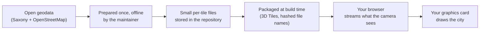
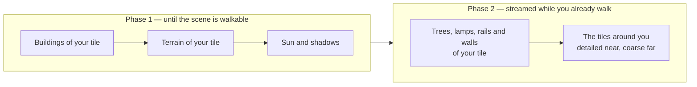

# How the city walker works

*Deutsch: [So funktioniert der Stadtspaziergang](../de/how-it-works.md)*

This page explains, without assuming any background in geodata or 3D
graphics, what you are looking at when you open the viewer, where it all
comes from, and how much of it is "real". Terms in **bold** are explained in
the [glossary](./glossary.md).

## What you see

A stylised, walkable 3D model of the centre of Dresden: a square of
4 km × 4 km on both banks of the Elbe, with the historic Altstadt in the
south-west, the Inner and Outer Neustadt in the north and the Johannstadt
in the south-east. You start on the south-eastern quarter, near the
Carolabrücke, and can walk at street level or fly above the roofs.

Nothing is installed, nothing is stored about you, and no server computes
the picture. Your browser downloads prepared files as you move — about
4 MB for the tile you start on, up to about 17 MB if you visit every
corner — and your own graphics card draws every frame, using a library
called **three.js**.

The look is deliberately not photo-realistic. It is a soft, pastel,
"watercolour on paper" rendering: buildings are matte clay volumes, the
ground is coloured by land use rather than textured with aerial photos, and
a faint paper grain lies over the whole image. That is an artistic choice,
documented in the [art-direction notes](../../transformations.md).

## The one-picture summary

Every station in this picture is described in
[From download to browser](./data-journey.md); the datasets themselves in
[Where the data comes from](./data-sources.md).

## What the scene is made of

The scene is built from layers. Each layer comes from one or two datasets,
and each is a mix of measured fact and deliberate simplification.

| Layer | What it shows | Where it comes from | Real or stylised? |
|---|---|---|---|
| **Ground** | The shape of the terrain: river banks, the slope up to the Neustadt, embankments | The official 1 m terrain model (**DGM1**) | Real heights: a mesh of triangles that stays within 15 cm of the 1 m model near you (50 cm further away), dense where the ground bends. Vertical walls are ramps in the source; where OpenStreetMap knows a wall, the project stands it on the measured step |
| **Ground colours** | Roads grey, paths sand, meadows sage, forest moss, built-up areas pale clay, water blue | The official land-use map (**Basis-DLM**) | Real classification; the colours are a designed pastel palette, painted in your browser, not photographs |
| **Water** | The Elbe and smaller water bodies, with a gently moving surface and drifting mist | Basis-DLM water areas, laid on the real terrain | Real outline, invented ripples |
| **Buildings** | Every building with its real footprint, height and roof shape | The official 3D building model (**LoD2**), roughly 16,000 buildings and building parts in the four tiles | Real geometry. Facades are plain by design; there are no windows in the source data |
| **Building colours** | Roof colours; a subtle tint per building; a warm glow in shops and public buildings at dusk | Roof colour sampled from aerial photos (**DOP**); the rest derived from building attributes | Roof colours are real (about 83 % coverage), wall tints are synthesised |
| **Trees and hedges** | Individual trees with crowns of the measured height; the city's street and park trees; hedges and tree rows | Tree positions and heights from the difference between the surface model (**DOM1**) and the terrain model; the city of Dresden's **street-tree register** (position, height, crown width, species); trees in courtyards from the **laser scan**; hedges from **OpenStreetMap** at their laser-measured height; rows from Basis-DLM; greenness from the infrared aerial photo (**NDVI**) | Positions and heights are measured; street trees get a crown shape from their species (round, columnar, conifer, weeping …), the other crowns are generic |
| **Street lamps** | Lamp posts along streets and squares | **OpenStreetMap** | Real positions, default height |
| **Railways and bridges** | Tracks, ballast beds, bridge decks with arches or piers, station platforms | Basis-DLM (tracks, bridges), terrain and surface models (deck heights), OpenStreetMap (platforms, whether a bridge is an arch bridge) | Real alignment and deck heights; the structural detail is simplified |
| **Walls** | The Brühlsche Terrasse and other retaining walls and city walls | OpenStreetMap lines with their tagged heights | Real position, tagged or default height |
| **Sun, shadows and sky** | Sunlight for any date and time of day; blue hour, golden hour, night | Computed from the calendar, the clock and Dresden's latitude | Astronomically correct sun position; the colours are designed |
| **Atmosphere** | Distance haze, valley fog in the low ground, river mist, depth tint, paper grain | Computed in the browser; the valley fog reads the real terrain height | Artistic |

## How a visit unfolds

The scene is not loaded all at once, and it never has to be loaded
completely. The city is cut into 2 km tiles, and the viewer **streams**
them: it fetches what the camera can see, in detail near you and coarser
further away, and can let go of what you have left far behind. The first
picture needs only the tile you start on; the loading screen shows the
rest arriving:

Phase 1 ends when the loading screen says *begehbar* ("walkable"): the
overlay dissolves and you can move. Phase 2 continues in the background; a
small pill at the top of the screen counts the stages as they arrive.
Until everything around you is in, the horizon is deliberately hazy so the
missing tiles do not read as a cliff edge. After that the streaming simply
goes on as you move: a distant tile shows its buildings on coarse ground,
and gets its trees, lamps, rails and walls once you are close enough for
the detailed ground.

## What is real, what is not

**Measured, from official surveys:** terrain heights, building footprints,
heights and roof shapes, land use, water outlines, railway alignments,
bridge positions and deck heights, tree positions and heights, roof colours,
meadow greenness.

**Contributed by volunteers (OpenStreetMap):** street lamps, station
platforms, retaining walls with their heights, the structural type of
bridges. Completeness varies from street to street.

**Computed:** the sun position, all shadows, fog and haze, the depth of
field, the slow motion of leaves and water.

**Invented for the look:** the pastel palette, the paper grain and vignette,
the shape of tree crowns, the wall tint per building, the ripples on the
water, the warm windows at dusk (the *presence* of a shop or public building
is real; its lit windows are not).

**Not in the data at all:** windows and doors, facade materials, street
furniture other than lamps, vehicles, people, vegetation smaller than about
3 m, and anything indoors.

## Things worth knowing before you draw conclusions from the picture

- The datasets have **different dates**. The terrain was surveyed in late
  2024, the building model was generated in spring and summer 2025, the
  land-use map and the aerial photos have their own editions. A house that
  is new in one dataset may be missing in another. See the edition table in
  [Where the data comes from](./data-sources.md#dataset-editions-in-use).
- A tile is a 2 km square. At the **seams** between tiles a small step or a
  colour change can show, and tiles further away are drawn with coarser
  ground and without trees, lamps, rails or walls until you come closer.
- Aerial photos look slightly **sideways** at tall buildings, so a sampled
  roof colour can include a bit of facade. The sampling avoids the edge of
  each roof to reduce this.
- Tree **species** are unknown; every tree is the same generic shape, scaled
  to its measured height and tinted by how green it looked from the air.
- The building model contains **no bridges, walls or towers** for these
  tiles even though newer editions of the product may; that is why bridges
  and walls are rebuilt from other sources.

## Where to go next

- [Where the data comes from](./data-sources.md) — every dataset, where it
  was downloaded, what it is good at and what it is not, the licences.
- [From download to browser](./data-journey.md) — the stations of the data,
  what is the single source of truth, what is a derivative, what your
  browser actually receives.
- [Using the viewer](./using-the-viewer.md) — controls and the settings
  panel, explained label by label (the interface is in German).
- [Glossary](./glossary.md) — the abbreviations.
- For developers: [docs/README.md](../../README.md).
