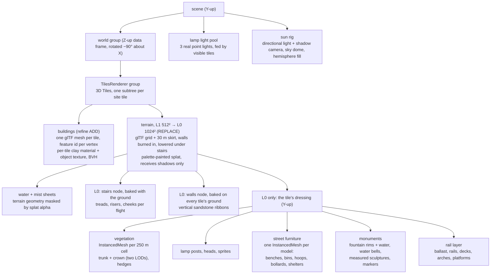
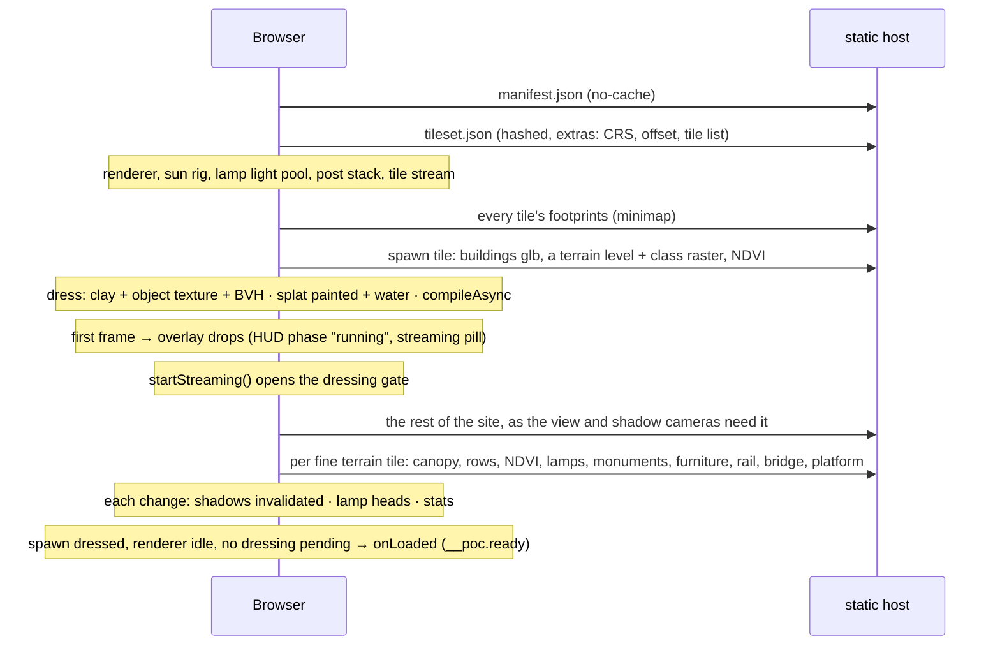

# Rendering — how the data becomes pixels

The developer map of the frame: what is in the scene graph, which dataset
attribute drives which visual variable, how light and post-processing are
layered, and where the frame budget goes. The *recipes* (the shadow setup
and its dead ends, the vegetation shaders, the QA harness) live in the
[city-walker skill](../.claude/skills/city-walker/SKILL.md); the *ledger*
of every transformation and its status is [transformations.md](./transformations.md).
This page is the overview that ties them together.

## Scene graph

Source data is projected (EPSG:25833 for Dresden; the site config names the
CRS, [ADR 0026](./adr/0026-one-site-config-per-build.md)) and Z-up. A
`world` group is rotated −90° about X so data-Z (elevation) becomes scene-Y
(up). The site streams into `world` as an OGC 3D Tiles tileset through
3DTilesRendererJS ([ADR 0024](./adr/0024-site-streams-as-3d-tiles.md)):
the tileset's frame *is* the recentered data frame, and the renderer turns
each Y-up glTF into it. That turn cancels the `world` group's, so a tile's
content root sits, in effect, in the scene's Y-up frame — which is why the
Y-up dressing (vegetation, lamps, monuments, street furniture, rails) hangs directly under the
fine terrain's content root and leaves with its tile. Mixing the frames up
applies the rotation twice (the classic "trees shoot skyward" bug).

Every tile's buildings get their **own clay material**: it binds that
tile's object texture, while the program and the live look uniforms are
shared (`visual-style.ts` `StyleResources`). Everything a tile adds —
material, object texture, BVH, splat, water, dressing — is disposed with it
(`disposeTile` in `tile-stream.ts`).

`x = epsgX − cx`, `z = −(epsgY − cy)`, `y = elevation`, with `(cx, cy)` the
recenter offset captured from the spawn tile's CityJSON at bake time, carried
in the tileset's root `extras` (`lib/city/tileset.ts`) and shared by every
tile (`lib/city/recenter.ts`, `lib/city/ground-clamp.ts`).

**Shaders derive data-frame positions from world space.** The streamed
glTF positions are quantised (the dequantisation sits on the node), so
`position` is not in metres; but `world` only rotates, so world (x, y, z)
is data (x, −z, y) exactly. The terrain, water and clay shaders read their
elevation and data-frame XY through that one chunk
(`app/_components/shader-chunks.ts` `DATA_POSITION`).

## Visual encoding — which data drives which pixel

The scene is a data visualisation as much as a game level: nearly every
visual variable is bound to an attribute of one of the datasets. This table
is the codebook.

| Visual variable | Driven by | Source | Where |
|---|---|---|---|
| Ground height | DGM resampled at build time to the terrain grid (1024² fine, 512² coarse); heights read back from the grid | DGM1 | `scripts/bake-tiles.ts`, `terrain-layer.ts`, `lib/city/terrain-geometry.ts` |
| Ground shading | the grid's normals, pulled to straight up below ~12° of tilt (the DGM's micro-relief and the 8-bit normals lit as blotches); real slopes keep their shading | DGM1 | `terrain-layer.ts` (`TERRAIN_NORMAL`) |
| Ground step at walls | wall line + `kind` ∈ retaining/city/embankment/cliff, height ≥ 1.5 m, burned in at build time | OSM | `lib/city/terrain-conflate.ts` (probe 11 m each side, feather 11 m, clamp 18 m) |
| Contour lines | data-frame elevation (`DATA_POSITION`), 2 m minor / 10 m major; each set fades once its lines crowd closer than a few pixels, and on near-flat ground (< ~3 % grade) and under water, where the DGM's noise only drew squiggles | DGM1 | `terrain-layer.ts` (`CONTOUR_INK`) |
| Ground colour | land-cover class → the one palette, painted on the GPU into an sRGB, mipmapped, anisotropy-16 splat; the class PNG is decoded byte-exact by `lib/city/png-raster.ts`, never by the browser (WebKit colour-managed and dithered the ids into speckles) | Basis-DLM | `lib/city/landcover.ts`, `landcover-splat.ts`, `terrain-layer.ts` |
| Meadow lush ↔ dry | NDVI on class 1 only (`uMeadowNdvi`), read from a coarse mip (~10 m) so it drifts rather than flecks | DOP | `terrain-layer.ts` |
| Meadow relief | low-frequency colour + normal mottle on class 1 | — (synth) | `GRASS_MOTTLE` / `GRASS_NORMAL` |
| Kerb stone | a 12 × 24 cm stone band on the kerb lines (the smoothed road edge), in the fine terrain glTF, casting | Basis-DLM (+ OSM islands) | `lib/city/kerbs.ts`, `kerb-layer.ts` |
| Kerb shadow | the road strip out to 0.12 m · cot(sun elevation) across the kerb, when the sun stands behind it: −28 % | Basis-DLM + sun | `ground-detail.ts` (`uSunDir`) |
| Kerb band | signed distance (m) to the road edge, baked and smoothed (`edges_<t>.png`; else the class texels box-smoothed): a pale band 0.25 m on the pavement side, a gutter 0.35 m on the road side; only where the far side is ground (classes 0–4, 6); fades out past ~0.5 m/px (*Bodendetail*) | Basis-DLM | `ground-detail.ts` |
| Lawn edge | the same distance for the meadow (urban green included): a darker lip 0.25 m and a normal kink | Basis-DLM (+ DOP) | `ground-detail.ts` |
| Paving pattern | OSM `surface` on the road (class 7) and on the pavement (the rest), the way direction orienting slabs and sett rows; unknown → asphalt on the road, slabs on class 4, sand on class 6; joints fade out past ~5 cm/px, the material's tint stays | OSM (+ Basis-DLM class) | `ground-detail.ts`, `surface_<t>.png` |
| Parking bays | the paving raster's parking bits: on the carriageway a lane 2 m (parallel, bays every 5.5 m) or 5 m (perpendicular, every 2.5 m) from the kerb with its edge line; in a car park bay lines every 2.5 m across the aisle direction, aisles left clear; pale paint, faded out past ~15 cm/px | OSM | `ground-detail.ts` |
| Sports ground surface | OSM `leisure=pitch` / `track`: its `surface`, else the sport's usual one, in pastels (`lib/city/sport.ts`) over an exact analytic outline (rotated rectangle, a track's capsule band, else the mapped outline) chosen from up to eight candidate rows of the index raster; mown stripes (~5.5 m) on grass, fine grain on the rest (*Bodendetail*) | OSM | `sport-ground.ts`, `sport_<t>.png` + `.json` |
| Sports ground lines | the sport's lines at their standard dimensions (football, tennis, basketball, volleyball, handball / multi-sport court, running lanes 1.22 m, a chess board), scaled to fit a smaller ground; 12 cm, box-filtered over the pixel footprint (a steady hairline from afar), chalk white, blue tape on sand | OSM | `sport-ground.ts` |
| Goals, posts, nets | football / handball goals on the goal lines, basketball posts behind the baselines, nets across tennis and volleyball courts; pale-clay bars (casting), the nets a translucent lavender-grey — the street furniture's palette and matte material; fine level only | OSM (+ DGM1 ground) | `sport-fixtures.ts`, `lib/city/sport.ts` `sportFixtures` |
| Urban green | the edge raster's meadow side on classes 0 and 4 (NDVI > 0.3, not OSM-paved) → painted exactly as meadow: colour, mottle, NDVI tint, lawn edge (*Stadtgrün*) | DOP | `ground-detail.ts` `urbanGreen`, `edges.py` |
| Water extent + shoreline | splat alpha (3×3 tent over class 8), `smoothstep`ed | Basis-DLM | `landcover-splat.ts`, `water-layer.ts` |
| Water ripple, glitter, sky tint | time, sun direction, fog palette; the sheet shades from a level normal, not the terrain grid's | — (synth) | `water-layer.ts` |
| River mist | water mask blurred over ~20 m (coarse mip, five taps) so it thins out over the banks; two drifting fbm layers, no threshold; thinned within ~90 m of the eye | Basis-DLM (mask) | `createWaterMist` (*Flussnebel*) |
| Building silhouette | solid geometry | LoD2 | `city-layer.ts` |
| Per-building attributes (the rows below) | `_FEATURE_ID_0` per vertex → `EXT_structural_metadata` property table → RGBA32F texture, three texels per object, `texelFetch`ed per vertex | LoD2 (+ DOP) | `city-layer.ts`, `lib/city/city-mesh.ts` `packObjectTexels`, `visual-style.ts` |
| Wall tint | `hash(objectid)` + `function` family + `measuredHeight` nudge, palette by `Site.facades` (render / brick) (column `tint`) | LoD2 (+ synth) | `lib/city/building-tint.ts` at bake time (*Farbvariation*) |
| Roof colour | DOP median per roof when sampled, else palette from `roofType` / `Dachneigung` (column `roof`) | DOP, LoD2 | `roofColor()`, baked into the property table (*Dachfarbe*) |
| Roof chroma | hue-preserving vibrance lift, strongest on drab roofs | — | `visual-style.ts` (*Dachsättigung*) |
| Storey bands | `storeyHeight(measuredHeight)` (column `storeyH`; the storeys attribute is ~4 % populated) | LoD2 | `visual-style.ts` (*Höhenlinien*) |
| Eave line | min RoofSurface Z per building (column `eaveH`) | LoD2 geometry | (*Traufkante*) |
| Ground darkening on walls | height above the building's own base (column `baseZ`) | LoD2 geometry | (*Boden-Verlauf*) |
| Rim light | view/normal/sun geometry | — | (*Streiflicht*) |
| Dusk glow | `function` ∈ commerce/public/special (column `glow`) × `nightFactor` | LoD2, sun | (*Abendlicht*) |
| Roughness jitter | `hash(objectid)` (column `rough`) → [0.55, 1.0] | — | (*Materialstreuung*) |
| Transparency | slider, hash-dithered (no transmission) | — | (*Transparenz*) |
| Tree position and height | canopy point + `h` (3–45 m); rows every 9 m along `veg04_l` | DOM1−DGM1, Basis-DLM | `vegetation-layer.ts` |
| Tree gate | none on classes 5–8 | Basis-DLM | `pipeline/bake/canopy.py` |
| Crown colour | NDVI 5×5 footprint max, recentred on the median | DOP | `crownColor` (+ hash sage fallback) |
| Crown motion | wind sway (vertex), leaf flutter, sway-coupled brightness | — | (*Blattflimmern*, *Windhelligkeit*) |
| Crown detail | distance (in 220 m / out 300 m per 250 m chunk) | — | `updateLod` (*Detaillierte Kronen*) |
| Hedge | box instances every 1.1 m along `veg04_l` where `BWS=1100` | Basis-DLM | `vegetation-layer.ts` |
| Lamp post | point, 5 m default; none on classes 5 and 8 | OSM | `lamp-layer.ts`, `pipeline/bake/lamps.py` |
| Lamp light | nearest three heads of the visible tiles get a real point light; the rest emissive + sprites, all × `nightFactor` | OSM, sun | `MAX_REAL_LAMPS = 3` |
| Street furniture | OSM point → one small abstracted model per kind (bench, backless bench, picnic table, bin, bicycle hoop, bollard — stone or metal, at its tagged height —, post box, stop shelter): softened blocks, capsules, tube strokes in the scene's pastels, vertex-coloured under one matte material; front turned to the bake's bearing `a` (OSM `direction`, else the nearest highway), a bench stretched to its mapped length `l`, a stand as `n` hoops 0.9 m apart; none on classes 5 and 8 or bridge decks | OSM | `furniture-layer.ts`, `lib/city/furniture.ts`, `pipeline/bake/furniture.py` |
| Playground | OSM outline → a pale sand floor 4 cm over the ground, skirted 0.2 m; the mapped equipment only stands on it, each piece one soft single-coloured sculpture in a pastel from the scene at the buildings' brightness (swing = an arch with a pill seat, dusk blue; slide = an extruded wave, peach; climbing frame = a faceted dome, sage; springy = an egg on a stem, butter; seesaw = a plank on a half-round, lilac; roundabout = a rimmed disc; playhouse = an extruded house silhouette; sandpit = sand in a rounded sage frame); a sandpit area a sand slab 6 cm above | OSM | `furniture-layer.ts` (`addSlab`), `lib/city/furniture.ts` |
| Fountain basin | OSM outline → clay rim (+0.35 m over the highest ground; 0.2 m for `water=reflecting_pool`, none for `fountain=splash_pad`), water = the 0.35 m inset; a point → 2.2 m round basin | OSM, Basis-DLM | `monument-layer.ts`, `pipeline/bake/monuments.py` |
| Fountain jets | a translucent water bell (lathe, alpha fading along the falling curtain; breathes ±7 % on a per-jet phase, streaks run down the curtain; warm glow × `nightFactor`), `0.3·√area` tall, clamped 1.2–4.5 m; one centred, or four round a measured sculpture (only those on the water) | OSM | `jetHeight`, `jetPlaces` (`lib/city/monuments.ts`), `unitBell` |
| Monument / fountain sculpture | `relief` (nDOM patch, 1 m) → ×4 bilinear, one [1 2 1] pass, fringe below 0.08 m sunk; heights over the terrain per sample; the buildings' clay; a fountain's sculpture uplit warm × `nightFactor`, fading over its lowest 2.5 m above the water | DOM1 − DGM1, Basis-DLM | `reliefSurface`, `reliefMesh`, `uplight` |
| Fountain water | three crossing swells perturb the normal and the emissive (shimmer); a cool glow × `nightFactor` | — | `animateWater` |
| Unmeasured statue / stone / column | abstract clay marker: rounded pillar 2.2 m · slab 1 m · shaft 4.5 m, a stable yaw from the position | Basis-DLM | `MARKER_SHAPE` |
| Canopy on a monument | a canopy point on a relief cell is dropped (the DOM1 "tree" was the monument) | DOM1, Basis-DLM | `onRelief` |
| Ballast surface | dissolved `ver03_f` polygons, ground-clamped per vertex | Basis-DLM | `rail-layer.ts` |
| Rails | `ver03_l` lines × `tracks` (1–3 pairs at `TRACK_PITCH`), draped or lifted onto a deck | Basis-DLM | `buildRails` |
| Bridge deck | `ver06_f`/`ver06_l` ring with per-vertex `deck` height, width by `kind` | Basis-DLM + DGM1/DOM1 | `rail-layer.ts` |
| Bridge underside | `structure` contains `arch` → spandrel arches on river piers; else box piers | OSM | `addArches` |
| Platform | `railway=platform` polygons, terrain-clamped | OSM | `rail-layer.ts` |
| Wall ribbon | line + `h`, base on every tile's shaped fine ground, top on the high shelf — baked into the fine terrain glTF | OSM | `lib/city/walls.ts` at build, `wall-layer.ts` (material) |
| Raised terrace | a `layer` ≥ 1 OSM area a lifted flight lands on: the ground inside lifted to its level `z` at build | OSM (+ tagged steps) | `lib/city/stairs.ts` `raiseTerraces` |
| Ground under stairs | flight axis + `w` + landings `z`: under the flight set to 12 cm below the ramp (lifted where the DGM runs below — the walkable ground); beside it, out to `w`/2 + 1.5 cells, only lowered, never across a wall | OSM + DGM1 | `lib/city/stairs.ts` `burnStairs` |
| Steps | `n` treads at z0 + (k+1)·rise across `w`, cheeks down to z0 − 0.6 m; sandstone `0xc4b090`, risers × 0.62, cheeks × 0.8 — baked into the fine terrain glTF (vertex colours) | OSM + DGM1 | `lib/city/stairs.ts` `stairGeometry`/`stairColors` at build, `stair-layer.ts` (material) |
| Sun direction | date + time + the site's lat/lng (suncalc 2, north-based azimuth) | — | `lib/city/sun.ts`, `sun-rig.ts` |
| Sky, fog and fill colours | sun altitude through palette stops at −18°, −4°, −2° (blue hour), +1°, +6° (golden hour), +12°, +60° | — | `lib/city/atmosphere.ts` |
| Valley fog | world height below a floor derived from the lowest terrain landed so far | DGM1 | `height-fog.ts` (*Talnebel*) |
| Distance fog | slider; far plane clamped to ~1.1 km until the site has first loaded | — | `create-app.ts` (*Nebel*) |
| Site-edge haze | distance to the site's outer tile edge: everything fades into the fog colour over the last 450 m (never within ~60 m of the eye) | tile bounds | `height-fog.ts` (`SITE_EDGE_FADE_M`) |
| Horizon haze | the sky dome blends into the fog colour below the horizon and feathers up to ~16°, so the data's edge, the fog and the sky meet in one band | — | `sun-rig.ts` (`uHazeColor`) |
| Depth tint | screen depth → warm near / cool far | — | `depth-grading-effect.ts` (*Tiefenfärbung*) |
| Contact shadows | N8AO at half resolution, never motion-gated | — | `post-stack.ts` (*Kontaktschatten*) |
| Depth of field | crosshair raycast distance, focus range 1.6 × distance (≥ 45 m), bokeh scale 0.5 — a hint of lens, not a tilt-shift; off while moving | — | `post-stack.ts` (*Tiefenschärfe*) |
| Paper grain, vignette | screen-space | — | `paper-grain-effect.ts` (*Papierkorn*) |
| Minimap | site tile bounds + 2048² class raster in the palette + footprints of the visible tiles | DGM1, Basis-DLM, LoD2 | `minimap.tsx`, `lib/city/minimap.ts` |

Every slider in the HUD is one row of `lib/city/look-controls.ts`; the
German label in parentheses above is the slider that scales the term. The
palette in `lib/city/landcover.ts` is the only place a land-cover colour
is spelled: changing one is a look change, not a re-bake
([ADR 0023](./adr/0023-land-cover-colours-painted-at-runtime.md)).

## Light and shadow

- **Sun:** one `DirectionalLight` whose direction comes from suncalc for the
  chosen instant (2.x reports degrees with a north-based azimuth; the 1.x →
  2.x flip rotated the sun by 180° until the tests caught it). A physical
  `Sky` dome with drifting fbm clouds and a `HemisphereLight` take their
  colours from the altitude palette. The dome is tempered (a little less
  radiance and chroma — untouched, its lower third tone-maps to paper white)
  and dissolves into the fog colour at and below the horizon: past the
  last tile there is no ground, only haze. Its clouds start a few degrees
  up — lower, the cloud plane's projection crowded them into one sunlit
  white sheet along the horizon.
- **Shadow map:** `PCFShadowMap` with a raised `shadow.radius` (three r182
  made PCF the soft option and deprecated `PCFSoftShadowMap`), 3072² on
  desktop, 2048² on phones, 512² in the lite profile. Terrain **receives
  only**. `normalBias = 0`, a small negative `bias`. The frustum follows the
  camera, half-size 110 m at eye level growing in octaves to 880 m with
  altitude, centred on the ground and pushed ahead along the view
  (`lib/city/shadow-fit.ts`). It re-renders only when the centre leaves a
  dead zone (18 % of the half-size), the size re-fits, the sun moves or a
  caster changes (`invalidateShadows()` — the crown LOD swap included, and
  every tile that lands, leaves or changes visibility through the stream's
  change hook). Animated geometry (sway, clouds) deliberately does **not**
  update it.
- **The shadow camera streams.** The sun's shadow camera is registered
  with the tiles renderer as a second camera, at the shadow map's
  resolution, so a tile that casts into the view stays loaded even when it
  is behind the player. `displayActiveTiles` keeps every loaded tile drawn
  (turning on the spot never blinks one); three's own frustum culling keeps
  the off-screen ones out of the main pass.
- **Lamps at night:** a `nightFactor = smoothstep(2°, −6°)` of sun altitude
  fans out to lamp heads, sprites and the building dusk glow. Real point
  lights are a fixed pool of three, allocated before the first frame and
  retargeted to the nearest heads of the visible tiles' dressings (re-fed on
  every stream change), because three.js bakes the light count into every
  compiled program.

The full recipe with its rejected alternatives (VSM rings, large
`normalBias`, 4096 maps, a bigger eye-level frustum) is in the skill and in
[ADR 0009](./adr/0009-shadow-recipe.md).

## Post-processing

`render → N8AO (half-res, depth-aware upsample) → depth of field (skipped
while moving) → one EffectPass: SMAA + depth grading + vignette + paper
grain`. The composer bypasses the renderer's MSAA (`antialias: false`);
SMAA carries the anti-aliasing. `halfRes`, `aoSamples` and
`denoiseSamples` rebuild N8AO's materials and are therefore
construction-time settings. 3DTilesRendererJS's fade and overlay plugins
patch materials with `onBeforeCompile` and are deliberately not used.

## The frame budget

The bottleneck is **fill-rate** (post FX and the shadow depth pass), not
draw calls: buildings are one mesh per tile, vegetation one instanced mesh
per 250 m cell. Two orthogonal switches size the work
(`app/_components/scene-profile.ts`), and the tiles renderer decides how
much of the site is loaded (screen-space error target 16 px, an LRU cache):

| Knob | full · desktop | full · mobile | lite (tests) |
|---|---|---|---|
| Tiles | the whole site streams (`tileset.json`) | same | spawn tile only (`tileset-spawn.json`; `&block=1` streams the site) |
| Terrain grid | L0 1024² near, L1 512² beyond (≈1.2 km at 1080p) | same | same |
| Shadow map | 3072² | 2048² | 512² |
| Pixel ratio | ≤ 2 | ≤ 1.5 | 0.5 |
| Land-cover rasters | L0 4096², L1 2048² | 2048² everywhere | L0 4096², L1 2048² |
| N8AO quality | Medium | Medium | Performance |

What one site tile costs (Dresden, as published; the `.glb.gz` are
pre-gzipped glTF with meshopt compression and quantised positions):

| Content | Wire size per tile | Triangles |
|---|---|---|
| buildings `city_<tile>.glb.gz` | 1.1–1.5 MB | ≈143 k on the spawn tile |
| fine terrain `terrain_<tile>_l0.glb.gz` | 1.5–2.0 MB | ≈2.1 M (1024² grid + skirt) |
| coarse terrain `terrain_<tile>_l1.glb.gz` | 0.4–0.55 MB | ≈0.53 M (512² grid + skirt) |
| footprints (minimap) | 0.23–0.33 MB | — |
| class raster 4096² / 2048² | 0.22–0.25 / ≈0.08 MB | — |
| NDVI raster | 0.3–0.45 MB | — |
| paving raster (fine level) | 0.6–0.86 MB | — |
| edge raster (fine level) | 0.34–0.46 MB | — |
| kerb stones (in the fine terrain) | ≈ 0.2–0.4 MB | ≈ 130–200 k |
| canopy points (fine level) | 0.6–1.8 MB | — |

Before the tileset a tile was ≈1.0 MB of buildings plus a 1.1 MB
heightfield; quantised meshes cost more on the wire than a height blob,
the price of a standard format
([ADR 0024](./adr/0024-site-streams-as-3d-tiles.md)). The terrain is the
triangle-heavy layer, but it never casts, so it stays out of the shadow
depth pass.

While the camera moves, DoF is dropped and restored after 250 ms of
stillness (`lib/city/regression.ts`); SSAO stays on because gating it made
contact shadows blink on every step.

## Boot sequence

The **first frame** waits on the spawn tile's buildings and *any* of its
terrain levels (`bootApp` in `create-app.ts`); the player is then placed
again on the spawn tile's ground, which did not exist when the pose was
first set. Everything else is the tiles renderer's call: it loads and
unloads by screen-space error from both cameras, and a `DressingPlugin`
(`tile-stream.ts`) dresses each landing tile inside the renderer's own
load, so no tile is shown half-dressed. Before a tile or a dressing shows,
its shaders are compiled with `compileAsync` against the target the scene
pass renders into (`PostStack.compile`), so a landing tile never compiles
inside a frame. The heavy dressing — vegetation,
lamps, monuments, rails — waits behind a gate the HUD opens after the handover
(`startStreaming`, [ADR 0008](./adr/0008-progressive-two-phase-boot.md)'s
second phase) and is built one tile at a time. **Ready** (`onLoaded`,
`__poc.ready`) is the first moment after the gate at which the spawn tile
is dressed, the renderer is idle and no dressing is pending; it also lifts
the fog clamp. A tile that fails to load leaves a hole and one `onError`
message; a dressing that fails leaves its tile bare — neither takes the
scene down. Collision, demolish, autofocus and double-tap work on every
visible tile; the two ground rays (double-tap travel, autofocus) march the
terrain's height grid (`lib/city/ground-ray.ts`) — the terrain has no BVH.

The HUD's five load stages and their weights are declared once in
`lib/city/load-stages.ts`. The first three are the first frame; the other
two measure **what the cameras see**, not the whole site: *Umgebung* is
the tile renderer's own load progress, *Details* the dressings built
against those queued. Both only move forward. Once everything in view is
in, the pill leaves; later loads (a flight) show a small, late *Umgebung
lädt* hint instead (`onBusy`). The minimap loads every tile's footprints
up front (named in the tileset's root extras), so it is complete from the
start.

## Verifying a change

Headless CI runs the lite profile under SwiftShader and asserts *presence*
(a per-layer scene census on `__poc.stats.layerStats`, frame counts,
shadow re-render counts), never looks. Anything visual is judged on a real
GPU with the snapshot harness: drop a Snapshot JSON into `shots/` and run
`bun run shots`. Judge from oblique angles. The streaming tuning (error
thresholds, cache budget, tile seams, the painted shoreline) is still
waiting for that look: [plan 019](./plans/019-gpu-verification.md).
