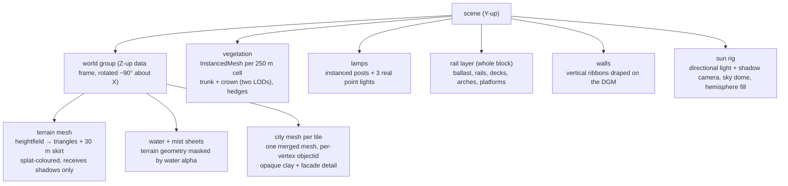
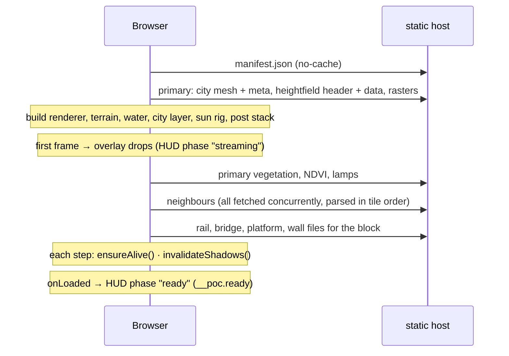

# Rendering — how the data becomes pixels

The developer map of the frame: what is in the scene graph, which dataset
attribute drives which visual variable, how light and post-processing are
layered, and where the frame budget goes. The *recipes* (the shadow setup
and its dead ends, the vegetation shaders, the QA harness) live in the
[city-walker skill](../.claude/skills/city-walker/SKILL.md); the *ledger*
of every transformation and its status is [transformations.md](./transformations.md).
This page is the overview that ties them together.

## Scene graph

Source data is EPSG:25833 and Z-up. A `world` group is rotated −90° about
X so data-Z (elevation) becomes scene-Y (up); layers that are built from
data-frame geometry live in `world`, layers that compute their own Y-up
positions live directly in `scene`. Mixing them up applies the rotation
twice (the classic "trees shoot skyward" bug).

`x = epsgX − cx`, `z = −(epsgY − cy)`, `y = elevation`, with `(cx, cy)` the
recenter offset captured from the primary tile's building bake and shared by
every tile (`lib/city/recenter.ts`, `lib/city/ground-clamp.ts`).

## Visual encoding — which data drives which pixel

The scene is a data visualisation as much as a game level: nearly every
visual variable is bound to an attribute of one of the datasets. This table
is the codebook.

| Visual variable | Driven by | Source | Where |
|---|---|---|---|
| Ground height | heightfield sample | DGM1 | `terrain-layer.ts`, `lib/city/terrain-geometry.ts` |
| Ground step at walls | wall line + `kind` ∈ retaining/city/embankment, height ≥ 1.5 m | OSM | `lib/city/terrain-conflate.ts` (probe 11 m each side, feather 11 m, clamp 18 m) |
| 🧪 Ground mesh density (`?terrain=tin`) | vertices where the native 1 m DGM1 bends, ±0.15 m everywhere; walls' ribbons snap to the measured step (face at the ramp foot, cap to the crest) | DGM1 (+ OSM walls for the ribbon) | `lib/city/terrain-tin.ts`, `lib/city/wall-snap.ts` |
| Ground colour | land-cover class (pastel palette), anisotropy-16 sampled | Basis-DLM | `extract-dlm.sh` palette, `terrain-layer.ts` |
| Meadow lush ↔ dry | NDVI on class 1 only (`uMeadowNdvi`) | DOP | `terrain-layer.ts` |
| Meadow relief | low-frequency colour + normal mottle on class 1 | — (synth) | `GRASS_MOTTLE` / `GRASS_NORMAL` |
| Water extent + shoreline | splat alpha, `smoothstep`ed | Basis-DLM | `water-layer.ts` |
| Water ripple, glitter, sky tint | time, sun direction, fog palette | — (synth) | `water-layer.ts` |
| River mist | water mask + sun, drifting | Basis-DLM (mask) | `createWaterMist` |
| Building silhouette | solid geometry | LoD2 | `city-layer.ts` |
| Wall tint | `hash(objectid)` + `function` family + `measuredHeight` nudge | LoD2 (+ synth) | `lib/city/building-tint.ts` (*Farbvariation*) |
| Roof colour | DOP median per roof when sampled, else palette from `roofType` / `Dachneigung` | DOP, LoD2 | `roofColor()`, baked into the mesh meta (*Dachfarbe*) |
| Roof chroma | hue-preserving vibrance lift, strongest on drab roofs | — | `visual-style.ts` (*Dachsättigung*) |
| Storey bands | `storeyHeight(measuredHeight)` (the storeys attribute is ~4 % populated) | LoD2 | `visual-style.ts` (*Höhenlinien*) |
| Eave line | min RoofSurface Z per building | LoD2 geometry | (*Traufkante*) |
| Ground darkening on walls | height above the building's own base | LoD2 geometry | (*Boden-Verlauf*) |
| Rim light | view/normal/sun geometry | — | (*Streiflicht*) |
| Dusk glow | `function` ∈ commerce/public/special × `nightFactor` | LoD2, sun | (*Abendlicht*) |
| Roughness jitter | `hash(objectid)` → [0.55, 1.0] | — | (*Materialstreuung*) |
| Transparency | slider, hash-dithered (no transmission) | — | (*Transparenz*) |
| Tree position and height | canopy point + `h` (3–45 m); rows every 9 m along `veg04_l` | DOM1−DGM1, Basis-DLM | `vegetation-layer.ts` |
| Tree gate | none on classes 5–8 | Basis-DLM | `extract-canopy.sh` |
| Crown colour | NDVI 5×5 footprint max, recentred on the median | DOP | `crownColor` (+ hash sage fallback) |
| Crown motion | wind sway (vertex), leaf flutter, sway-coupled brightness | — | (*Blattflimmern*, *Windhelligkeit*) |
| Crown detail | distance (in 220 m / out 300 m per 250 m chunk) | — | `updateLod` (*Detaillierte Kronen*) |
| Hedge | box instances every 1.1 m along `veg04_l` where `BWS=1100` | Basis-DLM | `vegetation-layer.ts` |
| Lamp post | point, 5 m default | OSM | `lamp-layer.ts` |
| Lamp light | nearest three heads get a real point light; the rest emissive + sprites, all × `nightFactor` | OSM, sun | `MAX_REAL_LAMPS = 3` |
| Ballast surface | dissolved `ver03_f` polygons, ground-clamped per vertex | Basis-DLM | `rail-layer.ts` |
| Rails | `ver03_l` lines × `tracks` (1–3 pairs at `TRACK_PITCH`), draped or lifted onto a deck | Basis-DLM | `buildRails` |
| Bridge deck | `ver06_f`/`ver06_l` ring with per-vertex `deck` height, width by `kind` | Basis-DLM + DGM1/DOM1 | `rail-layer.ts` |
| Bridge underside | `structure` contains `arch` → spandrel arches on river piers; else box piers | OSM | `addArches` |
| Platform | `railway=platform` polygons, terrain-clamped | OSM | `rail-layer.ts` |
| Wall ribbon | line + `h`, base draped on the DGM | OSM | `wall-layer.ts` |
| Sun direction | date + time + Dresden lat/lng (suncalc 2, north-based azimuth) | — | `lib/city/sun.ts`, `sun-rig.ts` |
| Sky, fog and fill colours | sun altitude through palette stops at −18°, −4°, −2° (blue hour), +1°, +6° (golden hour), +12°, +60° | — | `lib/city/atmosphere.ts` |
| Valley fog | world height below a floor derived from the tiles' minimum elevation | DGM1 | `height-fog.ts` (*Talnebel*) |
| Distance fog | slider; far plane clamped to ~1.1 km while neighbours are missing | — | `create-app.ts` (*Nebel*) |
| Depth tint | screen depth → warm near / cool far | — | `depth-grading-effect.ts` (*Tiefenfärbung*) |
| Contact shadows | N8AO at half resolution, never motion-gated | — | `post-stack.ts` (*Kontaktschatten*) |
| Depth of field | crosshair raycast distance, focus range ∝ distance; off while moving | — | `post-stack.ts` (*Tiefenschärfe*) |
| Paper grain, vignette | screen-space | — | `paper-grain-effect.ts` (*Papierkorn*) |
| Minimap | tile bounds + class PNG + building footprints | DGM1, Basis-DLM, LoD2 | `minimap.tsx`, `lib/city/minimap.ts` |

Every slider in the HUD is one row of `lib/city/look-controls.ts`; the
German label in parentheses above is the slider that scales the term.

## Light and shadow

- **Sun:** one `DirectionalLight` whose direction comes from suncalc for the
  chosen instant (2.x reports degrees with a north-based azimuth; the 1.x →
  2.x flip rotated the sun by 180° until the tests caught it). A physical
  `Sky` dome with drifting fbm clouds and a `HemisphereLight` take their
  colours from the altitude palette.
- **Shadow map:** `PCFShadowMap` with a raised `shadow.radius` (three r182
  made PCF the soft option and deprecated `PCFSoftShadowMap`), 3072² on
  desktop, 2048² on phones, 512² in the lite profile. Terrain **receives
  only**. `normalBias = 0`, a small negative `bias`. The frustum follows the
  camera, half-size 110 m at eye level growing in octaves to 880 m with
  altitude, centred on the ground and pushed ahead along the view
  (`lib/city/shadow-fit.ts`). It re-renders only when the centre leaves a
  dead zone (18 % of the half-size), the size re-fits, the sun moves or a
  caster changes (`invalidateShadows()` — the crown LOD swap included).
  Animated geometry (sway, clouds) deliberately does **not** update it.
- **Lamps at night:** a `nightFactor = smoothstep(2°, −6°)` of sun altitude
  fans out to lamp heads, sprites and the building dusk glow. Real point
  lights are a fixed pool of three, allocated before the first frame and
  retargeted to the nearest heads, because three.js bakes the light count
  into every compiled program.

The full recipe with its rejected alternatives (VSM rings, large
`normalBias`, 4096 maps, a bigger eye-level frustum) is in the skill and in
[ADR 0009](./adr/0009-shadow-recipe.md).

## Post-processing

`render → N8AO (half-res, depth-aware upsample) → depth of field (skipped
while moving) → one EffectPass: SMAA + depth grading + vignette + paper
grain`. The composer bypasses the renderer's MSAA (`antialias: false`);
SMAA carries the anti-aliasing. `halfRes`, `aoSamples` and
`denoiseSamples` rebuild N8AO's materials and are therefore
construction-time settings.

## The frame budget

The bottleneck is **fill-rate** (post FX and the shadow depth pass), not
draw calls: buildings are one mesh per tile, vegetation one instanced mesh
per 250 m cell. Two orthogonal switches size the work
(`app/_components/scene-profile.ts`):

| Knob | full · desktop | full · mobile | lite (tests) |
|---|---|---|---|
| Tiles | primary + 3 neighbours | same | primary only (`&block=1` keeps the block) |
| Shadow map | 3072² | 2048² | 512² |
| Pixel ratio | ≤ 2 | ≤ 1.5 | 0.5 |
| Land-cover rasters | primary 4096², neighbours 2048² | 2048² everywhere | primary 4096² |
| N8AO quality | Medium | Medium | Performance |

While the camera moves, DoF is dropped and restored after 250 ms of
stillness (`lib/city/regression.ts`); SSAO stays on because gating it made
contact shadows blink on every step.

## Boot sequence

Everything after the first frame runs in `loadRest()` (`create-app.ts`);
a failure there degrades the scene (`onError`) but never takes the first
frame down. The HUD's six load stages and their weights are declared once
in `lib/city/load-stages.ts`.

## Verifying a change

Headless CI runs the lite profile under SwiftShader and asserts *presence*
(a per-layer scene census on `__poc.stats.layerStats`, frame counts,
shadow re-render counts), never looks. Anything visual is judged on a real
GPU with the snapshot harness: drop a Snapshot JSON into `shots/` and run
`bun run shots`. Judge from oblique angles.
