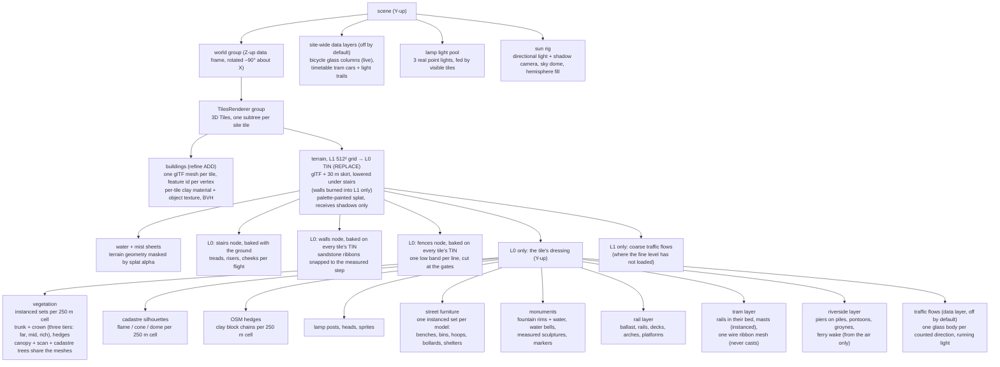
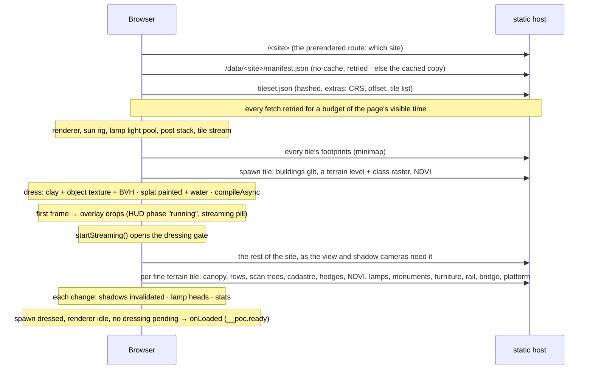

# Rendering — how the data becomes pixels

The developer map of the frame: what is in the scene graph, which dataset
attribute drives which visual variable, how light and post-processing are
layered, and where the frame budget goes. The *recipes* (the shadow setup
and its dead ends, the vegetation shaders, the QA harness) live in the
[city-walker skill](../.claude/skills/city-walker/SKILL.md); the *ledger*
of every transformation and its status is [transformations.md](./transformations.md).
This page is the overview that ties them together.

## Scene graph

Source data is projected (EPSG:25833 for Dresden; the site config names the
CRS, [ADR 0026](./adr/0026-one-site-config-per-build.md)) and Z-up. A
`world` group is rotated −90° about X so data-Z (elevation) becomes scene-Y
(up). The site streams into `world` as an OGC 3D Tiles tileset through
3DTilesRendererJS ([ADR 0024](./adr/0024-site-streams-as-3d-tiles.md)):
the tileset's frame *is* the recentered data frame, and the renderer turns
each Y-up glTF into it. That turn cancels the `world` group's, so a tile's
content root sits, in effect, in the scene's Y-up frame — which is why the
Y-up dressing (vegetation, lamps, monuments, street furniture, rails, trams) hangs directly under the
fine terrain's content root and leaves with its tile. Mixing the frames up
applies the rotation twice (the classic "trees shoot skyward" bug).


```mermaid
flowchart TB
  SCENE["scene (Y-up)"]
  WORLD["world group (Z-up data frame, rotated −90° about X)"]
  TILES["TilesRenderer group<br/>3D Tiles, one subtree per site tile"]
  SCENE --> WORLD
  WORLD --> TILES
  TILES --> CITY["buildings (refine ADD)<br/>one glTF mesh per tile, feature id per vertex<br/>per-tile clay material + object texture, BVH"]
  TILES --> TER["terrain, L1 512² grid → L0 TIN (REPLACE)<br/>glTF + 30 m skirt, lowered under stairs<br/>(walls burned into L1 only)<br/>palette-painted splat, receives shadows only"]
  TER --> WAT["water + mist sheets<br/>terrain geometry masked by splat alpha"]
  TER --> STAIR["L0: stairs node, baked with the ground<br/>treads, risers, cheeks per flight"]
  TER --> WALL["L0: walls node, baked on every tile's TIN<br/>sandstone ribbons snapped to the measured step"]
  TER --> FENCE["L0: fences node, baked on every tile's TIN<br/>one low band per line, cut at the gates"]
  TER --> DRESS["L0 only: the tile's dressing (Y-up)"]
  DRESS --> VEG["vegetation<br/>instanced sets per 250 m cell<br/>trunk + crown (three tiers: far, mid, rich), hedges<br/>canopy + scan + cadastre trees share the meshes"]
  DRESS --> INV["cadastre silhouettes<br/>flame / cone / dome per 250 m cell"]
  DRESS --> LOW["OSM hedges<br/>clay block chains per 250 m cell"]
  DRESS --> LAMP["lamp posts, heads, sprites"]
  DRESS --> FURN["street furniture<br/>one instanced set per model:<br/>benches, bins, hoops, bollards, shelters"]
  DRESS --> MON["monuments<br/>fountain rims + water, water bells,<br/>measured sculptures, markers"]
  DRESS --> RAIL["rail layer<br/>ballast, rails, decks, arches, platforms"]
  DRESS --> TRAM["tram layer<br/>rails in their bed, masts (instanced),<br/>one wire ribbon mesh (never casts)"]
  DRESS --> RIV["riverside layer<br/>piers on piles, pontoons, groynes,<br/>ferry wake (from the air only)"]
  DRESS --> TRAF["traffic flows (data layer, off by default)<br/>one glass body per counted direction, running light"]
  TER --> TRAFC["L1 only: coarse traffic flows<br/>(where the fine level has not loaded)"]
  SCENE --> DATA["site-wide data layers (off by default)<br/>bicycle glass columns (live),<br/>timetable tram cars + light trails"]
  SCENE --> LIGHTS["lamp light pool<br/>3 real point lights, fed by visible tiles"]
  SCENE --> SUN["sun rig<br/>directional light + shadow camera, sky dome, hemisphere fill"]
```

Every tile's buildings get their **own clay material**: it binds that
tile's object texture, while the live look uniforms are shared nodes
(`visual-style.ts` `StyleResources`). What carries no per-tile data —
crowns, trunks, hedges, fountains, furniture, wires — is one node material
for the whole scene (`three-utils.ts` `sceneMaterial`), and instanced layers
draw through `Instances` (`instancing.ts`) so every set with the same
material shares one node build. Everything a tile adds —
material, object texture, BVH, splat, water, dressing — is disposed with it
(`disposeTile` in `tile-stream.ts`).

`x = epsgX − cx`, `z = −(epsgY − cy)`, `y = elevation`, with `(cx, cy)` the
recenter offset captured from the spawn tile's CityJSON at bake time, carried
in the tileset's root `extras` (`lib/city/tileset.ts`) and shared by every
tile (`lib/city/recenter.ts`, `lib/city/ground-clamp.ts`).

**Materials derive data-frame positions from world space.** The streamed
glTF positions are quantised (the dequantisation sits on the node), so
`position` is not in metres; but `world` only rotates, so world (x, y, z)
is data (x, −z, y) exactly. Every material is a TSL node material on
`WebGPURenderer` ([ADR 0027](./adr/0027-webgpu-renderer-and-tsl.md)); the
terrain, water, clay and ground-light nodes read their elevation and
data-frame XY through one helper (`app/_components/shader-chunks.ts`
`dataXY`, `dataPosition`, `rasterUv`).

## Visual encoding — which data drives which pixel

The scene is a data visualisation as much as a game level: nearly every
visual variable is bound to an attribute of one of the datasets. This table
is the codebook.

| Visual variable | Driven by | Source | Where |
|---|---|---|---|
| Ground height + mesh density | fine level: an error-bounded TIN of the native 1 m DGM1 — vertices where the ground bends, within ±0.15 m everywhere; heights read from its triangles through a bucket index. Coarse level: the DGM resampled to 512², heights read back from the grid | DGM1 | `scripts/bake-tiles.ts`, `scripts/bake-terrain-tin.ts`, `lib/city/terrain-tin.ts` (`TinIndex`), `terrain-layer.ts`, `lib/city/terrain-geometry.ts` |
| Wall ribbon placement | earth-retaining walls snap to the step the fine TIN measures (face at the ramp foot, a coping cap back to where the ground reaches its level, per column); other walls on the OSM line | DGM1 + OSM walls | `lib/city/walls.ts`, `lib/city/wall-snap.ts` (at build) |
| Ground shading | the grid's normals, pulled to straight up below ~12° of tilt (the DGM's micro-relief and the 8-bit normals lit as blotches); real slopes keep their shading | DGM1 | `terrain-layer.ts` (`terrainNormal()`) |
| Ground step at walls (coarse level only) | wall line + `kind` ∈ retaining/city/embankment/cliff, height ≥ 1.5 m, burned into the 512² grid at build time | OSM | `lib/city/terrain-conflate.ts` (probe 11 m each side, feather 11 m, clamp 18 m) |
| Contour lines | data-frame elevation (`dataPosition`, `shader-chunks.ts`), 2 m minor / 10 m major; each set fades once its lines crowd closer than a few pixels, and on near-flat ground (< ~3 % grade) and under water, where the DGM's noise only drew squiggles | DGM1 | `terrain-layer.ts` (`contourInk()`) |
| Ground colour | land-cover class → the one palette, painted on the GPU into an sRGB, mipmapped, anisotropy-16 splat; the class PNG is decoded byte-exact by `lib/city/png-raster.ts`, never by the browser (WebKit colour-managed and dithered the ids into speckles) | Basis-DLM | `lib/city/landcover.ts`, `landcover-splat.ts`, `terrain-layer.ts` |
| Meadow lush ↔ dry | NDVI on class 1 only (`meadowNdvi`), read from a coarse mip (~10 m) so it drifts rather than flecks | DOP | `terrain-layer.ts` |
| Meadow relief | low-frequency colour + normal mottle on class 1 | — (synth) | `terrain-layer.ts`: `grassMottle()` (colour), `terrainNormal(true)` (normal) |
| Kerb stone | a 12 × 24 cm stone band on the kerb lines (the smoothed road edge), its face toward the road, its top falling to the pavement's level at the back (no second step on the pavement side), in the fine terrain glTF, casting | Basis-DLM (+ OSM islands) | `lib/city/kerbs.ts`, `kerb-layer.ts` |
| Kerb shadow | the road strip out to 0.12 m · cot(sun elevation) across the kerb, when the sun stands behind it: −28 % | Basis-DLM + sun | `ground-detail.ts` (`sunDirection`) |
| Kerb band | signed distance (m) to the road edge, baked and smoothed (`edges_<t>.png`; else the class texels box-smoothed): a pale band 0.25 m on the pavement side, a gutter 0.35 m on the road side; only where the far side is ground (classes 0–4, 6); fades out past ~0.5 m/px (*Bodendetail*) | Basis-DLM | `ground-detail.ts` |
| Lawn edge | the same distance for the meadow (urban green included): a darker lip 0.25 m and a normal kink | Basis-DLM (+ DOP) | `ground-detail.ts` |
| Paving pattern | OSM `surface` on the road (class 7) and on the pavement (the rest), the way direction orienting slabs and sett rows; unknown → asphalt on the road, slabs on class 4, sand on class 6; joints fade out past ~5 cm/px, the material's tint stays | OSM (+ Basis-DLM class) | `ground-detail.ts`, `surface_<t>.png` |
| Parking bays | the paving raster's parking bits: on the carriageway a lane 2 m (parallel, bays every 5.5 m) or 5 m (perpendicular, every 2.5 m) from the kerb with its edge line; in a car park bay lines every 2.5 m across the aisle direction, aisles left clear; pale paint, faded out past ~15 cm/px | OSM | `ground-detail.ts` |
| Sports ground surface | OSM `leisure=pitch` / `track`: its `surface`, else the sport's usual one, in pastels (`lib/city/sport.ts`) over an exact analytic outline (rotated rectangle, a track's capsule band, else the mapped outline) chosen from up to eight candidate rows of the index raster; mown stripes (~5.5 m) on grass, fine grain on the rest (*Bodendetail*) | OSM | `sport-ground.ts`, `sport_<t>.png` + `.json` |
| Road markings | OSM crossings (zebra: 0.5 m bars across the carriageway, 4 m wide; *Furt*: two broken 12 cm lines, 3 m apart), stop lines (0.5 m, 3 m before a directed signal, the right half), cycle lanes (a broken 25 cm line 1.85 m from the kerb on the tagged side), centre lines (12 cm, 3 m dashes in 8.25 m, two-way main roads with `lanes` ≥ 2); a warm off-white, worn, box-filtered, clipped to the carriageway; fine level only (*Bodendetail*) | OSM + Basis-DLM (the carriageway) | `road-markings.ts`, `markings_<t>.png` + `.json` |
| Sports ground lines | the sport's lines at their standard dimensions (football, tennis, basketball, volleyball, handball / multi-sport court, running lanes 1.22 m, a chess board), scaled to fit a smaller ground; 12 cm, box-filtered over the pixel footprint (a steady hairline from afar), chalk white, blue tape on sand | OSM | `sport-ground.ts` |
| Goals, posts, nets | football / handball goals on the goal lines, basketball posts behind the baselines, nets across tennis and volleyball courts; pale-clay bars (casting), the nets a translucent lavender-grey — the street furniture's palette and matte material; fine level only | OSM (+ DGM1 ground) | `sport-fixtures.ts`, `lib/city/sport.ts` `sportFixtures` |
| Urban green | the edge raster's meadow side on classes 0 and 4 (NDVI > 0.3, not OSM-paved) → painted exactly as meadow: colour, mottle, NDVI tint, lawn edge (*Stadtgrün*) | DOP | `ground-detail.ts` `urbanGreen`, `edges.py` |
| Water extent + shoreline | splat alpha (3×3 tent over class 8), `smoothstep`ed | Basis-DLM | `landcover-splat.ts`, `water-layer.ts` |
| Water ripple, glitter, sky tint | time, sun direction, fog palette; the sheet shades from a level normal, not the terrain grid's | — (synth) | `water-layer.ts` |
| River mist | water mask blurred over ~20 m (coarse mip, five taps) so it thins out over the banks; two drifting fbm layers, no threshold; thinned within ~90 m of the eye | Basis-DLM (mask) | `createWaterMist` (*Flussnebel*) |
| Building silhouette | solid geometry | LoD2 | `city-layer.ts` |
| Roofs rebuilt from the scan | where a LoD2 roof misses DOM1 (> 40 % of its cells > 2 m off: free-form roofs of complex buildings, 3 m placeholders of new ones), the object's triangles are replaced at bake time by what DOM1 measures inside its footprint — flat levels, and the measured surface where it slopes or curves (a pitched roof, a vault, a dome; an error-bounded TIN) — each part standing from the object's LoD2 base, same object id, so every row below applies unchanged; 886 objects on the site; a LoD2 roof whose form the scan confirms (the Frauenkirche's dome) is kept; faces shade with normals smoothed over them, creases > 30° kept (ADR 0036) | DOM1, LoD2 (+ DOP NDVI) | `scripts/measured-roofs.ts`, `bake-city-mesh.ts` `withMeasuredRoofs`; `pipeline/bake/roofs.py` |
| Small structures LoD2 lacks | a closed box per structure the laser scan measured (garden houses, sheds, container buildings): its rectangle, from the lowest ground under the rectangle (sunk 0.2 m) to the fitted top, flat or pent, no storey band; appended to the tile's building mesh as objects of their own (column `source` = 1), so the clay look, demolish, picking, collision and the minimap treat them as buildings; wall tint hashed from its first corner, the flat-roof slate palette, no glow; the canopy and scan points in or within 0.5 m of one are dropped at build time (its roof, read as a tree) | LSC (+ OSM exclusions, DOP NDVI) | `lib/city/small-buildings.ts`, `bake-city-mesh.ts` `appendScanStructures`; `pipeline/bake/small_buildings.py` |
| Structures beyond LoD2 | what DOM1 stands above `max(DGM1, LoD2 roof)` where OSM names it (column `source` = 2): a chimney, tower, mast, water tower, communications tower or lighthouse as a 16-sided column lathed from its kind's ring profile (a chimney's head band, a TV tower's cabin, a water tower's tank), foot to the measured top, radius from the outline / `diameter` / the gap blob (a chimney at least h/24); a building LoD2 lacks as its OSM outline extruded to the 60th percentile of the measured height, flat roof; a tower, lighthouse or water tower under a LoD2 roof is not drawn again (LoD2's own). Its own object and root (demolish, picking, collision, minimap); a column is not a `Building` (the HUD's count), and chimneys, towers and lighthouses take the brick palette with the roof tint = the wall's (no terracotta cap) | DOM1, DGM1, LoD2, OSM | `lib/city/structures.ts`, `bake-city-mesh.ts` `appendGapStructures`; `pipeline/bake/structures.py` |
| Landmark roof relief | on a landmark only, where DOM1 rises ≥ 3 m above its highest LoD2 roof on ≥ 60 m² (and ≥ 2 % of its footprint): the excess as its measured height field (1 m grid, lightly smoothed: half the cell, half a σ = 1 cell Gaussian over the patch) built as one surface, each corner the mean of the patch cells around it, walls along the patch's edge down to the cell's `floor` — the lowest LoD2 roof in the 3 × 3 around it, sunk 0.3 m (a tower LoD2 folded into a pitched nave stands on the slope, not at the ridge; surface-model voids below the LoD2 roof filled from the nearest measured cell in the bake) —, no bottom face — a truncated spire rises to a point, the Elbphilharmonie's crests roll over its flat 96 m block; a relief is a row that copies its host object (`of`) — tint, roof, flags, root — so it looks like the building and demolish takes it along; no footprint of its own (`source` = 2) | DOM1, LoD2, Wikidata | `lib/city/structures.ts` `reliefMesh`, `appendGapStructures`; `structures.py` `relief` |
| Per-building attributes (the rows below) | `_FEATURE_ID_0` per vertex → `EXT_structural_metadata` property table → RGBA32F texture, three texels per object, read per vertex with `textureLoad` | LoD2 (+ DOP, OSM) | `city-layer.ts`, `lib/city/city-mesh.ts` `packObjectTexels`, `visual-style.ts` |
| Wall tint | OSM `building:colour` when mapped, brought into the clay's register (hue kept, saturation ≤ 0.45, lightness held in [0.45, 0.9] plus the palette's jitter: a red wall is a dusty terracotta, not a signal red); else the palette family of OSM's `building:material` (brick → brick, stone/glass/metal → cool, concrete → neutral, wood/plaster → warm; for a landmark Wikidata's material where OSM has none); else `hash(objectid)` + `function` family (a part's own value, else its root Building's) + `measuredHeight` nudge, palette by the building's facade context — brick or plaster as the mapped walls within 300 m vote (distance-weighted; the tile's vote where fewer than 6 are mapped; glass and metal do not vote; `osm_buildings.py` `context`) (column `tint`). A part's own tags win over its building's | LoD2, OSM, Wikidata (+ synth) | `lib/city/building-tint.ts` `buildingTint`, `osmColourTint` at bake time (*Farbvariation*) |
| Roof colour | DOP median per roof when sampled; else OSM `roof:colour` in the clay's register (lightness [0.3, 0.8], saturation ≤ 0.45); else palette from `roofType` / `Dachneigung` (column `roof`) | DOP, OSM, LoD2 | `roofColor()`, baked into the property table (*Dachfarbe*) |
| Roof chroma | hue-preserving vibrance lift, strongest on drab roofs | — | `visual-style.ts` (*Dachsättigung*) |
| Storey bands | OSM `building:levels` → eave height ÷ storeys where that gives 2.4–5.5 m (`mappedStoreyHeight`); else `storeyHeight(measuredHeight)`, whole ~3.2 m storeys (column `storeyH`; LoD2's storeys attribute is ~4 % populated) | LoD2, OSM | `visual-style.ts` (*Höhenlinien*) |
| Eave line | min RoofSurface Z per building (column `eaveH`) | LoD2 geometry | (*Traufkante*) |
| Ground darkening on walls | height above the building's own base (column `baseZ`) | LoD2 geometry | (*Boden-Verlauf*) |
| Rim light | view/normal/sun geometry | — | (*Streiflicht*) |
| Dusk glow | `function` ∈ commerce/public/special (column `glow`; a BuildingPart takes its Building's `function` through `root`) × `nightFactor` | LoD2, sun | (*Abendlicht*) |
| Shop fronts | OSM shop / café on the ground floor (column `flags`, bit 1) → a warm wash under the first storey line, soft top edge, walls only, a ≈3.5 m hash along the facade; × dusk glow × `nightFactor`; no window structure | OSM, LoD2, sun | `visual-style.ts` `clayGlow` (*Abendlicht*) |
| Listed facades | OSM `heritage=*` (column `flags`, bit 2) → a barely-there warm lift of the wall tint and a finer second cornice 0.45 m under the eave | OSM, LoD2 | `visual-style.ts` `osmColour` (*Farbvariation*, *Traufkante*) |
| Glass facades | OSM `building:material=glass` (or Wikidata's, on a landmark; column `flags`, bit 4) → walls a little cooler (×(0.93, 0.99, 1.07)) and smoother (roughness 0.42), and a pale sky sheen at grazing angles (Fresnel³ on the *Streiflicht* slider, dimmed 70 % at night). No panes, no mullions (the window grid stays 🗃️) | OSM, Wikidata | `visual-style.ts` `osmColour` / `clayGlow` (*Streiflicht*) |
| Metal cladding | `building:material` metal / steel / aluminium / copper / zinc (column `flags`, bit 8) → a cooler wall at 60 % of the glass tint, roughness 0.5, no sheen | OSM, Wikidata | `visual-style.ts` `osmColour` / `clayGlow` |
| Landmark | a Wikidata landmark's objects (column `flags`, bit 16): no look of its own — the roof relief is measured on these objects only, and the HUD's *Wahrzeichen* list glides to the landmark | Wikidata, OSM `wikidata=` | `prepare-data.ts` `withLandmarks`, `lib/city/landmarks.ts` |
| Roughness jitter | `hash(objectid)` (column `rough`) → [0.55, 1.0] | — | (*Materialstreuung*) |
| The asked building | the probe's pick on a click, a long press or `I` (the whole building tree) → flag 32 in the packed texture at runtime: lifted 40 % towards paper white with a faint paper light of its own; a pencil hatch every 0.9 m on the building near (up the facade at 45°, across the roof), 45° strokes every 7 px in screen space where those would crowd; and the outline (below); no slider, the hatch not in *Papier* | the viewer's question | `inquiry-probe.ts`, `city-layer.ts` `mark`, `visual-style.ts` `askedColour` |
| The asked tree, monument or bridge | the probe's pick among the tile's askable things (ray vs. data solids; bridges vs. their drawn meshes) → the outline (next row) alone | the viewer's question | `inquiry-probe.ts`, `lib/city/ask-items.ts`, `bridge-ask.ts` |
| The asked traffic flow or bicycle counter | while its layer shows: a ray on the flow's drawn bodies (the vertex names its section) or on the counter's columns as tall as they stand → the outline alone, a flow's with the layer's own grown and widened positions, tested only against what stands in front of the glass | the viewer's question | `traffic-ask.ts`, `bike-ask.ts`, `lib/city/inquiry-traffic.ts` |
| The outline of the asked element | its triangles (a building's or bridge's own; a tree's crown and trunk, a monument's cylinder, a basin's prism as stand-ins) → a one-byte mask where the scene's depth shows them, blurred at half resolution by its own one-byte blur (GaussianBlurNode's kernel, `outlineKernel`) → the band 0.07–0.66 of the blur: one rounded line along the silhouette as seen now, 4.5 CSS px of the hatch's graphite on a hair of its paper, fwidth-smoothed; over the finished frame, in every picture style; mask and blur drawn only while something is asked | the viewer's question | `selection-outline.ts`, `selection-shape.ts`, `lib/city/outline.ts`, `post-stack.ts` |
| The inquiry card (HUD, not the scene; a bottom sheet on touch) | the fact columns (`buildingId`, ALKIS use, roof form and pitch, height, area, OSM name, address, storeys), a tree's register facts (`treefacts_<tile>.json`), a monument's or bridge's feature, and the provenance manifest (each source's edition and licence), on demand only | LoD2, OSM, `data/<site>/provenance.json` | `lib/city/object-facts.ts`, `lib/city/inquiry.ts`, `lib/city/provenance.ts`, `inquiry-card.tsx` (ADR 0042) |
| Transparency | slider, hash-dithered (no transmission) | — | (*Transparenz*) |
| Tree position and height | canopy point + `h` (3–45 m); rows every 9 m along `veg04_l` | DOM1−DGM1, Basis-DLM | `vegetation-layer.ts` |
| Tree gate | none on classes 5–8 | Basis-DLM | `pipeline/bake/canopy.py` |
| Crown colour | NDVI 5×5 footprint max, recentred on the median; where the DOP has no near-IR (Munich) the GLI from its RGB, mapped onto the NDVI's scale | DOP | `crownColor` (+ hash sage fallback) |
| Crown motion | wind sway (vertex), leaf flutter, sway-coupled brightness | — | (*Blattflimmern*, *Windhelligkeit*) |
| Crown detail | three tiers per 250 m chunk, decided over the whole site each frame: rich multi-tuft crown near (in 220 m / out 300 m) while the site's rich trees fit a budget of 2 500 (nearest chunks first), mid crown + trunk, far crown (80 tris, no trunk, dense chunks thinned to every other tree drawn 1.35× wider) past 650 m / back at 550 m | — | `lib/city/vegetation-lod.ts`, `updateVegetationLod` (*Multi-Tuft-Kronen (nah)*) |
| Coarse-level trees | a fixed third of the fine level's trees (a hash of where each stands), as tall, crowns √3 wider, in their colours and season, no trunks — wherever the tile renderer shows the coarse terrain: far off, from the air, in Modell past 2.5 m/px or wherever a coarsened stream or a load leaves the fine level out, at any scale; the fine level draws every tree | where each tree stands (`drawnCoarse`) | `coarse-crowns-layer.ts`, `lib/city/coarse-crowns.ts`, `scripts/coarse-crowns.ts`, `crowns_<t>.crw.gz` |
| Inventory tree | surveyed position, height `h`, crown diameter `d` → non-uniform instance scale; genus/cultivar → archetype (clear stem + crown shape: broadleaf / flame / tiered cone / weeping dome); leaf type + `Blut-`/gold cultivars → crown colour; trunk diameter `t` → trunk girth (fitted to the drawn trunk's radius at 1.3 m, flared foot included, × 1.3; else from the height); drops row/canopy trees inside its crown, except in DLM forest/copse (`f`); trunks + broadleaf crowns drawn in the canopy's chunk meshes; OSM `natural=tree` (`s: "osm"`) fills in where the register has no tree within 3 m | Stadtbaumkataster Dresden, OSM | `tree-inventory-layer.ts`, `lib/city/tree-inventory.ts` |
| Crown season | scene date (calendar day) + genus `gn` (± 6 days per tree) → `{ leaf, autumn }` (`lib/city/tree-season.ts`); `autumn` mixes the per-instance colour toward the genus hue, `aBare` = 1 − leaf discards the crown down to a 25 % grey-brown twig stipple (a hashed alpha test in crown space, ~1.25 px cells at every distance) and thins the shadow through the same discard in a custom depth material; evergreens constant, canopy/row trees a generic curve; written on a day change, never per frame | Stadtbaumkataster (genus), OSM | `crown-season.ts`, `vegetation-layer.ts` `buildCrownMaterial(…, bare)` |
| Hedge | box instances every 1.1 m along `veg04_l` where `BWS=1100` | Basis-DLM | `vegetation-layer.ts` |
| Allotment gardens | OSM `landuse=allotments`: a soft, slightly wandering edge (the baked distance to the garden land, LINEAR — paths, roads, rail and water cut out); inside, analytic plots ≈12 × 17 m (a jittered Voronoi in the colony's axis frame, meandering borders drawn as thin soft paths), each a lawn in one of a few soft greens — a third with warm vegetable beds, some with sparse pastel flower dots, the rest with darker shrub mottles — and a faint hedge green inside the rim; box-filtered, fading to the plots' tones and then to one calm tone with distance (0.85 of *Bodendetail*; no colony maps its parcels, so the plots are invented) | OSM | `cultivated-layer.ts`, `cultivated_<t>.png` |
| Orchard tree | OSM `landuse=orchard`: the mapped trees, else an 8 m grid along the long axis, less the spots a canopy, scan or inventory tree fills (4 m, or its crown), as the cadastre's "small" archetype | OSM | `tile-stream.ts` → `tree-inventory-layer.ts` |
| Vine row | OSM `landuse=vineyard`: rows 1.8 m apart along the contour, 1.3 × 0.5 m boxes (11 vineyards, 305 rows, on the Loschwitz slopes: 33414_5656, 33416_5654, 33416_5656) | OSM + DGM1 | `cultivated-layer.ts` |
| OSM hedge | polyline → ≤ 2.5 m superellipsoid pieces scaled to `h` × `w`; OSM line, LSC height where measured (else tag / 1.5 m) | OSM, LSC | `low-vegetation-layer.ts` |
| Extra tree | LSC crown peak + `h` outside the canopy mask and away from any cadastre tree, appended to the canopy points | LSC | `tile-stream.ts` → `vegetation-layer.ts` |
| Lamp post | point, 5 m default; none on classes 5 and 8 | OSM | `lamp-layer.ts`, `pipeline/bake/lamps.py` |
| Lamp light | nearest three heads of the visible tiles get a real point light; the rest emissive + sprites, all × `nightFactor` | OSM, sun | `MAX_REAL_LAMPS = 3` |
| Street furniture | OSM point → one small abstracted model per kind (bench, backless bench, picnic table, bin, bicycle hoop, bollard — stone or metal, at its tagged height —, post box, stop shelter): softened blocks, capsules, tube strokes in the scene's pastels, vertex-coloured under one matte material; front turned to the bake's bearing `a` (OSM `direction`, else the nearest highway), a bench stretched to its mapped length `l`, a stand as `n` hoops 0.9 m apart; none on classes 5 and 8 or bridge decks | OSM | `furniture-layer.ts`, `lib/city/furniture.ts`, `pipeline/bake/furniture.py` |
| Signs and fixtures | OSM point → advertising column (paper drum Ø 1.2 m, 2.7 m, a darker ring and dome, three pastel poster fields; `lit` ones emissive × `nightFactor`), traffic signal (3.2 m pole, a three-lamp head a shade deeper than the metal, facing `a`, unlit), pillar hydrant (0.8 m, red ochre), underground-hydrant sign plate on a post (one soft rose field, at 70 %), clock on a 3.5 m post (double face) or on a facade (one face, bracket to the wall), drinking fountain (1 m bronze column + basin), bus-stop "H" sign (2.6 m pole, a soft green disc in a yellow one — no letter —, timetable box); clock hands (soft slate) turned by the scene's time (`clockMinutes`, on the minute), never casting | OSM | `furniture-layer.ts` (`column`, `signal`, `hydrant`, `hydrantSign`, `poleClock`, `wallClock`, `drinkingWater`, `stopSign`, `clockHands`), `pipeline/bake/furniture.py` |
| Playground | OSM outline → a pale sand floor 4 cm over the ground, skirted 0.2 m; the mapped equipment only stands on it, each piece one soft single-coloured sculpture in a pastel from the scene at the buildings' brightness (swing = an arch with a pill seat, dusk blue; slide = an extruded wave, peach; climbing frame = a faceted dome, sage; springy = an egg on a stem, butter; seesaw = a plank on a half-round, lilac; roundabout = a rimmed disc; playhouse = an extruded house silhouette; sandpit = sand in a rounded sage frame); a sandpit area a sand slab 6 cm above | OSM | `furniture-layer.ts` (`addSlab`), `lib/city/furniture.ts` |
| Fountain basin | OSM outline → clay rim (+0.35 m over the highest ground; 0.2 m for `water=reflecting_pool`, none for `fountain=splash_pad`), water = the 0.35 m inset; a point → 2.2 m round basin | OSM, Basis-DLM | `monument-layer.ts`, `pipeline/bake/monuments.py` |
| Fountain jets | a translucent water bell (lathe, alpha fading along the falling curtain; breathes ±7 % on a per-jet phase, streaks run down the curtain; warm glow × `nightFactor`), `0.3·√area` tall, clamped 1.2–4.5 m; one centred, or four round a measured sculpture (only those on the water) | OSM | `jetHeight`, `jetPlaces` (`lib/city/monuments.ts`), `unitBell` |
| Monument / fountain sculpture | `relief` (nDOM patch, 1 m) → ×4 bilinear, one [1 2 1] pass, fringe below 0.08 m sunk; heights over the terrain per sample; the buildings' clay; a fountain's sculpture uplit warm × `nightFactor`, fading over its lowest 2.5 m above the water | DOM1 − DGM1, Basis-DLM | `reliefSurface`, `reliefMesh`, `uplight` |
| Fountain water | three crossing swells perturb the normal and the emissive (shimmer); a cool glow × `nightFactor` | — | `monument-layer.ts` `waterMaterial` |
| Unmeasured statue / stone / column | abstract clay marker: rounded pillar 2.2 m · slab 1 m · shaft 4.5 m, a stable yaw from the position | Basis-DLM | `MARKER_SHAPE` |
| Canopy on a monument | a canopy point on a relief cell is dropped (the DOM1 "tree" was the monument) | DOM1, Basis-DLM | `onRelief` |
| Ballast surface | dissolved `ver03_f` polygons (and their holes) draped on the ground — split where it strays > 1 m from a triangle, down to 6 m — 0.18 m up, a 0.45 m fascia; none on a rail deck | Basis-DLM | `rail-layer.ts` |
| Rails | `ver03_l` lines × `tracks` (1–3 pairs at `TRACK_PITCH`) on the level the whole line runs on (`lv`, ADR 0041): the ground, a rail deck, or a span over a gap the DGM leaves beside a bridge; none in a tunnel (a stretch > 15 m within 2 m of a DLM tunnel) and none of the DLM's trams. Without a DLM: OSM's rail ways (each track its own way, `tracks` from the tag), the same drawing | Basis-DLM (OSM without one) | `buildRails` |
| Bridge deck | `ver06_f`/`ver06_l` ring with per-vertex `deck` height (the roadway DOM1 measures, held near the DGM abutment ramp and within 8 % grade, 4 % on rail), width by `kind`, the top in its land-cover class colour (road, path, railway; stone otherwise) laid out by its frame on the axis (`aDeck`, per vertex of a top split to triangles of ≤ 6 m so it holds on a curve: a road deck's footways along both sides in the pavement's colour with slabs, kerb stone and gutter, the carriageway's grain and, on two lanes, the centre dashes; a path deck sand with kerbs; a rail deck the bed with walkways; stone paving otherwise — `bridge-surface.ts`), its fascia, the parapets, piers and masonry ashlar (courses, running-bond joints, a shade per block, a weathering mottle; the fine detail fading by the pixel's footprint), parapet walls along the sides only (none where a frame stands on the edge), closed from below; the deck line a straight ramp plus one upward camber fitted to the measurement, never sagging; slab `depth` = deck − (water + fairway clearance), 0.6–5 m, else 1.1 m; from each end ≥ 0.5 m above the ground an approach at the kind's grade (road 8 %, path 10 %, rail 3 %) down to where it meets it, ≤ 40 m, in the deck's colour, 1.1 m deep (none onto another deck); drawn by the tile that owns its centre, on both terrain levels. Without a DLM the ring is OSM's `man_made=bridge` outline, else one bridge's ways buffered by `width` (or `lanes`) and merged per `layer`, the same drawing | Basis-DLM (OSM without one) + DGM1/DOM1 + OSM seamarks | `drawBridge` |
| Bridge superstructure | `ribs` (lateral `offset` + `rise` per 2 m): on an arch bridge the ribs that follow the tightest rib's parabola → steel arches carried below the deck to their springing, hangers/posts every 16 m (a rib that follows no arch: not drawn); cable-stayed → pylon + stays every 12 m fanned to the deck; else an open frame on each deck edge, its outer face flush with the deck's side, in a simple form (`ribProfile`: straight chords from the deck to the towers, a sag between them no lower than 2.6 m, a level girder without towers) — one 1.6 m chord, a post every 10 m, no diagonals — and a tower on a river pier + portal where it peaks ≥ 10 m (4 m prominent); two ribs snap to the two deck edges (`placeRibs`); pale matte steel `0xd9dde0` | DOM1 (+ Wikidata/OSM class) | `addSuperstructure`, `lib/city/bridge.ts` |
| Bridge underside | `structure` contains `arch` and no steel arch → arches of ~26 m between piers 3.2 m thick, springing a quarter of the clearance above the ground, the deck's own side edges carried down to them as spandrel walls (both faces), a vault across the deck under each arch; else box piers every ~26 m on the axis, the fairway kept clear (main span wide, else 40 m); a frame's tower stands on its river pier | OSM / Wikidata | `addMasonry`, `masonryArches`, `pierStations` |
| Span deck | under a rail or tram span (a gap with no deck outline): a slab as wide as the tracks + 0.9 m (tram: 1.6 m either side), top in the deck colour, stone fascia and soffit 1.1 m deep, a pier every 26 m where it clears the ground by 2.5 m; drawn by the tile owning its middle | the line levels on DGM1 | `addSpanDeck` |
| Passage under a deck | where a line's level cuts through the fill under a drawn deck: the terrain along the line lowered to its level (2 m per track + 1.5 m either side), at build time | the line levels, the decks | `lib/city/passages.ts`, `shapeDgm` |
| Platform | `railway=platform` polygons, terrain-clamped; none below ground | OSM | `rail-layer.ts` |
| Landing stage | OSM pier outline + `deck` → timber slab 0.3 m, instanced piles every 4 m round its edge over the water, railing (rail + posts 2 m) along the edges over the water | OSM + DGM1 | `riverside-layer.ts` (`addPier`) |
| Pontoon | outline cut to the water → soft slate hull −0.3…+0.35 m and pale deck +0.5 m over the lowest ground under it (= the drawn water); clay hut + slate roof when `len` > 15 m; 1.4 m gangway to `bank` | OSM + the terrain the water lies on | `riverside-layer.ts` (`addPontoon`) |
| Groyne | line → stone ridge, crest 0.5 m over the ground, flanks 2.5 m out, 1 m down | OSM | `riverside-layer.ts` (`addGroyne`) |
| Traffic flow (data layer) | the site's counted vehicles per day, per direction (a total split evenly where the source counts both ways together): a glass body on the right of travel, a soft dome 1.2–3.6 m wide and 0.6–6 m tall with the root, tapering to a point only where no counted section runs on (not at junctions, not at tile seams); built on both terrain levels (the coarse one coarser); tint over five stops (400 / 2 000 / 5 000 / 9 000 / 16 000 a day: sage, peach, coral, rose, wine, log-spaced between), slate mixed in with the heavy-goods share; **the scene's hour** scales the count on a measured daily curve (Hamburg's inner-city counters, per working day / Saturday / Sunday): colour from the hour's count, size √ of it (0.35–1.5× the daily body), comets lit one in eight at night to all at the average hour, running at 11 m/s and slowing to half at the evening peak, up to 3× as many on a busy lane; the glass refracts what is behind it (one frame copy, `glass.ts`), thickens into its colour from the air and far off; feet 0.2 m under the ground, on a bridge street the deck; up to 5× wider from the air; never casts; only while switched on | Landeshauptstadt Dresden (Verkehrsmengen); the daily curve Freie und Hansestadt Hamburg | `traffic-layer.ts`, `glass.ts`, `lib/city/traffic.ts`, `lib/city/traffic-hours.ts`, `traffic_<t>.geojson` |
| Bicycle counter (data layer) | the last full hour's bicycles per direction, read live from the city every 5 min while on (Dresden's WFS, Hamburg's SensorThings — `lib/city/bike-feeds.ts`): a glass column per direction either side of the street, 1.5 m + 1.6 × √count, a domed top, teal / lilac; rings of light rising at 0.18 m/s × √count; a soft pool of its colour on the ground; grey and still when older than 3 h; widened from the air; never casts | Landeshauptstadt Dresden (Rad-Dauerzählstellen) | `bike-layer.ts`, `glass.ts`, `lib/city/bike-counts.ts` |
| Tram car (data layer) | every scheduled tram of the site (DVB, LVB, MVG) at the scene's clock (running on in real time from the HUD's instant): four 7.2 m sections along the OSM track path, standing at stops, easing between them, on bridge decks; DVB yellow, slate window band; receives, never casts; a 140 m trail of light behind each car on its track, warm white fading to gold; not live positions | DELFI via gtfs.de + OSM tracks | `tram-cars.ts`, `lib/city/tram-timetable.ts`, `trams.json` |
| Ferry line | route over the water → 1.2 m dashed pale ribbon (14 m dashes) 6 cm over the water, alpha 0.55 × the map fade (camera 25 → 60 m over the ground), never casts | OSM | `riverside-layer.ts` (`ferryMesh`), `map-overlay.ts` |
| Tram track | OSM track line (none in a tunnel), bed per stretch from the class raster (+ NDVI; road and the paved built-up/path classes → street, a 20 m majority, no stretch under 20 m): rails in the road's lavender-grey a shade deeper; `street` → rail heads 2 cm over the road, no sleepers, no groove; `grass` → rails 15 cm up over a 2.6 m strip in the meadow colour; `ballast` → rails 25 cm up over a 2.8 m ballast strip; rails ± half the track's gauge `g` (OSM `gauge`: Dresden 1.45 m, Leipzig 1.458 m, Munich 1.435 m; standard 1.435 m untagged); on the level the whole track runs on (`lv`, ADR 0041; OSM's `bridge: 1` prefers a deck, interpolated along its ramp; off the bridge an approach < 1.5 m over the ground; a span over a gap on its own deck); none cast | OSM, Basis-DLM, DOP | `tram-layer.ts`, `pipeline/bake/tram.py` |
| Contact wire | per track 5.6 m over the rail top, sagging 0.15 m (× span / 30 m) between the bake's support stations `s` and the line's ends; a light slate, fogged; drawn `max(12 mm, 0.8 px)` wide with alpha = 0.6 × true coverage (≥ 0.2), faded 150 → 350 m; never casts | OSM | `tram-layer.ts` (`wireMesh`), `lib/city/tram.ts` |
| Span wire / arm | a mast pair across the tracks (anchors 7 m up), facade rosettes (6.5 m), lifted to clear the wires by 0.5 m, a hanger to each wire; a cantilever arm 35 cm over the wire with a stay — the same wire ribbon | OSM (masts, building outlines) | `tram-layer.ts` (`addSpan`, `addArm`) |
| Catenary mast | 7.5 m tapered pole (pale green-grey), instanced, casts | OSM `power=catenary_mast` | `tram-layer.ts` (`buildMasts`) |
| Tram stop sign | the bus stop's "H" sign model on the stop's platform, facing the track | OSM `railway=tram_stop` + platforms | `tram-layer.ts` (`buildStops` → `buildFurniture`) |
| Wall ribbon | line + `h`, base on every tile's shaped fine ground, top on the high shelf — baked into the fine terrain glTF; a freestanding wall is cut at its gates | OSM | `lib/city/walls.ts` at build, `wall-layer.ts` (material) |
| Fence band | line + `h` on the fine ground: one low, opaque, double-sided band — a quad per ≤ 2.5 m at ¾ of `h` (0.4–1 m; a handrail its top 15 cm) — in one muted tone near the ground's (warm grey-sage; `picket` a warm stone), a breath deeper at the foot, lighter toward the top edge, fading toward the pale ground from 40 to 160 m, lit as the ground it stands on (its normal the world's up, so no face turns into a dark sheet); no pattern, no holes, no dither (the drawn panels aliased, 🗃️) | OSM | `lib/city/fences.ts` at build, `fence-layer.ts` |
| Gate | a `w`-wide gap in its fence (or freestanding wall), a leaf of the band in a lighter stone — a boom at the band's top for a lift gate, swing gate or cycle barrier; a closed ring is cut across its closing vertex, a neighbour's gate over the seam cuts this tile's piece too | OSM | `lib/city/fences.ts` `cutGaps` |
| Fence shadow | none cast (an opaque band would cast a solid wall of shadow, a light one needs a dithered depth pass, which crawled); the band receives | OSM | `fence-layer.ts` |
| Raised terrace | a `layer` ≥ 1 OSM area a lifted flight lands on: the ground inside lifted to its level `z` at build | OSM (+ tagged steps) | `lib/city/stairs.ts` `raiseTerraces` |
| Ground under stairs | flight axis + `w` + landings `z`: under the flight set to 12 cm below the ramp (lifted where the DGM runs below — the walkable ground); beside it, out to `w`/2 + 1.5 cells, only lowered, never across a wall | OSM + DGM1 | `lib/city/stairs.ts` `burnStairs` |
| Steps | `n` treads at z0 + (k+1)·rise across `w`, cheeks down to z0 − 0.6 m; a side whose bank (3.2 m out) stands ≥ 0.4 m over the tread a *Wange* instead: 3 m wide, topped at the bank (≤ 4 m over the tread), its outer edge on the ground there, a 0.5 m stone coping, the rest `0xe4dbcb`; cheeks down to the ground beside them, a face from the top landing to lower ground beyond; sandstone `0xc4b090`, risers × 0.62, cheeks × 0.8 — baked into the fine terrain glTF (vertex colours) | OSM + DGM1 | `lib/city/stairs.ts` `stairGeometry`/`stairColors` at build, `stair-layer.ts` (material) |
| Sun direction | date + time + the site's lat/lng (suncalc 2, north-based azimuth) | — | `lib/city/sun.ts`, `sun-rig.ts` |
| Sky, fog and fill colours | sun altitude through palette stops at −18°, −4°, −2° (blue hour), +1°, +6° (golden hour), +12°, +60° | — | `lib/city/atmosphere.ts` |
| Valley fog | world height below a floor derived from the lowest terrain landed so far, fading out over a depth of 0.6 × the site's ground relief (2nd–90th height percentile, `extras.ground`), 8–28 m: Dresden, Grimma, Meißen, Unna 28 m, Munich ≈ 15, Leipzig ≈ 12, Hamburg ≈ 9.6 — one `scene.fogNode` for every material (additive light — lamp halos and pools — fades to black in it rather than toward the fog colour) | DGM1 | `height-fog.ts` (*Talnebel*), `lib/city/valley-fog.ts` |
| Distance fog | slider; far plane clamped to ~1.1 km until the site has first loaded | — | `create-app.ts` (*Nebel*) |
| Site-edge haze | distance to the site's outer tile edge: everything fades into the fog colour over the last 450 m (never within ~60 m of the eye) | tile bounds | `height-fog.ts` (`SITE_EDGE_FADE_M`) |
| Horizon haze | the sky dome blends into the fog colour below the horizon and feathers up to ~16°, so the data's edge, the fog and the sky meet in one band | — | `sun-rig.ts` (the haze node) |
| Sky dome position | the dome (a ±2250 m box) is re-centred on the rendering camera every frame; fixed at the origin, the outer tiles (the Blaues Wunder is ~3 km out) stood outside it and saw the bare clear colour | — | `sun-rig.ts` (`onBeforeRender`) |
| Depth tint | screen depth → warm near / cool + desaturated far | — | `post-stack.ts` (*Tiefenfärbung*) |
| Contact shadows | GTAO at half resolution (normals from depth, 2 m radius, 0.15 m thickness), its 5×5 noise averaged out by a depth-aware box in its own half-resolution, one-byte pass; never motion-gated | — | `post-stack.ts` (*Kontaktschatten*) |
| Ambient (sky) light | the sky-view factor (1 − mean sin² of the horizon within 150 m, 16 azimuths, from the bare ground; `svf_<t>.png`, ≈2 m) scales the indirect diffuse only: the terrain directly, a facade by the ground's value 2.5 m outside it, doubled, faded to 1 toward the eaves | DGM1 + LoD2 | `sky-light.ts`, `terrain-layer.ts`, `visual-style.ts` (*Himmelslicht*) |
| Far shadow | the horizon (the skyline's angle in 16 azimuths, `horizon_<t>.png`, ≈8 m, two bands: 80–1 500 m and 8–80 m out): the sun's direct light on the ground fades across ±0.8° of it, joined to the shadow map by `min`; inside the shadow frustum only the far band, beyond it (faded in over its last 20 %) the higher of the two | DGM1 + LoD2 | `sky-light.ts`, `terrain-layer.ts`, `sun-rig.ts` (`shadowReach`) (*Ferne Schatten*) |
| Depth of field | crosshair raycast distance, focus range 1.6 × distance (≥ 45 m), bokeh scale 0.5 — a hint of lens, not a tilt-shift; off while moving; desktop only — a phone does not build it (ADR 0047) | — | `post-stack.ts` (*Tiefenschärfe*) |
| Paper grain, vignette | screen-space; animated film grain and a heavier vignette under the monochrome picture styles | — | `post-stack.ts` (*Papierkorn*) |
| Picture style | the HUD's *Bildstil*: pastel (no pass), comic, film noir, Sin City, Papier, Strich, Schwarzplan — one post pass over the finished frame (below); Papier and Strich also swap every surface for one white paper material for the frame (Papier's ground keeps its paint and water as greys, Strich's turns plan-coloured), the Schwarzplan draws the buildings unlit black and hides everything but them and the white ground; remembered per browser | sun altitude (noir's dusk exposure) | `lib/city/render-style.ts`, `stylize-effect.ts`, `paper-scene.ts`, `style-memory.ts` |
| Modell's picture | a parallel camera (`model-camera.ts`, sheared for the Militärperspektive) at a scale (metres per CSS px ↔ 1 : n at 96 dpi); the post passes read it through the view lens; DoF, grading and vignette off, the distance fog open, the sky dome hidden, the background the style's paper; the shadow frustum fits the picture's footprint | the view (pivot, turn, tilt, scale) | `lib/city/model-view.ts`, `model-rig.ts`, `view-lens.ts`, ADR 0044 |
| Schnitt | the near plane through the pivot; the clay drawn two-sided with its back faces near-black (the poché, `clayPoche`), the ground's profile along the cut as a poché strip from the terrain heights | the terrain heights | `visual-style.ts` `setClaySection`, `model-cuts.ts`, `lib/city/section.ts` |
| Ausschnitt | the city's group in a `ClippingGroup` with the rectangle's four planes, shown once its programs are compiled and held off the frames (`holdCut`); shadows not clipped; a plinth of four poché strips from the ground down to a common base | the terrain heights | `model-cuts.ts`, `lib/city/section.ts`, `post-stack.ts` |
| Ink lines | the second difference of inverse view depth (`1/z` is affine across a plane): relative jump → silhouette, relative change of slope → crease; per style a pen: comic and Papier sway (±2 px over ~120 px) and tremble, swell and thin within a stroke, lift off now and then and sit a little off the fill; detail falls away with distance (silhouette ramp widens, folds fade, the pen gets finer); no folds in open ground; faded by the scene's fog factor | depth buffer | `stylize-effect.ts` (*Tuschelinien*) |
| Minimap | site tile bounds + 512² class raster in the palette + the bridge decks in the colour of the class they carry (hairline edge) + footprints of the visible tiles | DGM1, Basis-DLM, LoD2 | `minimap.tsx`, `lib/city/minimap.ts` |

Every slider in the HUD is one row of `lib/city/look-controls.ts`; the
German label in parentheses above is the slider that scales the term. The
palette in `lib/city/landcover.ts` is the only place a land-cover colour
is spelled: changing one is a look change, not a re-bake
([ADR 0023](./adr/0023-land-cover-colours-painted-at-runtime.md)).

## Light and shadow

- **Sun:** one `DirectionalLight` whose direction comes from suncalc for the
  chosen instant (2.x reports degrees with a north-based azimuth; the 1.x →
  2.x flip rotated the sun by 180° until the tests caught it). A physical
  sky dome (three's TSL `SkyMesh`, its fbm clouds drifting on TSL `time`)
  and a `HemisphereLight` take their colours from the altitude palette. The
  dome is tempered (a little less radiance and chroma — untouched, its lower
  third reads as paper white) and dissolves into the fog colour at and below
  the horizon: past the last tile there is no ground, only haze. The haze
  band also covers the low sky, where the cloud plane's projection crowds
  the clouds into one sunlit sheet (SkyMesh's own cloud fade sits inside its
  colour node, out of reach).
- **Shadow map:** `PCFShadowMap` with a raised `shadow.radius` (three's
  `ShadowFilterNode` spreads a 5-tap Vogel disk by radius × texel), 3072² on
  desktop, 2048² on phones, 512² in the lite profile (smaller at a raised
  safety level, [ADR 0046](./adr/0046-a-per-device-safety-ladder-for-gpu-loss.md)).
  Its colour target is **one red byte**: three's shadow pass always draws
  into a colour texture beside the depth the filter reads, of the shadow's
  `mapType` — RGBA, as large again as the depth — though only coloured
  shadows sample it. `OneByteShadowNode` (`sun-rig.ts`), installed as the
  light's `shadow.shadowNode` (the hook three's own CSM and tiled shadows
  use: no patch, ADR 0027), makes it R8 before anything is allocated:
  20 MiB at 2048², 45 at 3072² (`shadowMapBytesFor`, depth and colour),
  where three's default holds 32 and 72. Keep
  `renderer.shadowMap.transmitted` off — coloured shadows would read a
  red-only target. Terrain **receives
  only**. `normalBias = 0`, a small negative `bias`. The frustum follows the
  camera, half-size 110 m at eye level growing in octaves to 880 m with
  altitude, centred on the ground and pushed ahead along the view
  (`lib/city/shadow-fit.ts`). It re-renders only when the centre leaves a
  dead zone (18 % of the half-size), the size re-fits, the sun moves or a
  caster changes (`invalidateShadows()` — the crown LOD swap included, a
  season change that thins or fills crowns, and every tile that lands, leaves or changes visibility through the stream's
  change hook). Animated geometry (sway, clouds) deliberately does **not**
  update it.
- **The shadow camera streams, at a resolution of its own.** The sun's
  shadow camera is registered with the tiles renderer as a second camera,
  so a tile that casts into the view stays loaded even when it is behind
  the player — at a resolution of its own (`SHADOW_STREAM_PX` in
  `lib/city/shadow-fit.ts`: 128 px on a desktop, 64 on a phone), not at
  the map's. The tile renderer measures an orthographic
  camera's error as a tile's geometric error over its pixel (the
  frustum's width over the resolution), whatever the distance: at the
  map's 2048 px the coarse terrain's 40 m came to 372, 186, 93 and 46.5 px
  at half-sizes of 110, 220, 440 and 880 m, against a target of 16, so every tile the
  frustum touched was refined to its fine level — up to four from the air
  (an iPhone flying at 228 m: 642 → 677 MB held). On a phone, at 64 px,
  the coarse level stays at or below 11.6 px at every radius, so the
  shadow camera never refines terrain, while a tile's buildings
  (≥ 3 636 px) and the coarse ground under them still load for the
  shadow: what the main camera refines is refined for the view, and near
  a seam with the sun behind, a neighbour the view does not refine casts
  its coarse crowns' shadows. A desktop has the memory for the fine
  level under the eye-level frustum: at 128 px the coarse level's 23 px
  at 110 m still refine it (a neighbour behind the player casts its own
  trees' shadows, and the whole-site boot asks for the spawn tile's fine
  level as early as it did), but no longer from the air (11.6 px and less
  from 220 m on). By
  night the shadow camera streams nothing (`streamShadowTiles`); nor from
  safety level 2, nor for two minutes after a memory emergency
  ([ADR 0046](./adr/0046-a-per-device-safety-ladder-for-gpu-loss.md)).
  `displayActiveTiles` keeps every loaded tile drawn
  (turning on the spot never blinks one); three's own frustum culling keeps
  the off-screen ones out of the main pass.
- **Lamps at night:** a `nightFactor = smoothstep(2°, −6°)` of sun altitude
  fans out to lamp heads, sprites and the building dusk glow. Real point
  lights are a fixed pool of three, allocated before the first frame and
  retargeted to the nearest heads of the visible tiles' dressings (re-fed on
  every stream change), because the light count is part of every lit node
  build.

- **Baked large-scale light** (plan 033): two rasters from the committed
  DGM1 + LoD2, the roofs rebuilt from DOM1 in place of theirs
  (`pipeline/bake/skyview.py`, ADR 0036). The *sky-view factor* dims the
  hemisphere fill where the city hides the sky (courtyards, street
  canyons), on the terrain and the clay facades, and never touches the
  sun (the material's `aoNode`). The *horizon* answers "is the sun above
  the skyline here?" on the terrain, folded into the sun's shadow through
  the material's `receivedShadowNode` as `min(shadow map, horizon)` so one
  occluder never darkens twice. Its far
  band (occluders 80–1 500 m away) holds the long low-sun shadows the
  frustum above cuts off; its near band (8–80 m) the neighbours' shadows on
  ground past the frustum, faded in over the frustum's last 20 % and whole
  beyond it (inside, the shadow map has them with their shapes)
  ([ADR 0031](./adr/0031-baked-horizon-map-for-far-shadows.md)). Both
  rows at 0 are the picture without them; the defaults (0.5, 0.8) are
  unjudged on a GPU.

The full recipe with its rejected alternatives (VSM rings, large
`normalBias`, 4096 maps, a bigger eye-level frustum) is in the skill and in
[ADR 0009](./adr/0009-shadow-recipe.md).

## Post-processing

The scene renders **top-level into its own half-float target** with a
depth texture (`post-stack.ts`), and three's node `RenderPipeline` reads
colour and depth from it: `GTAO (half resolution, normals from depth) × the
contact slider → DepthOfFieldNode (desktop; skipped while moving) → the
picture style → SMAANode (FXAA on a phone) → depth grading + vignette +
paper grain + the outline → sRGB`. Rendering the scene outside the
pipeline is what lets a tile's `compileAsync` prepare the very build its
frames use (a build is keyed by render context, a context by target and
call depth). The target has no MSAA (`antialias: false`); SMAA or FXAA
carries the anti-aliasing. There is no tone mapping: the look was tuned
without it. The GTAO sample count is a construction-time setting (16;
8 in the lite profile). 3DTilesRendererJS's fade and overlay plugins patch
GLSL and stay unused.

**What the stack builds follows the device tier** (`postProfileFor` in
`scene-profile.ts`,
[ADR 0047](./adr/0047-phone-memory-budget-in-true-bytes.md)): its
screen-sized targets live in the GPU process for the whole session, and no
step of the memory governor can shrink them.

- **Desktop.** Two pipelines, with and without DoF, are built once —
  swapping one pipeline's output node would re-translate the whole post
  graph every time a flight starts or stops. Each draws into one shared
  half-float target (`BeforeAA`), and a last pipeline antialiases and
  finishes it: one SMAA for every pipeline, not a copy of its input and
  three targets per pipeline (sixteen full-resolution targets, ~95 MB on
  an iPhone, once the styles were warmed). DoF reads its input from a
  target of its own without a depth buffer (the one `dof()` makes has one,
  a third more memory, and nothing reads it).
- **Phone.** No DoF is built: its six targets and its copy of the input
  held 23 MiB at an iPhone's 603×1311 drawing buffer from the first frame,
  standing still or not, for a lens hint a six-inch screen barely shows;
  the HUD hides the *Tiefenschärfe* switch, the look keeps its value. FXAA
  replaces SMAA's three half-float targets and the frame copy before them
  (24 MiB): `fxaa.ts` is three's FXAANode ported with a **perceptual
  luma** — the square root of the linear luma, since three's expects sRGB
  and this frame is linear half-float, above 1 in the sun's glow — and
  explicit level-0 samples (no derivatives inside its branches). It runs
  inside the last pass, on the scene target itself, the contact shadows
  multiplied in after it (at half resolution and smoothed they carry no
  edge of their own). `BeforeAA` is drawn into, and held, only while a
  picture style is on, and freed on the first pastel frame. A still
  pastel frame is the scene, GTAO, the AO smoothing and the last pass:
  four passes, where it was about eighteen.
- **Both.** The AO smoothing (`aoSmoothed`) writes one byte, without a
  depth buffer (a half-float RGBA with depth was twelve bytes a texel for
  one value); the outline draws only while something is asked (below).

On the iPhone the post targets went from 68 to 9.6 MiB (+0.9 while
something is asked, +6 while a picture style is on); at 2560×1440 on a
desktop, from 316 to 251 MiB.

**The outline of the asked element** (`selection-outline.ts`) is a
one-byte mask at the drawing buffer's resolution — the element's
triangles where the scene's depth shows them — blurred by its own
two-pass blur into one-byte, half-resolution targets with GaussianBlurNode's
kernel (`outlineKernel`; three's node copies its source's half-float type
onto its targets, which made them RGBA16F), and banded in the last pass,
over the antialiased frame. The mask and the blur are drawn only while
something is asked; idle, the last pass reads the cleared 0.19 MiB blur
target, and the mask and the first blur target are freed
`OUTLINE_KEEP_MS` (10 s) after the last question and made again by the
next. Their programs compile with the idle warm-up on every tier, so the
first question builds nothing. (The mask stays at full resolution: the
blur's taps step a fraction of a texel, and a half-resolution mask would
move the line's edge by up to two pixels.)


**Picture styles** ([ADR 0034](./adr/0034-picture-styles-as-one-post-pass.md))
redraw the finished frame; no material knows about them (the ground's
Papier tones aside, below). They are one node (`stylize-effect.ts`) in a
second pipeline pair — the default pastel draws the pair without it — and
its mode and pen are uniforms, so a switch between styles rebuilds
nothing. Once the scene has loaded and the browser is idle
(`PostStack.warmStyles`) the styled pipelines are built, one per frame
(three builds a pipeline's graph on its first render),
and the style dressing and the Papier programs of the scene's objects are
compiled ahead with `compileAsync` under the swap itself; afterwards a
tile that lands compiles its Papier programs with its own (one drawable
per material and layout — the override's build key). So the first switch
does not hitch. **Not on a phone** (`postProfileFor`: `warmStyles`
`"outline-only"`, `warmPaper` off): there the warm-up compiles only the
outline's programs — no styled pipelines, no style dressing, no Papier
programs. Those doubled the pipelines the GPU process holds (and the
sibling crown sets inflated what three counts), and the Papier programs
took half a minute of main thread on an iPhone, whose tab died of memory
on a flight afterwards. A phone's first switch to a style builds its
pipelines and its dressing in that frame — one hitch, for a style most
never pick. The viewer's last style is kept in local storage
(`style-memory.ts`). The table is `lib/city/render-style.ts`; per style it
sets the node's mode, a weight on the *Tuschelinien*, *Tiefenfärbung* and
*Papierkorn* sliders, the vignette, animated film grain and whether depth
of field may run.

- *Comic* — lightness (read through a small blur, so crowns and AO give
  flat areas, not flecks) cut into four flat tones, the colour rebuilt from
  a lifted **chroma** (HSL saturation explodes towards white), highlights
  leaning into the paper, a 45° dot screen in the darkest band up close
  only (gone by ~200 m), the sky an unbanded wash. In the distance, and
  where the colour nears the fog colour, the band edges soften into the
  wash — hard bands on a pale far field broke into white blotches.
- *Film noir* — luminance through an S-curve, crushed blacks, the distance
  lifted into grey smoke, a graduated sky; faint ink. From a sun altitude
  of ~12° down to civil dusk (−6°) the exposure opens (×1.6, ×1.25 on the
  sky, with a shoulder) and the curve pivots lower and flatter — a fixed
  curve crushed a darkening frame to black.
- *Sin City* — masses, not contours: four inks (black, near-black,
  near-white, white) around a threshold that leans halfway towards the
  neighbourhood's brightness (eight taps on a ~48 px ring), so a dark park
  or a bright square still splits into light and shade; rain as streaks on
  a grid of world directions in depth layers hidden behind nearer
  geometry, thinned when looking steeply down. The luminance is read
  through a small blur before the threshold, so crowns, AO and penumbrae cannot
  break a mass into stipple; crowns and the (faintly blue) river are pushed
  towards black, up-facing grass is not; black sky, far things sinking into
  the near-black; ink only on the big silhouettes (a relative depth jump
  above ~10 %) and, up close, a building's folds, solid black; on black,
  white cuts where the skyline or a big silhouette meets more black. Red
  is kept on **pitched** surfaces only (the slope from the depth buffer's
  reconstructed normal against world up), which lets the colour window be
  wide — every terracotta, brick or rust roof turns red, lit or oxblood in
  shade — without sand, paths or warm facades following.

- *Scene dressing* (`style-dressing.ts`) — geometry a style draws with for
  its frames only: Comic's crowns are cartoon clouds of three balls (the
  far tier one ball), Papier's folded card polyhedra (icosahedron detail
  0/1), both built next to the scene's crowns (`buildStyleCrownGeo`) with
  the same anchor and size, as sibling sets on the originals' instance
  buffers and material, shown in their place for the frame (a visibility
  swap: same material and layout, so the same node build); Film noir hangs
  an additive light cone under every lamp head, sharing the heads' instance
  matrices, 0.22 strength by day rising with the lamps' night uniform to 1.
  A style change redraws the shadow map. The tagged sets are gathered once
  per change of the tile stream, not walked every frame.
- *Papier* — the city as a white card model. A post pass cannot do this
  (it sees a colour, not how much of it is surface and how much light), so
  for this style's frames `paper-scene.ts` sets `scene.overrideMaterial` to
  one flat-shaded, off-white `MeshStandardNodeMaterial` under the real
  sun, sky light, shadow map and AO (three carries each drawn material's
  `positionNode` over, so instanced sets stay put and crowns keep their
  sway); a layer's own colour survives as a 10 %
  whisper, a slow world-space drift keeps the sheets from being one white.
  Glows, sprites and every see-through sheet (the river's too) are hidden for
  the frame (the list, too, is gathered per stream change); the sky box's
  inside is culled, so a paper background shows. The ground is the
  exception: the terrain material sets `userData.paperOwn`, opts out of the
  override for these frames (`allowOverride`) and, under one shared
  uniform, draws itself as paper — its road markings, parking bays and
  sports lines in a light pencil grey, the water's extent (the splat's
  alpha) a cool, deeper paper — with its own light, sky view and contours.
  The pass lays the light out as a duotone (shade blue-grey, light paper)
  under a fine graphite pen.
- *Strich* — Papier's swap (the same card material and builds) with the
  ground's plan palette under the shared uniform (`paperGroundOn` = 2:
  the paved and built ground a light neutral, green a plan green, water a
  plan blue, paint grey); the pass keeps each surface's hue, lays the
  light out as two washes (sunlit the sheet, shade one light grey) and
  draws with a technical pen — one CSS pixel, no wander, no lifts.
- *Schwarzplan* — the swap's third kind: an unlit black material for the
  clay (`userData.figure`), the ground white (`paperGroundOn` = 3, no
  contours), everything else hidden for its frames; one threshold in the
  pass cuts the remaining light away. No pen.

The pass reads the depth buffer at **integer** texel radii around a texel
centre, blending two radii for the stroke weight: the buffer is sampled
NEAREST, and a fractional radius rounds its two taps unevenly, which on a
grazing street is as large a second difference as a fold — whole patches
inked over. The input is clamped to [0, 1] before any HSL maths (the sun's
halo is HDR). The only branch in the node is on the mode (a uniform);
per pixel it selects, so every derivative and texture read stays in
uniform control flow, as WGSL requires.

## Modell: the parallel camera

Modell ([ADR 0044](./adr/0044-modell-parallel-projections.md), plan 055)
draws the city with a parallel camera: three's `OrthographicCamera`,
subclassed to multiply a shear onto the projection for the
Militärperspektive (`model-camera.ts`). It stands 20 km back along the
view (`MODEL_STANDOFF`): a parallel picture does not change with the
distance, and from there the scene's build-time camera branches
(`positionViewDirection`, the points' size attenuation), which keep the
perspective camera's builds, are within a fraction of a degree of right.
Nothing is built for Modell.

- **The view lens** (`view-lens.ts`). No post pass holds the real camera;
  they read a stand-in whose near, far, projection and world matrices are
  copied from the camera drawing the frame, every frame, plus `ortho`
  (which depth formula: a per-pixel select) and `equivalent` (the distance
  a 55° camera would show the same picture from — what the far-field fades
  read). GTAO takes the lens as its camera.
- **Rays** (`view-ray.ts`) unproject the near and far plane, so the sheared
  camera picks right; a parallel ray starts at the scene's top.
- **Scale, not distance.** The shadow frustum fits the footprint in
  half-octave steps (110–1600 m; 880 m on phones); vegetation tiers, lamp
  lights, the map overlay and the soundscape read an eye over the pivot at
  the equivalent distance.
- **Trees at every scale.** The picture loads one terrain level across
  the sheet (the tile renderer's error for a parallel camera is the
  geometric error over the pixel size): fine below 2.5 m/px, coarse
  above — and below it too wherever the memory governor has raised the
  error target (×4: from ≈ 1 : 2 400) or the fine tiles are still on
  their way. Each level carries its own trees: the fine one every tree,
  the coarse one a fixed third of them, √3 wider, baked by the build
  from the same placement (`crowns_<t>.crw.gz`). So whichever level the
  renderer shows has its trees, and Modell has no tree rule of its own.
  The bridges ride on both levels as well (the coarse one draws its
  decks too), so no river crossing goes with the level.
- **The Ausschnitt compiles ahead.** A `ClippingGroup` changes the build
  of every drawable under it, and three keeps one render object per
  drawable for both sides: switching it rebuilds the whole city's
  programs in the frame, both ways, and frees the side it leaves. So a
  cut shows once `PostStack.holdCut` has compiled both sides on
  stand-ins (pipeline-anchors.ts, every material) — the clipped ones
  under the group itself (`aloneUnder`: the stand-in its only visible
  child for the call's synchronous half), where three makes the very
  render context the frames use — and holds them while it shows; a tile
  landing meanwhile is held as it compiles. The shadow pass is left
  unclipped: nothing compiles ahead for it.
- **The dolly zoom.** Entering, the perspective camera backs away while
  its field of view closes to 2°, keeping the pivot's framing, and tilts to
  the view; the fog opens as it goes; at the end the parallel camera takes
  over with a matched frustum. Leaving runs it backwards.
- **The export** (`image-export.ts`, `lib/city/image-export.ts`) renders a
  parallel view larger than the canvas by sliding the frustum
  (`setViewOffset`) over overlapping tiles of the canvas's size, **one
  tile per animation frame** — three's SMAA and GTAO render once per frame
  (`NodeUpdateType.FRAME`), so a second render in the same frame reused
  the first one's antialiased picture — each tile's margin cut away. The
  view holds still meanwhile and a veil covers the canvas. The legend
  strip is drawn on a 2D canvas under the picture.

## The frame budget

The bottleneck is **fill-rate** (post FX and the shadow depth pass), not
draw calls: buildings are one mesh per tile, vegetation one instanced mesh
per 250 m cell (the cadastre's trunks and broadleaf crowns ride in the
canopy's cell meshes; only its flame/cone/dome silhouettes add meshes —
`scripts/eval/kataster-cost.ts` models the calls per view). Three
orthogonal switches size the work (`app/_components/scene-profile.ts`):
the profile (full or lite), the device tier (desktop or phone) and the
device's safety level (0–3,
[ADR 0046](./adr/0046-a-per-device-safety-ladder-for-gpu-loss.md): a
device that lost its GPU lately gets a lighter page, one level lower every
three days). The tiles renderer decides how much of the site is loaded
(screen-space error target 16 px, an LRU cache). Values in parentheses are
the safety levels 1, 2 and 3:

| Knob | full · desktop | full · mobile | lite (tests) |
|---|---|---|---|
| Tiles | the whole site streams (`tileset.json`) | same | spawn tile only (`tileset-spawn.json`; `&block=1` streams the site) |
| Terrain | L0 TIN (±0.15 m) near, L1 512² grid beyond (the switch at ≈ 2.6 km from a tile for a viewport 1080 CSS px high; ≈ 2.1 km on an iPhone in portrait) | same | same |
| Shadow map | 3072² (2048², 2048², 1024²) | 2048² (2048², 1024², 1024²) | 512² |
| Shadow camera streams at | 128 px, by day; from level 2 never | 64 px, by day; from level 2 never | as the tier |
| Rasters decoding at once (`RASTER_TURNS`) | 5 | 1 | as the tier |
| Pixel ratio | ≤ 2 (1.5, 1.25, 1.0) | ≤ 1.5 (1.25, 1.0, 0.85) | 0.5 |
| Post (`postProfileFor`) | DoF, SMAA, every style warmed | no DoF, FXAA, only the outline warmed | as the tier |
| Land-cover rasters | L0 4096², L1 2048² | 2048² everywhere; the coarse level without the sports raster | L0 4096², L1 2048² |
| GTAO samples | 16 | 16 | 8 |
| Tile contents at once | 5 parses, 25 downloads per origin | 2 parses, 4 downloads per origin | as the tier |
| Tile cache (GPU bytes: glTF + a tile's rasters and dressing) | 1.2–1.6 GB (1.0–1.4, 0.8–1.2, 0.6–1.0) | 168–336 MiB (148–296, 136–272, 96–232) | as the tier |
| Memory governor (`lib/city/memory-governor.ts`) | steps at 2 / 2.5 GB (a last one 10 s past 2.5); lines × 0.9 a level, starting at step 0 (0, 1, 2) | steps at 480 / 560 MB (a last one 10 s past 560); lines × 0.9 a level, starting at step 0 (1, 2, 3) | as the tier |

The fine level's reach is the tile renderer's formula: a tile refines when
its 40 m error exceeds 16 px, at a distance of 40 m × H / (16 px × 2 tan
27.5°) for a viewport H CSS px high and the 55° field of view — 2.6 km at
1080 px, 2.1 km at an iPhone's 874; each governor step halves it.

What one site tile costs (Dresden, as published; the `.glb.gz` are
pre-gzipped glTF with meshopt compression and quantised positions):

| Content | Wire size per tile | Triangles |
|---|---|---|
| buildings `city_<tile>.glb.gz` | up to 2.0 MB (the laser scan's small structures add 1–12 %, +3.3 % over the site) | ≈143 k on the spawn tile (+2.4 k for its 204 scan structures, 12 each) |
| fine terrain `terrain_<tile>_l0.glb.gz` (TIN, ADR 0030) | 1.3–3.6 MB | 0.30–0.49 M (TIN + skirt; the 1024² grid it replaced: ≈2.1 M, 2.15–2.45 MB) |
| coarse terrain `terrain_<tile>_l1.glb.gz` | 0.4–0.55 MB | ≈0.53 M (512² grid + skirt) |
| footprints (minimap) | 0.23–0.33 MB | — |
| class raster 4096² / 2048² | 0.22–0.25 / ≈0.08 MB | — |
| NDVI raster | 0.3–0.45 MB | — |
| paving raster (fine level) | 0.6–0.86 MB | — |
| edge raster (fine level) | 0.34–0.46 MB | — |
| kerb stones (in the fine terrain) | ≈ 0.2–0.4 MB | ≈ 130–200 k |
| canopy points (fine level) | 0.6–9.5 MB raw (forest tiles top) | up to 81 k trees: ≈ 9 MB of instance data once built (trunks, mid and rich crowns share one matrix buffer) |
| cadastre trees, scan trees, hedges (fine level) | 0.4–0.8 / 0.65 (spawn only) / ≤ 0.03 MB raw | — |
| coarse crowns (coarse level) | 0.04–0.29 MB (0.07–0.56 MB raw) | 3 700–27 900 crowns, 20 tris each: ≈ 90 B of instance data a crown once built (matrix, tint, season) |

Before the tileset a tile was ≈1.0 MB of buildings plus a 1.1 MB
heightfield; quantised meshes cost more on the wire than a height blob,
the price of a standard format
([ADR 0024](./adr/0024-site-streams-as-3d-tiles.md)). The terrain is the
triangle-heavy layer, but it never casts, so it stays out of the shadow
depth pass.

**GPU memory on a phone** ([ADR 0047](./adr/0047-phone-memory-budget-in-true-bytes.md)).
On an iPhone (Sentry CITY-WALK-1…8: Safari, WebGPU, a 603×1311 drawing
buffer) the GPU process lost the page's device at 495–761 MB held (three's
`info.memory.total`) — "GPUCommandEncoder.finish: Unable to finish",
"createCommandEncoder: Unable to make command encoder", a
`mappedAtCreation` buffer that came back too short in `createAttribute` —
and the page's own process was killed right after its first frame at only
277–312 MB held: Safari charges WebGPU allocations to the page, and three
keeps every attribute's CPU array. The loss line moves with the system's
pressure; a recovered page lost its GPU lower than the first one. *Held*
runs high where it counts: three charges an interleaved buffer once per
attribute view, so an instanced set's matrices count four times, and again
for every set sharing them; it counts no pipeline objects and no swap
chain. The governor's lines were measured on the phone against it, so it
stays their measure; the tile cache counts true bytes.

- **Fixed costs.** On that iPhone the post stack's screen targets and the
  shadow map held ~100 MiB before a single tile: 68 MiB of targets
  (SMAA's, DoF's, the outline's, the frame copies) and a 32 MiB shadow
  map, half of it the colour target three draws beside the depth. With the
  phone's post profile and the one-byte shadow colour target (above) they
  are ~30 MiB: 9.6 of targets, 20 of shadow map — +0.9 while something is
  asked, +6 while a picture style is on.
- **Per tile.** A coarse terrain level holds, on a phone, its class raster
  (2048², 4 MiB), the splat painted from it with its mips (21.3), NDVI
  (1.3), sky view (1) and horizon (2): ~30 MiB. A tile showing its fine
  level holds 75.7: the same set and the sports raster (16) — shared by
  file with the coarse level (`shared-rasters.ts`; the cache weighs a
  shared raster half by each level) — and its own surface (16), edges (8),
  markings (4) and allotments (≤ 2) rasters. The sports raster is read by
  the fine level only on a phone (`readsSportGrounds`; it was 16 MiB per
  coarse tile, 14 of Dresden's 15 have grounds). The coarse level is lean
  besides: its grid index and the water index derived from it are one
  copy for the site (`createGridShare`, kept only where a tile's numbers
  equal the site's: −12 MiB per coarse tile after the first, on the GPU
  and the CPU), and it carries only its coarse crowns, traffic and
  bridges.
- **The tile cache** weighs a tile as the GPU holds it: the glTF (by
  count, so a buffer whose CPU copy is gone weighs what it did), the
  terrain's rasters and the dressing's geometry, less the buffers the
  site shares (`DressingPlugin.calculateBytesUsed`). A phone's bounds are
  derived (`tileCacheBytesFor`): `max` = the governor's soft line − the
  fixed costs (24 bytes per drawn pixel and the shadow map: 38 MiB at
  level 0 on a 402×874 iPhone) − 100 MiB (~40 for the scene-wide sets —
  sky, lamp pool, data layers, uniform buffers, shader text — and ~60 of
  headroom: tiles in flight weigh nothing, the cache can run a tile over
  `max` before it unloads, three counts a tree set's matrices once per
  view) = **336 MiB** at level 0 (296, 272, 232 at levels 1–3), `min`
  about half (168, 148, 136, 96), and `max − min` above the largest tile
  (`LARGEST_TILE_BYTES`, 128 MiB on a phone). The 320–600 MB before were
  wrong the other way: `max` sat above the governor's own hard line
  (560), so with the fixed costs and three's count on top — ~750 MB held —
  the cache never held anything back before Safari took the GPU (at 614
  MB). A view that wants more than `max` (every city in the 6 km frustum
  and its coarse level stay wanted at every step; a portrait spawn view
  wanted ~380 MiB at the old raster sizes) loads its farthest tiles late,
  or once the governor's coarser target has let fine levels go.
- **The memory governor** (`lib/city/memory-governor.ts`) reads *held*
  once a second and, past each line, raises the tiles' error target (×2,
  ×4: coarser tiles in view) and lowers the cache's lower bound (tiles no
  longer in view leave sooner) — never its upper bound, at which the
  cache loads nothing, not even the coarser tiles it now wants. When the
  second step has held 10 s and the memory is still past the hard line, a
  last one follows (×8, the fine terrain and its dressing within about a
  quarter of a kilometre on a phone, an eighth of the cache's lower
  bound): an iPhone in Comic sat at the second step with 690–760 MB held
  for forty seconds before Safari took its GPU away (CITY-WALK-3). It
  steps back only well below the line, after 10 s, one step at a time,
  and not while the memory would cross the line again with what the step
  freed back (measured while it held; forgotten after two minutes) — a
  camera standing still used to give its fine tiles up and stream them
  back in every ten seconds. At a raised safety level both lines are
  × 0.9 per level (a phone's soft line 480, 432, 389, 350 MiB) and the
  governor starts at a **floor** it never leaves for a finer step: the
  level itself on a phone, one lower on a desktop — already for the
  stream's first update. A **memory emergency** (`memoryEmergency` in
  `create-app.ts`: an uncaptured `GPUOutOfMemoryError`, or a compile the
  stream reports out of memory) **forces** the last step at once, without
  a line or a hold, sheds every tile not in use, keeps the shadow camera
  from streaming for two minutes and raises the device's level once per
  page — in use only (hidden, or within 5 s of a return, an allocation
  refused is a reclaimed GPU's symptom), and as the page's own raise, so
  the loss it foretells renews it rather than adding a level; WebKit
  reports every failed allocation, so one emergency covers five seconds.
- **The page's own process.** After a content's compile has uploaded it,
  and while its tile is still there, an allowlist of its attributes give
  up their CPU arrays (`dropCpuCopies`; the lists are `cpuDroppable` and
  `cityCpuDroppable`): a city content 10.0 → 5.3 MiB on the CPU, a fine
  level 27.4 → 7.7, a coarse one 16.4 → 0.8 (with the shared index) —
  about 190 MiB in a view of five cities, four fine and six coarse
  levels. "Uploaded" is what the compile's resolving means: it resolves
  only once every drawable under the content has been through
  `compileAsync`, those another compile had started too — the boot's
  compile of the whole scene meets a slow tile's water mid-build, and the
  tile's own compile waits for that step at its end
  (`compile-lanes.ts`). The glTF loader's result (its parser, the binary
  chunk, the decoded buffers) goes at `load-model` (`dropLoaderResult`).
  Rasters decode **in a site-wide turn** (`raster-upload.ts`,
  `lib/city/task-gate.ts`, `setRasterTier`). A phone decodes **one at a
  time** and puts each on the GPU at once (`renderer.initTexture`), its
  bytes dropped at the upload — at most one decoded raster (16 MiB)
  waits, where a fine level held ~48 MiB of them until its compile, times
  five parses. A desktop keeps what it always did: five decodes at once,
  each raster uploaded by its level's compile. Through one turn the spawn
  tile's ground waited behind every neighbour's, and uploaded as they
  decoded, every neighbour's rasters took the main thread before the
  spawn tile's compile: the whole-site boot took 40 %, then 15 % longer,
  and is as fast as before since. A level whose tile leaves while it
  dresses — the camera wanted it and moved on, a memory emergency shed
  it — stops its raster loads where they are (`DressingPlugin`'s
  per-content abort): it decodes and uploads nothing more, and lets go
  of the shared rasters it waited for at once. And a phone parses two
  tile contents and downloads four per origin at once (`PHONE_STREAM`,
  the renderer's own queues replaced before its first update), where the
  boot asked for eleven contents in one millisecond.
  Two rules follow: an attribute read on the CPU after the dressing (the
  city's positions, index and feature ids; the TIN's index), or first
  read by a material the tile's own does not use, stays off the drop
  lists — met after the drop, three uploads an empty buffer and the draw
  fails; and a buffer the site shares (`markSceneShared`) is never on a
  geometry when that geometry is disposed — three would destroy it for
  every tile.
- **A failed allocation costs a dressing, not the page.** A compile the
  GPU had no room for (`lib/city/gpu-allocation.ts`: the
  `createAttribute` RangeError, WebKit's "Unable to …", an
  `OperationError`, `GPUOutOfMemoryError`) leaves its dressing off, notes
  `alloc-failed <part> <message>` (`content`, `dressing`, `crowns` or
  `dispose` — never the tile: its id names where the player was) and
  calls the memory emergency (a half-made attribute met again at a
  release is only noted). Disposal steps past such an attribute
  (`disposeGeometry`), and a leaving tile whose dressing still compiles
  has its content freed by the plugin, so the tile renderer's own
  dispose never meets one. A compile that throws
  inside three's `compileAsync` leaves three's private pre-compiling flag
  raised until the next compile that succeeds (only
  `ShadowNode.updateBefore` reads it): the shadow map can pause until the
  next tile compiles.

**Reading the heartbeat.** The crash trail takes a beat every 2 s; the
crash card, every report's breadcrumbs and `crashTrail.current()` (in a
cabled Web Inspector) print it as one line:

```text
12.3s  f360 30fps  gpu 180MB rast 98MB held 512MB 5482a 274MB 120t 339MB 31rt 120p 300u  90dc 1200k▲  tiles 3/6 terr 2f/4c  cache 290MB 168-336  net 4d 2p 0f offline  pastel walk 2m
```

- the seconds since the page started, frames drawn and the frame rate;
- `gpu`: the scene's own estimate — every geometry by count, the tracked
  textures and the shadow map; `rast`: the tracked textures alone (the
  rasters, splats and object tables), so the geometry is `gpu − rast −`
  the shadow map;
- `held`: three's count, the governor's measure, and its parts:
  attributes (count, MB with the indices), textures (count, MB — the post
  targets and the shadow map with the rasters), render targets, programs,
  uniform buffers; `heap` only where the browser has `performance.memory`
  (never on Safari);
- the last frame's draw calls and triangles;
- `tiles`: the cities in view and the dressings built (every one,
  coarse and hidden ones too); `terr`: the terrain levels loaded with
  their rasters, fine and coarse;
- `cache`: the tile cache's bytes and its bounds (min–max), MB — a cache
  at `max` with the GPU short is a view that wants more than fits;
- `net`: tile contents downloading, parsing and failed; `offline` when
  the browser thinks so;
- the picture style, walking or flying, the camera's height above the
  ground.

An older record prints as it was.

**If the GPU is lost anyway**, or a frame throws, the render stops and the
page reloads where the player stood, **a safety level lighter**
(`gpu-recovery.ts`, `lib/city/gpu-safety.ts`,
[ADR 0046](./adr/0046-a-per-device-safety-ladder-for-gpu-loss.md)): the
snapshot waits in session storage, the raised level in local storage
(`gpu-safety`). One automatic reload per level (0 → 1 → 2 → 3); none from
level 3, and none where the raise cannot be stored — the next page would
be no lighter; a tab-wide net of three in ten minutes covers a
`?safety=N` page, whose level cannot rise. One incident raises the level
once: the loss after the page's own memory emergency renews that raise
(`raisedBy`), and a page killed after one raises nothing more on the next
load. Before every reload `renderer.dispose()` runs (raced against
300 ms): it unhooks the geometries' dispose listeners and destroys the
device, which WebKit otherwise frees only once the old document is
collected — after the new page has started allocating in the same
process. A page hidden at that moment reloads once it is visible. The
recovered page sets its pose before the stream's first update (its start
tile is the one under the camera, `startTileOf`), **looking straight
down** onto that tile — a pose that looks at the sky or out past the
site's edge from the air sees no tile, and by night or from level 2 no
shadow camera streams one, so nothing would load — and puts the player's
own aim back once the tile has landed; its first frame waits for that
tile, or for any shown tile once the renderer is idle without it. From
level 2 it puts back neither the picture style nor Modell. A page lost
before its first frame leaves the snapshot it booted with for the next;
a boot that fails takes it, so the next load starts at the spawn. Past
the caps the HUD shows a card (`gpu-failure-card.tsx`): *Die Grafik ist
ausgefallen*, one sentence, *Leichter weiter* (a level lighter, back where
the player stood, past every cap) and *Neu laden*, the browser's own
words under *Details*. A frame that throws stops the render too: three's
render does not unwind (its call depth stays a level deep, or the shadow
pass's override stays on), and no later frame draws right. It is a loss
only with a sign of the GPU running out — an allocation error, a memory
emergency before it, a GPU the probe finds gone (`frameLoss`); otherwise
it is a bug (`failed`, and every throw on WebGL2, which has nothing to
probe): the page reloads at the same level, at most twice in ten
minutes. Before the first frame the message fails the boot instead.

**A GPU taken in the background is not the page's failure** (the resume
guard in `create-app.ts`). Hidden, a phone's page lets go of every tile
not in use at once (`shedUnusedTiles`: `unloadPercent` 1 for that call —
it frees 5 % of its excess a call and the rest in later frames, and a
hidden page runs none) and keeps none while hidden (the cache's lower
bound 0, whatever step the governor takes). Shown again, it gets its
lower bound back and probes the device — an empty command buffer
encoded, finished and submitted, where WebKit throws "Unable to make
command encoder" before any device-lost arrives. A failed probe, a device
lost while hidden, or a frame that fails within 5 s of a return after at
least 10 s away (by the wall clock: iOS stops `performance.now()` while
the device sleeps) is noted `gpu reclaimed`: the page reloads at the same
level, at most three times in 30 minutes.

**Crashes and slow pages are reported** where the build has a DSN
(`NEXT_PUBLIC_SENTRY_DSN`, ADR 0043). A page the browser kills runs no
handler, so the crash trail (`lib/city/crash-trail.ts`: events, a beat
every 2 s, and the whole page's frame-rate buckets and memory peaks) is
read by the next load, which sends it as a fatal event grouped by
renderer and phase (`boot after <stage>`, `streaming`, `running`); the
problems the viewer catches itself (a lost device, a GPU error, a failed
frame, allocation or load, a GPU the page could not recover from) go out
as they happen, and each page's numbers (first frame, loaded, mean fps,
the share of time below 10/20/30 fps, the most memory held) as a
transaction each time it leaves view, for the stretch since the last
one, and each page is a session (`ok` → `exited`, or `crashed` by the
next load) for Sentry's crash-free rate per release. A page reports at
most five of the problems it goes on after (one `alloc-failed` for a
whole out-of-memory episode, whatever the parts it failed on), and past
that cap the first problem that ends it (`device-lost`, `frame failed`,
`boot failed`, `gpu failed`) — the first only, so a failure card is one
report. A record whose page is still open in another tab is not a crash
(`pageStillOpen`); nor is one that started in a hidden document (it starts
`hidden`, and a kill in the background is no crash). After a GPU recovery
only a record with nothing but its start is passed over; a recovery page
that dies, in its boot or later, comes in as *Recovery page died (phase,
backend)* with a fingerprint of its own. What a page notes after `render
stopped`, `reloading` or `gpu reclaimed`, or once it ended clean
(pagehide, the viewer's end), a failed load or boot while it is hidden,
and a reclaim's own word — a `device-lost` or `alloc-failed` while hidden
or within 5 s of a return, noted before the page knows to say `gpu
reclaimed` — is its **aftermath** (`isAftermath`): a breadcrumb, no
event, no session error — the rejection from freeing what the dead
device held, the fetches a reload cancels. A page that does not reload
notes `gpu failed`, reported even past saving: after a reclaim, the
failure card's only word. Levels: a lost device, `gpu failed` and a
failed boot are fatal, a boot that gave up on the network (`network: …`)
an error, a failed allocation the page survived (`alloc-failed`) a
warning, the rest errors; `gpu reclaimed`, `memory emergency`,
`net-retry`, `net-wait` and `safety` are breadcrumbs only. Every report
is tagged `safety` (the device's level), `resumed_s` (seconds since the
page came back after at least 10 s hidden, when under a minute) and, on
a crash, `restart_gap_s` (how soon the next page started after the
record's last write: under ~2 s is Safari reloading a page whose process
it killed — the last beat may lie 2 s before the death); both by the
wall clock the trail keeps beside its own, which stops while the device
sleeps. Event text is scrubbed of places (`scrub`: the numbers in a URL,
in a bare tile id and in anything shaped like a coordinate). All of it
is Sentry envelopes in beacons (`lib/city/crash-reports.ts`), no SDK, to
the site's own `/r/e`, which `next.config.ts` forwards to the tracker
(blockers drop requests to Sentry's host). The release is
`bridge@<commit>`, derived once
(`reportBuild`) for the page and for `scripts/sentry-release.ts`, which
creates it after the build with its commit and deploy. To set it up: a
Sentry project (EU region, *Prevent Storing of IP Addresses* on), its DSN
as `NEXT_PUBLIC_SENTRY_DSN` and an organisation token as
`SENTRY_AUTH_TOKEN` with `SENTRY_ORG` and `SENTRY_PROJECT` in the
deploy's environment (Preview too, to try it there), a rebuild; the
console then says `[crash-reports] on → …`, and `crashReports.test()`
sends a test event. Sentry's releases show the crash-free sessions, its
issues the crashes by phase and device, its trace views the pages'
numbers (op `page`, named by the path) per release and device.

On a desktop, while the camera moves, DoF is dropped and restored after
250 ms of stillness (`lib/city/regression.ts`). That saves its passes,
not its memory — its targets are held either way, which was the cost on a
phone, so a phone does not build it. The contact shadows stay on because
gating them made them blink on every step.

## Boot sequence


```mermaid
sequenceDiagram
  participant B as Browser
  participant S as static host
  B->>S: /<site> (the prerendered route: which site)
  B->>S: /data/<site>/manifest.json (no-cache, retried · else the cached copy)
  B->>S: tileset.json (hashed, extras: CRS, offset, tile list)
  Note over B,S: every fetch retried for a budget of the page's visible time
  Note over B: renderer, sun rig, lamp light pool, post stack, tile stream
  B->>S: every tile's footprints (minimap)
  B->>S: spawn tile: buildings glb, a terrain level + class raster, NDVI
  Note over B: dress: clay + object texture + BVH · splat painted + water · compileAsync
  Note over B: first frame → overlay drops (HUD phase "running", streaming pill)
  Note over B: startStreaming() opens the dressing gate
  B->>S: the rest of the site, as the view and shadow cameras need it
  B->>S: per fine terrain tile: canopy, rows, scan trees, cadastre, hedges, NDVI, lamps, monuments, furniture, rail, bridge, platform
  Note over B: each change: shadows invalidated · lamp heads · stats
  Note over B: spawn dressed, renderer idle, no dressing pending → onLoaded (__poc.ready)
```

The **first frame** waits on the spawn tile's buildings and *any* of its
terrain levels (`bootApp` in `create-app.ts`); the player is then placed
again on the spawn tile's ground, which did not exist when the pose was
first set. A page that recovers a lost GPU starts on the tile under the
player's camera instead, its pose set before the stream's first update,
looking straight down onto that tile until it has landed
([ADR 0046](./adr/0046-a-per-device-safety-ladder-for-gpu-loss.md)).
Everything else is the tiles renderer's call: it loads and
unloads by screen-space error from both cameras, and a `DressingPlugin`
(`tile-stream.ts`) dresses each landing tile inside the renderer's own
load, so no tile is shown half-dressed. Before a tile or a dressing shows,
its node materials are built and compiled with `compileAsync` against the
target the scene renders into (`PostStack.compile`, one drawable per
material and attribute layout, shown and unculled for the call), so a
landing tile never builds inside a frame. The shadow pass's pipelines for
new casters are the exception: they compile in the frame that first draws
them. The heavy dressing — vegetation,
lamps, monuments, rails — waits behind a gate the HUD opens after the handover
(`startStreaming`, [ADR 0008](./adr/0008-progressive-two-phase-boot.md)'s
second phase) and is built one tile at a time. A tile with nothing on
screen shows at once, bare, and is dressed after; a terrain level that
takes over from its tile's other level on screen — the fine one replacing
the coarse one as the view comes closer, or back — is loaded only once
its dressing is built and compiled too (`handsOver`, at most 10 s), and
the dressing hangs on it in the task the renderer records it, before any
frame. The renderer keeps the old level drawn until the new one is loaded
(3D Tiles' REPLACE refinement, both ways), so one level's trees, lamps
and bridges leave in the frame the next level's arrive; the old way, the
new level showed bare first and its trees came after — a blink of no
trees at every change of level. **Ready** (`onLoaded`,
`__poc.ready`) is the first moment after the gate at which the spawn tile
is dressed, the renderer is idle and no dressing is pending; it also lifts
the fog clamp. A tile that fails to load for any reason but the network
leaves a hole and one `onError` message; a dressing that fails leaves its
tile bare — neither takes the scene down. Collision, demolish, autofocus and double-tap work on every
visible tile; the two ground rays (double-tap travel, autofocus) march the
terrain's height grid (`lib/city/ground-ray.ts`) — the terrain has no BVH.
Whatever moves the camera — walking, flying, a glide on its way, a double
tap, a snapshot, a GPS fix, a tile landing — it ends up neither below the
ground nor inside a building: `camera-pose.ts` sets a walker out beside a
building and lifts a flyer over its roof, and a glide plans its path over
what lies between ([ADR 0032](./adr/0032-camera-never-inside-a-building.md)).

**The network fails, and is tried again**
([ADR 0048](./adr/0048-network-failures-are-retried.md)). Every tile and
tileset request goes through one retrying fetch (`fetchBytes` in
`fetch-optional.ts`; for tile content `ContentFetchPlugin`, which inflates
the `.gz` once its body is read whole — one that does not inflate is a
corrupt file, not a blip, and is not retried), and so do the terrain,
sky-view and horizon rasters (`fetchRasterBytes`) and the trees' NDVI
sampler: an abort is never retried, a 404 means absent, a network error
or a 408/425/429/5xx is retried with jittered backoff (0.5 s doubling to
15 s, × 0.5–1.5, a `Retry-After` honoured) — the first try at once, each
retry once the page is usable, visible and online, or visible and called
offline every 15 s (`net-gate.ts`). The budget counts the page's visible
time, offline or not — a phone in a pocket spends nothing, one in a
tunnel ends in a give-up: 20 s for a tile's content, 8 s for an optional
side file or a raster, 20 s for the manifest, 60 s for the tileset. A
tile that retries stays LOADING, so its coarse level stays drawn and the
boot keeps waiting. One that gives up is FAILED and healed
(`tile-retry.ts`): asked for again on `online`, on the page's return and
after 5, 15, 45, then every 120 s — by `lruCache.remove(tile)` and then
`resetFailedTiles()`, because 3d-tiles-renderer 0.5.3's
`resetFailedTiles()` alone never re-requests a tile still in its cache (an
upstream bug, to be reported). A tile the cache evicted meanwhile is left
alone: the renderer asks for it itself when it wants it. The HUD's pill
about the network goes once nothing it failed is outstanding — every
tile that gave up has landed, or the renderer's update after the heal
did not ask for it again (out of view). Before the first frame a network
give-up on the spawn tile or the tileset notes `net-wait` instead of
failing the boot: the boot fails only after 60 s of a visible page
without those tiles back, with a `network: …` message — the wait ends
when the last of them lands, and a later give-up waits afresh — and the
boot error says *Keine Verbindung zum Server* and offers *Erneut
versuchen* (`boot-error.tsx`).
The manifest is fetched `no-cache`, and once that gives up the copy the
browser cached last will do — never the unhashed `tileset.json`, which the
build does not publish. From `pagehide` on — a reload, the GPU recovery's
too — nothing is decided or reported (`pageLeaving`).

**The burst is paced.** A phone parses two tile contents and downloads
four per origin at once (`PHONE_STREAM` in `tile-stream.ts`; the tile
renderer's own 5 and 25 asked for the boot's eleven contents in one
millisecond), and its terrain, sky-view and horizon rasters decode and
upload one at a time for the whole site (`raster-upload.ts`,
`setRasterTier`; a desktop decodes five at once and uploads at the
compile, as before): a raster is on the GPU, its bytes gone, before the
next one decodes. The ground fills in a little
later for it. A level whose tile leaves meanwhile takes no more turns.

The HUD's five load stages and their weights are declared once in
`lib/city/load-stages.ts`. The first three are the first frame; the other
two measure **what the cameras see**, not the whole site: *Umgebung* is
the tile renderer's own load progress, *Details* the dressings built
against those queued. Both only move forward. Once everything in view is
in, the pill leaves; later loads (a flight) show a small, late *Umgebung
lädt* hint instead (`onBusy`). The minimap loads every tile's footprints
up front (named in the tileset's root extras), so it is complete from the
start.

## Sound (hidden, opt-in)

The viewer is silent. A hidden soundscape ([plan 035](./plans/completed.md#035--a-hidden-soundscape--done-2026-09-26-unheard-the-listening-pass-is-a-maintainer-action))
plays only after an explicit toggle — the **L** key (listed in no hint) or
the quiet *Klang (experimentell)* switch at the bottom of the Erweitert
tab — and is off again at every load. No `AudioContext` exists before
that gesture (the e2e suite asserts it); the context is created inside
it, as iOS Safari requires, with an *ambient* audio session where Safari
offers one (it mixes with the visitor's own audio and keeps to the silent
switch). The engine (`app/_components/soundscape/`, 17 kB) is a dynamic
import on the first toggle; the viewer carries only the switch, the
speaker glyph that shows while it plays (a click turns it off) and
`lib/city/sound-entry.ts` (≈ 6 kB of boot JS in all). A hidden tab fades
out and suspends the context.

It is one WebAudio graph, all synthesized (no samples, no dependency):
looped noise beds through filters, short scheduled event graphs that free
themselves, a dark generated "air" reverb for the far sounds, a quiet
master (0.32) and a gentle compressor. Levels move by `setTargetAtTime`
ramps on the audio thread (0.4 s; the master fades over ≈ 2 s). The scene
is sampled at the **10 Hz pose tick** (the render loop's throttled pose
callback, ~100 ms apart — no per-frame work): the
handle's `listen` (height above ground, mode, trees within 40 m of the
loaded vegetation chunks, the crowns' sway clock) and the tiles' own
rasters, fetched and decoded on the CPU only while the sound plays and
dropped with it (the class raster kept at 4 m, the sky view, the paving
raster's surface byte for the tile underfoot).

| Data | Sound (`lib/city/soundscape.ts`) |
|---|---|
| sky-view factor (else the built-up share), height above ground, the crowns' sway phase | wind: low-passed pink noise, gusting with the same signal the crowns bend with |
| road / rail / built-up share within 30 m, height, night factor | the city's far hum (brown noise under 170 Hz), half of it at night |
| distance to the water class (16 rays, 260 m), its bearing | the Elbe's low murmur, panned towards it |
| fountains (monuments file), date and hour | a fountain's splash within 45 m, April–October, 8–22 h |
| trees within 40 m, the generic leaf-cover year, the wind | leaves: high-passed noise that swells in the gusts |
| green share, trees, sun (night factor), day of year, hour | birds by day — sparrows in streets, tits in parks, a blackbird's phrase at dusk and in the spring dawn chorus; silent at night, sparse in winter |
| meadow share, summer nights | two crickets |
| paving raster (sett, asphalt, concrete, slabs, gravel, grass) + class | footsteps on foot, one per 0.75 m at walking pace, the stride lengthening above it |
| bell towers (`soundmarks_<tile>.geojson`), the scene clock | the full hour a forward clock change crosses, struck by the nearest four towers within 1.5 km, each **delayed by its distance at 343 m/s**, quieter and duller with distance, a deeper bell in a taller tower |
| tram tracks (`tram_<tile>.geojson`) | now and then (≈ once in 2½ min beside a track, 4:30–0:30) a two-stroke tram bell |

Unjudged by ear: the levels and timbres are designed, not listened to
(the plan's STOP rule applies — a source that sounds cheesy is removed,
not tuned endlessly).

## Verifying a change

Headless CI runs the lite profile under SwiftShader and asserts *presence*
(a per-layer scene census on `__poc.stats.layerStats`, frame counts,
shadow re-render counts), never looks. Anything visual is judged on a real
GPU with the snapshot harness: drop a Snapshot JSON into `shots/` and run
`bun run shots`. Judge from oblique angles. The streaming tuning (error
thresholds, cache budget, tile seams, the painted shoreline) is still
waiting for that look: [plan 019](./plans/019-gpu-verification.md).
